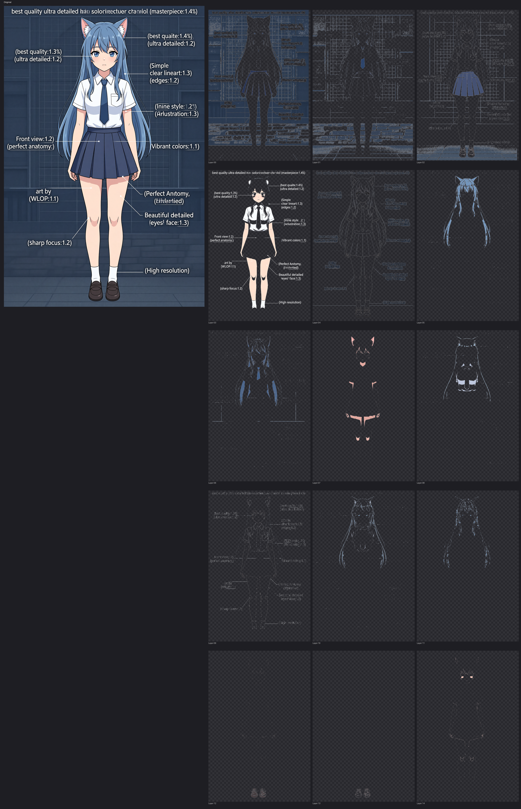

# 🎭 Live2D Master Agent

> **一句话**：输入一张角色图，AI 自动拆层 + 自动 Rigging，3 分钟生成可导入 Cubism Editor 的 Live2D 模型。

<div align="center">

[](https://mw2wbyys6t-sudo.github.io/Live2D/)
[](https://github.com/mw2wbyys6t-sudo/Live2D)
[]()

</div>

<div align="center">
  
  <p><em>左：输入原图 → 右：AI 自动拆分的 15 个图层</em></p>
</div>

---

## 🚀 先体验，再决定

**👉 [点击这里在线体验](https://mw2wbyys6t-sudo.github.io/Live2D/)** — 浏览器内直接生成 Live2D 风格立绘，无需安装任何东西。

可体验的功能：
- 🎨 **在线生成角色**（Pollinations 免费 API，无需 Key）
- 🔍 **AI 自动分层**（K-means 颜色聚类演示）
- 🎭 **Live2D 模型实时互动**（鼠标跟随、表情切换、参数调节）
- 📦 **下载真实 AI 产物**（model3.json / 纹理图集 / 分层 PNG）

---

## ✅ 能做什么 / ⚠️ 不能做什么

> 诚实说明，避免误解。

### ✅ 已经实现

| 功能 | 说明 |
|---|---|
| 🤖 AI 角色生成 | Pollinations（免费）/ Seedream / SenseNova 三家 Provider |
| 🎨 自动拆层 | K-means 颜色聚类，自动拆成 12-15 个图层 |
| 📐 52 层标准映射 | 自动映射到 Live2D Cubism 官方 52 层结构 |
| 🔺 自动 ArtMesh 网格 | Delaunay 三角剖分 + 轮廓提取 |
| 🌳 自动 Warp Deformer 树 | Root → Head/Body → Face/Eye/Mouth 完整层级 |
| 📦 model3.json 导出 | Cubism 5 兼容（参数/物理/表情/纹理） |
| 📄 PSD 导出 | Photoshop 多图层，直接拖进 Cubism Editor |
| 🐱 桌面桌宠 | 一键打包，Win/macOS/Linux 三端 |
| 🧪 279 项测试 | 全部通过，无需 API Key |

### ⚠️ 已知局限

| 局限 | 说明 |
|---|---|
| **不含 .moc3** | 输出的 model3.json 需在 Cubism Editor 中手动生成 MOC3 才能运行时播放 |
| **分层靠颜色** | K-means 按颜色聚类，无法理解"头发 vs 皮肤"（颜色接近会混） |
| **生成质量依赖 Provider** | 第三方 API 风格不稳定 |

### 🔮 开发中（Phase 3）

- AI 语义分割（按部位理解，替代 K-means）
- Amodal 补全（自动补全被遮挡部分）
- ARKit 52 口型同步
- Web 端在线生成

---

## 👀 适合谁用？

| 人群 | 痛点 | 方案 |
|---|---|---|
| **VTuber / 虚拟主播** | 找画师+建模太贵、周期长 | AI 粗模，快速出道 |
| **Live2D 建模师** | 拆层、拉网格太机械 | AI 做粗模，你做精修 |
| **独立游戏开发者** | 需要大量 Live2D NPC | 批量生成，统一风格 |
| **桌宠爱好者** | 想要专属桌宠但不会建模 | 一键生成，即开即用 |
| **技术美术** | 想探索 AI + Live2D 工作流 | 完整开源，可二开 |

---

## 🎯 三分钟上手

```bash
# 1. 安装依赖
python3 install.py

# 2. 一句话生成角色 + 自动拆层 + 自动 Rigging
python3 master_tool.py "蓝发猫耳少女，白色背景" --rig

# 3. 或者用已有图片端到端处理
python3 master_tool.py --input character.png --layer-only --rig
```

> 💡 默认使用 **Pollinations 免费图像生成**，无需 API Key，开箱即用。

### 其他使用方式

<details>
<summary>📦 交互式 Agent（新手友好）</summary>

```bash
python3 live2d_agent.py
```

会弹出菜单：生成角色 / 拆分图层 / 自动 Rigging / 部署桌宠 / 一键全流程。

</details>

<details>
<summary>🌐 Web UI 可视化</summary>

```bash
cd web && npm install && npm run dev
# 浏览器打开 http://localhost:3000
```

支持：图片上传转 PSD / 图层树可视化 / 规范合规检测 / QA 质检面板。

</details>

<details>
<summary>⚙️ Go API 服务 / Python 工作流引擎 / Trae Skill</summary>

```bash
# Go API
cd api && go run main.go    # POST /api/generate | /api/layer | /api/rig

# Python 工作流
from live2d.workflow import WorkflowEngine
engine = WorkflowEngine(output_dir="./output")
result = engine.run(prompt="银发狐妖少女", generate_52_config=True)

# Trae IDE Skill：在 Trae 中加载 .trae/skills/live2d-master-agent/
# 然后说："帮我生成一个蓝发猫娘 Live2D 角色，然后自动 rigging"
```

</details>

---

## 📦 跑完能得到什么？

```
output/
├── layers_<时间戳>/
│   ├── layer_000.png ~ layer_NNN.png   # 拆分后的独立图层（RGBA）
│   ├── preview.png                      # 图层叠加预览
│   ├── character.psd                    # Photoshop 多图层文件
│   ├── layer_mapping.json               # 52 层标准映射
│   └── parameters.json                  # Cubism 参数定义
│
├── rigged_<时间戳>/                      # ⭐ 自动 Rigging 输出
│   ├── character.model3.json            # Cubism model3.json
│   ├── character.texture_00~07.png      # 8 张纹理图集
│   ├── character.physics3.json          # 物理配置
│   ├── mesh_guide.json                  # 网格元数据
│   └── expressions/                     # 表情（smile/surprised/angry）
│
└── pet_packages/<name>/                 # 桌面桌宠包
    ├── run_pet.py                       # 双击运行
    └── layers/                          # 图层素材
```

直接把 `rigged/` 拖进 Cubism Editor 就能看到自动生成的网格和变形器。

---

## 🛠️ 项目结构速览

```
Live2D Master Agent
├── 🐍 live2d/          # Python 核心：工作流 / 图生 / 分层 / Rigging / 导出 / 桌宠
├── 🔷 api/             # Go REST API（Gin 框架）
├── ⚛️ web/             # Next.js 前端（React + Tailwind）
├── 📘 lib/             # TypeScript 8 步流水线类型
├── 🎨 comfyui-connector/  # ComfyUI 集成
├── 🧪 tests/           # 279 项自动化测试
├── 📚 docs/            # 文档 + 在线演示页
├── 🎯 examples/        # 真实案例产物（VTuber / 猫娘 / 发片）
└── 🔌 .trae/skills/    # Trae IDE Skill 插件
```

---

## 🔧 配置 API Key（可选）

默认免费方案无需配置。如需更高质量，复制 `.env.example` 为 `.env`：

```env
# 火山引擎 ARK / Seedream（可选，高质量生成）
ARK_API_KEY=your-api-key-here
ARK_BASE_URL=https://ark.cn-beijing.volces.com/api/v3

# SenseNova（可选）
SENSENOVA_KEY_ID=your-key-id
SENSENOVA_KEY_SECRET=your-key-secret
```

---

## 📋 环境要求

| 组件 | 最低版本 | 推荐 |
|---|---|---|
| Python | 3.8 | 3.11 / 3.12 |
| Node.js（Web UI） | 18 | 20 LTS |
| Go（API 服务） | 1.20 | 1.22 |
| 操作系统 | Win / macOS / Linux | — |

---

## 🧪 测试

```bash
python3 -m pytest tests/ -v
```

279 项测试全部无需 API Key，覆盖边界场景：1×1 像素 / 全透明 / 共线点崩溃 / 多页纹理分页 / 1024×1024 大图 / L/U/环形轮廓 / 特殊字符层名 等。

---

## 📖 文档导航

| 文档 | 内容 |
|---|---|
| [快速入门](docs/QUICKSTART.md) | 5 分钟跑通全流程 |
| [完整使用说明](USAGE.md) | 所有命令和参数详解 |
| [用户指南](docs/USER_GUIDE.md) | 从入门到精通 |
| [最佳实践](docs/BEST_PRACTICES.md) | 出高质量结果的技巧 |
| [常见问题](docs/FAQ.md) | 遇到问题先看这里 |
| [Rigging 指南](docs/RIGGING_GUIDE.md) | 自动 Rigging 原理与调优 |
| [更新日志](CHANGELOG.md) | 版本迭代历史 |

---

## 🤝 相关生态

- **[Textoon](https://github.com/Human3DAIGC/Textoon)** — 阿里通义，学术界首个文生 Live2D 系统
- **[Qwen-Image-Layered](https://qwenlayered.com/)** — 阿里 Qwen，图像分层 + Amodal 补全
- **[Open-LLM-VTuber](https://github.com/Open-LLM-VTuber/Open-LLM-VTuber)** — AI VTuber 完整框架
- **[pixi-live2d-display](https://www.npmjs.com/package/@naari3/pixi-live2d-display)** — Web 运行时
- **[awesome-digital-human-live2d](https://github.com/wan-h/awesome-digital-human-live2d)** — 最全资源索引

---

## ⭐ 项目亮点

- 🆓 **开箱即用**：默认 Pollinations 免费生成，零配置跑通
- 🇨🇳 **中文友好**：CLI / Agent / 文档全中文
- 🛡️ **安全可靠**：Fernet 加密 / 路径防护 / PSD 炸弹防护 / 日志脱敏
- 🧪 **测试完善**：279 项自动化测试
- 🎯 **真·自动 Rigging**：国内开源少有的完整网格 + Deformer 方案
- 📦 **Cubism 5.x 兼容**：输出标准 model3.json，直接导入编辑器

### 路线图

```
✅ Phase 1 — 图生 + K-means 分层 + PSD + 52 层映射 + 桌宠
✅ Phase 2 — 自动 ArtMesh + Warp Deformer 树 + model3.json + 暴力测试
🔮 Phase 3 — 语义分割 + Amodal 补全 + ARKit 口型同步 + Web 运行时
🔮 Phase 4+ — 语音驱动 + 表情识别 + 实时动捕 + 云端部署
```

---

## 📄 许可证

MIT License — 可自由商用、修改、分发，保留版权声明即可。

---

<div align="center">

**如果这个项目对你有帮助，别忘了点个 Star ⭐**

Made with ❤️ by Live2D Master Agent Team

</div>
# 🎭 Live2D Master# 🎭 Live2D Master Agent — AI 桌宠生成器

> **一句话**：输入一句话，AI 生成# 🎭 Live2D Master Agent — AI 桌宠生成器

> **一句话**：输入一句话，AI 生成你的专属桌面伙伴。免费、无需安装、浏览器内即可体验。

<div align="center# 🎭 Live2D Master Agent — AI 桌宠生成器

> **一句话**：输入一句话，AI 生成你的专属桌面伙伴。免费、无需安装、浏览器内即可体验。

<div align="center">

[](https://mw2wbyys6t-sudo.github.io/Live2D/)
[](https://mw2wbyys6t-sudo.github.io/Live2D/)
[](# 🎭 Live2D Master Agent — AI 桌宠生成器

> **一句话**：输入一句话，AI 生成你的专属桌面伙伴。免费、无需安装、浏览器内即可体验。

<div align="center">

[](https://mw2wbyys6t-sudo.github.io/Live2D/)
[](https://github.com/mw2wbyys6t-sudo/Live2D)
# 🎭 Live2D Master Agent — AI 桌宠生成器

> **一句话**：输入一句话，AI 生成你的专属桌面伙伴。免费、无需安装、浏览器内即可体验。

<div align="center">

[](https://mw2wbyys6t-sudo.github.io/Live2D/)
[](https://github.com/mw2wbyys6t-sudo/Live2D)
[](https://mw2wbyys6t-sudo.github.io/Live2D/)
[](https://github.com/mw2wbyys6t-sudo/Live2D)
[]()

</div>

---

## 🚀 先体验，再决定

**👉# 🎭 Live2D Master Agent — AI 桌宠生成器

> **一句话**：输入一句话，AI 生成你的专属桌面伙伴。免费、无需安装、浏览器内即可体验。

<div align="center">

[](https://mw2wbyys6t-sudo.github.io/Live2D/)
[](https://github.com/mw2wbyys6t-sudo/Live2D)
[]()

</div>

---

## 🚀 先体验，再决定

**👉 [点击这里在线体验](https://mw2wbyys6t-sudo.github.io/Live2D/)** — 浏览器内直接# 🎭 Live2D Master Agent — AI 桌宠生成器

> **一句话**：输入一句话，AI 生成你的专属桌面伙伴。免费、无需安装、浏览器内即可体验。

<div align="center">

[](https://mw2wbyys6t-sudo.github.io/Live2D/)
[](https://github.com/mw2wbyys6t-sudo/Live2D)
[]()

</div>

---

## 🚀 先体验，再决定

**👉 [点击这里在线体验](https://mw2wbyys6t-sudo.github.io/Live2D/)** — 浏览器内直接生成，30 秒看到效果。

你能体验到：
- 🎨 **AI# 🎭 Live2D Master Agent — AI 桌宠生成器

> **一句话**：输入一句话，AI 生成你的专属桌面伙伴。免费、无需安装、浏览器内即可体验。

<div align="center">

[](https://mw2wbyys6t-sudo.github.io/Live2D/)
[](https://github.com/mw2wbyys6t-sudo/Live2D)
[]()

</div>

---

## 🚀 先体验，再决定

**👉 [点击这里在线体验](https://mw2wbyys6t-sudo.github.io/Live2D/)** — 浏览器内直接生成，30 秒看到效果。

你能体验到：
- 🎨 **AI 生成角色** — 一句话描述，生成# 🎭 Live2D Master Agent — AI 桌宠生成器

> **一句话**：输入一句话，AI 生成你的专属桌面伙伴。免费、无需安装、浏览器内即可体验。

<div align="center">

[](https://mw2wbyys6t-sudo.github.io/Live2D/)
[](https://github.com/mw2wbyys6t-sudo/Live2D)
[]()

</div>

---

## 🚀 先体验，再决定

**👉 [点击这里在线体验](https://mw2wbyys6t-sudo.github.io/Live2D/)** — 浏览器内直接生成，30 秒看到效果。

你能体验到：
- 🎨 **AI 生成角色** — 一句话描述，生成你想要的动漫角色
- ✂️ **自动分层动画** — 眨眼、呼吸、# 🎭 Live2D Master Agent — AI 桌宠生成器

> **一句话**：输入一句话，AI 生成你的专属桌面伙伴。免费、无需安装、浏览器内即可体验。

<div align="center">

[](https://mw2wbyys6t-sudo.github.io/Live2D/)
[](https://github.com/mw2wbyys6t-sudo/Live2D)
[]()

</div>

---

## 🚀 先体验，再决定

**👉 [点击这里在线体验](https://mw2wbyys6t-sudo.github.io/Live2D/)** — 浏览器内直接生成，30 秒看到效果。

你能体验到：
- 🎨 **AI 生成角色** — 一句话描述，生成你想要的动漫角色
- ✂️ **自动分层动画** — 眨眼、呼吸、摇摆，角色是活的
- 👀 **鼠标跟随视线** — 角色的眼睛# 🎭 Live2D Master Agent — AI 桌宠生成器

> **一句话**：输入一句话，AI 生成你的专属桌面伙伴。免费、无需安装、浏览器内即可体验。

<div align="center">

[](https://mw2wbyys6t-sudo.github.io/Live2D/)
[](https://github.com/mw2wbyys6t-sudo/Live2D)
[]()

</div>

---

## 🚀 先体验，再决定

**👉 [点击这里在线体验](https://mw2wbyys6t-sudo.github.io/Live2D/)** — 浏览器内直接生成，30 秒看到效果。

你能体验到：
- 🎨 **AI 生成角色** — 一句话描述，生成你想要的动漫角色
- ✂️ **自动分层动画** — 眨眼、呼吸、摇摆，角色是活的
- 👀 **鼠标跟随视线** — 角色的眼睛会跟着你动
- 🖱️ **点击互动** — 点不同部位有不同反应# 🎭 Live2D Master Agent — AI 桌宠生成器

> **一句话**：输入一句话，AI 生成你的专属桌面伙伴。免费、无需安装、浏览器内即可体验。

<div align="center">

[](https://mw2wbyys6t-sudo.github.io/Live2D/)
[](https://github.com/mw2wbyys6t-sudo/Live2D)
[]()

</div>

---

## 🚀 先体验，再决定

**👉 [点击这里在线体验](https://mw2wbyys6t-sudo.github.io/Live2D/)** — 浏览器内直接生成，30 秒看到效果。

你能体验到：
- 🎨 **AI 生成角色** — 一句话描述，生成你想要的动漫角色
- ✂️ **自动分层动画** — 眨眼、呼吸、摇摆，角色是活的
- 👀 **鼠标跟随视线** — 角色的眼睛会跟着你动
- 🖱️ **点击互动** — 点不同部位有不同反应
- 📦 **下载桌宠** — 一键打包，双击就能在桌面跑

---# 🎭 Live2D Master Agent — AI 桌宠生成器

> **一句话**：输入一句话，AI 生成你的专属桌面伙伴。免费、无需安装、浏览器内即可体验。

<div align="center">

[](https://mw2wbyys6t-sudo.github.io/Live2D/)
[](https://github.com/mw2wbyys6t-sudo/Live2D)
[]()

</div>

---

## 🚀 先体验，再决定

**👉 [点击这里在线体验](https://mw2wbyys6t-sudo.github.io/Live2D/)** — 浏览器内直接生成，30 秒看到效果。

你能体验到：
- 🎨 **AI 生成角色** — 一句话描述，生成你想要的动漫角色
- ✂️ **自动分层动画** — 眨眼、呼吸、摇摆，角色是活的
- 👀 **鼠标跟随视线** — 角色的眼睛会跟着你动
- 🖱️ **点击互动** — 点不同部位有不同反应
- 📦 **下载桌宠** — 一键打包，双击就能在桌面跑

---

## ✅ 能做什么 / ⚠️ 不能做什么

> 诚实说明，避免误解。

### ✅ 已经实现

# 🎭 Live2D Master Agent — AI 桌宠生成器

> **一句话**：输入一句话，AI 生成你的专属桌面伙伴。免费、无需安装、浏览器内即可体验。

<div align="center">

[](https://mw2wbyys6t-sudo.github.io/Live2D/)
[](https://github.com/mw2wbyys6t-sudo/Live2D)
[]()

</div>

---

## 🚀 先体验，再决定

**👉 [点击这里在线体验](https://mw2wbyys6t-sudo.github.io/Live2D/)** — 浏览器内直接生成，30 秒看到效果。

你能体验到：
- 🎨 **AI 生成角色** — 一句话描述，生成你想要的动漫角色
- ✂️ **自动分层动画** — 眨眼、呼吸、摇摆，角色是活的
- 👀 **鼠标跟随视线** — 角色的眼睛会跟着你动
- 🖱️ **点击互动** — 点不同部位有不同反应
- 📦 **下载桌宠** — 一键打包，双击就能在桌面跑

---

## ✅ 能做什么 / ⚠️ 不能做什么

> 诚实说明，避免误解。

### ✅ 已经实现

| 功能 | 说明 |
|---|---|
| 🤖 AI 角色生成 | Poll# 🎭 Live2D Master Agent — AI 桌宠生成器

> **一句话**：输入一句话，AI 生成你的专属桌面伙伴。免费、无需安装、浏览器内即可体验。

<div align="center">

[](https://mw2wbyys6t-sudo.github.io/Live2D/)
[](https://github.com/mw2wbyys6t-sudo/Live2D)
[]()

</div>

---

## 🚀 先体验，再决定

**👉 [点击这里在线体验](https://mw2wbyys6t-sudo.github.io/Live2D/)** — 浏览器内直接生成，30 秒看到效果。

你能体验到：
- 🎨 **AI 生成角色** — 一句话描述，生成你想要的动漫角色
- ✂️ **自动分层动画** — 眨眼、呼吸、摇摆，角色是活的
- 👀 **鼠标跟随视线** — 角色的眼睛会跟着你动
- 🖱️ **点击互动** — 点不同部位有不同反应
- 📦 **下载桌宠** — 一键打包，双击就能在桌面跑

---

## ✅ 能做什么 / ⚠️ 不能做什么

> 诚实说明，避免误解。

### ✅ 已经实现

| 功能 | 说明 |
|---|---|
| 🤖 AI 角色生成 | Pollinations（免费）/ Seedream / SenseNova 三家 Provider |
| ✂️ 自动# 🎭 Live2D Master Agent — AI 桌宠生成器

> **一句话**：输入一句话，AI 生成你的专属桌面伙伴。免费、无需安装、浏览器内即可体验。

<div align="center">

[](https://mw2wbyys6t-sudo.github.io/Live2D/)
[](https://github.com/mw2wbyys6t-sudo/Live2D)
[]()

</div>

---

## 🚀 先体验，再决定

**👉 [点击这里在线体验](https://mw2wbyys6t-sudo.github.io/Live2D/)** — 浏览器内直接生成，30 秒看到效果。

你能体验到：
- 🎨 **AI 生成角色** — 一句话描述，生成你想要的动漫角色
- ✂️ **自动分层动画** — 眨眼、呼吸、摇摆，角色是活的
- 👀 **鼠标跟随视线** — 角色的眼睛会跟着你动
- 🖱️ **点击互动** — 点不同部位有不同反应
- 📦 **下载桌宠** — 一键打包，双击就能在桌面跑

---

## ✅ 能做什么 / ⚠️ 不能做什么

> 诚实说明，避免误解。

### ✅ 已经实现

| 功能 | 说明 |
|---|---|
| 🤖 AI 角色生成 | Pollinations（免费）/ Seedream / SenseNova 三家 Provider |
| ✂️ 自动拆层 | K-means 颜色聚类，自动拆成 12-15 个图层 |
| 🎬 桌宠动画# 🎭 Live2D Master Agent — AI 桌宠生成器

> **一句话**：输入一句话，AI 生成你的专属桌面伙伴。免费、无需安装、浏览器内即可体验。

<div align="center">

[](https://mw2wbyys6t-sudo.github.io/Live2D/)
[](https://github.com/mw2wbyys6t-sudo/Live2D)
[]()

</div>

---

## 🚀 先体验，再决定

**👉 [点击这里在线体验](https://mw2wbyys6t-sudo.github.io/Live2D/)** — 浏览器内直接生成，30 秒看到效果。

你能体验到：
- 🎨 **AI 生成角色** — 一句话描述，生成你想要的动漫角色
- ✂️ **自动分层动画** — 眨眼、呼吸、摇摆，角色是活的
- 👀 **鼠标跟随视线** — 角色的眼睛会跟着你动
- 🖱️ **点击互动** — 点不同部位有不同反应
- 📦 **下载桌宠** — 一键打包，双击就能在桌面跑

---

## ✅ 能做什么 / ⚠️ 不能做什么

> 诚实说明，避免误解。

### ✅ 已经实现

| 功能 | 说明 |
|---|---|
| 🤖 AI 角色生成 | Pollinations（免费）/ Seedream / SenseNova 三家 Provider |
| ✂️ 自动拆层 | K-means 颜色聚类，自动拆成 12-15 个图层 |
| 🎬 桌宠动画 | 眨眼 / 呼吸 / 头发摆动 / 身体摇摆 / 鼠标跟随 /# 🎭 Live2D Master Agent — AI 桌宠生成器

> **一句话**：输入一句话，AI 生成你的专属桌面伙伴。免费、无需安装、浏览器内即可体验。

<div align="center">

[](https://mw2wbyys6t-sudo.github.io/Live2D/)
[](https://github.com/mw2wbyys6t-sudo/Live2D)
[]()

</div>

---

## 🚀 先体验，再决定

**👉 [点击这里在线体验](https://mw2wbyys6t-sudo.github.io/Live2D/)** — 浏览器内直接生成，30 秒看到效果。

你能体验到：
- 🎨 **AI 生成角色** — 一句话描述，生成你想要的动漫角色
- ✂️ **自动分层动画** — 眨眼、呼吸、摇摆，角色是活的
- 👀 **鼠标跟随视线** — 角色的眼睛会跟着你动
- 🖱️ **点击互动** — 点不同部位有不同反应
- 📦 **下载桌宠** — 一键打包，双击就能在桌面跑

---

## ✅ 能做什么 / ⚠️ 不能做什么

> 诚实说明，避免误解。

### ✅ 已经实现

| 功能 | 说明 |
|---|---|
| 🤖 AI 角色生成 | Pollinations（免费）/ Seedream / SenseNova 三家 Provider |
| ✂️ 自动拆层 | K-means 颜色聚类，自动拆成 12-15 个图层 |
| 🎬 桌宠动画 | 眨眼 / 呼吸 / 头发摆动 / 身体摇摆 / 鼠标跟随 / 表情切换 |
| 🖱️ 互动交互 | 点击 / 拖拽 / 右键菜单# 🎭 Live2D Master Agent — AI 桌宠生成器

> **一句话**：输入一句话，AI 生成你的专属桌面伙伴。免费、无需安装、浏览器内即可体验。

<div align="center">

[](https://mw2wbyys6t-sudo.github.io/Live2D/)
[](https://github.com/mw2wbyys6t-sudo/Live2D)
[]()

</div>

---

## 🚀 先体验，再决定

**👉 [点击这里在线体验](https://mw2wbyys6t-sudo.github.io/Live2D/)** — 浏览器内直接生成，30 秒看到效果。

你能体验到：
- 🎨 **AI 生成角色** — 一句话描述，生成你想要的动漫角色
- ✂️ **自动分层动画** — 眨眼、呼吸、摇摆，角色是活的
- 👀 **鼠标跟随视线** — 角色的眼睛会跟着你动
- 🖱️ **点击互动** — 点不同部位有不同反应
- 📦 **下载桌宠** — 一键打包，双击就能在桌面跑

---

## ✅ 能做什么 / ⚠️ 不能做什么

> 诚实说明，避免误解。

### ✅ 已经实现

| 功能 | 说明 |
|---|---|
| 🤖 AI 角色生成 | Pollinations（免费）/ Seedream / SenseNova 三家 Provider |
| ✂️ 自动拆层 | K-means 颜色聚类，自动拆成 12-15 个图层 |
| 🎬 桌宠动画 | 眨眼 / 呼吸 / 头发摆动 / 身体摇摆 / 鼠标跟随 / 表情切换 |
| 🖱️ 互动交互 | 点击 / 拖拽 / 右键菜单 / 开机自启 |
| 📦 一键打包 | Windows exe（Mac/Linux# 🎭 Live2D Master Agent — AI 桌宠生成器

> **一句话**：输入一句话，AI 生成你的专属桌面伙伴。免费、无需安装、浏览器内即可体验。

<div align="center">

[](https://mw2wbyys6t-sudo.github.io/Live2D/)
[](https://github.com/mw2wbyys6t-sudo/Live2D)
[]()

</div>

---

## 🚀 先体验，再决定

**👉 [点击这里在线体验](https://mw2wbyys6t-sudo.github.io/Live2D/)** — 浏览器内直接生成，30 秒看到效果。

你能体验到：
- 🎨 **AI 生成角色** — 一句话描述，生成你想要的动漫角色
- ✂️ **自动分层动画** — 眨眼、呼吸、摇摆，角色是活的
- 👀 **鼠标跟随视线** — 角色的眼睛会跟着你动
- 🖱️ **点击互动** — 点不同部位有不同反应
- 📦 **下载桌宠** — 一键打包，双击就能在桌面跑

---

## ✅ 能做什么 / ⚠️ 不能做什么

> 诚实说明，避免误解。

### ✅ 已经实现

| 功能 | 说明 |
|---|---|
| 🤖 AI 角色生成 | Pollinations（免费）/ Seedream / SenseNova 三家 Provider |
| ✂️ 自动拆层 | K-means 颜色聚类，自动拆成 12-15 个图层 |
| 🎬 桌宠动画 | 眨眼 / 呼吸 / 头发摆动 / 身体摇摆 / 鼠标跟随 / 表情切换 |
| 🖱️ 互动交互 | 点击 / 拖拽 / 右键菜单 / 开机自启 |
| 📦 一键打包 | Windows exe（Mac/Linux 后续支持） |
| 🎨 纹理图集 | 多页 shelf-packing 算法自动# 🎭 Live2D Master Agent — AI 桌宠生成器

> **一句话**：输入一句话，AI 生成你的专属桌面伙伴。免费、无需安装、浏览器内即可体验。

<div align="center">

[](https://mw2wbyys6t-sudo.github.io/Live2D/)
[](https://github.com/mw2wbyys6t-sudo/Live2D)
[]()

</div>

---

## 🚀 先体验，再决定

**👉 [点击这里在线体验](https://mw2wbyys6t-sudo.github.io/Live2D/)** — 浏览器内直接生成，30 秒看到效果。

你能体验到：
- 🎨 **AI 生成角色** — 一句话描述，生成你想要的动漫角色
- ✂️ **自动分层动画** — 眨眼、呼吸、摇摆，角色是活的
- 👀 **鼠标跟随视线** — 角色的眼睛会跟着你动
- 🖱️ **点击互动** — 点不同部位有不同反应
- 📦 **下载桌宠** — 一键打包，双击就能在桌面跑

---

## ✅ 能做什么 / ⚠️ 不能做什么

> 诚实说明，避免误解。

### ✅ 已经实现

| 功能 | 说明 |
|---|---|
| 🤖 AI 角色生成 | Pollinations（免费）/ Seedream / SenseNova 三家 Provider |
| ✂️ 自动拆层 | K-means 颜色聚类，自动拆成 12-15 个图层 |
| 🎬 桌宠动画 | 眨眼 / 呼吸 / 头发摆动 / 身体摇摆 / 鼠标跟随 / 表情切换 |
| 🖱️ 互动交互 | 点击 / 拖拽 / 右键菜单 / 开机自启 |
| 📦 一键打包 | Windows exe（Mac/Linux 后续支持） |
| 🎨 纹理图集 | 多页 shelf-packing 算法自动合图 |
| 📄 PSD 导出 | Photoshop 多图层，可二次编辑 |
# 🎭 Live2D Master Agent — AI 桌宠生成器

> **一句话**：输入一句话，AI 生成你的专属桌面伙伴。免费、无需安装、浏览器内即可体验。

<div align="center">

[](https://mw2wbyys6t-sudo.github.io/Live2D/)
[](https://github.com/mw2wbyys6t-sudo/Live2D)
[]()

</div>

---

## 🚀 先体验，再决定

**👉 [点击这里在线体验](https://mw2wbyys6t-sudo.github.io/Live2D/)** — 浏览器内直接生成，30 秒看到效果。

你能体验到：
- 🎨 **AI 生成角色** — 一句话描述，生成你想要的动漫角色
- ✂️ **自动分层动画** — 眨眼、呼吸、摇摆，角色是活的
- 👀 **鼠标跟随视线** — 角色的眼睛会跟着你动
- 🖱️ **点击互动** — 点不同部位有不同反应
- 📦 **下载桌宠** — 一键打包，双击就能在桌面跑

---

## ✅ 能做什么 / ⚠️ 不能做什么

> 诚实说明，避免误解。

### ✅ 已经实现

| 功能 | 说明 |
|---|---|
| 🤖 AI 角色生成 | Pollinations（免费）/ Seedream / SenseNova 三家 Provider |
| ✂️ 自动拆层 | K-means 颜色聚类，自动拆成 12-15 个图层 |
| 🎬 桌宠动画 | 眨眼 / 呼吸 / 头发摆动 / 身体摇摆 / 鼠标跟随 / 表情切换 |
| 🖱️ 互动交互 | 点击 / 拖拽 / 右键菜单 / 开机自启 |
| 📦 一键打包 | Windows exe（Mac/Linux 后续支持） |
| 🎨 纹理图集 | 多页 shelf-packing 算法自动合图 |
| 📄 PSD 导出 | Photoshop 多图层，可二次编辑 |
| 🧪 149 项测试 | 全部通过，无需 API Key |

#### 🎭 Live2D Master Agent — AI 桌宠生成器

> **一句话**：输入一句话，AI 生成你的专属桌面伙伴。免费、无需安装、浏览器内即可体验。

<div align="center">

[](https://mw2wbyys6t-sudo.github.io/Live2D/)
[](https://github.com/mw2wbyys6t-sudo/Live2D)
[]()

</div>

---

## 🚀 先体验，再决定

**👉 [点击这里在线体验](https://mw2wbyys6t-sudo.github.io/Live2D/)** — 浏览器内直接生成，30 秒看到效果。

你能体验到：
- 🎨 **AI 生成角色** — 一句话描述，生成你想要的动漫角色
- ✂️ **自动分层动画** — 眨眼、呼吸、摇摆，角色是活的
- 👀 **鼠标跟随视线** — 角色的眼睛会跟着你动
- 🖱️ **点击互动** — 点不同部位有不同反应
- 📦 **下载桌宠** — 一键打包，双击就能在桌面跑

---

## ✅ 能做什么 / ⚠️ 不能做什么

> 诚实说明，避免误解。

### ✅ 已经实现

| 功能 | 说明 |
|---|---|
| 🤖 AI 角色生成 | Pollinations（免费）/ Seedream / SenseNova 三家 Provider |
| ✂️ 自动拆层 | K-means 颜色聚类，自动拆成 12-15 个图层 |
| 🎬 桌宠动画 | 眨眼 / 呼吸 / 头发摆动 / 身体摇摆 / 鼠标跟随 / 表情切换 |
| 🖱️ 互动交互 | 点击 / 拖拽 / 右键菜单 / 开机自启 |
| 📦 一键打包 | Windows exe（Mac/Linux 后续支持） |
| 🎨 纹理图集 | 多页 shelf-packing 算法自动合图 |
| 📄 PSD 导出 | Photoshop 多图层，可二次编辑 |
| 🧪 149 项测试 | 全部通过，无需 API Key |

### ⚠️ 已知局限

| 局限 | 说明 |
|---|---|
| **# 🎭 Live2D Master Agent — AI 桌宠生成器

> **一句话**：输入一句话，AI 生成你的专属桌面伙伴。免费、无需安装、浏览器内即可体验。

<div align="center">

[](https://mw2wbyys6t-sudo.github.io/Live2D/)
[](https://github.com/mw2wbyys6t-sudo/Live2D)
[]()

</div>

---

## 🚀 先体验，再决定

**👉 [点击这里在线体验](https://mw2wbyys6t-sudo.github.io/Live2D/)** — 浏览器内直接生成，30 秒看到效果。

你能体验到：
- 🎨 **AI 生成角色** — 一句话描述，生成你想要的动漫角色
- ✂️ **自动分层动画** — 眨眼、呼吸、摇摆，角色是活的
- 👀 **鼠标跟随视线** — 角色的眼睛会跟着你动
- 🖱️ **点击互动** — 点不同部位有不同反应
- 📦 **下载桌宠** — 一键打包，双击就能在桌面跑

---

## ✅ 能做什么 / ⚠️ 不能做什么

> 诚实说明，避免误解。

### ✅ 已经实现

| 功能 | 说明 |
|---|---|
| 🤖 AI 角色生成 | Pollinations（免费）/ Seedream / SenseNova 三家 Provider |
| ✂️ 自动拆层 | K-means 颜色聚类，自动拆成 12-15 个图层 |
| 🎬 桌宠动画 | 眨眼 / 呼吸 / 头发摆动 / 身体摇摆 / 鼠标跟随 / 表情切换 |
| 🖱️ 互动交互 | 点击 / 拖拽 / 右键菜单 / 开机自启 |
| 📦 一键打包 | Windows exe（Mac/Linux 后续支持） |
| 🎨 纹理图集 | 多页 shelf-packing 算法自动合图 |
| 📄 PSD 导出 | Photoshop 多图层，可二次编辑 |
| 🧪 149 项测试 | 全部通过，无需 API Key |

### ⚠️ 已知局限

| 局限 | 说明 |
|---|---|
| **不是真 Live2D** | 当前桌宠用 pygame 做图层动画，不是 Cubism# 🎭 Live2D Master Agent — AI 桌宠生成器

> **一句话**：输入一句话，AI 生成你的专属桌面伙伴。免费、无需安装、浏览器内即可体验。

<div align="center">

[](https://mw2wbyys6t-sudo.github.io/Live2D/)
[](https://github.com/mw2wbyys6t-sudo/Live2D)
[]()

</div>

---

## 🚀 先体验，再决定

**👉 [点击这里在线体验](https://mw2wbyys6t-sudo.github.io/Live2D/)** — 浏览器内直接生成，30 秒看到效果。

你能体验到：
- 🎨 **AI 生成角色** — 一句话描述，生成你想要的动漫角色
- ✂️ **自动分层动画** — 眨眼、呼吸、摇摆，角色是活的
- 👀 **鼠标跟随视线** — 角色的眼睛会跟着你动
- 🖱️ **点击互动** — 点不同部位有不同反应
- 📦 **下载桌宠** — 一键打包，双击就能在桌面跑

---

## ✅ 能做什么 / ⚠️ 不能做什么

> 诚实说明，避免误解。

### ✅ 已经实现

| 功能 | 说明 |
|---|---|
| 🤖 AI 角色生成 | Pollinations（免费）/ Seedream / SenseNova 三家 Provider |
| ✂️ 自动拆层 | K-means 颜色聚类，自动拆成 12-15 个图层 |
| 🎬 桌宠动画 | 眨眼 / 呼吸 / 头发摆动 / 身体摇摆 / 鼠标跟随 / 表情切换 |
| 🖱️ 互动交互 | 点击 / 拖拽 / 右键菜单 / 开机自启 |
| 📦 一键打包 | Windows exe（Mac/Linux 后续支持） |
| 🎨 纹理图集 | 多页 shelf-packing 算法自动合图 |
| 📄 PSD 导出 | Photoshop 多图层，可二次编辑 |
| 🧪 149 项测试 | 全部通过，无需 API Key |

### ⚠️ 已知局限

| 局限 | 说明 |
|---|---|
| **不是真 Live2D** | 当前桌宠用 pygame 做图层动画，不是 Cubism 网格变形（质感有差距） |
| **分层靠颜色** | K-means# 🎭 Live2D Master Agent — AI 桌宠生成器

> **一句话**：输入一句话，AI 生成你的专属桌面伙伴。免费、无需安装、浏览器内即可体验。

<div align="center">

[](https://mw2wbyys6t-sudo.github.io/Live2D/)
[](https://github.com/mw2wbyys6t-sudo/Live2D)
[]()

</div>

---

## 🚀 先体验，再决定

**👉 [点击这里在线体验](https://mw2wbyys6t-sudo.github.io/Live2D/)** — 浏览器内直接生成，30 秒看到效果。

你能体验到：
- 🎨 **AI 生成角色** — 一句话描述，生成你想要的动漫角色
- ✂️ **自动分层动画** — 眨眼、呼吸、摇摆，角色是活的
- 👀 **鼠标跟随视线** — 角色的眼睛会跟着你动
- 🖱️ **点击互动** — 点不同部位有不同反应
- 📦 **下载桌宠** — 一键打包，双击就能在桌面跑

---

## ✅ 能做什么 / ⚠️ 不能做什么

> 诚实说明，避免误解。

### ✅ 已经实现

| 功能 | 说明 |
|---|---|
| 🤖 AI 角色生成 | Pollinations（免费）/ Seedream / SenseNova 三家 Provider |
| ✂️ 自动拆层 | K-means 颜色聚类，自动拆成 12-15 个图层 |
| 🎬 桌宠动画 | 眨眼 / 呼吸 / 头发摆动 / 身体摇摆 / 鼠标跟随 / 表情切换 |
| 🖱️ 互动交互 | 点击 / 拖拽 / 右键菜单 / 开机自启 |
| 📦 一键打包 | Windows exe（Mac/Linux 后续支持） |
| 🎨 纹理图集 | 多页 shelf-packing 算法自动合图 |
| 📄 PSD 导出 | Photoshop 多图层，可二次编辑 |
| 🧪 149 项测试 | 全部通过，无需 API Key |

### ⚠️ 已知局限

| 局限 | 说明 |
|---|---|
| **不是真 Live2D** | 当前桌宠用 pygame 做图层动画，不是 Cubism 网格变形（质感有差距） |
| **分层靠颜色** | K-means 按颜色聚类，无法理解"头发 vs 皮肤"（颜色接近会混） |
| **生成质量依赖 Provider** |# 🎭 Live2D Master Agent — AI 桌宠生成器

> **一句话**：输入一句话，AI 生成你的专属桌面伙伴。免费、无需安装、浏览器内即可体验。

<div align="center">

[](https://mw2wbyys6t-sudo.github.io/Live2D/)
[](https://github.com/mw2wbyys6t-sudo/Live2D)
[]()

</div>

---

## 🚀 先体验，再决定

**👉 [点击这里在线体验](https://mw2wbyys6t-sudo.github.io/Live2D/)** — 浏览器内直接生成，30 秒看到效果。

你能体验到：
- 🎨 **AI 生成角色** — 一句话描述，生成你想要的动漫角色
- ✂️ **自动分层动画** — 眨眼、呼吸、摇摆，角色是活的
- 👀 **鼠标跟随视线** — 角色的眼睛会跟着你动
- 🖱️ **点击互动** — 点不同部位有不同反应
- 📦 **下载桌宠** — 一键打包，双击就能在桌面跑

---

## ✅ 能做什么 / ⚠️ 不能做什么

> 诚实说明，避免误解。

### ✅ 已经实现

| 功能 | 说明 |
|---|---|
| 🤖 AI 角色生成 | Pollinations（免费）/ Seedream / SenseNova 三家 Provider |
| ✂️ 自动拆层 | K-means 颜色聚类，自动拆成 12-15 个图层 |
| 🎬 桌宠动画 | 眨眼 / 呼吸 / 头发摆动 / 身体摇摆 / 鼠标跟随 / 表情切换 |
| 🖱️ 互动交互 | 点击 / 拖拽 / 右键菜单 / 开机自启 |
| 📦 一键打包 | Windows exe（Mac/Linux 后续支持） |
| 🎨 纹理图集 | 多页 shelf-packing 算法自动合图 |
| 📄 PSD 导出 | Photoshop 多图层，可二次编辑 |
| 🧪 149 项测试 | 全部通过，无需 API Key |

### ⚠️ 已知局限

| 局限 | 说明 |
|---|---|
| **不是真 Live2D** | 当前桌宠用 pygame 做图层动画，不是 Cubism 网格变形（质感有差距） |
| **分层靠颜色** | K-means 按颜色聚类，无法理解"头发 vs 皮肤"（颜色接近会混） |
| **生成质量依赖 Provider** | 第三方 API 风格不稳定 |

### 🔮# 🎭 Live2D Master Agent — AI 桌宠生成器

> **一句话**：输入一句话，AI 生成你的专属桌面伙伴。免费、无需安装、浏览器内即可体验。

<div align="center">

[](https://mw2wbyys6t-sudo.github.io/Live2D/)
[](https://github.com/mw2wbyys6t-sudo/Live2D)
[]()

</div>

---

## 🚀 先体验，再决定

**👉 [点击这里在线体验](https://mw2wbyys6t-sudo.github.io/Live2D/)** — 浏览器内直接生成，30 秒看到效果。

你能体验到：
- 🎨 **AI 生成角色** — 一句话描述，生成你想要的动漫角色
- ✂️ **自动分层动画** — 眨眼、呼吸、摇摆，角色是活的
- 👀 **鼠标跟随视线** — 角色的眼睛会跟着你动
- 🖱️ **点击互动** — 点不同部位有不同反应
- 📦 **下载桌宠** — 一键打包，双击就能在桌面跑

---

## ✅ 能做什么 / ⚠️ 不能做什么

> 诚实说明，避免误解。

### ✅ 已经实现

| 功能 | 说明 |
|---|---|
| 🤖 AI 角色生成 | Pollinations（免费）/ Seedream / SenseNova 三家 Provider |
| ✂️ 自动拆层 | K-means 颜色聚类，自动拆成 12-15 个图层 |
| 🎬 桌宠动画 | 眨眼 / 呼吸 / 头发摆动 / 身体摇摆 / 鼠标跟随 / 表情切换 |
| 🖱️ 互动交互 | 点击 / 拖拽 / 右键菜单 / 开机自启 |
| 📦 一键打包 | Windows exe（Mac/Linux 后续支持） |
| 🎨 纹理图集 | 多页 shelf-packing 算法自动合图 |
| 📄 PSD 导出 | Photoshop 多图层，可二次编辑 |
| 🧪 149 项测试 | 全部通过，无需 API Key |

### ⚠️ 已知局限

| 局限 | 说明 |
|---|---|
| **不是真 Live2D** | 当前桌宠用 pygame 做图层动画，不是 Cubism 网格变形（质感有差距） |
| **分层靠颜色** | K-means 按颜色聚类，无法理解"头发 vs 皮肤"（颜色接近会混） |
| **生成质量依赖 Provider** | 第三方 API 风格不稳定 |

### 🔮 路线图

```
✅ Phase 1 — AI 桌宠 MVP（当前）：# 🎭 Live2D Master Agent — AI 桌宠生成器

> **一句话**：输入一句话，AI 生成你的专属桌面伙伴。免费、无需安装、浏览器内即可体验。

<div align="center">

[](https://mw2wbyys6t-sudo.github.io/Live2D/)
[](https://github.com/mw2wbyys6t-sudo/Live2D)
[]()

</div>

---

## 🚀 先体验，再决定

**👉 [点击这里在线体验](https://mw2wbyys6t-sudo.github.io/Live2D/)** — 浏览器内直接生成，30 秒看到效果。

你能体验到：
- 🎨 **AI 生成角色** — 一句话描述，生成你想要的动漫角色
- ✂️ **自动分层动画** — 眨眼、呼吸、摇摆，角色是活的
- 👀 **鼠标跟随视线** — 角色的眼睛会跟着你动
- 🖱️ **点击互动** — 点不同部位有不同反应
- 📦 **下载桌宠** — 一键打包，双击就能在桌面跑

---

## ✅ 能做什么 / ⚠️ 不能做什么

> 诚实说明，避免误解。

### ✅ 已经实现

| 功能 | 说明 |
|---|---|
| 🤖 AI 角色生成 | Pollinations（免费）/ Seedream / SenseNova 三家 Provider |
| ✂️ 自动拆层 | K-means 颜色聚类，自动拆成 12-15 个图层 |
| 🎬 桌宠动画 | 眨眼 / 呼吸 / 头发摆动 / 身体摇摆 / 鼠标跟随 / 表情切换 |
| 🖱️ 互动交互 | 点击 / 拖拽 / 右键菜单 / 开机自启 |
| 📦 一键打包 | Windows exe（Mac/Linux 后续支持） |
| 🎨 纹理图集 | 多页 shelf-packing 算法自动合图 |
| 📄 PSD 导出 | Photoshop 多图层，可二次编辑 |
| 🧪 149 项测试 | 全部通过，无需 API Key |

### ⚠️ 已知局限

| 局限 | 说明 |
|---|---|
| **不是真 Live2D** | 当前桌宠用 pygame 做图层动画，不是 Cubism 网格变形（质感有差距） |
| **分层靠颜色** | K-means 按颜色聚类，无法理解"头发 vs 皮肤"（颜色接近会混） |
| **生成质量依赖 Provider** | 第三方 API 风格不稳定 |

### 🔮 路线图

```
✅ Phase 1 — AI 桌宠 MVP（当前）：图生 + 分层 + pygame 桌宠 + Web 预览
🚧 Phase 2 —# 🎭 Live2D Master Agent — AI 桌宠生成器

> **一句话**：输入一句话，AI 生成你的专属桌面伙伴。免费、无需安装、浏览器内即可体验。

<div align="center">

[](https://mw2wbyys6t-sudo.github.io/Live2D/)
[](https://github.com/mw2wbyys6t-sudo/Live2D)
[]()

</div>

---

## 🚀 先体验，再决定

**👉 [点击这里在线体验](https://mw2wbyys6t-sudo.github.io/Live2D/)** — 浏览器内直接生成，30 秒看到效果。

你能体验到：
- 🎨 **AI 生成角色** — 一句话描述，生成你想要的动漫角色
- ✂️ **自动分层动画** — 眨眼、呼吸、摇摆，角色是活的
- 👀 **鼠标跟随视线** — 角色的眼睛会跟着你动
- 🖱️ **点击互动** — 点不同部位有不同反应
- 📦 **下载桌宠** — 一键打包，双击就能在桌面跑

---

## ✅ 能做什么 / ⚠️ 不能做什么

> 诚实说明，避免误解。

### ✅ 已经实现

| 功能 | 说明 |
|---|---|
| 🤖 AI 角色生成 | Pollinations（免费）/ Seedream / SenseNova 三家 Provider |
| ✂️ 自动拆层 | K-means 颜色聚类，自动拆成 12-15 个图层 |
| 🎬 桌宠动画 | 眨眼 / 呼吸 / 头发摆动 / 身体摇摆 / 鼠标跟随 / 表情切换 |
| 🖱️ 互动交互 | 点击 / 拖拽 / 右键菜单 / 开机自启 |
| 📦 一键打包 | Windows exe（Mac/Linux 后续支持） |
| 🎨 纹理图集 | 多页 shelf-packing 算法自动合图 |
| 📄 PSD 导出 | Photoshop 多图层，可二次编辑 |
| 🧪 149 项测试 | 全部通过，无需 API Key |

### ⚠️ 已知局限

| 局限 | 说明 |
|---|---|
| **不是真 Live2D** | 当前桌宠用 pygame 做图层动画，不是 Cubism 网格变形（质感有差距） |
| **分层靠颜色** | K-means 按颜色聚类，无法理解"头发 vs 皮肤"（颜色接近会混） |
| **生成质量依赖 Provider** | 第三方 API 风格不稳定 |

### 🔮 路线图

```
✅ Phase 1 — AI 桌宠 MVP（当前）：图生 + 分层 + pygame 桌宠 + Web 预览
🚧 Phase 2 — 桌宠产品化：角色库 / 换装 / 社区 / 多平台
🔮# 🎭 Live2D Master Agent — AI 桌宠生成器

> **一句话**：输入一句话，AI 生成你的专属桌面伙伴。免费、无需安装、浏览器内即可体验。

<div align="center">

[](https://mw2wbyys6t-sudo.github.io/Live2D/)
[](https://github.com/mw2wbyys6t-sudo/Live2D)
[]()

</div>

---

## 🚀 先体验，再决定

**👉 [点击这里在线体验](https://mw2wbyys6t-sudo.github.io/Live2D/)** — 浏览器内直接生成，30 秒看到效果。

你能体验到：
- 🎨 **AI 生成角色** — 一句话描述，生成你想要的动漫角色
- ✂️ **自动分层动画** — 眨眼、呼吸、摇摆，角色是活的
- 👀 **鼠标跟随视线** — 角色的眼睛会跟着你动
- 🖱️ **点击互动** — 点不同部位有不同反应
- 📦 **下载桌宠** — 一键打包，双击就能在桌面跑

---

## ✅ 能做什么 / ⚠️ 不能做什么

> 诚实说明，避免误解。

### ✅ 已经实现

| 功能 | 说明 |
|---|---|
| 🤖 AI 角色生成 | Pollinations（免费）/ Seedream / SenseNova 三家 Provider |
| ✂️ 自动拆层 | K-means 颜色聚类，自动拆成 12-15 个图层 |
| 🎬 桌宠动画 | 眨眼 / 呼吸 / 头发摆动 / 身体摇摆 / 鼠标跟随 / 表情切换 |
| 🖱️ 互动交互 | 点击 / 拖拽 / 右键菜单 / 开机自启 |
| 📦 一键打包 | Windows exe（Mac/Linux 后续支持） |
| 🎨 纹理图集 | 多页 shelf-packing 算法自动合图 |
| 📄 PSD 导出 | Photoshop 多图层，可二次编辑 |
| 🧪 149 项测试 | 全部通过，无需 API Key |

### ⚠️ 已知局限

| 局限 | 说明 |
|---|---|
| **不是真 Live2D** | 当前桌宠用 pygame 做图层动画，不是 Cubism 网格变形（质感有差距） |
| **分层靠颜色** | K-means 按颜色聚类，无法理解"头发 vs 皮肤"（颜色接近会混） |
| **生成质量依赖 Provider** | 第三方 API 风格不稳定 |

### 🔮 路线图

```
✅ Phase 1 — AI 桌宠 MVP（当前）：图生 + 分层 + pygame 桌宠 + Web 预览
🚧 Phase 2 — 桌宠产品化：角色库 / 换装 / 社区 / 多平台
🔮 Phase 3 — Live2D 模型生成：真 Cubism 模型 + 自动 Rig# 🎭 Live2D Master Agent — AI 桌宠生成器

> **一句话**：输入一句话，AI 生成你的专属桌面伙伴。免费、无需安装、浏览器内即可体验。

<div align="center">

[](https://mw2wbyys6t-sudo.github.io/Live2D/)
[](https://github.com/mw2wbyys6t-sudo/Live2D)
[]()

</div>

---

## 🚀 先体验，再决定

**👉 [点击这里在线体验](https://mw2wbyys6t-sudo.github.io/Live2D/)** — 浏览器内直接生成，30 秒看到效果。

你能体验到：
- 🎨 **AI 生成角色** — 一句话描述，生成你想要的动漫角色
- ✂️ **自动分层动画** — 眨眼、呼吸、摇摆，角色是活的
- 👀 **鼠标跟随视线** — 角色的眼睛会跟着你动
- 🖱️ **点击互动** — 点不同部位有不同反应
- 📦 **下载桌宠** — 一键打包，双击就能在桌面跑

---

## ✅ 能做什么 / ⚠️ 不能做什么

> 诚实说明，避免误解。

### ✅ 已经实现

| 功能 | 说明 |
|---|---|
| 🤖 AI 角色生成 | Pollinations（免费）/ Seedream / SenseNova 三家 Provider |
| ✂️ 自动拆层 | K-means 颜色聚类，自动拆成 12-15 个图层 |
| 🎬 桌宠动画 | 眨眼 / 呼吸 / 头发摆动 / 身体摇摆 / 鼠标跟随 / 表情切换 |
| 🖱️ 互动交互 | 点击 / 拖拽 / 右键菜单 / 开机自启 |
| 📦 一键打包 | Windows exe（Mac/Linux 后续支持） |
| 🎨 纹理图集 | 多页 shelf-packing 算法自动合图 |
| 📄 PSD 导出 | Photoshop 多图层，可二次编辑 |
| 🧪 149 项测试 | 全部通过，无需 API Key |

### ⚠️ 已知局限

| 局限 | 说明 |
|---|---|
| **不是真 Live2D** | 当前桌宠用 pygame 做图层动画，不是 Cubism 网格变形（质感有差距） |
| **分层靠颜色** | K-means 按颜色聚类，无法理解"头发 vs 皮肤"（颜色接近会混） |
| **生成质量依赖 Provider** | 第三方 API 风格不稳定 |

### 🔮 路线图

```
✅ Phase 1 — AI 桌宠 MVP（当前）：图生 + 分层 + pygame 桌宠 + Web 预览
🚧 Phase 2 — 桌宠产品化：角色库 / 换装 / 社区 / 多平台
🔮 Phase 3 — Live2D 模型生成：真 Cubism 模型 + 自动 Rigging（研究中）
```

> 💡 我们的终极目标是让每个人都能# 🎭 Live2D Master Agent — AI 桌宠生成器

> **一句话**：输入一句话，AI 生成你的专属桌面伙伴。免费、无需安装、浏览器内即可体验。

<div align="center">

[](https://mw2wbyys6t-sudo.github.io/Live2D/)
[](https://github.com/mw2wbyys6t-sudo/Live2D)
[]()

</div>

---

## 🚀 先体验，再决定

**👉 [点击这里在线体验](https://mw2wbyys6t-sudo.github.io/Live2D/)** — 浏览器内直接生成，30 秒看到效果。

你能体验到：
- 🎨 **AI 生成角色** — 一句话描述，生成你想要的动漫角色
- ✂️ **自动分层动画** — 眨眼、呼吸、摇摆，角色是活的
- 👀 **鼠标跟随视线** — 角色的眼睛会跟着你动
- 🖱️ **点击互动** — 点不同部位有不同反应
- 📦 **下载桌宠** — 一键打包，双击就能在桌面跑

---

## ✅ 能做什么 / ⚠️ 不能做什么

> 诚实说明，避免误解。

### ✅ 已经实现

| 功能 | 说明 |
|---|---|
| 🤖 AI 角色生成 | Pollinations（免费）/ Seedream / SenseNova 三家 Provider |
| ✂️ 自动拆层 | K-means 颜色聚类，自动拆成 12-15 个图层 |
| 🎬 桌宠动画 | 眨眼 / 呼吸 / 头发摆动 / 身体摇摆 / 鼠标跟随 / 表情切换 |
| 🖱️ 互动交互 | 点击 / 拖拽 / 右键菜单 / 开机自启 |
| 📦 一键打包 | Windows exe（Mac/Linux 后续支持） |
| 🎨 纹理图集 | 多页 shelf-packing 算法自动合图 |
| 📄 PSD 导出 | Photoshop 多图层，可二次编辑 |
| 🧪 149 项测试 | 全部通过，无需 API Key |

### ⚠️ 已知局限

| 局限 | 说明 |
|---|---|
| **不是真 Live2D** | 当前桌宠用 pygame 做图层动画，不是 Cubism 网格变形（质感有差距） |
| **分层靠颜色** | K-means 按颜色聚类，无法理解"头发 vs 皮肤"（颜色接近会混） |
| **生成质量依赖 Provider** | 第三方 API 风格不稳定 |

### 🔮 路线图

```
✅ Phase 1 — AI 桌宠 MVP（当前）：图生 + 分层 + pygame 桌宠 + Web 预览
🚧 Phase 2 — 桌宠产品化：角色库 / 换装 / 社区 / 多平台
🔮 Phase 3 — Live2D 模型生成：真 Cubism 模型 + 自动 Rigging（研究中）
```

> 💡 我们的终极目标是让每个人都能快速拥有自己的 Live2D 模型，但这需要时间。当前先用桌宠形态验证# 🎭 Live2D Master Agent — AI 桌宠生成器

> **一句话**：输入一句话，AI 生成你的专属桌面伙伴。免费、无需安装、浏览器内即可体验。

<div align="center">

[](https://mw2wbyys6t-sudo.github.io/Live2D/)
[](https://github.com/mw2wbyys6t-sudo/Live2D)
[]()

</div>

---

## 🚀 先体验，再决定

**👉 [点击这里在线体验](https://mw2wbyys6t-sudo.github.io/Live2D/)** — 浏览器内直接生成，30 秒看到效果。

你能体验到：
- 🎨 **AI 生成角色** — 一句话描述，生成你想要的动漫角色
- ✂️ **自动分层动画** — 眨眼、呼吸、摇摆，角色是活的
- 👀 **鼠标跟随视线** — 角色的眼睛会跟着你动
- 🖱️ **点击互动** — 点不同部位有不同反应
- 📦 **下载桌宠** — 一键打包，双击就能在桌面跑

---

## ✅ 能做什么 / ⚠️ 不能做什么

> 诚实说明，避免误解。

### ✅ 已经实现

| 功能 | 说明 |
|---|---|
| 🤖 AI 角色生成 | Pollinations（免费）/ Seedream / SenseNova 三家 Provider |
| ✂️ 自动拆层 | K-means 颜色聚类，自动拆成 12-15 个图层 |
| 🎬 桌宠动画 | 眨眼 / 呼吸 / 头发摆动 / 身体摇摆 / 鼠标跟随 / 表情切换 |
| 🖱️ 互动交互 | 点击 / 拖拽 / 右键菜单 / 开机自启 |
| 📦 一键打包 | Windows exe（Mac/Linux 后续支持） |
| 🎨 纹理图集 | 多页 shelf-packing 算法自动合图 |
| 📄 PSD 导出 | Photoshop 多图层，可二次编辑 |
| 🧪 149 项测试 | 全部通过，无需 API Key |

### ⚠️ 已知局限

| 局限 | 说明 |
|---|---|
| **不是真 Live2D** | 当前桌宠用 pygame 做图层动画，不是 Cubism 网格变形（质感有差距） |
| **分层靠颜色** | K-means 按颜色聚类，无法理解"头发 vs 皮肤"（颜色接近会混） |
| **生成质量依赖 Provider** | 第三方 API 风格不稳定 |

### 🔮 路线图

```
✅ Phase 1 — AI 桌宠 MVP（当前）：图生 + 分层 + pygame 桌宠 + Web 预览
🚧 Phase 2 — 桌宠产品化：角色库 / 换装 / 社区 / 多平台
🔮 Phase 3 — Live2D 模型生成：真 Cubism 模型 + 自动 Rigging（研究中）
```

> 💡 我们的终极目标是让每个人都能快速拥有自己的 Live2D 模型，但这需要时间。当前先用桌宠形态验证产品，技术成熟后逐步升级。

---

## 👀 适合谁用？

# 🎭 Live2D Master Agent — AI 桌宠生成器

> **一句话**：输入一句话，AI 生成你的专属桌面伙伴。免费、无需安装、浏览器内即可体验。

<div align="center">

[](https://mw2wbyys6t-sudo.github.io/Live2D/)
[](https://github.com/mw2wbyys6t-sudo/Live2D)
[]()

</div>

---

## 🚀 先体验，再决定

**👉 [点击这里在线体验](https://mw2wbyys6t-sudo.github.io/Live2D/)** — 浏览器内直接生成，30 秒看到效果。

你能体验到：
- 🎨 **AI 生成角色** — 一句话描述，生成你想要的动漫角色
- ✂️ **自动分层动画** — 眨眼、呼吸、摇摆，角色是活的
- 👀 **鼠标跟随视线** — 角色的眼睛会跟着你动
- 🖱️ **点击互动** — 点不同部位有不同反应
- 📦 **下载桌宠** — 一键打包，双击就能在桌面跑

---

## ✅ 能做什么 / ⚠️ 不能做什么

> 诚实说明，避免误解。

### ✅ 已经实现

| 功能 | 说明 |
|---|---|
| 🤖 AI 角色生成 | Pollinations（免费）/ Seedream / SenseNova 三家 Provider |
| ✂️ 自动拆层 | K-means 颜色聚类，自动拆成 12-15 个图层 |
| 🎬 桌宠动画 | 眨眼 / 呼吸 / 头发摆动 / 身体摇摆 / 鼠标跟随 / 表情切换 |
| 🖱️ 互动交互 | 点击 / 拖拽 / 右键菜单 / 开机自启 |
| 📦 一键打包 | Windows exe（Mac/Linux 后续支持） |
| 🎨 纹理图集 | 多页 shelf-packing 算法自动合图 |
| 📄 PSD 导出 | Photoshop 多图层，可二次编辑 |
| 🧪 149 项测试 | 全部通过，无需 API Key |

### ⚠️ 已知局限

| 局限 | 说明 |
|---|---|
| **不是真 Live2D** | 当前桌宠用 pygame 做图层动画，不是 Cubism 网格变形（质感有差距） |
| **分层靠颜色** | K-means 按颜色聚类，无法理解"头发 vs 皮肤"（颜色接近会混） |
| **生成质量依赖 Provider** | 第三方 API 风格不稳定 |

### 🔮 路线图

```
✅ Phase 1 — AI 桌宠 MVP（当前）：图生 + 分层 + pygame 桌宠 + Web 预览
🚧 Phase 2 — 桌宠产品化：角色库 / 换装 / 社区 / 多平台
🔮 Phase 3 — Live2D 模型生成：真 Cubism 模型 + 自动 Rigging（研究中）
```

> 💡 我们的终极目标是让每个人都能快速拥有自己的 Live2D 模型，但这需要时间。当前先用桌宠形态验证产品，技术成熟后逐步升级。

---

## 👀 适合谁用？

| 人群 | 痛点 | 方案 |
|---|---|---|
| **二次元爱好者** | 想要专属桌宠但不会画画# 🎭 Live2D Master Agent — AI 桌宠生成器

> **一句话**：输入一句话，AI 生成你的专属桌面伙伴。免费、无需安装、浏览器内即可体验。

<div align="center">

[](https://mw2wbyys6t-sudo.github.io/Live2D/)
[](https://github.com/mw2wbyys6t-sudo/Live2D)
[]()

</div>

---

## 🚀 先体验，再决定

**👉 [点击这里在线体验](https://mw2wbyys6t-sudo.github.io/Live2D/)** — 浏览器内直接生成，30 秒看到效果。

你能体验到：
- 🎨 **AI 生成角色** — 一句话描述，生成你想要的动漫角色
- ✂️ **自动分层动画** — 眨眼、呼吸、摇摆，角色是活的
- 👀 **鼠标跟随视线** — 角色的眼睛会跟着你动
- 🖱️ **点击互动** — 点不同部位有不同反应
- 📦 **下载桌宠** — 一键打包，双击就能在桌面跑

---

## ✅ 能做什么 / ⚠️ 不能做什么

> 诚实说明，避免误解。

### ✅ 已经实现

| 功能 | 说明 |
|---|---|
| 🤖 AI 角色生成 | Pollinations（免费）/ Seedream / SenseNova 三家 Provider |
| ✂️ 自动拆层 | K-means 颜色聚类，自动拆成 12-15 个图层 |
| 🎬 桌宠动画 | 眨眼 / 呼吸 / 头发摆动 / 身体摇摆 / 鼠标跟随 / 表情切换 |
| 🖱️ 互动交互 | 点击 / 拖拽 / 右键菜单 / 开机自启 |
| 📦 一键打包 | Windows exe（Mac/Linux 后续支持） |
| 🎨 纹理图集 | 多页 shelf-packing 算法自动合图 |
| 📄 PSD 导出 | Photoshop 多图层，可二次编辑 |
| 🧪 149 项测试 | 全部通过，无需 API Key |

### ⚠️ 已知局限

| 局限 | 说明 |
|---|---|
| **不是真 Live2D** | 当前桌宠用 pygame 做图层动画，不是 Cubism 网格变形（质感有差距） |
| **分层靠颜色** | K-means 按颜色聚类，无法理解"头发 vs 皮肤"（颜色接近会混） |
| **生成质量依赖 Provider** | 第三方 API 风格不稳定 |

### 🔮 路线图

```
✅ Phase 1 — AI 桌宠 MVP（当前）：图生 + 分层 + pygame 桌宠 + Web 预览
🚧 Phase 2 — 桌宠产品化：角色库 / 换装 / 社区 / 多平台
🔮 Phase 3 — Live2D 模型生成：真 Cubism 模型 + 自动 Rigging（研究中）
```

> 💡 我们的终极目标是让每个人都能快速拥有自己的 Live2D 模型，但这需要时间。当前先用桌宠形态验证产品，技术成熟后逐步升级。

---

## 👀 适合谁用？

| 人群 | 痛点 | 方案 |
|---|---|---|
| **二次元爱好者** | 想要专属桌宠但不会画画 | AI 生成，一句话搞定 |
| **VTuber 新人** | 想做# 🎭 Live2D Master Agent — AI 桌宠生成器

> **一句话**：输入一句话，AI 生成你的专属桌面伙伴。免费、无需安装、浏览器内即可体验。

<div align="center">

[](https://mw2wbyys6t-sudo.github.io/Live2D/)
[](https://github.com/mw2wbyys6t-sudo/Live2D)
[]()

</div>

---

## 🚀 先体验，再决定

**👉 [点击这里在线体验](https://mw2wbyys6t-sudo.github.io/Live2D/)** — 浏览器内直接生成，30 秒看到效果。

你能体验到：
- 🎨 **AI 生成角色** — 一句话描述，生成你想要的动漫角色
- ✂️ **自动分层动画** — 眨眼、呼吸、摇摆，角色是活的
- 👀 **鼠标跟随视线** — 角色的眼睛会跟着你动
- 🖱️ **点击互动** — 点不同部位有不同反应
- 📦 **下载桌宠** — 一键打包，双击就能在桌面跑

---

## ✅ 能做什么 / ⚠️ 不能做什么

> 诚实说明，避免误解。

### ✅ 已经实现

| 功能 | 说明 |
|---|---|
| 🤖 AI 角色生成 | Pollinations（免费）/ Seedream / SenseNova 三家 Provider |
| ✂️ 自动拆层 | K-means 颜色聚类，自动拆成 12-15 个图层 |
| 🎬 桌宠动画 | 眨眼 / 呼吸 / 头发摆动 / 身体摇摆 / 鼠标跟随 / 表情切换 |
| 🖱️ 互动交互 | 点击 / 拖拽 / 右键菜单 / 开机自启 |
| 📦 一键打包 | Windows exe（Mac/Linux 后续支持） |
| 🎨 纹理图集 | 多页 shelf-packing 算法自动合图 |
| 📄 PSD 导出 | Photoshop 多图层，可二次编辑 |
| 🧪 149 项测试 | 全部通过，无需 API Key |

### ⚠️ 已知局限

| 局限 | 说明 |
|---|---|
| **不是真 Live2D** | 当前桌宠用 pygame 做图层动画，不是 Cubism 网格变形（质感有差距） |
| **分层靠颜色** | K-means 按颜色聚类，无法理解"头发 vs 皮肤"（颜色接近会混） |
| **生成质量依赖 Provider** | 第三方 API 风格不稳定 |

### 🔮 路线图

```
✅ Phase 1 — AI 桌宠 MVP（当前）：图生 + 分层 + pygame 桌宠 + Web 预览
🚧 Phase 2 — 桌宠产品化：角色库 / 换装 / 社区 / 多平台
🔮 Phase 3 — Live2D 模型生成：真 Cubism 模型 + 自动 Rigging（研究中）
```

> 💡 我们的终极目标是让每个人都能快速拥有自己的 Live2D 模型，但这需要时间。当前先用桌宠形态验证产品，技术成熟后逐步升级。

---

## 👀 适合谁用？

| 人群 | 痛点 | 方案 |
|---|---|---|
| **二次元爱好者** | 想要专属桌宠但不会画画 | AI 生成，一句话搞定 |
| **VTuber 新人** | 想做虚拟形象但没钱建模 | 先用桌宠出道，后续升级 Live2D |
|# 🎭 Live2D Master Agent — AI 桌宠生成器

> **一句话**：输入一句话，AI 生成你的专属桌面伙伴。免费、无需安装、浏览器内即可体验。

<div align="center">

[](https://mw2wbyys6t-sudo.github.io/Live2D/)
[](https://github.com/mw2wbyys6t-sudo/Live2D)
[]()

</div>

---

## 🚀 先体验，再决定

**👉 [点击这里在线体验](https://mw2wbyys6t-sudo.github.io/Live2D/)** — 浏览器内直接生成，30 秒看到效果。

你能体验到：
- 🎨 **AI 生成角色** — 一句话描述，生成你想要的动漫角色
- ✂️ **自动分层动画** — 眨眼、呼吸、摇摆，角色是活的
- 👀 **鼠标跟随视线** — 角色的眼睛会跟着你动
- 🖱️ **点击互动** — 点不同部位有不同反应
- 📦 **下载桌宠** — 一键打包，双击就能在桌面跑

---

## ✅ 能做什么 / ⚠️ 不能做什么

> 诚实说明，避免误解。

### ✅ 已经实现

| 功能 | 说明 |
|---|---|
| 🤖 AI 角色生成 | Pollinations（免费）/ Seedream / SenseNova 三家 Provider |
| ✂️ 自动拆层 | K-means 颜色聚类，自动拆成 12-15 个图层 |
| 🎬 桌宠动画 | 眨眼 / 呼吸 / 头发摆动 / 身体摇摆 / 鼠标跟随 / 表情切换 |
| 🖱️ 互动交互 | 点击 / 拖拽 / 右键菜单 / 开机自启 |
| 📦 一键打包 | Windows exe（Mac/Linux 后续支持） |
| 🎨 纹理图集 | 多页 shelf-packing 算法自动合图 |
| 📄 PSD 导出 | Photoshop 多图层，可二次编辑 |
| 🧪 149 项测试 | 全部通过，无需 API Key |

### ⚠️ 已知局限

| 局限 | 说明 |
|---|---|
| **不是真 Live2D** | 当前桌宠用 pygame 做图层动画，不是 Cubism 网格变形（质感有差距） |
| **分层靠颜色** | K-means 按颜色聚类，无法理解"头发 vs 皮肤"（颜色接近会混） |
| **生成质量依赖 Provider** | 第三方 API 风格不稳定 |

### 🔮 路线图

```
✅ Phase 1 — AI 桌宠 MVP（当前）：图生 + 分层 + pygame 桌宠 + Web 预览
🚧 Phase 2 — 桌宠产品化：角色库 / 换装 / 社区 / 多平台
🔮 Phase 3 — Live2D 模型生成：真 Cubism 模型 + 自动 Rigging（研究中）
```

> 💡 我们的终极目标是让每个人都能快速拥有自己的 Live2D 模型，但这需要时间。当前先用桌宠形态验证产品，技术成熟后逐步升级。

---

## 👀 适合谁用？

| 人群 | 痛点 | 方案 |
|---|---|---|
| **二次元爱好者** | 想要专属桌宠但不会画画 | AI 生成，一句话搞定 |
| **VTuber 新人** | 想做虚拟形象但没钱建模 | 先用桌宠出道，后续升级 Live2D |
| **桌宠玩家** | 玩腻了现有桌宠想换 | AI 生成独一无二# 🎭 Live2D Master Agent — AI 桌宠生成器

> **一句话**：输入一句话，AI 生成你的专属桌面伙伴。免费、无需安装、浏览器内即可体验。

<div align="center">

[](https://mw2wbyys6t-sudo.github.io/Live2D/)
[](https://github.com/mw2wbyys6t-sudo/Live2D)
[]()

</div>

---

## 🚀 先体验，再决定

**👉 [点击这里在线体验](https://mw2wbyys6t-sudo.github.io/Live2D/)** — 浏览器内直接生成，30 秒看到效果。

你能体验到：
- 🎨 **AI 生成角色** — 一句话描述，生成你想要的动漫角色
- ✂️ **自动分层动画** — 眨眼、呼吸、摇摆，角色是活的
- 👀 **鼠标跟随视线** — 角色的眼睛会跟着你动
- 🖱️ **点击互动** — 点不同部位有不同反应
- 📦 **下载桌宠** — 一键打包，双击就能在桌面跑

---

## ✅ 能做什么 / ⚠️ 不能做什么

> 诚实说明，避免误解。

### ✅ 已经实现

| 功能 | 说明 |
|---|---|
| 🤖 AI 角色生成 | Pollinations（免费）/ Seedream / SenseNova 三家 Provider |
| ✂️ 自动拆层 | K-means 颜色聚类，自动拆成 12-15 个图层 |
| 🎬 桌宠动画 | 眨眼 / 呼吸 / 头发摆动 / 身体摇摆 / 鼠标跟随 / 表情切换 |
| 🖱️ 互动交互 | 点击 / 拖拽 / 右键菜单 / 开机自启 |
| 📦 一键打包 | Windows exe（Mac/Linux 后续支持） |
| 🎨 纹理图集 | 多页 shelf-packing 算法自动合图 |
| 📄 PSD 导出 | Photoshop 多图层，可二次编辑 |
| 🧪 149 项测试 | 全部通过，无需 API Key |

### ⚠️ 已知局限

| 局限 | 说明 |
|---|---|
| **不是真 Live2D** | 当前桌宠用 pygame 做图层动画，不是 Cubism 网格变形（质感有差距） |
| **分层靠颜色** | K-means 按颜色聚类，无法理解"头发 vs 皮肤"（颜色接近会混） |
| **生成质量依赖 Provider** | 第三方 API 风格不稳定 |

### 🔮 路线图

```
✅ Phase 1 — AI 桌宠 MVP（当前）：图生 + 分层 + pygame 桌宠 + Web 预览
🚧 Phase 2 — 桌宠产品化：角色库 / 换装 / 社区 / 多平台
🔮 Phase 3 — Live2D 模型生成：真 Cubism 模型 + 自动 Rigging（研究中）
```

> 💡 我们的终极目标是让每个人都能快速拥有自己的 Live2D 模型，但这需要时间。当前先用桌宠形态验证产品，技术成熟后逐步升级。

---

## 👀 适合谁用？

| 人群 | 痛点 | 方案 |
|---|---|---|
| **二次元爱好者** | 想要专属桌宠但不会画画 | AI 生成，一句话搞定 |
| **VTuber 新人** | 想做虚拟形象但没钱建模 | 先用桌宠出道，后续升级 Live2D |
| **桌宠玩家** | 玩腻了现有桌宠想换 | AI 生成独一无二的角色 |
| **Live2D 学习者** | 想了解分层/建模流程# 🎭 Live2D Master Agent — AI 桌宠生成器

> **一句话**：输入一句话，AI 生成你的专属桌面伙伴。免费、无需安装、浏览器内即可体验。

<div align="center">

[](https://mw2wbyys6t-sudo.github.io/Live2D/)
[](https://github.com/mw2wbyys6t-sudo/Live2D)
[]()

</div>

---

## 🚀 先体验，再决定

**👉 [点击这里在线体验](https://mw2wbyys6t-sudo.github.io/Live2D/)** — 浏览器内直接生成，30 秒看到效果。

你能体验到：
- 🎨 **AI 生成角色** — 一句话描述，生成你想要的动漫角色
- ✂️ **自动分层动画** — 眨眼、呼吸、摇摆，角色是活的
- 👀 **鼠标跟随视线** — 角色的眼睛会跟着你动
- 🖱️ **点击互动** — 点不同部位有不同反应
- 📦 **下载桌宠** — 一键打包，双击就能在桌面跑

---

## ✅ 能做什么 / ⚠️ 不能做什么

> 诚实说明，避免误解。

### ✅ 已经实现

| 功能 | 说明 |
|---|---|
| 🤖 AI 角色生成 | Pollinations（免费）/ Seedream / SenseNova 三家 Provider |
| ✂️ 自动拆层 | K-means 颜色聚类，自动拆成 12-15 个图层 |
| 🎬 桌宠动画 | 眨眼 / 呼吸 / 头发摆动 / 身体摇摆 / 鼠标跟随 / 表情切换 |
| 🖱️ 互动交互 | 点击 / 拖拽 / 右键菜单 / 开机自启 |
| 📦 一键打包 | Windows exe（Mac/Linux 后续支持） |
| 🎨 纹理图集 | 多页 shelf-packing 算法自动合图 |
| 📄 PSD 导出 | Photoshop 多图层，可二次编辑 |
| 🧪 149 项测试 | 全部通过，无需 API Key |

### ⚠️ 已知局限

| 局限 | 说明 |
|---|---|
| **不是真 Live2D** | 当前桌宠用 pygame 做图层动画，不是 Cubism 网格变形（质感有差距） |
| **分层靠颜色** | K-means 按颜色聚类，无法理解"头发 vs 皮肤"（颜色接近会混） |
| **生成质量依赖 Provider** | 第三方 API 风格不稳定 |

### 🔮 路线图

```
✅ Phase 1 — AI 桌宠 MVP（当前）：图生 + 分层 + pygame 桌宠 + Web 预览
🚧 Phase 2 — 桌宠产品化：角色库 / 换装 / 社区 / 多平台
🔮 Phase 3 — Live2D 模型生成：真 Cubism 模型 + 自动 Rigging（研究中）
```

> 💡 我们的终极目标是让每个人都能快速拥有自己的 Live2D 模型，但这需要时间。当前先用桌宠形态验证产品，技术成熟后逐步升级。

---

## 👀 适合谁用？

| 人群 | 痛点 | 方案 |
|---|---|---|
| **二次元爱好者** | 想要专属桌宠但不会画画 | AI 生成，一句话搞定 |
| **VTuber 新人** | 想做虚拟形象但没钱建模 | 先用桌宠出道，后续升级 Live2D |
| **桌宠玩家** | 玩腻了现有桌宠想换 | AI 生成独一无二的角色 |
| **Live2D 学习者** | 想了解分层/建模流程 | 从 AI 分层入门，再学# 🎭 Live2D Master Agent — AI 桌宠生成器

> **一句话**：输入一句话，AI 生成你的专属桌面伙伴。免费、无需安装、浏览器内即可体验。

<div align="center">

[](https://mw2wbyys6t-sudo.github.io/Live2D/)
[](https://github.com/mw2wbyys6t-sudo/Live2D)
[]()

</div>

---

## 🚀 先体验，再决定

**👉 [点击这里在线体验](https://mw2wbyys6t-sudo.github.io/Live2D/)** — 浏览器内直接生成，30 秒看到效果。

你能体验到：
- 🎨 **AI 生成角色** — 一句话描述，生成你想要的动漫角色
- ✂️ **自动分层动画** — 眨眼、呼吸、摇摆，角色是活的
- 👀 **鼠标跟随视线** — 角色的眼睛会跟着你动
- 🖱️ **点击互动** — 点不同部位有不同反应
- 📦 **下载桌宠** — 一键打包，双击就能在桌面跑

---

## ✅ 能做什么 / ⚠️ 不能做什么

> 诚实说明，避免误解。

### ✅ 已经实现

| 功能 | 说明 |
|---|---|
| 🤖 AI 角色生成 | Pollinations（免费）/ Seedream / SenseNova 三家 Provider |
| ✂️ 自动拆层 | K-means 颜色聚类，自动拆成 12-15 个图层 |
| 🎬 桌宠动画 | 眨眼 / 呼吸 / 头发摆动 / 身体摇摆 / 鼠标跟随 / 表情切换 |
| 🖱️ 互动交互 | 点击 / 拖拽 / 右键菜单 / 开机自启 |
| 📦 一键打包 | Windows exe（Mac/Linux 后续支持） |
| 🎨 纹理图集 | 多页 shelf-packing 算法自动合图 |
| 📄 PSD 导出 | Photoshop 多图层，可二次编辑 |
| 🧪 149 项测试 | 全部通过，无需 API Key |

### ⚠️ 已知局限

| 局限 | 说明 |
|---|---|
| **不是真 Live2D** | 当前桌宠用 pygame 做图层动画，不是 Cubism 网格变形（质感有差距） |
| **分层靠颜色** | K-means 按颜色聚类，无法理解"头发 vs 皮肤"（颜色接近会混） |
| **生成质量依赖 Provider** | 第三方 API 风格不稳定 |

### 🔮 路线图

```
✅ Phase 1 — AI 桌宠 MVP（当前）：图生 + 分层 + pygame 桌宠 + Web 预览
🚧 Phase 2 — 桌宠产品化：角色库 / 换装 / 社区 / 多平台
🔮 Phase 3 — Live2D 模型生成：真 Cubism 模型 + 自动 Rigging（研究中）
```

> 💡 我们的终极目标是让每个人都能快速拥有自己的 Live2D 模型，但这需要时间。当前先用桌宠形态验证产品，技术成熟后逐步升级。

---

## 👀 适合谁用？

| 人群 | 痛点 | 方案 |
|---|---|---|
| **二次元爱好者** | 想要专属桌宠但不会画画 | AI 生成，一句话搞定 |
| **VTuber 新人** | 想做虚拟形象但没钱建模 | 先用桌宠出道，后续升级 Live2D |
| **桌宠玩家** | 玩腻了现有桌宠想换 | AI 生成独一无二的角色 |
| **Live2D 学习者** | 想了解分层/建模流程 | 从 AI 分层入门，再学手工建模 |
| **开发者** | 想基于此做二次开发 | 完整开源# 🎭 Live2D Master Agent — AI 桌宠生成器

> **一句话**：输入一句话，AI 生成你的专属桌面伙伴。免费、无需安装、浏览器内即可体验。

<div align="center">

[](https://mw2wbyys6t-sudo.github.io/Live2D/)
[](https://github.com/mw2wbyys6t-sudo/Live2D)
[]()

</div>

---

## 🚀 先体验，再决定

**👉 [点击这里在线体验](https://mw2wbyys6t-sudo.github.io/Live2D/)** — 浏览器内直接生成，30 秒看到效果。

你能体验到：
- 🎨 **AI 生成角色** — 一句话描述，生成你想要的动漫角色
- ✂️ **自动分层动画** — 眨眼、呼吸、摇摆，角色是活的
- 👀 **鼠标跟随视线** — 角色的眼睛会跟着你动
- 🖱️ **点击互动** — 点不同部位有不同反应
- 📦 **下载桌宠** — 一键打包，双击就能在桌面跑

---

## ✅ 能做什么 / ⚠️ 不能做什么

> 诚实说明，避免误解。

### ✅ 已经实现

| 功能 | 说明 |
|---|---|
| 🤖 AI 角色生成 | Pollinations（免费）/ Seedream / SenseNova 三家 Provider |
| ✂️ 自动拆层 | K-means 颜色聚类，自动拆成 12-15 个图层 |
| 🎬 桌宠动画 | 眨眼 / 呼吸 / 头发摆动 / 身体摇摆 / 鼠标跟随 / 表情切换 |
| 🖱️ 互动交互 | 点击 / 拖拽 / 右键菜单 / 开机自启 |
| 📦 一键打包 | Windows exe（Mac/Linux 后续支持） |
| 🎨 纹理图集 | 多页 shelf-packing 算法自动合图 |
| 📄 PSD 导出 | Photoshop 多图层，可二次编辑 |
| 🧪 149 项测试 | 全部通过，无需 API Key |

### ⚠️ 已知局限

| 局限 | 说明 |
|---|---|
| **不是真 Live2D** | 当前桌宠用 pygame 做图层动画，不是 Cubism 网格变形（质感有差距） |
| **分层靠颜色** | K-means 按颜色聚类，无法理解"头发 vs 皮肤"（颜色接近会混） |
| **生成质量依赖 Provider** | 第三方 API 风格不稳定 |

### 🔮 路线图

```
✅ Phase 1 — AI 桌宠 MVP（当前）：图生 + 分层 + pygame 桌宠 + Web 预览
🚧 Phase 2 — 桌宠产品化：角色库 / 换装 / 社区 / 多平台
🔮 Phase 3 — Live2D 模型生成：真 Cubism 模型 + 自动 Rigging（研究中）
```

> 💡 我们的终极目标是让每个人都能快速拥有自己的 Live2D 模型，但这需要时间。当前先用桌宠形态验证产品，技术成熟后逐步升级。

---

## 👀 适合谁用？

| 人群 | 痛点 | 方案 |
|---|---|---|
| **二次元爱好者** | 想要专属桌宠但不会画画 | AI 生成，一句话搞定 |
| **VTuber 新人** | 想做虚拟形象但没钱建模 | 先用桌宠出道，后续升级 Live2D |
| **桌宠玩家** | 玩腻了现有桌宠想换 | AI 生成独一无二的角色 |
| **Live2D 学习者** | 想了解分层/建模流程 | 从 AI 分层入门，再学手工建模 |
| **开发者** | 想基于此做二次开发 | 完整开源，MIT 协议 |

---

## 🎯 三分钟上手

```bash
# 1# 🎭 Live2D Master Agent — AI 桌宠生成器

> **一句话**：输入一句话，AI 生成你的专属桌面伙伴。免费、无需安装、浏览器内即可体验。

<div align="center">

[](https://mw2wbyys6t-sudo.github.io/Live2D/)
[](https://github.com/mw2wbyys6t-sudo/Live2D)
[]()

</div>

---

## 🚀 先体验，再决定

**👉 [点击这里在线体验](https://mw2wbyys6t-sudo.github.io/Live2D/)** — 浏览器内直接生成，30 秒看到效果。

你能体验到：
- 🎨 **AI 生成角色** — 一句话描述，生成你想要的动漫角色
- ✂️ **自动分层动画** — 眨眼、呼吸、摇摆，角色是活的
- 👀 **鼠标跟随视线** — 角色的眼睛会跟着你动
- 🖱️ **点击互动** — 点不同部位有不同反应
- 📦 **下载桌宠** — 一键打包，双击就能在桌面跑

---

## ✅ 能做什么 / ⚠️ 不能做什么

> 诚实说明，避免误解。

### ✅ 已经实现

| 功能 | 说明 |
|---|---|
| 🤖 AI 角色生成 | Pollinations（免费）/ Seedream / SenseNova 三家 Provider |
| ✂️ 自动拆层 | K-means 颜色聚类，自动拆成 12-15 个图层 |
| 🎬 桌宠动画 | 眨眼 / 呼吸 / 头发摆动 / 身体摇摆 / 鼠标跟随 / 表情切换 |
| 🖱️ 互动交互 | 点击 / 拖拽 / 右键菜单 / 开机自启 |
| 📦 一键打包 | Windows exe（Mac/Linux 后续支持） |
| 🎨 纹理图集 | 多页 shelf-packing 算法自动合图 |
| 📄 PSD 导出 | Photoshop 多图层，可二次编辑 |
| 🧪 149 项测试 | 全部通过，无需 API Key |

### ⚠️ 已知局限

| 局限 | 说明 |
|---|---|
| **不是真 Live2D** | 当前桌宠用 pygame 做图层动画，不是 Cubism 网格变形（质感有差距） |
| **分层靠颜色** | K-means 按颜色聚类，无法理解"头发 vs 皮肤"（颜色接近会混） |
| **生成质量依赖 Provider** | 第三方 API 风格不稳定 |

### 🔮 路线图

```
✅ Phase 1 — AI 桌宠 MVP（当前）：图生 + 分层 + pygame 桌宠 + Web 预览
🚧 Phase 2 — 桌宠产品化：角色库 / 换装 / 社区 / 多平台
🔮 Phase 3 — Live2D 模型生成：真 Cubism 模型 + 自动 Rigging（研究中）
```

> 💡 我们的终极目标是让每个人都能快速拥有自己的 Live2D 模型，但这需要时间。当前先用桌宠形态验证产品，技术成熟后逐步升级。

---

## 👀 适合谁用？

| 人群 | 痛点 | 方案 |
|---|---|---|
| **二次元爱好者** | 想要专属桌宠但不会画画 | AI 生成，一句话搞定 |
| **VTuber 新人** | 想做虚拟形象但没钱建模 | 先用桌宠出道，后续升级 Live2D |
| **桌宠玩家** | 玩腻了现有桌宠想换 | AI 生成独一无二的角色 |
| **Live2D 学习者** | 想了解分层/建模流程 | 从 AI 分层入门，再学手工建模 |
| **开发者** | 想基于此做二次开发 | 完整开源，MIT 协议 |

---

## 🎯 三分钟上手

```bash
# 1. 安装依赖
python3 install.py

# 2. 一句话生成桌宠
# 🎭 Live2D Master Agent — AI 桌宠生成器

> **一句话**：输入一句话，AI 生成你的专属桌面伙伴。免费、无需安装、浏览器内即可体验。

<div align="center">

[](https://mw2wbyys6t-sudo.github.io/Live2D/)
[](https://github.com/mw2wbyys6t-sudo/Live2D)
[]()

</div>

---

## 🚀 先体验，再决定

**👉 [点击这里在线体验](https://mw2wbyys6t-sudo.github.io/Live2D/)** — 浏览器内直接生成，30 秒看到效果。

你能体验到：
- 🎨 **AI 生成角色** — 一句话描述，生成你想要的动漫角色
- ✂️ **自动分层动画** — 眨眼、呼吸、摇摆，角色是活的
- 👀 **鼠标跟随视线** — 角色的眼睛会跟着你动
- 🖱️ **点击互动** — 点不同部位有不同反应
- 📦 **下载桌宠** — 一键打包，双击就能在桌面跑

---

## ✅ 能做什么 / ⚠️ 不能做什么

> 诚实说明，避免误解。

### ✅ 已经实现

| 功能 | 说明 |
|---|---|
| 🤖 AI 角色生成 | Pollinations（免费）/ Seedream / SenseNova 三家 Provider |
| ✂️ 自动拆层 | K-means 颜色聚类，自动拆成 12-15 个图层 |
| 🎬 桌宠动画 | 眨眼 / 呼吸 / 头发摆动 / 身体摇摆 / 鼠标跟随 / 表情切换 |
| 🖱️ 互动交互 | 点击 / 拖拽 / 右键菜单 / 开机自启 |
| 📦 一键打包 | Windows exe（Mac/Linux 后续支持） |
| 🎨 纹理图集 | 多页 shelf-packing 算法自动合图 |
| 📄 PSD 导出 | Photoshop 多图层，可二次编辑 |
| 🧪 149 项测试 | 全部通过，无需 API Key |

### ⚠️ 已知局限

| 局限 | 说明 |
|---|---|
| **不是真 Live2D** | 当前桌宠用 pygame 做图层动画，不是 Cubism 网格变形（质感有差距） |
| **分层靠颜色** | K-means 按颜色聚类，无法理解"头发 vs 皮肤"（颜色接近会混） |
| **生成质量依赖 Provider** | 第三方 API 风格不稳定 |

### 🔮 路线图

```
✅ Phase 1 — AI 桌宠 MVP（当前）：图生 + 分层 + pygame 桌宠 + Web 预览
🚧 Phase 2 — 桌宠产品化：角色库 / 换装 / 社区 / 多平台
🔮 Phase 3 — Live2D 模型生成：真 Cubism 模型 + 自动 Rigging（研究中）
```

> 💡 我们的终极目标是让每个人都能快速拥有自己的 Live2D 模型，但这需要时间。当前先用桌宠形态验证产品，技术成熟后逐步升级。

---

## 👀 适合谁用？

| 人群 | 痛点 | 方案 |
|---|---|---|
| **二次元爱好者** | 想要专属桌宠但不会画画 | AI 生成，一句话搞定 |
| **VTuber 新人** | 想做虚拟形象但没钱建模 | 先用桌宠出道，后续升级 Live2D |
| **桌宠玩家** | 玩腻了现有桌宠想换 | AI 生成独一无二的角色 |
| **Live2D 学习者** | 想了解分层/建模流程 | 从 AI 分层入门，再学手工建模 |
| **开发者** | 想基于此做二次开发 | 完整开源，MIT 协议 |

---

## 🎯 三分钟上手

```bash
# 1. 安装依赖
python3 install.py

# 2. 一句话生成桌宠
python3 master_tool.py "蓝发猫耳少女，白色背景" --pet

## 🎭 Live2D Master Agent — AI 桌宠生成器

> **一句话**：输入一句话，AI 生成你的专属桌面伙伴。免费、无需安装、浏览器内即可体验。

<div align="center">

[](https://mw2wbyys6t-sudo.github.io/Live2D/)
[](https://github.com/mw2wbyys6t-sudo/Live2D)
[]()

</div>

---

## 🚀 先体验，再决定

**👉 [点击这里在线体验](https://mw2wbyys6t-sudo.github.io/Live2D/)** — 浏览器内直接生成，30 秒看到效果。

你能体验到：
- 🎨 **AI 生成角色** — 一句话描述，生成你想要的动漫角色
- ✂️ **自动分层动画** — 眨眼、呼吸、摇摆，角色是活的
- 👀 **鼠标跟随视线** — 角色的眼睛会跟着你动
- 🖱️ **点击互动** — 点不同部位有不同反应
- 📦 **下载桌宠** — 一键打包，双击就能在桌面跑

---

## ✅ 能做什么 / ⚠️ 不能做什么

> 诚实说明，避免误解。

### ✅ 已经实现

| 功能 | 说明 |
|---|---|
| 🤖 AI 角色生成 | Pollinations（免费）/ Seedream / SenseNova 三家 Provider |
| ✂️ 自动拆层 | K-means 颜色聚类，自动拆成 12-15 个图层 |
| 🎬 桌宠动画 | 眨眼 / 呼吸 / 头发摆动 / 身体摇摆 / 鼠标跟随 / 表情切换 |
| 🖱️ 互动交互 | 点击 / 拖拽 / 右键菜单 / 开机自启 |
| 📦 一键打包 | Windows exe（Mac/Linux 后续支持） |
| 🎨 纹理图集 | 多页 shelf-packing 算法自动合图 |
| 📄 PSD 导出 | Photoshop 多图层，可二次编辑 |
| 🧪 149 项测试 | 全部通过，无需 API Key |

### ⚠️ 已知局限

| 局限 | 说明 |
|---|---|
| **不是真 Live2D** | 当前桌宠用 pygame 做图层动画，不是 Cubism 网格变形（质感有差距） |
| **分层靠颜色** | K-means 按颜色聚类，无法理解"头发 vs 皮肤"（颜色接近会混） |
| **生成质量依赖 Provider** | 第三方 API 风格不稳定 |

### 🔮 路线图

```
✅ Phase 1 — AI 桌宠 MVP（当前）：图生 + 分层 + pygame 桌宠 + Web 预览
🚧 Phase 2 — 桌宠产品化：角色库 / 换装 / 社区 / 多平台
🔮 Phase 3 — Live2D 模型生成：真 Cubism 模型 + 自动 Rigging（研究中）
```

> 💡 我们的终极目标是让每个人都能快速拥有自己的 Live2D 模型，但这需要时间。当前先用桌宠形态验证产品，技术成熟后逐步升级。

---

## 👀 适合谁用？

| 人群 | 痛点 | 方案 |
|---|---|---|
| **二次元爱好者** | 想要专属桌宠但不会画画 | AI 生成，一句话搞定 |
| **VTuber 新人** | 想做虚拟形象但没钱建模 | 先用桌宠出道，后续升级 Live2D |
| **桌宠玩家** | 玩腻了现有桌宠想换 | AI 生成独一无二的角色 |
| **Live2D 学习者** | 想了解分层/建模流程 | 从 AI 分层入门，再学手工建模 |
| **开发者** | 想基于此做二次开发 | 完整开源，MIT 协议 |

---

## 🎯 三分钟上手

```bash
# 1. 安装依赖
python3 install.py

# 2. 一句话生成桌宠
python3 master_tool.py "蓝发猫耳少女，白色背景" --pet

# 3. 运行桌宠
cd output/pet_*/  &&  run_pet.b# 🎭 Live2D Master Agent — AI 桌宠生成器

> **一句话**：输入一句话，AI 生成你的专属桌面伙伴。免费、无需安装、浏览器内即可体验。

<div align="center">

[](https://mw2wbyys6t-sudo.github.io/Live2D/)
[](https://github.com/mw2wbyys6t-sudo/Live2D)
[]()

</div>

---

## 🚀 先体验，再决定

**👉 [点击这里在线体验](https://mw2wbyys6t-sudo.github.io/Live2D/)** — 浏览器内直接生成，30 秒看到效果。

你能体验到：
- 🎨 **AI 生成角色** — 一句话描述，生成你想要的动漫角色
- ✂️ **自动分层动画** — 眨眼、呼吸、摇摆，角色是活的
- 👀 **鼠标跟随视线** — 角色的眼睛会跟着你动
- 🖱️ **点击互动** — 点不同部位有不同反应
- 📦 **下载桌宠** — 一键打包，双击就能在桌面跑

---

## ✅ 能做什么 / ⚠️ 不能做什么

> 诚实说明，避免误解。

### ✅ 已经实现

| 功能 | 说明 |
|---|---|
| 🤖 AI 角色生成 | Pollinations（免费）/ Seedream / SenseNova 三家 Provider |
| ✂️ 自动拆层 | K-means 颜色聚类，自动拆成 12-15 个图层 |
| 🎬 桌宠动画 | 眨眼 / 呼吸 / 头发摆动 / 身体摇摆 / 鼠标跟随 / 表情切换 |
| 🖱️ 互动交互 | 点击 / 拖拽 / 右键菜单 / 开机自启 |
| 📦 一键打包 | Windows exe（Mac/Linux 后续支持） |
| 🎨 纹理图集 | 多页 shelf-packing 算法自动合图 |
| 📄 PSD 导出 | Photoshop 多图层，可二次编辑 |
| 🧪 149 项测试 | 全部通过，无需 API Key |

### ⚠️ 已知局限

| 局限 | 说明 |
|---|---|
| **不是真 Live2D** | 当前桌宠用 pygame 做图层动画，不是 Cubism 网格变形（质感有差距） |
| **分层靠颜色** | K-means 按颜色聚类，无法理解"头发 vs 皮肤"（颜色接近会混） |
| **生成质量依赖 Provider** | 第三方 API 风格不稳定 |

### 🔮 路线图

```
✅ Phase 1 — AI 桌宠 MVP（当前）：图生 + 分层 + pygame 桌宠 + Web 预览
🚧 Phase 2 — 桌宠产品化：角色库 / 换装 / 社区 / 多平台
🔮 Phase 3 — Live2D 模型生成：真 Cubism 模型 + 自动 Rigging（研究中）
```

> 💡 我们的终极目标是让每个人都能快速拥有自己的 Live2D 模型，但这需要时间。当前先用桌宠形态验证产品，技术成熟后逐步升级。

---

## 👀 适合谁用？

| 人群 | 痛点 | 方案 |
|---|---|---|
| **二次元爱好者** | 想要专属桌宠但不会画画 | AI 生成，一句话搞定 |
| **VTuber 新人** | 想做虚拟形象但没钱建模 | 先用桌宠出道，后续升级 Live2D |
| **桌宠玩家** | 玩腻了现有桌宠想换 | AI 生成独一无二的角色 |
| **Live2D 学习者** | 想了解分层/建模流程 | 从 AI 分层入门，再学手工建模 |
| **开发者** | 想基于此做二次开发 | 完整开源，MIT 协议 |

---

## 🎯 三分钟上手

```bash
# 1. 安装依赖
python3 install.py

# 2. 一句话生成桌宠
python3 master_tool.py "蓝发猫耳少女，白色背景" --pet

# 3. 运行桌宠
cd output/pet_*/  &&  run_pet.bat   # Windows
# 或 ./run_pet.sh   # Mac/Linux
```# 🎭 Live2D Master Agent — AI 桌宠生成器

> **一句话**：输入一句话，AI 生成你的专属桌面伙伴。免费、无需安装、浏览器内即可体验。

<div align="center">

[](https://mw2wbyys6t-sudo.github.io/Live2D/)
[](https://github.com/mw2wbyys6t-sudo/Live2D)
[]()

</div>

---

## 🚀 先体验，再决定

**👉 [点击这里在线体验](https://mw2wbyys6t-sudo.github.io/Live2D/)** — 浏览器内直接生成，30 秒看到效果。

你能体验到：
- 🎨 **AI 生成角色** — 一句话描述，生成你想要的动漫角色
- ✂️ **自动分层动画** — 眨眼、呼吸、摇摆，角色是活的
- 👀 **鼠标跟随视线** — 角色的眼睛会跟着你动
- 🖱️ **点击互动** — 点不同部位有不同反应
- 📦 **下载桌宠** — 一键打包，双击就能在桌面跑

---

## ✅ 能做什么 / ⚠️ 不能做什么

> 诚实说明，避免误解。

### ✅ 已经实现

| 功能 | 说明 |
|---|---|
| 🤖 AI 角色生成 | Pollinations（免费）/ Seedream / SenseNova 三家 Provider |
| ✂️ 自动拆层 | K-means 颜色聚类，自动拆成 12-15 个图层 |
| 🎬 桌宠动画 | 眨眼 / 呼吸 / 头发摆动 / 身体摇摆 / 鼠标跟随 / 表情切换 |
| 🖱️ 互动交互 | 点击 / 拖拽 / 右键菜单 / 开机自启 |
| 📦 一键打包 | Windows exe（Mac/Linux 后续支持） |
| 🎨 纹理图集 | 多页 shelf-packing 算法自动合图 |
| 📄 PSD 导出 | Photoshop 多图层，可二次编辑 |
| 🧪 149 项测试 | 全部通过，无需 API Key |

### ⚠️ 已知局限

| 局限 | 说明 |
|---|---|
| **不是真 Live2D** | 当前桌宠用 pygame 做图层动画，不是 Cubism 网格变形（质感有差距） |
| **分层靠颜色** | K-means 按颜色聚类，无法理解"头发 vs 皮肤"（颜色接近会混） |
| **生成质量依赖 Provider** | 第三方 API 风格不稳定 |

### 🔮 路线图

```
✅ Phase 1 — AI 桌宠 MVP（当前）：图生 + 分层 + pygame 桌宠 + Web 预览
🚧 Phase 2 — 桌宠产品化：角色库 / 换装 / 社区 / 多平台
🔮 Phase 3 — Live2D 模型生成：真 Cubism 模型 + 自动 Rigging（研究中）
```

> 💡 我们的终极目标是让每个人都能快速拥有自己的 Live2D 模型，但这需要时间。当前先用桌宠形态验证产品，技术成熟后逐步升级。

---

## 👀 适合谁用？

| 人群 | 痛点 | 方案 |
|---|---|---|
| **二次元爱好者** | 想要专属桌宠但不会画画 | AI 生成，一句话搞定 |
| **VTuber 新人** | 想做虚拟形象但没钱建模 | 先用桌宠出道，后续升级 Live2D |
| **桌宠玩家** | 玩腻了现有桌宠想换 | AI 生成独一无二的角色 |
| **Live2D 学习者** | 想了解分层/建模流程 | 从 AI 分层入门，再学手工建模 |
| **开发者** | 想基于此做二次开发 | 完整开源，MIT 协议 |

---

## 🎯 三分钟上手

```bash
# 1. 安装依赖
python3 install.py

# 2. 一句话生成桌宠
python3 master_tool.py "蓝发猫耳少女，白色背景" --pet

# 3. 运行桌宠
cd output/pet_*/  &&  run_pet.bat   # Windows
# 或 ./run_pet.sh   # Mac/Linux
```

> 💡 默认使用 **Pollinations 免费图像生成**，无需 API Key，开箱即用。

### 其他使用方式

<details># 🎭 Live2D Master Agent — AI 桌宠生成器

> **一句话**：输入一句话，AI 生成你的专属桌面伙伴。免费、无需安装、浏览器内即可体验。

<div align="center">

[](https://mw2wbyys6t-sudo.github.io/Live2D/)
[](https://github.com/mw2wbyys6t-sudo/Live2D)
[]()

</div>

---

## 🚀 先体验，再决定

**👉 [点击这里在线体验](https://mw2wbyys6t-sudo.github.io/Live2D/)** — 浏览器内直接生成，30 秒看到效果。

你能体验到：
- 🎨 **AI 生成角色** — 一句话描述，生成你想要的动漫角色
- ✂️ **自动分层动画** — 眨眼、呼吸、摇摆，角色是活的
- 👀 **鼠标跟随视线** — 角色的眼睛会跟着你动
- 🖱️ **点击互动** — 点不同部位有不同反应
- 📦 **下载桌宠** — 一键打包，双击就能在桌面跑

---

## ✅ 能做什么 / ⚠️ 不能做什么

> 诚实说明，避免误解。

### ✅ 已经实现

| 功能 | 说明 |
|---|---|
| 🤖 AI 角色生成 | Pollinations（免费）/ Seedream / SenseNova 三家 Provider |
| ✂️ 自动拆层 | K-means 颜色聚类，自动拆成 12-15 个图层 |
| 🎬 桌宠动画 | 眨眼 / 呼吸 / 头发摆动 / 身体摇摆 / 鼠标跟随 / 表情切换 |
| 🖱️ 互动交互 | 点击 / 拖拽 / 右键菜单 / 开机自启 |
| 📦 一键打包 | Windows exe（Mac/Linux 后续支持） |
| 🎨 纹理图集 | 多页 shelf-packing 算法自动合图 |
| 📄 PSD 导出 | Photoshop 多图层，可二次编辑 |
| 🧪 149 项测试 | 全部通过，无需 API Key |

### ⚠️ 已知局限

| 局限 | 说明 |
|---|---|
| **不是真 Live2D** | 当前桌宠用 pygame 做图层动画，不是 Cubism 网格变形（质感有差距） |
| **分层靠颜色** | K-means 按颜色聚类，无法理解"头发 vs 皮肤"（颜色接近会混） |
| **生成质量依赖 Provider** | 第三方 API 风格不稳定 |

### 🔮 路线图

```
✅ Phase 1 — AI 桌宠 MVP（当前）：图生 + 分层 + pygame 桌宠 + Web 预览
🚧 Phase 2 — 桌宠产品化：角色库 / 换装 / 社区 / 多平台
🔮 Phase 3 — Live2D 模型生成：真 Cubism 模型 + 自动 Rigging（研究中）
```

> 💡 我们的终极目标是让每个人都能快速拥有自己的 Live2D 模型，但这需要时间。当前先用桌宠形态验证产品，技术成熟后逐步升级。

---

## 👀 适合谁用？

| 人群 | 痛点 | 方案 |
|---|---|---|
| **二次元爱好者** | 想要专属桌宠但不会画画 | AI 生成，一句话搞定 |
| **VTuber 新人** | 想做虚拟形象但没钱建模 | 先用桌宠出道，后续升级 Live2D |
| **桌宠玩家** | 玩腻了现有桌宠想换 | AI 生成独一无二的角色 |
| **Live2D 学习者** | 想了解分层/建模流程 | 从 AI 分层入门，再学手工建模 |
| **开发者** | 想基于此做二次开发 | 完整开源，MIT 协议 |

---

## 🎯 三分钟上手

```bash
# 1. 安装依赖
python3 install.py

# 2. 一句话生成桌宠
python3 master_tool.py "蓝发猫耳少女，白色背景" --pet

# 3. 运行桌宠
cd output/pet_*/  &&  run_pet.bat   # Windows
# 或 ./run_pet.sh   # Mac/Linux
```

> 💡 默认使用 **Pollinations 免费图像生成**，无需 API Key，开箱即用。

### 其他使用方式

<details>
<summary>📦 交互式 Agent（新手友好）</summary>

```bash
python3 live2d_agent.py
```

会弹出# 🎭 Live2D Master Agent — AI 桌宠生成器

> **一句话**：输入一句话，AI 生成你的专属桌面伙伴。免费、无需安装、浏览器内即可体验。

<div align="center">

[](https://mw2wbyys6t-sudo.github.io/Live2D/)
[](https://github.com/mw2wbyys6t-sudo/Live2D)
[]()

</div>

---

## 🚀 先体验，再决定

**👉 [点击这里在线体验](https://mw2wbyys6t-sudo.github.io/Live2D/)** — 浏览器内直接生成，30 秒看到效果。

你能体验到：
- 🎨 **AI 生成角色** — 一句话描述，生成你想要的动漫角色
- ✂️ **自动分层动画** — 眨眼、呼吸、摇摆，角色是活的
- 👀 **鼠标跟随视线** — 角色的眼睛会跟着你动
- 🖱️ **点击互动** — 点不同部位有不同反应
- 📦 **下载桌宠** — 一键打包，双击就能在桌面跑

---

## ✅ 能做什么 / ⚠️ 不能做什么

> 诚实说明，避免误解。

### ✅ 已经实现

| 功能 | 说明 |
|---|---|
| 🤖 AI 角色生成 | Pollinations（免费）/ Seedream / SenseNova 三家 Provider |
| ✂️ 自动拆层 | K-means 颜色聚类，自动拆成 12-15 个图层 |
| 🎬 桌宠动画 | 眨眼 / 呼吸 / 头发摆动 / 身体摇摆 / 鼠标跟随 / 表情切换 |
| 🖱️ 互动交互 | 点击 / 拖拽 / 右键菜单 / 开机自启 |
| 📦 一键打包 | Windows exe（Mac/Linux 后续支持） |
| 🎨 纹理图集 | 多页 shelf-packing 算法自动合图 |
| 📄 PSD 导出 | Photoshop 多图层，可二次编辑 |
| 🧪 149 项测试 | 全部通过，无需 API Key |

### ⚠️ 已知局限

| 局限 | 说明 |
|---|---|
| **不是真 Live2D** | 当前桌宠用 pygame 做图层动画，不是 Cubism 网格变形（质感有差距） |
| **分层靠颜色** | K-means 按颜色聚类，无法理解"头发 vs 皮肤"（颜色接近会混） |
| **生成质量依赖 Provider** | 第三方 API 风格不稳定 |

### 🔮 路线图

```
✅ Phase 1 — AI 桌宠 MVP（当前）：图生 + 分层 + pygame 桌宠 + Web 预览
🚧 Phase 2 — 桌宠产品化：角色库 / 换装 / 社区 / 多平台
🔮 Phase 3 — Live2D 模型生成：真 Cubism 模型 + 自动 Rigging（研究中）
```

> 💡 我们的终极目标是让每个人都能快速拥有自己的 Live2D 模型，但这需要时间。当前先用桌宠形态验证产品，技术成熟后逐步升级。

---

## 👀 适合谁用？

| 人群 | 痛点 | 方案 |
|---|---|---|
| **二次元爱好者** | 想要专属桌宠但不会画画 | AI 生成，一句话搞定 |
| **VTuber 新人** | 想做虚拟形象但没钱建模 | 先用桌宠出道，后续升级 Live2D |
| **桌宠玩家** | 玩腻了现有桌宠想换 | AI 生成独一无二的角色 |
| **Live2D 学习者** | 想了解分层/建模流程 | 从 AI 分层入门，再学手工建模 |
| **开发者** | 想基于此做二次开发 | 完整开源，MIT 协议 |

---

## 🎯 三分钟上手

```bash
# 1. 安装依赖
python3 install.py

# 2. 一句话生成桌宠
python3 master_tool.py "蓝发猫耳少女，白色背景" --pet

# 3. 运行桌宠
cd output/pet_*/  &&  run_pet.bat   # Windows
# 或 ./run_pet.sh   # Mac/Linux
```

> 💡 默认使用 **Pollinations 免费图像生成**，无需 API Key，开箱即用。

### 其他使用方式

<details>
<summary>📦 交互式 Agent（新手友好）</summary>

```bash
python3 live2d_agent.py
```

会弹出菜单：生成角色 / 拆分图层 / 打包桌宠 / 一键全流程。

# 🎭 Live2D Master Agent — AI 桌宠生成器

> **一句话**：输入一句话，AI 生成你的专属桌面伙伴。免费、无需安装、浏览器内即可体验。

<div align="center">

[](https://mw2wbyys6t-sudo.github.io/Live2D/)
[](https://github.com/mw2wbyys6t-sudo/Live2D)
[]()

</div>

---

## 🚀 先体验，再决定

**👉 [点击这里在线体验](https://mw2wbyys6t-sudo.github.io/Live2D/)** — 浏览器内直接生成，30 秒看到效果。

你能体验到：
- 🎨 **AI 生成角色** — 一句话描述，生成你想要的动漫角色
- ✂️ **自动分层动画** — 眨眼、呼吸、摇摆，角色是活的
- 👀 **鼠标跟随视线** — 角色的眼睛会跟着你动
- 🖱️ **点击互动** — 点不同部位有不同反应
- 📦 **下载桌宠** — 一键打包，双击就能在桌面跑

---

## ✅ 能做什么 / ⚠️ 不能做什么

> 诚实说明，避免误解。

### ✅ 已经实现

| 功能 | 说明 |
|---|---|
| 🤖 AI 角色生成 | Pollinations（免费）/ Seedream / SenseNova 三家 Provider |
| ✂️ 自动拆层 | K-means 颜色聚类，自动拆成 12-15 个图层 |
| 🎬 桌宠动画 | 眨眼 / 呼吸 / 头发摆动 / 身体摇摆 / 鼠标跟随 / 表情切换 |
| 🖱️ 互动交互 | 点击 / 拖拽 / 右键菜单 / 开机自启 |
| 📦 一键打包 | Windows exe（Mac/Linux 后续支持） |
| 🎨 纹理图集 | 多页 shelf-packing 算法自动合图 |
| 📄 PSD 导出 | Photoshop 多图层，可二次编辑 |
| 🧪 149 项测试 | 全部通过，无需 API Key |

### ⚠️ 已知局限

| 局限 | 说明 |
|---|---|
| **不是真 Live2D** | 当前桌宠用 pygame 做图层动画，不是 Cubism 网格变形（质感有差距） |
| **分层靠颜色** | K-means 按颜色聚类，无法理解"头发 vs 皮肤"（颜色接近会混） |
| **生成质量依赖 Provider** | 第三方 API 风格不稳定 |

### 🔮 路线图

```
✅ Phase 1 — AI 桌宠 MVP（当前）：图生 + 分层 + pygame 桌宠 + Web 预览
🚧 Phase 2 — 桌宠产品化：角色库 / 换装 / 社区 / 多平台
🔮 Phase 3 — Live2D 模型生成：真 Cubism 模型 + 自动 Rigging（研究中）
```

> 💡 我们的终极目标是让每个人都能快速拥有自己的 Live2D 模型，但这需要时间。当前先用桌宠形态验证产品，技术成熟后逐步升级。

---

## 👀 适合谁用？

| 人群 | 痛点 | 方案 |
|---|---|---|
| **二次元爱好者** | 想要专属桌宠但不会画画 | AI 生成，一句话搞定 |
| **VTuber 新人** | 想做虚拟形象但没钱建模 | 先用桌宠出道，后续升级 Live2D |
| **桌宠玩家** | 玩腻了现有桌宠想换 | AI 生成独一无二的角色 |
| **Live2D 学习者** | 想了解分层/建模流程 | 从 AI 分层入门，再学手工建模 |
| **开发者** | 想基于此做二次开发 | 完整开源，MIT 协议 |

---

## 🎯 三分钟上手

```bash
# 1. 安装依赖
python3 install.py

# 2. 一句话生成桌宠
python3 master_tool.py "蓝发猫耳少女，白色背景" --pet

# 3. 运行桌宠
cd output/pet_*/  &&  run_pet.bat   # Windows
# 或 ./run_pet.sh   # Mac/Linux
```

> 💡 默认使用 **Pollinations 免费图像生成**，无需 API Key，开箱即用。

### 其他使用方式

<details>
<summary>📦 交互式 Agent（新手友好）</summary>

```bash
python3 live2d_agent.py
```

会弹出菜单：生成角色 / 拆分图层 / 打包桌宠 / 一键全流程。

</details>

<details>
<summary>🌐 Web UI 可视化</summary>

```bash
cd# 🎭 Live2D Master Agent — AI 桌宠生成器

> **一句话**：输入一句话，AI 生成你的专属桌面伙伴。免费、无需安装、浏览器内即可体验。

<div align="center">

[](https://mw2wbyys6t-sudo.github.io/Live2D/)
[](https://github.com/mw2wbyys6t-sudo/Live2D)
[]()

</div>

---

## 🚀 先体验，再决定

**👉 [点击这里在线体验](https://mw2wbyys6t-sudo.github.io/Live2D/)** — 浏览器内直接生成，30 秒看到效果。

你能体验到：
- 🎨 **AI 生成角色** — 一句话描述，生成你想要的动漫角色
- ✂️ **自动分层动画** — 眨眼、呼吸、摇摆，角色是活的
- 👀 **鼠标跟随视线** — 角色的眼睛会跟着你动
- 🖱️ **点击互动** — 点不同部位有不同反应
- 📦 **下载桌宠** — 一键打包，双击就能在桌面跑

---

## ✅ 能做什么 / ⚠️ 不能做什么

> 诚实说明，避免误解。

### ✅ 已经实现

| 功能 | 说明 |
|---|---|
| 🤖 AI 角色生成 | Pollinations（免费）/ Seedream / SenseNova 三家 Provider |
| ✂️ 自动拆层 | K-means 颜色聚类，自动拆成 12-15 个图层 |
| 🎬 桌宠动画 | 眨眼 / 呼吸 / 头发摆动 / 身体摇摆 / 鼠标跟随 / 表情切换 |
| 🖱️ 互动交互 | 点击 / 拖拽 / 右键菜单 / 开机自启 |
| 📦 一键打包 | Windows exe（Mac/Linux 后续支持） |
| 🎨 纹理图集 | 多页 shelf-packing 算法自动合图 |
| 📄 PSD 导出 | Photoshop 多图层，可二次编辑 |
| 🧪 149 项测试 | 全部通过，无需 API Key |

### ⚠️ 已知局限

| 局限 | 说明 |
|---|---|
| **不是真 Live2D** | 当前桌宠用 pygame 做图层动画，不是 Cubism 网格变形（质感有差距） |
| **分层靠颜色** | K-means 按颜色聚类，无法理解"头发 vs 皮肤"（颜色接近会混） |
| **生成质量依赖 Provider** | 第三方 API 风格不稳定 |

### 🔮 路线图

```
✅ Phase 1 — AI 桌宠 MVP（当前）：图生 + 分层 + pygame 桌宠 + Web 预览
🚧 Phase 2 — 桌宠产品化：角色库 / 换装 / 社区 / 多平台
🔮 Phase 3 — Live2D 模型生成：真 Cubism 模型 + 自动 Rigging（研究中）
```

> 💡 我们的终极目标是让每个人都能快速拥有自己的 Live2D 模型，但这需要时间。当前先用桌宠形态验证产品，技术成熟后逐步升级。

---

## 👀 适合谁用？

| 人群 | 痛点 | 方案 |
|---|---|---|
| **二次元爱好者** | 想要专属桌宠但不会画画 | AI 生成，一句话搞定 |
| **VTuber 新人** | 想做虚拟形象但没钱建模 | 先用桌宠出道，后续升级 Live2D |
| **桌宠玩家** | 玩腻了现有桌宠想换 | AI 生成独一无二的角色 |
| **Live2D 学习者** | 想了解分层/建模流程 | 从 AI 分层入门，再学手工建模 |
| **开发者** | 想基于此做二次开发 | 完整开源，MIT 协议 |

---

## 🎯 三分钟上手

```bash
# 1. 安装依赖
python3 install.py

# 2. 一句话生成桌宠
python3 master_tool.py "蓝发猫耳少女，白色背景" --pet

# 3. 运行桌宠
cd output/pet_*/  &&  run_pet.bat   # Windows
# 或 ./run_pet.sh   # Mac/Linux
```

> 💡 默认使用 **Pollinations 免费图像生成**，无需 API Key，开箱即用。

### 其他使用方式

<details>
<summary>📦 交互式 Agent（新手友好）</summary>

```bash
python3 live2d_agent.py
```

会弹出菜单：生成角色 / 拆分图层 / 打包桌宠 / 一键全流程。

</details>

<details>
<summary>🌐 Web UI 可视化</summary>

```bash
cd web && npm install && npm run dev
# 浏览器打开 http://localhost:3000
```

支持：图片上传 /# 🎭 Live2D Master Agent — AI 桌宠生成器

> **一句话**：输入一句话，AI 生成你的专属桌面伙伴。免费、无需安装、浏览器内即可体验。

<div align="center">

[](https://mw2wbyys6t-sudo.github.io/Live2D/)
[](https://github.com/mw2wbyys6t-sudo/Live2D)
[]()

</div>

---

## 🚀 先体验，再决定

**👉 [点击这里在线体验](https://mw2wbyys6t-sudo.github.io/Live2D/)** — 浏览器内直接生成，30 秒看到效果。

你能体验到：
- 🎨 **AI 生成角色** — 一句话描述，生成你想要的动漫角色
- ✂️ **自动分层动画** — 眨眼、呼吸、摇摆，角色是活的
- 👀 **鼠标跟随视线** — 角色的眼睛会跟着你动
- 🖱️ **点击互动** — 点不同部位有不同反应
- 📦 **下载桌宠** — 一键打包，双击就能在桌面跑

---

## ✅ 能做什么 / ⚠️ 不能做什么

> 诚实说明，避免误解。

### ✅ 已经实现

| 功能 | 说明 |
|---|---|
| 🤖 AI 角色生成 | Pollinations（免费）/ Seedream / SenseNova 三家 Provider |
| ✂️ 自动拆层 | K-means 颜色聚类，自动拆成 12-15 个图层 |
| 🎬 桌宠动画 | 眨眼 / 呼吸 / 头发摆动 / 身体摇摆 / 鼠标跟随 / 表情切换 |
| 🖱️ 互动交互 | 点击 / 拖拽 / 右键菜单 / 开机自启 |
| 📦 一键打包 | Windows exe（Mac/Linux 后续支持） |
| 🎨 纹理图集 | 多页 shelf-packing 算法自动合图 |
| 📄 PSD 导出 | Photoshop 多图层，可二次编辑 |
| 🧪 149 项测试 | 全部通过，无需 API Key |

### ⚠️ 已知局限

| 局限 | 说明 |
|---|---|
| **不是真 Live2D** | 当前桌宠用 pygame 做图层动画，不是 Cubism 网格变形（质感有差距） |
| **分层靠颜色** | K-means 按颜色聚类，无法理解"头发 vs 皮肤"（颜色接近会混） |
| **生成质量依赖 Provider** | 第三方 API 风格不稳定 |

### 🔮 路线图

```
✅ Phase 1 — AI 桌宠 MVP（当前）：图生 + 分层 + pygame 桌宠 + Web 预览
🚧 Phase 2 — 桌宠产品化：角色库 / 换装 / 社区 / 多平台
🔮 Phase 3 — Live2D 模型生成：真 Cubism 模型 + 自动 Rigging（研究中）
```

> 💡 我们的终极目标是让每个人都能快速拥有自己的 Live2D 模型，但这需要时间。当前先用桌宠形态验证产品，技术成熟后逐步升级。

---

## 👀 适合谁用？

| 人群 | 痛点 | 方案 |
|---|---|---|
| **二次元爱好者** | 想要专属桌宠但不会画画 | AI 生成，一句话搞定 |
| **VTuber 新人** | 想做虚拟形象但没钱建模 | 先用桌宠出道，后续升级 Live2D |
| **桌宠玩家** | 玩腻了现有桌宠想换 | AI 生成独一无二的角色 |
| **Live2D 学习者** | 想了解分层/建模流程 | 从 AI 分层入门，再学手工建模 |
| **开发者** | 想基于此做二次开发 | 完整开源，MIT 协议 |

---

## 🎯 三分钟上手

```bash
# 1. 安装依赖
python3 install.py

# 2. 一句话生成桌宠
python3 master_tool.py "蓝发猫耳少女，白色背景" --pet

# 3. 运行桌宠
cd output/pet_*/  &&  run_pet.bat   # Windows
# 或 ./run_pet.sh   # Mac/Linux
```

> 💡 默认使用 **Pollinations 免费图像生成**，无需 API Key，开箱即用。

### 其他使用方式

<details>
<summary>📦 交互式 Agent（新手友好）</summary>

```bash
python3 live2d_agent.py
```

会弹出菜单：生成角色 / 拆分图层 / 打包桌宠 / 一键全流程。

</details>

<details>
<summary>🌐 Web UI 可视化</summary>

```bash
cd web && npm install && npm run dev
# 浏览器打开 http://localhost:3000
```

支持：图片上传 / 角色生成 / 图层预览 / 桌宠# 🎭 Live2D Master Agent — AI 桌宠生成器

> **一句话**：输入一句话，AI 生成你的专属桌面伙伴。免费、无需安装、浏览器内即可体验。

<div align="center">

[](https://mw2wbyys6t-sudo.github.io/Live2D/)
[](https://github.com/mw2wbyys6t-sudo/Live2D)
[]()

</div>

---

## 🚀 先体验，再决定

**👉 [点击这里在线体验](https://mw2wbyys6t-sudo.github.io/Live2D/)** — 浏览器内直接生成，30 秒看到效果。

你能体验到：
- 🎨 **AI 生成角色** — 一句话描述，生成你想要的动漫角色
- ✂️ **自动分层动画** — 眨眼、呼吸、摇摆，角色是活的
- 👀 **鼠标跟随视线** — 角色的眼睛会跟着你动
- 🖱️ **点击互动** — 点不同部位有不同反应
- 📦 **下载桌宠** — 一键打包，双击就能在桌面跑

---

## ✅ 能做什么 / ⚠️ 不能做什么

> 诚实说明，避免误解。

### ✅ 已经实现

| 功能 | 说明 |
|---|---|
| 🤖 AI 角色生成 | Pollinations（免费）/ Seedream / SenseNova 三家 Provider |
| ✂️ 自动拆层 | K-means 颜色聚类，自动拆成 12-15 个图层 |
| 🎬 桌宠动画 | 眨眼 / 呼吸 / 头发摆动 / 身体摇摆 / 鼠标跟随 / 表情切换 |
| 🖱️ 互动交互 | 点击 / 拖拽 / 右键菜单 / 开机自启 |
| 📦 一键打包 | Windows exe（Mac/Linux 后续支持） |
| 🎨 纹理图集 | 多页 shelf-packing 算法自动合图 |
| 📄 PSD 导出 | Photoshop 多图层，可二次编辑 |
| 🧪 149 项测试 | 全部通过，无需 API Key |

### ⚠️ 已知局限

| 局限 | 说明 |
|---|---|
| **不是真 Live2D** | 当前桌宠用 pygame 做图层动画，不是 Cubism 网格变形（质感有差距） |
| **分层靠颜色** | K-means 按颜色聚类，无法理解"头发 vs 皮肤"（颜色接近会混） |
| **生成质量依赖 Provider** | 第三方 API 风格不稳定 |

### 🔮 路线图

```
✅ Phase 1 — AI 桌宠 MVP（当前）：图生 + 分层 + pygame 桌宠 + Web 预览
🚧 Phase 2 — 桌宠产品化：角色库 / 换装 / 社区 / 多平台
🔮 Phase 3 — Live2D 模型生成：真 Cubism 模型 + 自动 Rigging（研究中）
```

> 💡 我们的终极目标是让每个人都能快速拥有自己的 Live2D 模型，但这需要时间。当前先用桌宠形态验证产品，技术成熟后逐步升级。

---

## 👀 适合谁用？

| 人群 | 痛点 | 方案 |
|---|---|---|
| **二次元爱好者** | 想要专属桌宠但不会画画 | AI 生成，一句话搞定 |
| **VTuber 新人** | 想做虚拟形象但没钱建模 | 先用桌宠出道，后续升级 Live2D |
| **桌宠玩家** | 玩腻了现有桌宠想换 | AI 生成独一无二的角色 |
| **Live2D 学习者** | 想了解分层/建模流程 | 从 AI 分层入门，再学手工建模 |
| **开发者** | 想基于此做二次开发 | 完整开源，MIT 协议 |

---

## 🎯 三分钟上手

```bash
# 1. 安装依赖
python3 install.py

# 2. 一句话生成桌宠
python3 master_tool.py "蓝发猫耳少女，白色背景" --pet

# 3. 运行桌宠
cd output/pet_*/  &&  run_pet.bat   # Windows
# 或 ./run_pet.sh   # Mac/Linux
```

> 💡 默认使用 **Pollinations 免费图像生成**，无需 API Key，开箱即用。

### 其他使用方式

<details>
<summary>📦 交互式 Agent（新手友好）</summary>

```bash
python3 live2d_agent.py
```

会弹出菜单：生成角色 / 拆分图层 / 打包桌宠 / 一键全流程。

</details>

<details>
<summary>🌐 Web UI 可视化</summary>

```bash
cd web && npm install && npm run dev
# 浏览器打开 http://localhost:3000
```

支持：图片上传 / 角色生成 / 图层预览 / 桌宠打包下载。

</details>

<details>
<summary>⚙️ Go API 服务 /# 🎭 Live2D Master Agent — AI 桌宠生成器

> **一句话**：输入一句话，AI 生成你的专属桌面伙伴。免费、无需安装、浏览器内即可体验。

<div align="center">

[](https://mw2wbyys6t-sudo.github.io/Live2D/)
[](https://github.com/mw2wbyys6t-sudo/Live2D)
[]()

</div>

---

## 🚀 先体验，再决定

**👉 [点击这里在线体验](https://mw2wbyys6t-sudo.github.io/Live2D/)** — 浏览器内直接生成，30 秒看到效果。

你能体验到：
- 🎨 **AI 生成角色** — 一句话描述，生成你想要的动漫角色
- ✂️ **自动分层动画** — 眨眼、呼吸、摇摆，角色是活的
- 👀 **鼠标跟随视线** — 角色的眼睛会跟着你动
- 🖱️ **点击互动** — 点不同部位有不同反应
- 📦 **下载桌宠** — 一键打包，双击就能在桌面跑

---

## ✅ 能做什么 / ⚠️ 不能做什么

> 诚实说明，避免误解。

### ✅ 已经实现

| 功能 | 说明 |
|---|---|
| 🤖 AI 角色生成 | Pollinations（免费）/ Seedream / SenseNova 三家 Provider |
| ✂️ 自动拆层 | K-means 颜色聚类，自动拆成 12-15 个图层 |
| 🎬 桌宠动画 | 眨眼 / 呼吸 / 头发摆动 / 身体摇摆 / 鼠标跟随 / 表情切换 |
| 🖱️ 互动交互 | 点击 / 拖拽 / 右键菜单 / 开机自启 |
| 📦 一键打包 | Windows exe（Mac/Linux 后续支持） |
| 🎨 纹理图集 | 多页 shelf-packing 算法自动合图 |
| 📄 PSD 导出 | Photoshop 多图层，可二次编辑 |
| 🧪 149 项测试 | 全部通过，无需 API Key |

### ⚠️ 已知局限

| 局限 | 说明 |
|---|---|
| **不是真 Live2D** | 当前桌宠用 pygame 做图层动画，不是 Cubism 网格变形（质感有差距） |
| **分层靠颜色** | K-means 按颜色聚类，无法理解"头发 vs 皮肤"（颜色接近会混） |
| **生成质量依赖 Provider** | 第三方 API 风格不稳定 |

### 🔮 路线图

```
✅ Phase 1 — AI 桌宠 MVP（当前）：图生 + 分层 + pygame 桌宠 + Web 预览
🚧 Phase 2 — 桌宠产品化：角色库 / 换装 / 社区 / 多平台
🔮 Phase 3 — Live2D 模型生成：真 Cubism 模型 + 自动 Rigging（研究中）
```

> 💡 我们的终极目标是让每个人都能快速拥有自己的 Live2D 模型，但这需要时间。当前先用桌宠形态验证产品，技术成熟后逐步升级。

---

## 👀 适合谁用？

| 人群 | 痛点 | 方案 |
|---|---|---|
| **二次元爱好者** | 想要专属桌宠但不会画画 | AI 生成，一句话搞定 |
| **VTuber 新人** | 想做虚拟形象但没钱建模 | 先用桌宠出道，后续升级 Live2D |
| **桌宠玩家** | 玩腻了现有桌宠想换 | AI 生成独一无二的角色 |
| **Live2D 学习者** | 想了解分层/建模流程 | 从 AI 分层入门，再学手工建模 |
| **开发者** | 想基于此做二次开发 | 完整开源，MIT 协议 |

---

## 🎯 三分钟上手

```bash
# 1. 安装依赖
python3 install.py

# 2. 一句话生成桌宠
python3 master_tool.py "蓝发猫耳少女，白色背景" --pet

# 3. 运行桌宠
cd output/pet_*/  &&  run_pet.bat   # Windows
# 或 ./run_pet.sh   # Mac/Linux
```

> 💡 默认使用 **Pollinations 免费图像生成**，无需 API Key，开箱即用。

### 其他使用方式

<details>
<summary>📦 交互式 Agent（新手友好）</summary>

```bash
python3 live2d_agent.py
```

会弹出菜单：生成角色 / 拆分图层 / 打包桌宠 / 一键全流程。

</details>

<details>
<summary>🌐 Web UI 可视化</summary>

```bash
cd web && npm install && npm run dev
# 浏览器打开 http://localhost:3000
```

支持：图片上传 / 角色生成 / 图层预览 / 桌宠打包下载。

</details>

<details>
<summary>⚙️ Go API 服务 / 已有的 Live2D Rigging（实验性）</summary>

```bash
# Go API# 🎭 Live2D Master Agent — AI 桌宠生成器

> **一句话**：输入一句话，AI 生成你的专属桌面伙伴。免费、无需安装、浏览器内即可体验。

<div align="center">

[](https://mw2wbyys6t-sudo.github.io/Live2D/)
[](https://github.com/mw2wbyys6t-sudo/Live2D)
[]()

</div>

---

## 🚀 先体验，再决定

**👉 [点击这里在线体验](https://mw2wbyys6t-sudo.github.io/Live2D/)** — 浏览器内直接生成，30 秒看到效果。

你能体验到：
- 🎨 **AI 生成角色** — 一句话描述，生成你想要的动漫角色
- ✂️ **自动分层动画** — 眨眼、呼吸、摇摆，角色是活的
- 👀 **鼠标跟随视线** — 角色的眼睛会跟着你动
- 🖱️ **点击互动** — 点不同部位有不同反应
- 📦 **下载桌宠** — 一键打包，双击就能在桌面跑

---

## ✅ 能做什么 / ⚠️ 不能做什么

> 诚实说明，避免误解。

### ✅ 已经实现

| 功能 | 说明 |
|---|---|
| 🤖 AI 角色生成 | Pollinations（免费）/ Seedream / SenseNova 三家 Provider |
| ✂️ 自动拆层 | K-means 颜色聚类，自动拆成 12-15 个图层 |
| 🎬 桌宠动画 | 眨眼 / 呼吸 / 头发摆动 / 身体摇摆 / 鼠标跟随 / 表情切换 |
| 🖱️ 互动交互 | 点击 / 拖拽 / 右键菜单 / 开机自启 |
| 📦 一键打包 | Windows exe（Mac/Linux 后续支持） |
| 🎨 纹理图集 | 多页 shelf-packing 算法自动合图 |
| 📄 PSD 导出 | Photoshop 多图层，可二次编辑 |
| 🧪 149 项测试 | 全部通过，无需 API Key |

### ⚠️ 已知局限

| 局限 | 说明 |
|---|---|
| **不是真 Live2D** | 当前桌宠用 pygame 做图层动画，不是 Cubism 网格变形（质感有差距） |
| **分层靠颜色** | K-means 按颜色聚类，无法理解"头发 vs 皮肤"（颜色接近会混） |
| **生成质量依赖 Provider** | 第三方 API 风格不稳定 |

### 🔮 路线图

```
✅ Phase 1 — AI 桌宠 MVP（当前）：图生 + 分层 + pygame 桌宠 + Web 预览
🚧 Phase 2 — 桌宠产品化：角色库 / 换装 / 社区 / 多平台
🔮 Phase 3 — Live2D 模型生成：真 Cubism 模型 + 自动 Rigging（研究中）
```

> 💡 我们的终极目标是让每个人都能快速拥有自己的 Live2D 模型，但这需要时间。当前先用桌宠形态验证产品，技术成熟后逐步升级。

---

## 👀 适合谁用？

| 人群 | 痛点 | 方案 |
|---|---|---|
| **二次元爱好者** | 想要专属桌宠但不会画画 | AI 生成，一句话搞定 |
| **VTuber 新人** | 想做虚拟形象但没钱建模 | 先用桌宠出道，后续升级 Live2D |
| **桌宠玩家** | 玩腻了现有桌宠想换 | AI 生成独一无二的角色 |
| **Live2D 学习者** | 想了解分层/建模流程 | 从 AI 分层入门，再学手工建模 |
| **开发者** | 想基于此做二次开发 | 完整开源，MIT 协议 |

---

## 🎯 三分钟上手

```bash
# 1. 安装依赖
python3 install.py

# 2. 一句话生成桌宠
python3 master_tool.py "蓝发猫耳少女，白色背景" --pet

# 3. 运行桌宠
cd output/pet_*/  &&  run_pet.bat   # Windows
# 或 ./run_pet.sh   # Mac/Linux
```

> 💡 默认使用 **Pollinations 免费图像生成**，无需 API Key，开箱即用。

### 其他使用方式

<details>
<summary>📦 交互式 Agent（新手友好）</summary>

```bash
python3 live2d_agent.py
```

会弹出菜单：生成角色 / 拆分图层 / 打包桌宠 / 一键全流程。

</details>

<details>
<summary>🌐 Web UI 可视化</summary>

```bash
cd web && npm install && npm run dev
# 浏览器打开 http://localhost:3000
```

支持：图片上传 / 角色生成 / 图层预览 / 桌宠打包下载。

</details>

<details>
<summary>⚙️ Go API 服务 / 已有的 Live2D Rigging（实验性）</summary>

```bash
# Go API
cd api && go run main.go    # POST /api/generate | /api/layer | /api/rig
```

**Live# 🎭 Live2D Master Agent — AI 桌宠生成器

> **一句话**：输入一句话，AI 生成你的专属桌面伙伴。免费、无需安装、浏览器内即可体验。

<div align="center">

[](https://mw2wbyys6t-sudo.github.io/Live2D/)
[](https://github.com/mw2wbyys6t-sudo/Live2D)
[]()

</div>

---

## 🚀 先体验，再决定

**👉 [点击这里在线体验](https://mw2wbyys6t-sudo.github.io/Live2D/)** — 浏览器内直接生成，30 秒看到效果。

你能体验到：
- 🎨 **AI 生成角色** — 一句话描述，生成你想要的动漫角色
- ✂️ **自动分层动画** — 眨眼、呼吸、摇摆，角色是活的
- 👀 **鼠标跟随视线** — 角色的眼睛会跟着你动
- 🖱️ **点击互动** — 点不同部位有不同反应
- 📦 **下载桌宠** — 一键打包，双击就能在桌面跑

---

## ✅ 能做什么 / ⚠️ 不能做什么

> 诚实说明，避免误解。

### ✅ 已经实现

| 功能 | 说明 |
|---|---|
| 🤖 AI 角色生成 | Pollinations（免费）/ Seedream / SenseNova 三家 Provider |
| ✂️ 自动拆层 | K-means 颜色聚类，自动拆成 12-15 个图层 |
| 🎬 桌宠动画 | 眨眼 / 呼吸 / 头发摆动 / 身体摇摆 / 鼠标跟随 / 表情切换 |
| 🖱️ 互动交互 | 点击 / 拖拽 / 右键菜单 / 开机自启 |
| 📦 一键打包 | Windows exe（Mac/Linux 后续支持） |
| 🎨 纹理图集 | 多页 shelf-packing 算法自动合图 |
| 📄 PSD 导出 | Photoshop 多图层，可二次编辑 |
| 🧪 149 项测试 | 全部通过，无需 API Key |

### ⚠️ 已知局限

| 局限 | 说明 |
|---|---|
| **不是真 Live2D** | 当前桌宠用 pygame 做图层动画，不是 Cubism 网格变形（质感有差距） |
| **分层靠颜色** | K-means 按颜色聚类，无法理解"头发 vs 皮肤"（颜色接近会混） |
| **生成质量依赖 Provider** | 第三方 API 风格不稳定 |

### 🔮 路线图

```
✅ Phase 1 — AI 桌宠 MVP（当前）：图生 + 分层 + pygame 桌宠 + Web 预览
🚧 Phase 2 — 桌宠产品化：角色库 / 换装 / 社区 / 多平台
🔮 Phase 3 — Live2D 模型生成：真 Cubism 模型 + 自动 Rigging（研究中）
```

> 💡 我们的终极目标是让每个人都能快速拥有自己的 Live2D 模型，但这需要时间。当前先用桌宠形态验证产品，技术成熟后逐步升级。

---

## 👀 适合谁用？

| 人群 | 痛点 | 方案 |
|---|---|---|
| **二次元爱好者** | 想要专属桌宠但不会画画 | AI 生成，一句话搞定 |
| **VTuber 新人** | 想做虚拟形象但没钱建模 | 先用桌宠出道，后续升级 Live2D |
| **桌宠玩家** | 玩腻了现有桌宠想换 | AI 生成独一无二的角色 |
| **Live2D 学习者** | 想了解分层/建模流程 | 从 AI 分层入门，再学手工建模 |
| **开发者** | 想基于此做二次开发 | 完整开源，MIT 协议 |

---

## 🎯 三分钟上手

```bash
# 1. 安装依赖
python3 install.py

# 2. 一句话生成桌宠
python3 master_tool.py "蓝发猫耳少女，白色背景" --pet

# 3. 运行桌宠
cd output/pet_*/  &&  run_pet.bat   # Windows
# 或 ./run_pet.sh   # Mac/Linux
```

> 💡 默认使用 **Pollinations 免费图像生成**，无需 API Key，开箱即用。

### 其他使用方式

<details>
<summary>📦 交互式 Agent（新手友好）</summary>

```bash
python3 live2d_agent.py
```

会弹出菜单：生成角色 / 拆分图层 / 打包桌宠 / 一键全流程。

</details>

<details>
<summary>🌐 Web UI 可视化</summary>

```bash
cd web && npm install && npm run dev
# 浏览器打开 http://localhost:3000
```

支持：图片上传 / 角色生成 / 图层预览 / 桌宠打包下载。

</details>

<details>
<summary>⚙️ Go API 服务 / 已有的 Live2D Rigging（实验性）</summary>

```bash
# Go API
cd api && go run main.go    # POST /api/generate | /api/layer | /api/rig
```

**Live2D Rigging 模块当前为实验性功能**：
- 可以生成 model3.json# 🎭 Live2D Master Agent — AI 桌宠生成器

> **一句话**：输入一句话，AI 生成你的专属桌面伙伴。免费、无需安装、浏览器内即可体验。

<div align="center">

[](https://mw2wbyys6t-sudo.github.io/Live2D/)
[](https://github.com/mw2wbyys6t-sudo/Live2D)
[]()

</div>

---

## 🚀 先体验，再决定

**👉 [点击这里在线体验](https://mw2wbyys6t-sudo.github.io/Live2D/)** — 浏览器内直接生成，30 秒看到效果。

你能体验到：
- 🎨 **AI 生成角色** — 一句话描述，生成你想要的动漫角色
- ✂️ **自动分层动画** — 眨眼、呼吸、摇摆，角色是活的
- 👀 **鼠标跟随视线** — 角色的眼睛会跟着你动
- 🖱️ **点击互动** — 点不同部位有不同反应
- 📦 **下载桌宠** — 一键打包，双击就能在桌面跑

---

## ✅ 能做什么 / ⚠️ 不能做什么

> 诚实说明，避免误解。

### ✅ 已经实现

| 功能 | 说明 |
|---|---|
| 🤖 AI 角色生成 | Pollinations（免费）/ Seedream / SenseNova 三家 Provider |
| ✂️ 自动拆层 | K-means 颜色聚类，自动拆成 12-15 个图层 |
| 🎬 桌宠动画 | 眨眼 / 呼吸 / 头发摆动 / 身体摇摆 / 鼠标跟随 / 表情切换 |
| 🖱️ 互动交互 | 点击 / 拖拽 / 右键菜单 / 开机自启 |
| 📦 一键打包 | Windows exe（Mac/Linux 后续支持） |
| 🎨 纹理图集 | 多页 shelf-packing 算法自动合图 |
| 📄 PSD 导出 | Photoshop 多图层，可二次编辑 |
| 🧪 149 项测试 | 全部通过，无需 API Key |

### ⚠️ 已知局限

| 局限 | 说明 |
|---|---|
| **不是真 Live2D** | 当前桌宠用 pygame 做图层动画，不是 Cubism 网格变形（质感有差距） |
| **分层靠颜色** | K-means 按颜色聚类，无法理解"头发 vs 皮肤"（颜色接近会混） |
| **生成质量依赖 Provider** | 第三方 API 风格不稳定 |

### 🔮 路线图

```
✅ Phase 1 — AI 桌宠 MVP（当前）：图生 + 分层 + pygame 桌宠 + Web 预览
🚧 Phase 2 — 桌宠产品化：角色库 / 换装 / 社区 / 多平台
🔮 Phase 3 — Live2D 模型生成：真 Cubism 模型 + 自动 Rigging（研究中）
```

> 💡 我们的终极目标是让每个人都能快速拥有自己的 Live2D 模型，但这需要时间。当前先用桌宠形态验证产品，技术成熟后逐步升级。

---

## 👀 适合谁用？

| 人群 | 痛点 | 方案 |
|---|---|---|
| **二次元爱好者** | 想要专属桌宠但不会画画 | AI 生成，一句话搞定 |
| **VTuber 新人** | 想做虚拟形象但没钱建模 | 先用桌宠出道，后续升级 Live2D |
| **桌宠玩家** | 玩腻了现有桌宠想换 | AI 生成独一无二的角色 |
| **Live2D 学习者** | 想了解分层/建模流程 | 从 AI 分层入门，再学手工建模 |
| **开发者** | 想基于此做二次开发 | 完整开源，MIT 协议 |

---

## 🎯 三分钟上手

```bash
# 1. 安装依赖
python3 install.py

# 2. 一句话生成桌宠
python3 master_tool.py "蓝发猫耳少女，白色背景" --pet

# 3. 运行桌宠
cd output/pet_*/  &&  run_pet.bat   # Windows
# 或 ./run_pet.sh   # Mac/Linux
```

> 💡 默认使用 **Pollinations 免费图像生成**，无需 API Key，开箱即用。

### 其他使用方式

<details>
<summary>📦 交互式 Agent（新手友好）</summary>

```bash
python3 live2d_agent.py
```

会弹出菜单：生成角色 / 拆分图层 / 打包桌宠 / 一键全流程。

</details>

<details>
<summary>🌐 Web UI 可视化</summary>

```bash
cd web && npm install && npm run dev
# 浏览器打开 http://localhost:3000
```

支持：图片上传 / 角色生成 / 图层预览 / 桌宠打包下载。

</details>

<details>
<summary>⚙️ Go API 服务 / 已有的 Live2D Rigging（实验性）</summary>

```bash
# Go API
cd api && go run main.go    # POST /api/generate | /api/layer | /api/rig
```

**Live2D Rigging 模块当前为实验性功能**：
- 可以生成 model3.json 骨架 + 纹理图集 + 物理/表情配置
- 需要在 Cubism Editor# 🎭 Live2D Master Agent — AI 桌宠生成器

> **一句话**：输入一句话，AI 生成你的专属桌面伙伴。免费、无需安装、浏览器内即可体验。

<div align="center">

[](https://mw2wbyys6t-sudo.github.io/Live2D/)
[](https://github.com/mw2wbyys6t-sudo/Live2D)
[]()

</div>

---

## 🚀 先体验，再决定

**👉 [点击这里在线体验](https://mw2wbyys6t-sudo.github.io/Live2D/)** — 浏览器内直接生成，30 秒看到效果。

你能体验到：
- 🎨 **AI 生成角色** — 一句话描述，生成你想要的动漫角色
- ✂️ **自动分层动画** — 眨眼、呼吸、摇摆，角色是活的
- 👀 **鼠标跟随视线** — 角色的眼睛会跟着你动
- 🖱️ **点击互动** — 点不同部位有不同反应
- 📦 **下载桌宠** — 一键打包，双击就能在桌面跑

---

## ✅ 能做什么 / ⚠️ 不能做什么

> 诚实说明，避免误解。

### ✅ 已经实现

| 功能 | 说明 |
|---|---|
| 🤖 AI 角色生成 | Pollinations（免费）/ Seedream / SenseNova 三家 Provider |
| ✂️ 自动拆层 | K-means 颜色聚类，自动拆成 12-15 个图层 |
| 🎬 桌宠动画 | 眨眼 / 呼吸 / 头发摆动 / 身体摇摆 / 鼠标跟随 / 表情切换 |
| 🖱️ 互动交互 | 点击 / 拖拽 / 右键菜单 / 开机自启 |
| 📦 一键打包 | Windows exe（Mac/Linux 后续支持） |
| 🎨 纹理图集 | 多页 shelf-packing 算法自动合图 |
| 📄 PSD 导出 | Photoshop 多图层，可二次编辑 |
| 🧪 149 项测试 | 全部通过，无需 API Key |

### ⚠️ 已知局限

| 局限 | 说明 |
|---|---|
| **不是真 Live2D** | 当前桌宠用 pygame 做图层动画，不是 Cubism 网格变形（质感有差距） |
| **分层靠颜色** | K-means 按颜色聚类，无法理解"头发 vs 皮肤"（颜色接近会混） |
| **生成质量依赖 Provider** | 第三方 API 风格不稳定 |

### 🔮 路线图

```
✅ Phase 1 — AI 桌宠 MVP（当前）：图生 + 分层 + pygame 桌宠 + Web 预览
🚧 Phase 2 — 桌宠产品化：角色库 / 换装 / 社区 / 多平台
🔮 Phase 3 — Live2D 模型生成：真 Cubism 模型 + 自动 Rigging（研究中）
```

> 💡 我们的终极目标是让每个人都能快速拥有自己的 Live2D 模型，但这需要时间。当前先用桌宠形态验证产品，技术成熟后逐步升级。

---

## 👀 适合谁用？

| 人群 | 痛点 | 方案 |
|---|---|---|
| **二次元爱好者** | 想要专属桌宠但不会画画 | AI 生成，一句话搞定 |
| **VTuber 新人** | 想做虚拟形象但没钱建模 | 先用桌宠出道，后续升级 Live2D |
| **桌宠玩家** | 玩腻了现有桌宠想换 | AI 生成独一无二的角色 |
| **Live2D 学习者** | 想了解分层/建模流程 | 从 AI 分层入门，再学手工建模 |
| **开发者** | 想基于此做二次开发 | 完整开源，MIT 协议 |

---

## 🎯 三分钟上手

```bash
# 1. 安装依赖
python3 install.py

# 2. 一句话生成桌宠
python3 master_tool.py "蓝发猫耳少女，白色背景" --pet

# 3. 运行桌宠
cd output/pet_*/  &&  run_pet.bat   # Windows
# 或 ./run_pet.sh   # Mac/Linux
```

> 💡 默认使用 **Pollinations 免费图像生成**，无需 API Key，开箱即用。

### 其他使用方式

<details>
<summary>📦 交互式 Agent（新手友好）</summary>

```bash
python3 live2d_agent.py
```

会弹出菜单：生成角色 / 拆分图层 / 打包桌宠 / 一键全流程。

</details>

<details>
<summary>🌐 Web UI 可视化</summary>

```bash
cd web && npm install && npm run dev
# 浏览器打开 http://localhost:3000
```

支持：图片上传 / 角色生成 / 图层预览 / 桌宠打包下载。

</details>

<details>
<summary>⚙️ Go API 服务 / 已有的 Live2D Rigging（实验性）</summary>

```bash
# Go API
cd api && go run main.go    # POST /api/generate | /api/layer | /api/rig
```

**Live2D Rigging 模块当前为实验性功能**：
- 可以生成 model3.json 骨架 + 纹理图集 + 物理/表情配置
- 需要在 Cubism Editor 中手动完成 ArtMesh + Deformer + Key# 🎭 Live2D Master Agent — AI 桌宠生成器

> **一句话**：输入一句话，AI 生成你的专属桌面伙伴。免费、无需安装、浏览器内即可体验。

<div align="center">

[](https://mw2wbyys6t-sudo.github.io/Live2D/)
[](https://github.com/mw2wbyys6t-sudo/Live2D)
[]()

</div>

---

## 🚀 先体验，再决定

**👉 [点击这里在线体验](https://mw2wbyys6t-sudo.github.io/Live2D/)** — 浏览器内直接生成，30 秒看到效果。

你能体验到：
- 🎨 **AI 生成角色** — 一句话描述，生成你想要的动漫角色
- ✂️ **自动分层动画** — 眨眼、呼吸、摇摆，角色是活的
- 👀 **鼠标跟随视线** — 角色的眼睛会跟着你动
- 🖱️ **点击互动** — 点不同部位有不同反应
- 📦 **下载桌宠** — 一键打包，双击就能在桌面跑

---

## ✅ 能做什么 / ⚠️ 不能做什么

> 诚实说明，避免误解。

### ✅ 已经实现

| 功能 | 说明 |
|---|---|
| 🤖 AI 角色生成 | Pollinations（免费）/ Seedream / SenseNova 三家 Provider |
| ✂️ 自动拆层 | K-means 颜色聚类，自动拆成 12-15 个图层 |
| 🎬 桌宠动画 | 眨眼 / 呼吸 / 头发摆动 / 身体摇摆 / 鼠标跟随 / 表情切换 |
| 🖱️ 互动交互 | 点击 / 拖拽 / 右键菜单 / 开机自启 |
| 📦 一键打包 | Windows exe（Mac/Linux 后续支持） |
| 🎨 纹理图集 | 多页 shelf-packing 算法自动合图 |
| 📄 PSD 导出 | Photoshop 多图层，可二次编辑 |
| 🧪 149 项测试 | 全部通过，无需 API Key |

### ⚠️ 已知局限

| 局限 | 说明 |
|---|---|
| **不是真 Live2D** | 当前桌宠用 pygame 做图层动画，不是 Cubism 网格变形（质感有差距） |
| **分层靠颜色** | K-means 按颜色聚类，无法理解"头发 vs 皮肤"（颜色接近会混） |
| **生成质量依赖 Provider** | 第三方 API 风格不稳定 |

### 🔮 路线图

```
✅ Phase 1 — AI 桌宠 MVP（当前）：图生 + 分层 + pygame 桌宠 + Web 预览
🚧 Phase 2 — 桌宠产品化：角色库 / 换装 / 社区 / 多平台
🔮 Phase 3 — Live2D 模型生成：真 Cubism 模型 + 自动 Rigging（研究中）
```

> 💡 我们的终极目标是让每个人都能快速拥有自己的 Live2D 模型，但这需要时间。当前先用桌宠形态验证产品，技术成熟后逐步升级。

---

## 👀 适合谁用？

| 人群 | 痛点 | 方案 |
|---|---|---|
| **二次元爱好者** | 想要专属桌宠但不会画画 | AI 生成，一句话搞定 |
| **VTuber 新人** | 想做虚拟形象但没钱建模 | 先用桌宠出道，后续升级 Live2D |
| **桌宠玩家** | 玩腻了现有桌宠想换 | AI 生成独一无二的角色 |
| **Live2D 学习者** | 想了解分层/建模流程 | 从 AI 分层入门，再学手工建模 |
| **开发者** | 想基于此做二次开发 | 完整开源，MIT 协议 |

---

## 🎯 三分钟上手

```bash
# 1. 安装依赖
python3 install.py

# 2. 一句话生成桌宠
python3 master_tool.py "蓝发猫耳少女，白色背景" --pet

# 3. 运行桌宠
cd output/pet_*/  &&  run_pet.bat   # Windows
# 或 ./run_pet.sh   # Mac/Linux
```

> 💡 默认使用 **Pollinations 免费图像生成**，无需 API Key，开箱即用。

### 其他使用方式

<details>
<summary>📦 交互式 Agent（新手友好）</summary>

```bash
python3 live2d_agent.py
```

会弹出菜单：生成角色 / 拆分图层 / 打包桌宠 / 一键全流程。

</details>

<details>
<summary>🌐 Web UI 可视化</summary>

```bash
cd web && npm install && npm run dev
# 浏览器打开 http://localhost:3000
```

支持：图片上传 / 角色生成 / 图层预览 / 桌宠打包下载。

</details>

<details>
<summary>⚙️ Go API 服务 / 已有的 Live2D Rigging（实验性）</summary>

```bash
# Go API
cd api && go run main.go    # POST /api/generate | /api/layer | /api/rig
```

**Live2D Rigging 模块当前为实验性功能**：
- 可以生成 model3.json 骨架 + 纹理图集 + 物理/表情配置
- 需要在 Cubism Editor 中手动完成 ArtMesh + Deformer + Keyform + MOC3 导出
- 适合专业用户作为"前置流程加速器"使用# 🎭 Live2D Master Agent — AI 桌宠生成器

> **一句话**：输入一句话，AI 生成你的专属桌面伙伴。免费、无需安装、浏览器内即可体验。

<div align="center">

[](https://mw2wbyys6t-sudo.github.io/Live2D/)
[](https://github.com/mw2wbyys6t-sudo/Live2D)
[]()

</div>

---

## 🚀 先体验，再决定

**👉 [点击这里在线体验](https://mw2wbyys6t-sudo.github.io/Live2D/)** — 浏览器内直接生成，30 秒看到效果。

你能体验到：
- 🎨 **AI 生成角色** — 一句话描述，生成你想要的动漫角色
- ✂️ **自动分层动画** — 眨眼、呼吸、摇摆，角色是活的
- 👀 **鼠标跟随视线** — 角色的眼睛会跟着你动
- 🖱️ **点击互动** — 点不同部位有不同反应
- 📦 **下载桌宠** — 一键打包，双击就能在桌面跑

---

## ✅ 能做什么 / ⚠️ 不能做什么

> 诚实说明，避免误解。

### ✅ 已经实现

| 功能 | 说明 |
|---|---|
| 🤖 AI 角色生成 | Pollinations（免费）/ Seedream / SenseNova 三家 Provider |
| ✂️ 自动拆层 | K-means 颜色聚类，自动拆成 12-15 个图层 |
| 🎬 桌宠动画 | 眨眼 / 呼吸 / 头发摆动 / 身体摇摆 / 鼠标跟随 / 表情切换 |
| 🖱️ 互动交互 | 点击 / 拖拽 / 右键菜单 / 开机自启 |
| 📦 一键打包 | Windows exe（Mac/Linux 后续支持） |
| 🎨 纹理图集 | 多页 shelf-packing 算法自动合图 |
| 📄 PSD 导出 | Photoshop 多图层，可二次编辑 |
| 🧪 149 项测试 | 全部通过，无需 API Key |

### ⚠️ 已知局限

| 局限 | 说明 |
|---|---|
| **不是真 Live2D** | 当前桌宠用 pygame 做图层动画，不是 Cubism 网格变形（质感有差距） |
| **分层靠颜色** | K-means 按颜色聚类，无法理解"头发 vs 皮肤"（颜色接近会混） |
| **生成质量依赖 Provider** | 第三方 API 风格不稳定 |

### 🔮 路线图

```
✅ Phase 1 — AI 桌宠 MVP（当前）：图生 + 分层 + pygame 桌宠 + Web 预览
🚧 Phase 2 — 桌宠产品化：角色库 / 换装 / 社区 / 多平台
🔮 Phase 3 — Live2D 模型生成：真 Cubism 模型 + 自动 Rigging（研究中）
```

> 💡 我们的终极目标是让每个人都能快速拥有自己的 Live2D 模型，但这需要时间。当前先用桌宠形态验证产品，技术成熟后逐步升级。

---

## 👀 适合谁用？

| 人群 | 痛点 | 方案 |
|---|---|---|
| **二次元爱好者** | 想要专属桌宠但不会画画 | AI 生成，一句话搞定 |
| **VTuber 新人** | 想做虚拟形象但没钱建模 | 先用桌宠出道，后续升级 Live2D |
| **桌宠玩家** | 玩腻了现有桌宠想换 | AI 生成独一无二的角色 |
| **Live2D 学习者** | 想了解分层/建模流程 | 从 AI 分层入门，再学手工建模 |
| **开发者** | 想基于此做二次开发 | 完整开源，MIT 协议 |

---

## 🎯 三分钟上手

```bash
# 1. 安装依赖
python3 install.py

# 2. 一句话生成桌宠
python3 master_tool.py "蓝发猫耳少女，白色背景" --pet

# 3. 运行桌宠
cd output/pet_*/  &&  run_pet.bat   # Windows
# 或 ./run_pet.sh   # Mac/Linux
```

> 💡 默认使用 **Pollinations 免费图像生成**，无需 API Key，开箱即用。

### 其他使用方式

<details>
<summary>📦 交互式 Agent（新手友好）</summary>

```bash
python3 live2d_agent.py
```

会弹出菜单：生成角色 / 拆分图层 / 打包桌宠 / 一键全流程。

</details>

<details>
<summary>🌐 Web UI 可视化</summary>

```bash
cd web && npm install && npm run dev
# 浏览器打开 http://localhost:3000
```

支持：图片上传 / 角色生成 / 图层预览 / 桌宠打包下载。

</details>

<details>
<summary>⚙️ Go API 服务 / 已有的 Live2D Rigging（实验性）</summary>

```bash
# Go API
cd api && go run main.go    # POST /api/generate | /api/layer | /api/rig
```

**Live2D Rigging 模块当前为实验性功能**：
- 可以生成 model3.json 骨架 + 纹理图集 + 物理/表情配置
- 需要在 Cubism Editor 中手动完成 ArtMesh + Deformer + Keyform + MOC3 导出
- 适合专业用户作为"前置流程加速器"使用
- 不建议普通用户使用

</details>

---

## 📦 跑完能得到# 🎭 Live2D Master Agent — AI 桌宠生成器

> **一句话**：输入一句话，AI 生成你的专属桌面伙伴。免费、无需安装、浏览器内即可体验。

<div align="center">

[](https://mw2wbyys6t-sudo.github.io/Live2D/)
[](https://github.com/mw2wbyys6t-sudo/Live2D)
[]()

</div>

---

## 🚀 先体验，再决定

**👉 [点击这里在线体验](https://mw2wbyys6t-sudo.github.io/Live2D/)** — 浏览器内直接生成，30 秒看到效果。

你能体验到：
- 🎨 **AI 生成角色** — 一句话描述，生成你想要的动漫角色
- ✂️ **自动分层动画** — 眨眼、呼吸、摇摆，角色是活的
- 👀 **鼠标跟随视线** — 角色的眼睛会跟着你动
- 🖱️ **点击互动** — 点不同部位有不同反应
- 📦 **下载桌宠** — 一键打包，双击就能在桌面跑

---

## ✅ 能做什么 / ⚠️ 不能做什么

> 诚实说明，避免误解。

### ✅ 已经实现

| 功能 | 说明 |
|---|---|
| 🤖 AI 角色生成 | Pollinations（免费）/ Seedream / SenseNova 三家 Provider |
| ✂️ 自动拆层 | K-means 颜色聚类，自动拆成 12-15 个图层 |
| 🎬 桌宠动画 | 眨眼 / 呼吸 / 头发摆动 / 身体摇摆 / 鼠标跟随 / 表情切换 |
| 🖱️ 互动交互 | 点击 / 拖拽 / 右键菜单 / 开机自启 |
| 📦 一键打包 | Windows exe（Mac/Linux 后续支持） |
| 🎨 纹理图集 | 多页 shelf-packing 算法自动合图 |
| 📄 PSD 导出 | Photoshop 多图层，可二次编辑 |
| 🧪 149 项测试 | 全部通过，无需 API Key |

### ⚠️ 已知局限

| 局限 | 说明 |
|---|---|
| **不是真 Live2D** | 当前桌宠用 pygame 做图层动画，不是 Cubism 网格变形（质感有差距） |
| **分层靠颜色** | K-means 按颜色聚类，无法理解"头发 vs 皮肤"（颜色接近会混） |
| **生成质量依赖 Provider** | 第三方 API 风格不稳定 |

### 🔮 路线图

```
✅ Phase 1 — AI 桌宠 MVP（当前）：图生 + 分层 + pygame 桌宠 + Web 预览
🚧 Phase 2 — 桌宠产品化：角色库 / 换装 / 社区 / 多平台
🔮 Phase 3 — Live2D 模型生成：真 Cubism 模型 + 自动 Rigging（研究中）
```

> 💡 我们的终极目标是让每个人都能快速拥有自己的 Live2D 模型，但这需要时间。当前先用桌宠形态验证产品，技术成熟后逐步升级。

---

## 👀 适合谁用？

| 人群 | 痛点 | 方案 |
|---|---|---|
| **二次元爱好者** | 想要专属桌宠但不会画画 | AI 生成，一句话搞定 |
| **VTuber 新人** | 想做虚拟形象但没钱建模 | 先用桌宠出道，后续升级 Live2D |
| **桌宠玩家** | 玩腻了现有桌宠想换 | AI 生成独一无二的角色 |
| **Live2D 学习者** | 想了解分层/建模流程 | 从 AI 分层入门，再学手工建模 |
| **开发者** | 想基于此做二次开发 | 完整开源，MIT 协议 |

---

## 🎯 三分钟上手

```bash
# 1. 安装依赖
python3 install.py

# 2. 一句话生成桌宠
python3 master_tool.py "蓝发猫耳少女，白色背景" --pet

# 3. 运行桌宠
cd output/pet_*/  &&  run_pet.bat   # Windows
# 或 ./run_pet.sh   # Mac/Linux
```

> 💡 默认使用 **Pollinations 免费图像生成**，无需 API Key，开箱即用。

### 其他使用方式

<details>
<summary>📦 交互式 Agent（新手友好）</summary>

```bash
python3 live2d_agent.py
```

会弹出菜单：生成角色 / 拆分图层 / 打包桌宠 / 一键全流程。

</details>

<details>
<summary>🌐 Web UI 可视化</summary>

```bash
cd web && npm install && npm run dev
# 浏览器打开 http://localhost:3000
```

支持：图片上传 / 角色生成 / 图层预览 / 桌宠打包下载。

</details>

<details>
<summary>⚙️ Go API 服务 / 已有的 Live2D Rigging（实验性）</summary>

```bash
# Go API
cd api && go run main.go    # POST /api/generate | /api/layer | /api/rig
```

**Live2D Rigging 模块当前为实验性功能**：
- 可以生成 model3.json 骨架 + 纹理图集 + 物理/表情配置
- 需要在 Cubism Editor 中手动完成 ArtMesh + Deformer + Keyform + MOC3 导出
- 适合专业用户作为"前置流程加速器"使用
- 不建议普通用户使用

</details>

---

## 📦 跑完能得到什么？

```
output/
├── pet_<时间戳>/                      # ⭐ 桌宠# 🎭 Live2D Master Agent — AI 桌宠生成器

> **一句话**：输入一句话，AI 生成你的专属桌面伙伴。免费、无需安装、浏览器内即可体验。

<div align="center">

[](https://mw2wbyys6t-sudo.github.io/Live2D/)
[](https://github.com/mw2wbyys6t-sudo/Live2D)
[]()

</div>

---

## 🚀 先体验，再决定

**👉 [点击这里在线体验](https://mw2wbyys6t-sudo.github.io/Live2D/)** — 浏览器内直接生成，30 秒看到效果。

你能体验到：
- 🎨 **AI 生成角色** — 一句话描述，生成你想要的动漫角色
- ✂️ **自动分层动画** — 眨眼、呼吸、摇摆，角色是活的
- 👀 **鼠标跟随视线** — 角色的眼睛会跟着你动
- 🖱️ **点击互动** — 点不同部位有不同反应
- 📦 **下载桌宠** — 一键打包，双击就能在桌面跑

---

## ✅ 能做什么 / ⚠️ 不能做什么

> 诚实说明，避免误解。

### ✅ 已经实现

| 功能 | 说明 |
|---|---|
| 🤖 AI 角色生成 | Pollinations（免费）/ Seedream / SenseNova 三家 Provider |
| ✂️ 自动拆层 | K-means 颜色聚类，自动拆成 12-15 个图层 |
| 🎬 桌宠动画 | 眨眼 / 呼吸 / 头发摆动 / 身体摇摆 / 鼠标跟随 / 表情切换 |
| 🖱️ 互动交互 | 点击 / 拖拽 / 右键菜单 / 开机自启 |
| 📦 一键打包 | Windows exe（Mac/Linux 后续支持） |
| 🎨 纹理图集 | 多页 shelf-packing 算法自动合图 |
| 📄 PSD 导出 | Photoshop 多图层，可二次编辑 |
| 🧪 149 项测试 | 全部通过，无需 API Key |

### ⚠️ 已知局限

| 局限 | 说明 |
|---|---|
| **不是真 Live2D** | 当前桌宠用 pygame 做图层动画，不是 Cubism 网格变形（质感有差距） |
| **分层靠颜色** | K-means 按颜色聚类，无法理解"头发 vs 皮肤"（颜色接近会混） |
| **生成质量依赖 Provider** | 第三方 API 风格不稳定 |

### 🔮 路线图

```
✅ Phase 1 — AI 桌宠 MVP（当前）：图生 + 分层 + pygame 桌宠 + Web 预览
🚧 Phase 2 — 桌宠产品化：角色库 / 换装 / 社区 / 多平台
🔮 Phase 3 — Live2D 模型生成：真 Cubism 模型 + 自动 Rigging（研究中）
```

> 💡 我们的终极目标是让每个人都能快速拥有自己的 Live2D 模型，但这需要时间。当前先用桌宠形态验证产品，技术成熟后逐步升级。

---

## 👀 适合谁用？

| 人群 | 痛点 | 方案 |
|---|---|---|
| **二次元爱好者** | 想要专属桌宠但不会画画 | AI 生成，一句话搞定 |
| **VTuber 新人** | 想做虚拟形象但没钱建模 | 先用桌宠出道，后续升级 Live2D |
| **桌宠玩家** | 玩腻了现有桌宠想换 | AI 生成独一无二的角色 |
| **Live2D 学习者** | 想了解分层/建模流程 | 从 AI 分层入门，再学手工建模 |
| **开发者** | 想基于此做二次开发 | 完整开源，MIT 协议 |

---

## 🎯 三分钟上手

```bash
# 1. 安装依赖
python3 install.py

# 2. 一句话生成桌宠
python3 master_tool.py "蓝发猫耳少女，白色背景" --pet

# 3. 运行桌宠
cd output/pet_*/  &&  run_pet.bat   # Windows
# 或 ./run_pet.sh   # Mac/Linux
```

> 💡 默认使用 **Pollinations 免费图像生成**，无需 API Key，开箱即用。

### 其他使用方式

<details>
<summary>📦 交互式 Agent（新手友好）</summary>

```bash
python3 live2d_agent.py
```

会弹出菜单：生成角色 / 拆分图层 / 打包桌宠 / 一键全流程。

</details>

<details>
<summary>🌐 Web UI 可视化</summary>

```bash
cd web && npm install && npm run dev
# 浏览器打开 http://localhost:3000
```

支持：图片上传 / 角色生成 / 图层预览 / 桌宠打包下载。

</details>

<details>
<summary>⚙️ Go API 服务 / 已有的 Live2D Rigging（实验性）</summary>

```bash
# Go API
cd api && go run main.go    # POST /api/generate | /api/layer | /api/rig
```

**Live2D Rigging 模块当前为实验性功能**：
- 可以生成 model3.json 骨架 + 纹理图集 + 物理/表情配置
- 需要在 Cubism Editor 中手动完成 ArtMesh + Deformer + Keyform + MOC3 导出
- 适合专业用户作为"前置流程加速器"使用
- 不建议普通用户使用

</details>

---

## 📦 跑完能得到什么？

```
output/
├── pet_<时间戳>/                      # ⭐ 桌宠包（双击运行）
│   ├── layers/                        # 拆分后的独立图层
│# 🎭 Live2D Master Agent — AI 桌宠生成器

> **一句话**：输入一句话，AI 生成你的专属桌面伙伴。免费、无需安装、浏览器内即可体验。

<div align="center">

[](https://mw2wbyys6t-sudo.github.io/Live2D/)
[](https://github.com/mw2wbyys6t-sudo/Live2D)
[]()

</div>

---

## 🚀 先体验，再决定

**👉 [点击这里在线体验](https://mw2wbyys6t-sudo.github.io/Live2D/)** — 浏览器内直接生成，30 秒看到效果。

你能体验到：
- 🎨 **AI 生成角色** — 一句话描述，生成你想要的动漫角色
- ✂️ **自动分层动画** — 眨眼、呼吸、摇摆，角色是活的
- 👀 **鼠标跟随视线** — 角色的眼睛会跟着你动
- 🖱️ **点击互动** — 点不同部位有不同反应
- 📦 **下载桌宠** — 一键打包，双击就能在桌面跑

---

## ✅ 能做什么 / ⚠️ 不能做什么

> 诚实说明，避免误解。

### ✅ 已经实现

| 功能 | 说明 |
|---|---|
| 🤖 AI 角色生成 | Pollinations（免费）/ Seedream / SenseNova 三家 Provider |
| ✂️ 自动拆层 | K-means 颜色聚类，自动拆成 12-15 个图层 |
| 🎬 桌宠动画 | 眨眼 / 呼吸 / 头发摆动 / 身体摇摆 / 鼠标跟随 / 表情切换 |
| 🖱️ 互动交互 | 点击 / 拖拽 / 右键菜单 / 开机自启 |
| 📦 一键打包 | Windows exe（Mac/Linux 后续支持） |
| 🎨 纹理图集 | 多页 shelf-packing 算法自动合图 |
| 📄 PSD 导出 | Photoshop 多图层，可二次编辑 |
| 🧪 149 项测试 | 全部通过，无需 API Key |

### ⚠️ 已知局限

| 局限 | 说明 |
|---|---|
| **不是真 Live2D** | 当前桌宠用 pygame 做图层动画，不是 Cubism 网格变形（质感有差距） |
| **分层靠颜色** | K-means 按颜色聚类，无法理解"头发 vs 皮肤"（颜色接近会混） |
| **生成质量依赖 Provider** | 第三方 API 风格不稳定 |

### 🔮 路线图

```
✅ Phase 1 — AI 桌宠 MVP（当前）：图生 + 分层 + pygame 桌宠 + Web 预览
🚧 Phase 2 — 桌宠产品化：角色库 / 换装 / 社区 / 多平台
🔮 Phase 3 — Live2D 模型生成：真 Cubism 模型 + 自动 Rigging（研究中）
```

> 💡 我们的终极目标是让每个人都能快速拥有自己的 Live2D 模型，但这需要时间。当前先用桌宠形态验证产品，技术成熟后逐步升级。

---

## 👀 适合谁用？

| 人群 | 痛点 | 方案 |
|---|---|---|
| **二次元爱好者** | 想要专属桌宠但不会画画 | AI 生成，一句话搞定 |
| **VTuber 新人** | 想做虚拟形象但没钱建模 | 先用桌宠出道，后续升级 Live2D |
| **桌宠玩家** | 玩腻了现有桌宠想换 | AI 生成独一无二的角色 |
| **Live2D 学习者** | 想了解分层/建模流程 | 从 AI 分层入门，再学手工建模 |
| **开发者** | 想基于此做二次开发 | 完整开源，MIT 协议 |

---

## 🎯 三分钟上手

```bash
# 1. 安装依赖
python3 install.py

# 2. 一句话生成桌宠
python3 master_tool.py "蓝发猫耳少女，白色背景" --pet

# 3. 运行桌宠
cd output/pet_*/  &&  run_pet.bat   # Windows
# 或 ./run_pet.sh   # Mac/Linux
```

> 💡 默认使用 **Pollinations 免费图像生成**，无需 API Key，开箱即用。

### 其他使用方式

<details>
<summary>📦 交互式 Agent（新手友好）</summary>

```bash
python3 live2d_agent.py
```

会弹出菜单：生成角色 / 拆分图层 / 打包桌宠 / 一键全流程。

</details>

<details>
<summary>🌐 Web UI 可视化</summary>

```bash
cd web && npm install && npm run dev
# 浏览器打开 http://localhost:3000
```

支持：图片上传 / 角色生成 / 图层预览 / 桌宠打包下载。

</details>

<details>
<summary>⚙️ Go API 服务 / 已有的 Live2D Rigging（实验性）</summary>

```bash
# Go API
cd api && go run main.go    # POST /api/generate | /api/layer | /api/rig
```

**Live2D Rigging 模块当前为实验性功能**：
- 可以生成 model3.json 骨架 + 纹理图集 + 物理/表情配置
- 需要在 Cubism Editor 中手动完成 ArtMesh + Deformer + Keyform + MOC3 导出
- 适合专业用户作为"前置流程加速器"使用
- 不建议普通用户使用

</details>

---

## 📦 跑完能得到什么？

```
output/
├── pet_<时间戳>/                      # ⭐ 桌宠包（双击运行）
│   ├── layers/                        # 拆分后的独立图层
│   ├── pet_config.json                # 动画配置
│   ├── run_pet.py                     # 运行脚本
│   ├── run_pet# 🎭 Live2D Master Agent — AI 桌宠生成器

> **一句话**：输入一句话，AI 生成你的专属桌面伙伴。免费、无需安装、浏览器内即可体验。

<div align="center">

[](https://mw2wbyys6t-sudo.github.io/Live2D/)
[](https://github.com/mw2wbyys6t-sudo/Live2D)
[]()

</div>

---

## 🚀 先体验，再决定

**👉 [点击这里在线体验](https://mw2wbyys6t-sudo.github.io/Live2D/)** — 浏览器内直接生成，30 秒看到效果。

你能体验到：
- 🎨 **AI 生成角色** — 一句话描述，生成你想要的动漫角色
- ✂️ **自动分层动画** — 眨眼、呼吸、摇摆，角色是活的
- 👀 **鼠标跟随视线** — 角色的眼睛会跟着你动
- 🖱️ **点击互动** — 点不同部位有不同反应
- 📦 **下载桌宠** — 一键打包，双击就能在桌面跑

---

## ✅ 能做什么 / ⚠️ 不能做什么

> 诚实说明，避免误解。

### ✅ 已经实现

| 功能 | 说明 |
|---|---|
| 🤖 AI 角色生成 | Pollinations（免费）/ Seedream / SenseNova 三家 Provider |
| ✂️ 自动拆层 | K-means 颜色聚类，自动拆成 12-15 个图层 |
| 🎬 桌宠动画 | 眨眼 / 呼吸 / 头发摆动 / 身体摇摆 / 鼠标跟随 / 表情切换 |
| 🖱️ 互动交互 | 点击 / 拖拽 / 右键菜单 / 开机自启 |
| 📦 一键打包 | Windows exe（Mac/Linux 后续支持） |
| 🎨 纹理图集 | 多页 shelf-packing 算法自动合图 |
| 📄 PSD 导出 | Photoshop 多图层，可二次编辑 |
| 🧪 149 项测试 | 全部通过，无需 API Key |

### ⚠️ 已知局限

| 局限 | 说明 |
|---|---|
| **不是真 Live2D** | 当前桌宠用 pygame 做图层动画，不是 Cubism 网格变形（质感有差距） |
| **分层靠颜色** | K-means 按颜色聚类，无法理解"头发 vs 皮肤"（颜色接近会混） |
| **生成质量依赖 Provider** | 第三方 API 风格不稳定 |

### 🔮 路线图

```
✅ Phase 1 — AI 桌宠 MVP（当前）：图生 + 分层 + pygame 桌宠 + Web 预览
🚧 Phase 2 — 桌宠产品化：角色库 / 换装 / 社区 / 多平台
🔮 Phase 3 — Live2D 模型生成：真 Cubism 模型 + 自动 Rigging（研究中）
```

> 💡 我们的终极目标是让每个人都能快速拥有自己的 Live2D 模型，但这需要时间。当前先用桌宠形态验证产品，技术成熟后逐步升级。

---

## 👀 适合谁用？

| 人群 | 痛点 | 方案 |
|---|---|---|
| **二次元爱好者** | 想要专属桌宠但不会画画 | AI 生成，一句话搞定 |
| **VTuber 新人** | 想做虚拟形象但没钱建模 | 先用桌宠出道，后续升级 Live2D |
| **桌宠玩家** | 玩腻了现有桌宠想换 | AI 生成独一无二的角色 |
| **Live2D 学习者** | 想了解分层/建模流程 | 从 AI 分层入门，再学手工建模 |
| **开发者** | 想基于此做二次开发 | 完整开源，MIT 协议 |

---

## 🎯 三分钟上手

```bash
# 1. 安装依赖
python3 install.py

# 2. 一句话生成桌宠
python3 master_tool.py "蓝发猫耳少女，白色背景" --pet

# 3. 运行桌宠
cd output/pet_*/  &&  run_pet.bat   # Windows
# 或 ./run_pet.sh   # Mac/Linux
```

> 💡 默认使用 **Pollinations 免费图像生成**，无需 API Key，开箱即用。

### 其他使用方式

<details>
<summary>📦 交互式 Agent（新手友好）</summary>

```bash
python3 live2d_agent.py
```

会弹出菜单：生成角色 / 拆分图层 / 打包桌宠 / 一键全流程。

</details>

<details>
<summary>🌐 Web UI 可视化</summary>

```bash
cd web && npm install && npm run dev
# 浏览器打开 http://localhost:3000
```

支持：图片上传 / 角色生成 / 图层预览 / 桌宠打包下载。

</details>

<details>
<summary>⚙️ Go API 服务 / 已有的 Live2D Rigging（实验性）</summary>

```bash
# Go API
cd api && go run main.go    # POST /api/generate | /api/layer | /api/rig
```

**Live2D Rigging 模块当前为实验性功能**：
- 可以生成 model3.json 骨架 + 纹理图集 + 物理/表情配置
- 需要在 Cubism Editor 中手动完成 ArtMesh + Deformer + Keyform + MOC3 导出
- 适合专业用户作为"前置流程加速器"使用
- 不建议普通用户使用

</details>

---

## 📦 跑完能得到什么？

```
output/
├── pet_<时间戳>/                      # ⭐ 桌宠包（双击运行）
│   ├── layers/                        # 拆分后的独立图层
│   ├── pet_config.json                # 动画配置
│   ├── run_pet.py                     # 运行脚本
│   ├── run_pet.bat / run_pet.sh       # 启动器
│   └── README.txt# 🎭 Live2D Master Agent — AI 桌宠生成器

> **一句话**：输入一句话，AI 生成你的专属桌面伙伴。免费、无需安装、浏览器内即可体验。

<div align="center">

[](https://mw2wbyys6t-sudo.github.io/Live2D/)
[](https://github.com/mw2wbyys6t-sudo/Live2D)
[]()

</div>

---

## 🚀 先体验，再决定

**👉 [点击这里在线体验](https://mw2wbyys6t-sudo.github.io/Live2D/)** — 浏览器内直接生成，30 秒看到效果。

你能体验到：
- 🎨 **AI 生成角色** — 一句话描述，生成你想要的动漫角色
- ✂️ **自动分层动画** — 眨眼、呼吸、摇摆，角色是活的
- 👀 **鼠标跟随视线** — 角色的眼睛会跟着你动
- 🖱️ **点击互动** — 点不同部位有不同反应
- 📦 **下载桌宠** — 一键打包，双击就能在桌面跑

---

## ✅ 能做什么 / ⚠️ 不能做什么

> 诚实说明，避免误解。

### ✅ 已经实现

| 功能 | 说明 |
|---|---|
| 🤖 AI 角色生成 | Pollinations（免费）/ Seedream / SenseNova 三家 Provider |
| ✂️ 自动拆层 | K-means 颜色聚类，自动拆成 12-15 个图层 |
| 🎬 桌宠动画 | 眨眼 / 呼吸 / 头发摆动 / 身体摇摆 / 鼠标跟随 / 表情切换 |
| 🖱️ 互动交互 | 点击 / 拖拽 / 右键菜单 / 开机自启 |
| 📦 一键打包 | Windows exe（Mac/Linux 后续支持） |
| 🎨 纹理图集 | 多页 shelf-packing 算法自动合图 |
| 📄 PSD 导出 | Photoshop 多图层，可二次编辑 |
| 🧪 149 项测试 | 全部通过，无需 API Key |

### ⚠️ 已知局限

| 局限 | 说明 |
|---|---|
| **不是真 Live2D** | 当前桌宠用 pygame 做图层动画，不是 Cubism 网格变形（质感有差距） |
| **分层靠颜色** | K-means 按颜色聚类，无法理解"头发 vs 皮肤"（颜色接近会混） |
| **生成质量依赖 Provider** | 第三方 API 风格不稳定 |

### 🔮 路线图

```
✅ Phase 1 — AI 桌宠 MVP（当前）：图生 + 分层 + pygame 桌宠 + Web 预览
🚧 Phase 2 — 桌宠产品化：角色库 / 换装 / 社区 / 多平台
🔮 Phase 3 — Live2D 模型生成：真 Cubism 模型 + 自动 Rigging（研究中）
```

> 💡 我们的终极目标是让每个人都能快速拥有自己的 Live2D 模型，但这需要时间。当前先用桌宠形态验证产品，技术成熟后逐步升级。

---

## 👀 适合谁用？

| 人群 | 痛点 | 方案 |
|---|---|---|
| **二次元爱好者** | 想要专属桌宠但不会画画 | AI 生成，一句话搞定 |
| **VTuber 新人** | 想做虚拟形象但没钱建模 | 先用桌宠出道，后续升级 Live2D |
| **桌宠玩家** | 玩腻了现有桌宠想换 | AI 生成独一无二的角色 |
| **Live2D 学习者** | 想了解分层/建模流程 | 从 AI 分层入门，再学手工建模 |
| **开发者** | 想基于此做二次开发 | 完整开源，MIT 协议 |

---

## 🎯 三分钟上手

```bash
# 1. 安装依赖
python3 install.py

# 2. 一句话生成桌宠
python3 master_tool.py "蓝发猫耳少女，白色背景" --pet

# 3. 运行桌宠
cd output/pet_*/  &&  run_pet.bat   # Windows
# 或 ./run_pet.sh   # Mac/Linux
```

> 💡 默认使用 **Pollinations 免费图像生成**，无需 API Key，开箱即用。

### 其他使用方式

<details>
<summary>📦 交互式 Agent（新手友好）</summary>

```bash
python3 live2d_agent.py
```

会弹出菜单：生成角色 / 拆分图层 / 打包桌宠 / 一键全流程。

</details>

<details>
<summary>🌐 Web UI 可视化</summary>

```bash
cd web && npm install && npm run dev
# 浏览器打开 http://localhost:3000
```

支持：图片上传 / 角色生成 / 图层预览 / 桌宠打包下载。

</details>

<details>
<summary>⚙️ Go API 服务 / 已有的 Live2D Rigging（实验性）</summary>

```bash
# Go API
cd api && go run main.go    # POST /api/generate | /api/layer | /api/rig
```

**Live2D Rigging 模块当前为实验性功能**：
- 可以生成 model3.json 骨架 + 纹理图集 + 物理/表情配置
- 需要在 Cubism Editor 中手动完成 ArtMesh + Deformer + Keyform + MOC3 导出
- 适合专业用户作为"前置流程加速器"使用
- 不建议普通用户使用

</details>

---

## 📦 跑完能得到什么？

```
output/
├── pet_<时间戳>/                      # ⭐ 桌宠包（双击运行）
│   ├── layers/                        # 拆分后的独立图层
│   ├── pet_config.json                # 动画配置
│   ├── run_pet.py                     # 运行脚本
│   ├── run_pet.bat / run_pet.sh       # 启动器
│   └── README.txt                     # 使用说明
│
├── layers_<时间戳>/
│   ├── layer_00# 🎭 Live2D Master Agent — AI 桌宠生成器

> **一句话**：输入一句话，AI 生成你的专属桌面伙伴。免费、无需安装、浏览器内即可体验。

<div align="center">

[](https://mw2wbyys6t-sudo.github.io/Live2D/)
[](https://github.com/mw2wbyys6t-sudo/Live2D)
[]()

</div>

---

## 🚀 先体验，再决定

**👉 [点击这里在线体验](https://mw2wbyys6t-sudo.github.io/Live2D/)** — 浏览器内直接生成，30 秒看到效果。

你能体验到：
- 🎨 **AI 生成角色** — 一句话描述，生成你想要的动漫角色
- ✂️ **自动分层动画** — 眨眼、呼吸、摇摆，角色是活的
- 👀 **鼠标跟随视线** — 角色的眼睛会跟着你动
- 🖱️ **点击互动** — 点不同部位有不同反应
- 📦 **下载桌宠** — 一键打包，双击就能在桌面跑

---

## ✅ 能做什么 / ⚠️ 不能做什么

> 诚实说明，避免误解。

### ✅ 已经实现

| 功能 | 说明 |
|---|---|
| 🤖 AI 角色生成 | Pollinations（免费）/ Seedream / SenseNova 三家 Provider |
| ✂️ 自动拆层 | K-means 颜色聚类，自动拆成 12-15 个图层 |
| 🎬 桌宠动画 | 眨眼 / 呼吸 / 头发摆动 / 身体摇摆 / 鼠标跟随 / 表情切换 |
| 🖱️ 互动交互 | 点击 / 拖拽 / 右键菜单 / 开机自启 |
| 📦 一键打包 | Windows exe（Mac/Linux 后续支持） |
| 🎨 纹理图集 | 多页 shelf-packing 算法自动合图 |
| 📄 PSD 导出 | Photoshop 多图层，可二次编辑 |
| 🧪 149 项测试 | 全部通过，无需 API Key |

### ⚠️ 已知局限

| 局限 | 说明 |
|---|---|
| **不是真 Live2D** | 当前桌宠用 pygame 做图层动画，不是 Cubism 网格变形（质感有差距） |
| **分层靠颜色** | K-means 按颜色聚类，无法理解"头发 vs 皮肤"（颜色接近会混） |
| **生成质量依赖 Provider** | 第三方 API 风格不稳定 |

### 🔮 路线图

```
✅ Phase 1 — AI 桌宠 MVP（当前）：图生 + 分层 + pygame 桌宠 + Web 预览
🚧 Phase 2 — 桌宠产品化：角色库 / 换装 / 社区 / 多平台
🔮 Phase 3 — Live2D 模型生成：真 Cubism 模型 + 自动 Rigging（研究中）
```

> 💡 我们的终极目标是让每个人都能快速拥有自己的 Live2D 模型，但这需要时间。当前先用桌宠形态验证产品，技术成熟后逐步升级。

---

## 👀 适合谁用？

| 人群 | 痛点 | 方案 |
|---|---|---|
| **二次元爱好者** | 想要专属桌宠但不会画画 | AI 生成，一句话搞定 |
| **VTuber 新人** | 想做虚拟形象但没钱建模 | 先用桌宠出道，后续升级 Live2D |
| **桌宠玩家** | 玩腻了现有桌宠想换 | AI 生成独一无二的角色 |
| **Live2D 学习者** | 想了解分层/建模流程 | 从 AI 分层入门，再学手工建模 |
| **开发者** | 想基于此做二次开发 | 完整开源，MIT 协议 |

---

## 🎯 三分钟上手

```bash
# 1. 安装依赖
python3 install.py

# 2. 一句话生成桌宠
python3 master_tool.py "蓝发猫耳少女，白色背景" --pet

# 3. 运行桌宠
cd output/pet_*/  &&  run_pet.bat   # Windows
# 或 ./run_pet.sh   # Mac/Linux
```

> 💡 默认使用 **Pollinations 免费图像生成**，无需 API Key，开箱即用。

### 其他使用方式

<details>
<summary>📦 交互式 Agent（新手友好）</summary>

```bash
python3 live2d_agent.py
```

会弹出菜单：生成角色 / 拆分图层 / 打包桌宠 / 一键全流程。

</details>

<details>
<summary>🌐 Web UI 可视化</summary>

```bash
cd web && npm install && npm run dev
# 浏览器打开 http://localhost:3000
```

支持：图片上传 / 角色生成 / 图层预览 / 桌宠打包下载。

</details>

<details>
<summary>⚙️ Go API 服务 / 已有的 Live2D Rigging（实验性）</summary>

```bash
# Go API
cd api && go run main.go    # POST /api/generate | /api/layer | /api/rig
```

**Live2D Rigging 模块当前为实验性功能**：
- 可以生成 model3.json 骨架 + 纹理图集 + 物理/表情配置
- 需要在 Cubism Editor 中手动完成 ArtMesh + Deformer + Keyform + MOC3 导出
- 适合专业用户作为"前置流程加速器"使用
- 不建议普通用户使用

</details>

---

## 📦 跑完能得到什么？

```
output/
├── pet_<时间戳>/                      # ⭐ 桌宠包（双击运行）
│   ├── layers/                        # 拆分后的独立图层
│   ├── pet_config.json                # 动画配置
│   ├── run_pet.py                     # 运行脚本
│   ├── run_pet.bat / run_pet.sh       # 启动器
│   └── README.txt                     # 使用说明
│
├── layers_<时间戳>/
│   ├── layer_000.png ~ layer_NNN.png  # 拆分后的独立图层（RGBA）
│   ├── preview.png                     # 图层叠加预览# 🎭 Live2D Master Agent — AI 桌宠生成器

> **一句话**：输入一句话，AI 生成你的专属桌面伙伴。免费、无需安装、浏览器内即可体验。

<div align="center">

[](https://mw2wbyys6t-sudo.github.io/Live2D/)
[](https://github.com/mw2wbyys6t-sudo/Live2D)
[]()

</div>

---

## 🚀 先体验，再决定

**👉 [点击这里在线体验](https://mw2wbyys6t-sudo.github.io/Live2D/)** — 浏览器内直接生成，30 秒看到效果。

你能体验到：
- 🎨 **AI 生成角色** — 一句话描述，生成你想要的动漫角色
- ✂️ **自动分层动画** — 眨眼、呼吸、摇摆，角色是活的
- 👀 **鼠标跟随视线** — 角色的眼睛会跟着你动
- 🖱️ **点击互动** — 点不同部位有不同反应
- 📦 **下载桌宠** — 一键打包，双击就能在桌面跑

---

## ✅ 能做什么 / ⚠️ 不能做什么

> 诚实说明，避免误解。

### ✅ 已经实现

| 功能 | 说明 |
|---|---|
| 🤖 AI 角色生成 | Pollinations（免费）/ Seedream / SenseNova 三家 Provider |
| ✂️ 自动拆层 | K-means 颜色聚类，自动拆成 12-15 个图层 |
| 🎬 桌宠动画 | 眨眼 / 呼吸 / 头发摆动 / 身体摇摆 / 鼠标跟随 / 表情切换 |
| 🖱️ 互动交互 | 点击 / 拖拽 / 右键菜单 / 开机自启 |
| 📦 一键打包 | Windows exe（Mac/Linux 后续支持） |
| 🎨 纹理图集 | 多页 shelf-packing 算法自动合图 |
| 📄 PSD 导出 | Photoshop 多图层，可二次编辑 |
| 🧪 149 项测试 | 全部通过，无需 API Key |

### ⚠️ 已知局限

| 局限 | 说明 |
|---|---|
| **不是真 Live2D** | 当前桌宠用 pygame 做图层动画，不是 Cubism 网格变形（质感有差距） |
| **分层靠颜色** | K-means 按颜色聚类，无法理解"头发 vs 皮肤"（颜色接近会混） |
| **生成质量依赖 Provider** | 第三方 API 风格不稳定 |

### 🔮 路线图

```
✅ Phase 1 — AI 桌宠 MVP（当前）：图生 + 分层 + pygame 桌宠 + Web 预览
🚧 Phase 2 — 桌宠产品化：角色库 / 换装 / 社区 / 多平台
🔮 Phase 3 — Live2D 模型生成：真 Cubism 模型 + 自动 Rigging（研究中）
```

> 💡 我们的终极目标是让每个人都能快速拥有自己的 Live2D 模型，但这需要时间。当前先用桌宠形态验证产品，技术成熟后逐步升级。

---

## 👀 适合谁用？

| 人群 | 痛点 | 方案 |
|---|---|---|
| **二次元爱好者** | 想要专属桌宠但不会画画 | AI 生成，一句话搞定 |
| **VTuber 新人** | 想做虚拟形象但没钱建模 | 先用桌宠出道，后续升级 Live2D |
| **桌宠玩家** | 玩腻了现有桌宠想换 | AI 生成独一无二的角色 |
| **Live2D 学习者** | 想了解分层/建模流程 | 从 AI 分层入门，再学手工建模 |
| **开发者** | 想基于此做二次开发 | 完整开源，MIT 协议 |

---

## 🎯 三分钟上手

```bash
# 1. 安装依赖
python3 install.py

# 2. 一句话生成桌宠
python3 master_tool.py "蓝发猫耳少女，白色背景" --pet

# 3. 运行桌宠
cd output/pet_*/  &&  run_pet.bat   # Windows
# 或 ./run_pet.sh   # Mac/Linux
```

> 💡 默认使用 **Pollinations 免费图像生成**，无需 API Key，开箱即用。

### 其他使用方式

<details>
<summary>📦 交互式 Agent（新手友好）</summary>

```bash
python3 live2d_agent.py
```

会弹出菜单：生成角色 / 拆分图层 / 打包桌宠 / 一键全流程。

</details>

<details>
<summary>🌐 Web UI 可视化</summary>

```bash
cd web && npm install && npm run dev
# 浏览器打开 http://localhost:3000
```

支持：图片上传 / 角色生成 / 图层预览 / 桌宠打包下载。

</details>

<details>
<summary>⚙️ Go API 服务 / 已有的 Live2D Rigging（实验性）</summary>

```bash
# Go API
cd api && go run main.go    # POST /api/generate | /api/layer | /api/rig
```

**Live2D Rigging 模块当前为实验性功能**：
- 可以生成 model3.json 骨架 + 纹理图集 + 物理/表情配置
- 需要在 Cubism Editor 中手动完成 ArtMesh + Deformer + Keyform + MOC3 导出
- 适合专业用户作为"前置流程加速器"使用
- 不建议普通用户使用

</details>

---

## 📦 跑完能得到什么？

```
output/
├── pet_<时间戳>/                      # ⭐ 桌宠包（双击运行）
│   ├── layers/                        # 拆分后的独立图层
│   ├── pet_config.json                # 动画配置
│   ├── run_pet.py                     # 运行脚本
│   ├── run_pet.bat / run_pet.sh       # 启动器
│   └── README.txt                     # 使用说明
│
├── layers_<时间戳>/
│   ├── layer_000.png ~ layer_NNN.png  # 拆分后的独立图层（RGBA）
│   ├── preview.png                     # 图层叠加预览
│   ├── character.psd                   # Photoshop 多图层文件
│   └── layer_mapping.json              # 52 层# 🎭 Live2D Master Agent — AI 桌宠生成器

> **一句话**：输入一句话，AI 生成你的专属桌面伙伴。免费、无需安装、浏览器内即可体验。

<div align="center">

[](https://mw2wbyys6t-sudo.github.io/Live2D/)
[](https://github.com/mw2wbyys6t-sudo/Live2D)
[]()

</div>

---

## 🚀 先体验，再决定

**👉 [点击这里在线体验](https://mw2wbyys6t-sudo.github.io/Live2D/)** — 浏览器内直接生成，30 秒看到效果。

你能体验到：
- 🎨 **AI 生成角色** — 一句话描述，生成你想要的动漫角色
- ✂️ **自动分层动画** — 眨眼、呼吸、摇摆，角色是活的
- 👀 **鼠标跟随视线** — 角色的眼睛会跟着你动
- 🖱️ **点击互动** — 点不同部位有不同反应
- 📦 **下载桌宠** — 一键打包，双击就能在桌面跑

---

## ✅ 能做什么 / ⚠️ 不能做什么

> 诚实说明，避免误解。

### ✅ 已经实现

| 功能 | 说明 |
|---|---|
| 🤖 AI 角色生成 | Pollinations（免费）/ Seedream / SenseNova 三家 Provider |
| ✂️ 自动拆层 | K-means 颜色聚类，自动拆成 12-15 个图层 |
| 🎬 桌宠动画 | 眨眼 / 呼吸 / 头发摆动 / 身体摇摆 / 鼠标跟随 / 表情切换 |
| 🖱️ 互动交互 | 点击 / 拖拽 / 右键菜单 / 开机自启 |
| 📦 一键打包 | Windows exe（Mac/Linux 后续支持） |
| 🎨 纹理图集 | 多页 shelf-packing 算法自动合图 |
| 📄 PSD 导出 | Photoshop 多图层，可二次编辑 |
| 🧪 149 项测试 | 全部通过，无需 API Key |

### ⚠️ 已知局限

| 局限 | 说明 |
|---|---|
| **不是真 Live2D** | 当前桌宠用 pygame 做图层动画，不是 Cubism 网格变形（质感有差距） |
| **分层靠颜色** | K-means 按颜色聚类，无法理解"头发 vs 皮肤"（颜色接近会混） |
| **生成质量依赖 Provider** | 第三方 API 风格不稳定 |

### 🔮 路线图

```
✅ Phase 1 — AI 桌宠 MVP（当前）：图生 + 分层 + pygame 桌宠 + Web 预览
🚧 Phase 2 — 桌宠产品化：角色库 / 换装 / 社区 / 多平台
🔮 Phase 3 — Live2D 模型生成：真 Cubism 模型 + 自动 Rigging（研究中）
```

> 💡 我们的终极目标是让每个人都能快速拥有自己的 Live2D 模型，但这需要时间。当前先用桌宠形态验证产品，技术成熟后逐步升级。

---

## 👀 适合谁用？

| 人群 | 痛点 | 方案 |
|---|---|---|
| **二次元爱好者** | 想要专属桌宠但不会画画 | AI 生成，一句话搞定 |
| **VTuber 新人** | 想做虚拟形象但没钱建模 | 先用桌宠出道，后续升级 Live2D |
| **桌宠玩家** | 玩腻了现有桌宠想换 | AI 生成独一无二的角色 |
| **Live2D 学习者** | 想了解分层/建模流程 | 从 AI 分层入门，再学手工建模 |
| **开发者** | 想基于此做二次开发 | 完整开源，MIT 协议 |

---

## 🎯 三分钟上手

```bash
# 1. 安装依赖
python3 install.py

# 2. 一句话生成桌宠
python3 master_tool.py "蓝发猫耳少女，白色背景" --pet

# 3. 运行桌宠
cd output/pet_*/  &&  run_pet.bat   # Windows
# 或 ./run_pet.sh   # Mac/Linux
```

> 💡 默认使用 **Pollinations 免费图像生成**，无需 API Key，开箱即用。

### 其他使用方式

<details>
<summary>📦 交互式 Agent（新手友好）</summary>

```bash
python3 live2d_agent.py
```

会弹出菜单：生成角色 / 拆分图层 / 打包桌宠 / 一键全流程。

</details>

<details>
<summary>🌐 Web UI 可视化</summary>

```bash
cd web && npm install && npm run dev
# 浏览器打开 http://localhost:3000
```

支持：图片上传 / 角色生成 / 图层预览 / 桌宠打包下载。

</details>

<details>
<summary>⚙️ Go API 服务 / 已有的 Live2D Rigging（实验性）</summary>

```bash
# Go API
cd api && go run main.go    # POST /api/generate | /api/layer | /api/rig
```

**Live2D Rigging 模块当前为实验性功能**：
- 可以生成 model3.json 骨架 + 纹理图集 + 物理/表情配置
- 需要在 Cubism Editor 中手动完成 ArtMesh + Deformer + Keyform + MOC3 导出
- 适合专业用户作为"前置流程加速器"使用
- 不建议普通用户使用

</details>

---

## 📦 跑完能得到什么？

```
output/
├── pet_<时间戳>/                      # ⭐ 桌宠包（双击运行）
│   ├── layers/                        # 拆分后的独立图层
│   ├── pet_config.json                # 动画配置
│   ├── run_pet.py                     # 运行脚本
│   ├── run_pet.bat / run_pet.sh       # 启动器
│   └── README.txt                     # 使用说明
│
├── layers_<时间戳>/
│   ├── layer_000.png ~ layer_NNN.png  # 拆分后的独立图层（RGBA）
│   ├── preview.png                     # 图层叠加预览
│   ├── character.psd                   # Photoshop 多图层文件
│   └── layer_mapping.json              # 52 层标准映射
│
└── rigged_<时间戳>/                    # 🧪 实验性：# 🎭 Live2D Master Agent — AI 桌宠生成器

> **一句话**：输入一句话，AI 生成你的专属桌面伙伴。免费、无需安装、浏览器内即可体验。

<div align="center">

[](https://mw2wbyys6t-sudo.github.io/Live2D/)
[](https://github.com/mw2wbyys6t-sudo/Live2D)
[]()

</div>

---

## 🚀 先体验，再决定

**👉 [点击这里在线体验](https://mw2wbyys6t-sudo.github.io/Live2D/)** — 浏览器内直接生成，30 秒看到效果。

你能体验到：
- 🎨 **AI 生成角色** — 一句话描述，生成你想要的动漫角色
- ✂️ **自动分层动画** — 眨眼、呼吸、摇摆，角色是活的
- 👀 **鼠标跟随视线** — 角色的眼睛会跟着你动
- 🖱️ **点击互动** — 点不同部位有不同反应
- 📦 **下载桌宠** — 一键打包，双击就能在桌面跑

---

## ✅ 能做什么 / ⚠️ 不能做什么

> 诚实说明，避免误解。

### ✅ 已经实现

| 功能 | 说明 |
|---|---|
| 🤖 AI 角色生成 | Pollinations（免费）/ Seedream / SenseNova 三家 Provider |
| ✂️ 自动拆层 | K-means 颜色聚类，自动拆成 12-15 个图层 |
| 🎬 桌宠动画 | 眨眼 / 呼吸 / 头发摆动 / 身体摇摆 / 鼠标跟随 / 表情切换 |
| 🖱️ 互动交互 | 点击 / 拖拽 / 右键菜单 / 开机自启 |
| 📦 一键打包 | Windows exe（Mac/Linux 后续支持） |
| 🎨 纹理图集 | 多页 shelf-packing 算法自动合图 |
| 📄 PSD 导出 | Photoshop 多图层，可二次编辑 |
| 🧪 149 项测试 | 全部通过，无需 API Key |

### ⚠️ 已知局限

| 局限 | 说明 |
|---|---|
| **不是真 Live2D** | 当前桌宠用 pygame 做图层动画，不是 Cubism 网格变形（质感有差距） |
| **分层靠颜色** | K-means 按颜色聚类，无法理解"头发 vs 皮肤"（颜色接近会混） |
| **生成质量依赖 Provider** | 第三方 API 风格不稳定 |

### 🔮 路线图

```
✅ Phase 1 — AI 桌宠 MVP（当前）：图生 + 分层 + pygame 桌宠 + Web 预览
🚧 Phase 2 — 桌宠产品化：角色库 / 换装 / 社区 / 多平台
🔮 Phase 3 — Live2D 模型生成：真 Cubism 模型 + 自动 Rigging（研究中）
```

> 💡 我们的终极目标是让每个人都能快速拥有自己的 Live2D 模型，但这需要时间。当前先用桌宠形态验证产品，技术成熟后逐步升级。

---

## 👀 适合谁用？

| 人群 | 痛点 | 方案 |
|---|---|---|
| **二次元爱好者** | 想要专属桌宠但不会画画 | AI 生成，一句话搞定 |
| **VTuber 新人** | 想做虚拟形象但没钱建模 | 先用桌宠出道，后续升级 Live2D |
| **桌宠玩家** | 玩腻了现有桌宠想换 | AI 生成独一无二的角色 |
| **Live2D 学习者** | 想了解分层/建模流程 | 从 AI 分层入门，再学手工建模 |
| **开发者** | 想基于此做二次开发 | 完整开源，MIT 协议 |

---

## 🎯 三分钟上手

```bash
# 1. 安装依赖
python3 install.py

# 2. 一句话生成桌宠
python3 master_tool.py "蓝发猫耳少女，白色背景" --pet

# 3. 运行桌宠
cd output/pet_*/  &&  run_pet.bat   # Windows
# 或 ./run_pet.sh   # Mac/Linux
```

> 💡 默认使用 **Pollinations 免费图像生成**，无需 API Key，开箱即用。

### 其他使用方式

<details>
<summary>📦 交互式 Agent（新手友好）</summary>

```bash
python3 live2d_agent.py
```

会弹出菜单：生成角色 / 拆分图层 / 打包桌宠 / 一键全流程。

</details>

<details>
<summary>🌐 Web UI 可视化</summary>

```bash
cd web && npm install && npm run dev
# 浏览器打开 http://localhost:3000
```

支持：图片上传 / 角色生成 / 图层预览 / 桌宠打包下载。

</details>

<details>
<summary>⚙️ Go API 服务 / 已有的 Live2D Rigging（实验性）</summary>

```bash
# Go API
cd api && go run main.go    # POST /api/generate | /api/layer | /api/rig
```

**Live2D Rigging 模块当前为实验性功能**：
- 可以生成 model3.json 骨架 + 纹理图集 + 物理/表情配置
- 需要在 Cubism Editor 中手动完成 ArtMesh + Deformer + Keyform + MOC3 导出
- 适合专业用户作为"前置流程加速器"使用
- 不建议普通用户使用

</details>

---

## 📦 跑完能得到什么？

```
output/
├── pet_<时间戳>/                      # ⭐ 桌宠包（双击运行）
│   ├── layers/                        # 拆分后的独立图层
│   ├── pet_config.json                # 动画配置
│   ├── run_pet.py                     # 运行脚本
│   ├── run_pet.bat / run_pet.sh       # 启动器
│   └── README.txt                     # 使用说明
│
├── layers_<时间戳>/
│   ├── layer_000.png ~ layer_NNN.png  # 拆分后的独立图层（RGBA）
│   ├── preview.png                     # 图层叠加预览
│   ├── character.psd                   # Photoshop 多图层文件
│   └── layer_mapping.json              # 52 层标准映射
│
└── rigged_<时间戳>/                    # 🧪 实验性：Live2D 素材包
    ├── character.model3.json           # Cubism model3.json 骨架
    ├── character.texture_0# 🎭 Live2D Master Agent — AI 桌宠生成器

> **一句话**：输入一句话，AI 生成你的专属桌面伙伴。免费、无需安装、浏览器内即可体验。

<div align="center">

[](https://mw2wbyys6t-sudo.github.io/Live2D/)
[](https://github.com/mw2wbyys6t-sudo/Live2D)
[]()

</div>

---

## 🚀 先体验，再决定

**👉 [点击这里在线体验](https://mw2wbyys6t-sudo.github.io/Live2D/)** — 浏览器内直接生成，30 秒看到效果。

你能体验到：
- 🎨 **AI 生成角色** — 一句话描述，生成你想要的动漫角色
- ✂️ **自动分层动画** — 眨眼、呼吸、摇摆，角色是活的
- 👀 **鼠标跟随视线** — 角色的眼睛会跟着你动
- 🖱️ **点击互动** — 点不同部位有不同反应
- 📦 **下载桌宠** — 一键打包，双击就能在桌面跑

---

## ✅ 能做什么 / ⚠️ 不能做什么

> 诚实说明，避免误解。

### ✅ 已经实现

| 功能 | 说明 |
|---|---|
| 🤖 AI 角色生成 | Pollinations（免费）/ Seedream / SenseNova 三家 Provider |
| ✂️ 自动拆层 | K-means 颜色聚类，自动拆成 12-15 个图层 |
| 🎬 桌宠动画 | 眨眼 / 呼吸 / 头发摆动 / 身体摇摆 / 鼠标跟随 / 表情切换 |
| 🖱️ 互动交互 | 点击 / 拖拽 / 右键菜单 / 开机自启 |
| 📦 一键打包 | Windows exe（Mac/Linux 后续支持） |
| 🎨 纹理图集 | 多页 shelf-packing 算法自动合图 |
| 📄 PSD 导出 | Photoshop 多图层，可二次编辑 |
| 🧪 149 项测试 | 全部通过，无需 API Key |

### ⚠️ 已知局限

| 局限 | 说明 |
|---|---|
| **不是真 Live2D** | 当前桌宠用 pygame 做图层动画，不是 Cubism 网格变形（质感有差距） |
| **分层靠颜色** | K-means 按颜色聚类，无法理解"头发 vs 皮肤"（颜色接近会混） |
| **生成质量依赖 Provider** | 第三方 API 风格不稳定 |

### 🔮 路线图

```
✅ Phase 1 — AI 桌宠 MVP（当前）：图生 + 分层 + pygame 桌宠 + Web 预览
🚧 Phase 2 — 桌宠产品化：角色库 / 换装 / 社区 / 多平台
🔮 Phase 3 — Live2D 模型生成：真 Cubism 模型 + 自动 Rigging（研究中）
```

> 💡 我们的终极目标是让每个人都能快速拥有自己的 Live2D 模型，但这需要时间。当前先用桌宠形态验证产品，技术成熟后逐步升级。

---

## 👀 适合谁用？

| 人群 | 痛点 | 方案 |
|---|---|---|
| **二次元爱好者** | 想要专属桌宠但不会画画 | AI 生成，一句话搞定 |
| **VTuber 新人** | 想做虚拟形象但没钱建模 | 先用桌宠出道，后续升级 Live2D |
| **桌宠玩家** | 玩腻了现有桌宠想换 | AI 生成独一无二的角色 |
| **Live2D 学习者** | 想了解分层/建模流程 | 从 AI 分层入门，再学手工建模 |
| **开发者** | 想基于此做二次开发 | 完整开源，MIT 协议 |

---

## 🎯 三分钟上手

```bash
# 1. 安装依赖
python3 install.py

# 2. 一句话生成桌宠
python3 master_tool.py "蓝发猫耳少女，白色背景" --pet

# 3. 运行桌宠
cd output/pet_*/  &&  run_pet.bat   # Windows
# 或 ./run_pet.sh   # Mac/Linux
```

> 💡 默认使用 **Pollinations 免费图像生成**，无需 API Key，开箱即用。

### 其他使用方式

<details>
<summary>📦 交互式 Agent（新手友好）</summary>

```bash
python3 live2d_agent.py
```

会弹出菜单：生成角色 / 拆分图层 / 打包桌宠 / 一键全流程。

</details>

<details>
<summary>🌐 Web UI 可视化</summary>

```bash
cd web && npm install && npm run dev
# 浏览器打开 http://localhost:3000
```

支持：图片上传 / 角色生成 / 图层预览 / 桌宠打包下载。

</details>

<details>
<summary>⚙️ Go API 服务 / 已有的 Live2D Rigging（实验性）</summary>

```bash
# Go API
cd api && go run main.go    # POST /api/generate | /api/layer | /api/rig
```

**Live2D Rigging 模块当前为实验性功能**：
- 可以生成 model3.json 骨架 + 纹理图集 + 物理/表情配置
- 需要在 Cubism Editor 中手动完成 ArtMesh + Deformer + Keyform + MOC3 导出
- 适合专业用户作为"前置流程加速器"使用
- 不建议普通用户使用

</details>

---

## 📦 跑完能得到什么？

```
output/
├── pet_<时间戳>/                      # ⭐ 桌宠包（双击运行）
│   ├── layers/                        # 拆分后的独立图层
│   ├── pet_config.json                # 动画配置
│   ├── run_pet.py                     # 运行脚本
│   ├── run_pet.bat / run_pet.sh       # 启动器
│   └── README.txt                     # 使用说明
│
├── layers_<时间戳>/
│   ├── layer_000.png ~ layer_NNN.png  # 拆分后的独立图层（RGBA）
│   ├── preview.png                     # 图层叠加预览
│   ├── character.psd                   # Photoshop 多图层文件
│   └── layer_mapping.json              # 52 层标准映射
│
└── rigged_<时间戳>/                    # 🧪 实验性：Live2D 素材包
    ├── character.model3.json           # Cubism model3.json 骨架
    ├── character.texture_00~07.png     # 8 张纹理图集
    ├── character.physics3# 🎭 Live2D Master Agent — AI 桌宠生成器

> **一句话**：输入一句话，AI 生成你的专属桌面伙伴。免费、无需安装、浏览器内即可体验。

<div align="center">

[](https://mw2wbyys6t-sudo.github.io/Live2D/)
[](https://github.com/mw2wbyys6t-sudo/Live2D)
[]()

</div>

---

## 🚀 先体验，再决定

**👉 [点击这里在线体验](https://mw2wbyys6t-sudo.github.io/Live2D/)** — 浏览器内直接生成，30 秒看到效果。

你能体验到：
- 🎨 **AI 生成角色** — 一句话描述，生成你想要的动漫角色
- ✂️ **自动分层动画** — 眨眼、呼吸、摇摆，角色是活的
- 👀 **鼠标跟随视线** — 角色的眼睛会跟着你动
- 🖱️ **点击互动** — 点不同部位有不同反应
- 📦 **下载桌宠** — 一键打包，双击就能在桌面跑

---

## ✅ 能做什么 / ⚠️ 不能做什么

> 诚实说明，避免误解。

### ✅ 已经实现

| 功能 | 说明 |
|---|---|
| 🤖 AI 角色生成 | Pollinations（免费）/ Seedream / SenseNova 三家 Provider |
| ✂️ 自动拆层 | K-means 颜色聚类，自动拆成 12-15 个图层 |
| 🎬 桌宠动画 | 眨眼 / 呼吸 / 头发摆动 / 身体摇摆 / 鼠标跟随 / 表情切换 |
| 🖱️ 互动交互 | 点击 / 拖拽 / 右键菜单 / 开机自启 |
| 📦 一键打包 | Windows exe（Mac/Linux 后续支持） |
| 🎨 纹理图集 | 多页 shelf-packing 算法自动合图 |
| 📄 PSD 导出 | Photoshop 多图层，可二次编辑 |
| 🧪 149 项测试 | 全部通过，无需 API Key |

### ⚠️ 已知局限

| 局限 | 说明 |
|---|---|
| **不是真 Live2D** | 当前桌宠用 pygame 做图层动画，不是 Cubism 网格变形（质感有差距） |
| **分层靠颜色** | K-means 按颜色聚类，无法理解"头发 vs 皮肤"（颜色接近会混） |
| **生成质量依赖 Provider** | 第三方 API 风格不稳定 |

### 🔮 路线图

```
✅ Phase 1 — AI 桌宠 MVP（当前）：图生 + 分层 + pygame 桌宠 + Web 预览
🚧 Phase 2 — 桌宠产品化：角色库 / 换装 / 社区 / 多平台
🔮 Phase 3 — Live2D 模型生成：真 Cubism 模型 + 自动 Rigging（研究中）
```

> 💡 我们的终极目标是让每个人都能快速拥有自己的 Live2D 模型，但这需要时间。当前先用桌宠形态验证产品，技术成熟后逐步升级。

---

## 👀 适合谁用？

| 人群 | 痛点 | 方案 |
|---|---|---|
| **二次元爱好者** | 想要专属桌宠但不会画画 | AI 生成，一句话搞定 |
| **VTuber 新人** | 想做虚拟形象但没钱建模 | 先用桌宠出道，后续升级 Live2D |
| **桌宠玩家** | 玩腻了现有桌宠想换 | AI 生成独一无二的角色 |
| **Live2D 学习者** | 想了解分层/建模流程 | 从 AI 分层入门，再学手工建模 |
| **开发者** | 想基于此做二次开发 | 完整开源，MIT 协议 |

---

## 🎯 三分钟上手

```bash
# 1. 安装依赖
python3 install.py

# 2. 一句话生成桌宠
python3 master_tool.py "蓝发猫耳少女，白色背景" --pet

# 3. 运行桌宠
cd output/pet_*/  &&  run_pet.bat   # Windows
# 或 ./run_pet.sh   # Mac/Linux
```

> 💡 默认使用 **Pollinations 免费图像生成**，无需 API Key，开箱即用。

### 其他使用方式

<details>
<summary>📦 交互式 Agent（新手友好）</summary>

```bash
python3 live2d_agent.py
```

会弹出菜单：生成角色 / 拆分图层 / 打包桌宠 / 一键全流程。

</details>

<details>
<summary>🌐 Web UI 可视化</summary>

```bash
cd web && npm install && npm run dev
# 浏览器打开 http://localhost:3000
```

支持：图片上传 / 角色生成 / 图层预览 / 桌宠打包下载。

</details>

<details>
<summary>⚙️ Go API 服务 / 已有的 Live2D Rigging（实验性）</summary>

```bash
# Go API
cd api && go run main.go    # POST /api/generate | /api/layer | /api/rig
```

**Live2D Rigging 模块当前为实验性功能**：
- 可以生成 model3.json 骨架 + 纹理图集 + 物理/表情配置
- 需要在 Cubism Editor 中手动完成 ArtMesh + Deformer + Keyform + MOC3 导出
- 适合专业用户作为"前置流程加速器"使用
- 不建议普通用户使用

</details>

---

## 📦 跑完能得到什么？

```
output/
├── pet_<时间戳>/                      # ⭐ 桌宠包（双击运行）
│   ├── layers/                        # 拆分后的独立图层
│   ├── pet_config.json                # 动画配置
│   ├── run_pet.py                     # 运行脚本
│   ├── run_pet.bat / run_pet.sh       # 启动器
│   └── README.txt                     # 使用说明
│
├── layers_<时间戳>/
│   ├── layer_000.png ~ layer_NNN.png  # 拆分后的独立图层（RGBA）
│   ├── preview.png                     # 图层叠加预览
│   ├── character.psd                   # Photoshop 多图层文件
│   └── layer_mapping.json              # 52 层标准映射
│
└── rigged_<时间戳>/                    # 🧪 实验性：Live2D 素材包
    ├── character.model3.json           # Cubism model3.json 骨架
    ├── character.texture_00~07.png     # 8 张纹理图集
    ├── character.physics3.json         # 物理配置
    └── expressions/                    # 表情（smile/surprised/angry）
```

---# 🎭 Live2D Master Agent — AI 桌宠生成器

> **一句话**：输入一句话，AI 生成你的专属桌面伙伴。免费、无需安装、浏览器内即可体验。

<div align="center">

[](https://mw2wbyys6t-sudo.github.io/Live2D/)
[](https://github.com/mw2wbyys6t-sudo/Live2D)
[]()

</div>

---

## 🚀 先体验，再决定

**👉 [点击这里在线体验](https://mw2wbyys6t-sudo.github.io/Live2D/)** — 浏览器内直接生成，30 秒看到效果。

你能体验到：
- 🎨 **AI 生成角色** — 一句话描述，生成你想要的动漫角色
- ✂️ **自动分层动画** — 眨眼、呼吸、摇摆，角色是活的
- 👀 **鼠标跟随视线** — 角色的眼睛会跟着你动
- 🖱️ **点击互动** — 点不同部位有不同反应
- 📦 **下载桌宠** — 一键打包，双击就能在桌面跑

---

## ✅ 能做什么 / ⚠️ 不能做什么

> 诚实说明，避免误解。

### ✅ 已经实现

| 功能 | 说明 |
|---|---|
| 🤖 AI 角色生成 | Pollinations（免费）/ Seedream / SenseNova 三家 Provider |
| ✂️ 自动拆层 | K-means 颜色聚类，自动拆成 12-15 个图层 |
| 🎬 桌宠动画 | 眨眼 / 呼吸 / 头发摆动 / 身体摇摆 / 鼠标跟随 / 表情切换 |
| 🖱️ 互动交互 | 点击 / 拖拽 / 右键菜单 / 开机自启 |
| 📦 一键打包 | Windows exe（Mac/Linux 后续支持） |
| 🎨 纹理图集 | 多页 shelf-packing 算法自动合图 |
| 📄 PSD 导出 | Photoshop 多图层，可二次编辑 |
| 🧪 149 项测试 | 全部通过，无需 API Key |

### ⚠️ 已知局限

| 局限 | 说明 |
|---|---|
| **不是真 Live2D** | 当前桌宠用 pygame 做图层动画，不是 Cubism 网格变形（质感有差距） |
| **分层靠颜色** | K-means 按颜色聚类，无法理解"头发 vs 皮肤"（颜色接近会混） |
| **生成质量依赖 Provider** | 第三方 API 风格不稳定 |

### 🔮 路线图

```
✅ Phase 1 — AI 桌宠 MVP（当前）：图生 + 分层 + pygame 桌宠 + Web 预览
🚧 Phase 2 — 桌宠产品化：角色库 / 换装 / 社区 / 多平台
🔮 Phase 3 — Live2D 模型生成：真 Cubism 模型 + 自动 Rigging（研究中）
```

> 💡 我们的终极目标是让每个人都能快速拥有自己的 Live2D 模型，但这需要时间。当前先用桌宠形态验证产品，技术成熟后逐步升级。

---

## 👀 适合谁用？

| 人群 | 痛点 | 方案 |
|---|---|---|
| **二次元爱好者** | 想要专属桌宠但不会画画 | AI 生成，一句话搞定 |
| **VTuber 新人** | 想做虚拟形象但没钱建模 | 先用桌宠出道，后续升级 Live2D |
| **桌宠玩家** | 玩腻了现有桌宠想换 | AI 生成独一无二的角色 |
| **Live2D 学习者** | 想了解分层/建模流程 | 从 AI 分层入门，再学手工建模 |
| **开发者** | 想基于此做二次开发 | 完整开源，MIT 协议 |

---

## 🎯 三分钟上手

```bash
# 1. 安装依赖
python3 install.py

# 2. 一句话生成桌宠
python3 master_tool.py "蓝发猫耳少女，白色背景" --pet

# 3. 运行桌宠
cd output/pet_*/  &&  run_pet.bat   # Windows
# 或 ./run_pet.sh   # Mac/Linux
```

> 💡 默认使用 **Pollinations 免费图像生成**，无需 API Key，开箱即用。

### 其他使用方式

<details>
<summary>📦 交互式 Agent（新手友好）</summary>

```bash
python3 live2d_agent.py
```

会弹出菜单：生成角色 / 拆分图层 / 打包桌宠 / 一键全流程。

</details>

<details>
<summary>🌐 Web UI 可视化</summary>

```bash
cd web && npm install && npm run dev
# 浏览器打开 http://localhost:3000
```

支持：图片上传 / 角色生成 / 图层预览 / 桌宠打包下载。

</details>

<details>
<summary>⚙️ Go API 服务 / 已有的 Live2D Rigging（实验性）</summary>

```bash
# Go API
cd api && go run main.go    # POST /api/generate | /api/layer | /api/rig
```

**Live2D Rigging 模块当前为实验性功能**：
- 可以生成 model3.json 骨架 + 纹理图集 + 物理/表情配置
- 需要在 Cubism Editor 中手动完成 ArtMesh + Deformer + Keyform + MOC3 导出
- 适合专业用户作为"前置流程加速器"使用
- 不建议普通用户使用

</details>

---

## 📦 跑完能得到什么？

```
output/
├── pet_<时间戳>/                      # ⭐ 桌宠包（双击运行）
│   ├── layers/                        # 拆分后的独立图层
│   ├── pet_config.json                # 动画配置
│   ├── run_pet.py                     # 运行脚本
│   ├── run_pet.bat / run_pet.sh       # 启动器
│   └── README.txt                     # 使用说明
│
├── layers_<时间戳>/
│   ├── layer_000.png ~ layer_NNN.png  # 拆分后的独立图层（RGBA）
│   ├── preview.png                     # 图层叠加预览
│   ├── character.psd                   # Photoshop 多图层文件
│   └── layer_mapping.json              # 52 层标准映射
│
└── rigged_<时间戳>/                    # 🧪 实验性：Live2D 素材包
    ├── character.model3.json           # Cubism model3.json 骨架
    ├── character.texture_00~07.png     # 8 张纹理图集
    ├── character.physics3.json         # 物理配置
    └── expressions/                    # 表情（smile/surprised/angry）
```

---

## 🛠️ 项目结构速览

```
Live2D Master Agent
├── 🐍# 🎭 Live2D Master Agent — AI 桌宠生成器

> **一句话**：输入一句话，AI 生成你的专属桌面伙伴。免费、无需安装、浏览器内即可体验。

<div align="center">

[](https://mw2wbyys6t-sudo.github.io/Live2D/)
[](https://github.com/mw2wbyys6t-sudo/Live2D)
[]()

</div>

---

## 🚀 先体验，再决定

**👉 [点击这里在线体验](https://mw2wbyys6t-sudo.github.io/Live2D/)** — 浏览器内直接生成，30 秒看到效果。

你能体验到：
- 🎨 **AI 生成角色** — 一句话描述，生成你想要的动漫角色
- ✂️ **自动分层动画** — 眨眼、呼吸、摇摆，角色是活的
- 👀 **鼠标跟随视线** — 角色的眼睛会跟着你动
- 🖱️ **点击互动** — 点不同部位有不同反应
- 📦 **下载桌宠** — 一键打包，双击就能在桌面跑

---

## ✅ 能做什么 / ⚠️ 不能做什么

> 诚实说明，避免误解。

### ✅ 已经实现

| 功能 | 说明 |
|---|---|
| 🤖 AI 角色生成 | Pollinations（免费）/ Seedream / SenseNova 三家 Provider |
| ✂️ 自动拆层 | K-means 颜色聚类，自动拆成 12-15 个图层 |
| 🎬 桌宠动画 | 眨眼 / 呼吸 / 头发摆动 / 身体摇摆 / 鼠标跟随 / 表情切换 |
| 🖱️ 互动交互 | 点击 / 拖拽 / 右键菜单 / 开机自启 |
| 📦 一键打包 | Windows exe（Mac/Linux 后续支持） |
| 🎨 纹理图集 | 多页 shelf-packing 算法自动合图 |
| 📄 PSD 导出 | Photoshop 多图层，可二次编辑 |
| 🧪 149 项测试 | 全部通过，无需 API Key |

### ⚠️ 已知局限

| 局限 | 说明 |
|---|---|
| **不是真 Live2D** | 当前桌宠用 pygame 做图层动画，不是 Cubism 网格变形（质感有差距） |
| **分层靠颜色** | K-means 按颜色聚类，无法理解"头发 vs 皮肤"（颜色接近会混） |
| **生成质量依赖 Provider** | 第三方 API 风格不稳定 |

### 🔮 路线图

```
✅ Phase 1 — AI 桌宠 MVP（当前）：图生 + 分层 + pygame 桌宠 + Web 预览
🚧 Phase 2 — 桌宠产品化：角色库 / 换装 / 社区 / 多平台
🔮 Phase 3 — Live2D 模型生成：真 Cubism 模型 + 自动 Rigging（研究中）
```

> 💡 我们的终极目标是让每个人都能快速拥有自己的 Live2D 模型，但这需要时间。当前先用桌宠形态验证产品，技术成熟后逐步升级。

---

## 👀 适合谁用？

| 人群 | 痛点 | 方案 |
|---|---|---|
| **二次元爱好者** | 想要专属桌宠但不会画画 | AI 生成，一句话搞定 |
| **VTuber 新人** | 想做虚拟形象但没钱建模 | 先用桌宠出道，后续升级 Live2D |
| **桌宠玩家** | 玩腻了现有桌宠想换 | AI 生成独一无二的角色 |
| **Live2D 学习者** | 想了解分层/建模流程 | 从 AI 分层入门，再学手工建模 |
| **开发者** | 想基于此做二次开发 | 完整开源，MIT 协议 |

---

## 🎯 三分钟上手

```bash
# 1. 安装依赖
python3 install.py

# 2. 一句话生成桌宠
python3 master_tool.py "蓝发猫耳少女，白色背景" --pet

# 3. 运行桌宠
cd output/pet_*/  &&  run_pet.bat   # Windows
# 或 ./run_pet.sh   # Mac/Linux
```

> 💡 默认使用 **Pollinations 免费图像生成**，无需 API Key，开箱即用。

### 其他使用方式

<details>
<summary>📦 交互式 Agent（新手友好）</summary>

```bash
python3 live2d_agent.py
```

会弹出菜单：生成角色 / 拆分图层 / 打包桌宠 / 一键全流程。

</details>

<details>
<summary>🌐 Web UI 可视化</summary>

```bash
cd web && npm install && npm run dev
# 浏览器打开 http://localhost:3000
```

支持：图片上传 / 角色生成 / 图层预览 / 桌宠打包下载。

</details>

<details>
<summary>⚙️ Go API 服务 / 已有的 Live2D Rigging（实验性）</summary>

```bash
# Go API
cd api && go run main.go    # POST /api/generate | /api/layer | /api/rig
```

**Live2D Rigging 模块当前为实验性功能**：
- 可以生成 model3.json 骨架 + 纹理图集 + 物理/表情配置
- 需要在 Cubism Editor 中手动完成 ArtMesh + Deformer + Keyform + MOC3 导出
- 适合专业用户作为"前置流程加速器"使用
- 不建议普通用户使用

</details>

---

## 📦 跑完能得到什么？

```
output/
├── pet_<时间戳>/                      # ⭐ 桌宠包（双击运行）
│   ├── layers/                        # 拆分后的独立图层
│   ├── pet_config.json                # 动画配置
│   ├── run_pet.py                     # 运行脚本
│   ├── run_pet.bat / run_pet.sh       # 启动器
│   └── README.txt                     # 使用说明
│
├── layers_<时间戳>/
│   ├── layer_000.png ~ layer_NNN.png  # 拆分后的独立图层（RGBA）
│   ├── preview.png                     # 图层叠加预览
│   ├── character.psd                   # Photoshop 多图层文件
│   └── layer_mapping.json              # 52 层标准映射
│
└── rigged_<时间戳>/                    # 🧪 实验性：Live2D 素材包
    ├── character.model3.json           # Cubism model3.json 骨架
    ├── character.texture_00~07.png     # 8 张纹理图集
    ├── character.physics3.json         # 物理配置
    └── expressions/                    # 表情（smile/surprised/angry）
```

---

## 🛠️ 项目结构速览

```
Live2D Master Agent
├── 🐍 live2d/           # Python 核心
│   ├── generation/      # AI 图像# 🎭 Live2D Master Agent — AI 桌宠生成器

> **一句话**：输入一句话，AI 生成你的专属桌面伙伴。免费、无需安装、浏览器内即可体验。

<div align="center">

[](https://mw2wbyys6t-sudo.github.io/Live2D/)
[](https://github.com/mw2wbyys6t-sudo/Live2D)
[]()

</div>

---

## 🚀 先体验，再决定

**👉 [点击这里在线体验](https://mw2wbyys6t-sudo.github.io/Live2D/)** — 浏览器内直接生成，30 秒看到效果。

你能体验到：
- 🎨 **AI 生成角色** — 一句话描述，生成你想要的动漫角色
- ✂️ **自动分层动画** — 眨眼、呼吸、摇摆，角色是活的
- 👀 **鼠标跟随视线** — 角色的眼睛会跟着你动
- 🖱️ **点击互动** — 点不同部位有不同反应
- 📦 **下载桌宠** — 一键打包，双击就能在桌面跑

---

## ✅ 能做什么 / ⚠️ 不能做什么

> 诚实说明，避免误解。

### ✅ 已经实现

| 功能 | 说明 |
|---|---|
| 🤖 AI 角色生成 | Pollinations（免费）/ Seedream / SenseNova 三家 Provider |
| ✂️ 自动拆层 | K-means 颜色聚类，自动拆成 12-15 个图层 |
| 🎬 桌宠动画 | 眨眼 / 呼吸 / 头发摆动 / 身体摇摆 / 鼠标跟随 / 表情切换 |
| 🖱️ 互动交互 | 点击 / 拖拽 / 右键菜单 / 开机自启 |
| 📦 一键打包 | Windows exe（Mac/Linux 后续支持） |
| 🎨 纹理图集 | 多页 shelf-packing 算法自动合图 |
| 📄 PSD 导出 | Photoshop 多图层，可二次编辑 |
| 🧪 149 项测试 | 全部通过，无需 API Key |

### ⚠️ 已知局限

| 局限 | 说明 |
|---|---|
| **不是真 Live2D** | 当前桌宠用 pygame 做图层动画，不是 Cubism 网格变形（质感有差距） |
| **分层靠颜色** | K-means 按颜色聚类，无法理解"头发 vs 皮肤"（颜色接近会混） |
| **生成质量依赖 Provider** | 第三方 API 风格不稳定 |

### 🔮 路线图

```
✅ Phase 1 — AI 桌宠 MVP（当前）：图生 + 分层 + pygame 桌宠 + Web 预览
🚧 Phase 2 — 桌宠产品化：角色库 / 换装 / 社区 / 多平台
🔮 Phase 3 — Live2D 模型生成：真 Cubism 模型 + 自动 Rigging（研究中）
```

> 💡 我们的终极目标是让每个人都能快速拥有自己的 Live2D 模型，但这需要时间。当前先用桌宠形态验证产品，技术成熟后逐步升级。

---

## 👀 适合谁用？

| 人群 | 痛点 | 方案 |
|---|---|---|
| **二次元爱好者** | 想要专属桌宠但不会画画 | AI 生成，一句话搞定 |
| **VTuber 新人** | 想做虚拟形象但没钱建模 | 先用桌宠出道，后续升级 Live2D |
| **桌宠玩家** | 玩腻了现有桌宠想换 | AI 生成独一无二的角色 |
| **Live2D 学习者** | 想了解分层/建模流程 | 从 AI 分层入门，再学手工建模 |
| **开发者** | 想基于此做二次开发 | 完整开源，MIT 协议 |

---

## 🎯 三分钟上手

```bash
# 1. 安装依赖
python3 install.py

# 2. 一句话生成桌宠
python3 master_tool.py "蓝发猫耳少女，白色背景" --pet

# 3. 运行桌宠
cd output/pet_*/  &&  run_pet.bat   # Windows
# 或 ./run_pet.sh   # Mac/Linux
```

> 💡 默认使用 **Pollinations 免费图像生成**，无需 API Key，开箱即用。

### 其他使用方式

<details>
<summary>📦 交互式 Agent（新手友好）</summary>

```bash
python3 live2d_agent.py
```

会弹出菜单：生成角色 / 拆分图层 / 打包桌宠 / 一键全流程。

</details>

<details>
<summary>🌐 Web UI 可视化</summary>

```bash
cd web && npm install && npm run dev
# 浏览器打开 http://localhost:3000
```

支持：图片上传 / 角色生成 / 图层预览 / 桌宠打包下载。

</details>

<details>
<summary>⚙️ Go API 服务 / 已有的 Live2D Rigging（实验性）</summary>

```bash
# Go API
cd api && go run main.go    # POST /api/generate | /api/layer | /api/rig
```

**Live2D Rigging 模块当前为实验性功能**：
- 可以生成 model3.json 骨架 + 纹理图集 + 物理/表情配置
- 需要在 Cubism Editor 中手动完成 ArtMesh + Deformer + Keyform + MOC3 导出
- 适合专业用户作为"前置流程加速器"使用
- 不建议普通用户使用

</details>

---

## 📦 跑完能得到什么？

```
output/
├── pet_<时间戳>/                      # ⭐ 桌宠包（双击运行）
│   ├── layers/                        # 拆分后的独立图层
│   ├── pet_config.json                # 动画配置
│   ├── run_pet.py                     # 运行脚本
│   ├── run_pet.bat / run_pet.sh       # 启动器
│   └── README.txt                     # 使用说明
│
├── layers_<时间戳>/
│   ├── layer_000.png ~ layer_NNN.png  # 拆分后的独立图层（RGBA）
│   ├── preview.png                     # 图层叠加预览
│   ├── character.psd                   # Photoshop 多图层文件
│   └── layer_mapping.json              # 52 层标准映射
│
└── rigged_<时间戳>/                    # 🧪 实验性：Live2D 素材包
    ├── character.model3.json           # Cubism model3.json 骨架
    ├── character.texture_00~07.png     # 8 张纹理图集
    ├── character.physics3.json         # 物理配置
    └── expressions/                    # 表情（smile/surprised/angry）
```

---

## 🛠️ 项目结构速览

```
Live2D Master Agent
├── 🐍 live2d/           # Python 核心
│   ├── generation/      # AI 图像生成（3 家 Provider）
│   ├── layering/        # 分层（K# 🎭 Live2D Master Agent — AI 桌宠生成器

> **一句话**：输入一句话，AI 生成你的专属桌面伙伴。免费、无需安装、浏览器内即可体验。

<div align="center">

[](https://mw2wbyys6t-sudo.github.io/Live2D/)
[](https://github.com/mw2wbyys6t-sudo/Live2D)
[]()

</div>

---

## 🚀 先体验，再决定

**👉 [点击这里在线体验](https://mw2wbyys6t-sudo.github.io/Live2D/)** — 浏览器内直接生成，30 秒看到效果。

你能体验到：
- 🎨 **AI 生成角色** — 一句话描述，生成你想要的动漫角色
- ✂️ **自动分层动画** — 眨眼、呼吸、摇摆，角色是活的
- 👀 **鼠标跟随视线** — 角色的眼睛会跟着你动
- 🖱️ **点击互动** — 点不同部位有不同反应
- 📦 **下载桌宠** — 一键打包，双击就能在桌面跑

---

## ✅ 能做什么 / ⚠️ 不能做什么

> 诚实说明，避免误解。

### ✅ 已经实现

| 功能 | 说明 |
|---|---|
| 🤖 AI 角色生成 | Pollinations（免费）/ Seedream / SenseNova 三家 Provider |
| ✂️ 自动拆层 | K-means 颜色聚类，自动拆成 12-15 个图层 |
| 🎬 桌宠动画 | 眨眼 / 呼吸 / 头发摆动 / 身体摇摆 / 鼠标跟随 / 表情切换 |
| 🖱️ 互动交互 | 点击 / 拖拽 / 右键菜单 / 开机自启 |
| 📦 一键打包 | Windows exe（Mac/Linux 后续支持） |
| 🎨 纹理图集 | 多页 shelf-packing 算法自动合图 |
| 📄 PSD 导出 | Photoshop 多图层，可二次编辑 |
| 🧪 149 项测试 | 全部通过，无需 API Key |

### ⚠️ 已知局限

| 局限 | 说明 |
|---|---|
| **不是真 Live2D** | 当前桌宠用 pygame 做图层动画，不是 Cubism 网格变形（质感有差距） |
| **分层靠颜色** | K-means 按颜色聚类，无法理解"头发 vs 皮肤"（颜色接近会混） |
| **生成质量依赖 Provider** | 第三方 API 风格不稳定 |

### 🔮 路线图

```
✅ Phase 1 — AI 桌宠 MVP（当前）：图生 + 分层 + pygame 桌宠 + Web 预览
🚧 Phase 2 — 桌宠产品化：角色库 / 换装 / 社区 / 多平台
🔮 Phase 3 — Live2D 模型生成：真 Cubism 模型 + 自动 Rigging（研究中）
```

> 💡 我们的终极目标是让每个人都能快速拥有自己的 Live2D 模型，但这需要时间。当前先用桌宠形态验证产品，技术成熟后逐步升级。

---

## 👀 适合谁用？

| 人群 | 痛点 | 方案 |
|---|---|---|
| **二次元爱好者** | 想要专属桌宠但不会画画 | AI 生成，一句话搞定 |
| **VTuber 新人** | 想做虚拟形象但没钱建模 | 先用桌宠出道，后续升级 Live2D |
| **桌宠玩家** | 玩腻了现有桌宠想换 | AI 生成独一无二的角色 |
| **Live2D 学习者** | 想了解分层/建模流程 | 从 AI 分层入门，再学手工建模 |
| **开发者** | 想基于此做二次开发 | 完整开源，MIT 协议 |

---

## 🎯 三分钟上手

```bash
# 1. 安装依赖
python3 install.py

# 2. 一句话生成桌宠
python3 master_tool.py "蓝发猫耳少女，白色背景" --pet

# 3. 运行桌宠
cd output/pet_*/  &&  run_pet.bat   # Windows
# 或 ./run_pet.sh   # Mac/Linux
```

> 💡 默认使用 **Pollinations 免费图像生成**，无需 API Key，开箱即用。

### 其他使用方式

<details>
<summary>📦 交互式 Agent（新手友好）</summary>

```bash
python3 live2d_agent.py
```

会弹出菜单：生成角色 / 拆分图层 / 打包桌宠 / 一键全流程。

</details>

<details>
<summary>🌐 Web UI 可视化</summary>

```bash
cd web && npm install && npm run dev
# 浏览器打开 http://localhost:3000
```

支持：图片上传 / 角色生成 / 图层预览 / 桌宠打包下载。

</details>

<details>
<summary>⚙️ Go API 服务 / 已有的 Live2D Rigging（实验性）</summary>

```bash
# Go API
cd api && go run main.go    # POST /api/generate | /api/layer | /api/rig
```

**Live2D Rigging 模块当前为实验性功能**：
- 可以生成 model3.json 骨架 + 纹理图集 + 物理/表情配置
- 需要在 Cubism Editor 中手动完成 ArtMesh + Deformer + Keyform + MOC3 导出
- 适合专业用户作为"前置流程加速器"使用
- 不建议普通用户使用

</details>

---

## 📦 跑完能得到什么？

```
output/
├── pet_<时间戳>/                      # ⭐ 桌宠包（双击运行）
│   ├── layers/                        # 拆分后的独立图层
│   ├── pet_config.json                # 动画配置
│   ├── run_pet.py                     # 运行脚本
│   ├── run_pet.bat / run_pet.sh       # 启动器
│   └── README.txt                     # 使用说明
│
├── layers_<时间戳>/
│   ├── layer_000.png ~ layer_NNN.png  # 拆分后的独立图层（RGBA）
│   ├── preview.png                     # 图层叠加预览
│   ├── character.psd                   # Photoshop 多图层文件
│   └── layer_mapping.json              # 52 层标准映射
│
└── rigged_<时间戳>/                    # 🧪 实验性：Live2D 素材包
    ├── character.model3.json           # Cubism model3.json 骨架
    ├── character.texture_00~07.png     # 8 张纹理图集
    ├── character.physics3.json         # 物理配置
    └── expressions/                    # 表情（smile/surprised/angry）
```

---

## 🛠️ 项目结构速览

```
Live2D Master Agent
├── 🐍 live2d/           # Python 核心
│   ├── generation/      # AI 图像生成（3 家 Provider）
│   ├── layering/        # 分层（K-means + 部位识别 + 52 层映射）
│   ├── pet/# 🎭 Live2D Master Agent — AI 桌宠生成器

> **一句话**：输入一句话，AI 生成你的专属桌面伙伴。免费、无需安装、浏览器内即可体验。

<div align="center">

[](https://mw2wbyys6t-sudo.github.io/Live2D/)
[](https://github.com/mw2wbyys6t-sudo/Live2D)
[]()

</div>

---

## 🚀 先体验，再决定

**👉 [点击这里在线体验](https://mw2wbyys6t-sudo.github.io/Live2D/)** — 浏览器内直接生成，30 秒看到效果。

你能体验到：
- 🎨 **AI 生成角色** — 一句话描述，生成你想要的动漫角色
- ✂️ **自动分层动画** — 眨眼、呼吸、摇摆，角色是活的
- 👀 **鼠标跟随视线** — 角色的眼睛会跟着你动
- 🖱️ **点击互动** — 点不同部位有不同反应
- 📦 **下载桌宠** — 一键打包，双击就能在桌面跑

---

## ✅ 能做什么 / ⚠️ 不能做什么

> 诚实说明，避免误解。

### ✅ 已经实现

| 功能 | 说明 |
|---|---|
| 🤖 AI 角色生成 | Pollinations（免费）/ Seedream / SenseNova 三家 Provider |
| ✂️ 自动拆层 | K-means 颜色聚类，自动拆成 12-15 个图层 |
| 🎬 桌宠动画 | 眨眼 / 呼吸 / 头发摆动 / 身体摇摆 / 鼠标跟随 / 表情切换 |
| 🖱️ 互动交互 | 点击 / 拖拽 / 右键菜单 / 开机自启 |
| 📦 一键打包 | Windows exe（Mac/Linux 后续支持） |
| 🎨 纹理图集 | 多页 shelf-packing 算法自动合图 |
| 📄 PSD 导出 | Photoshop 多图层，可二次编辑 |
| 🧪 149 项测试 | 全部通过，无需 API Key |

### ⚠️ 已知局限

| 局限 | 说明 |
|---|---|
| **不是真 Live2D** | 当前桌宠用 pygame 做图层动画，不是 Cubism 网格变形（质感有差距） |
| **分层靠颜色** | K-means 按颜色聚类，无法理解"头发 vs 皮肤"（颜色接近会混） |
| **生成质量依赖 Provider** | 第三方 API 风格不稳定 |

### 🔮 路线图

```
✅ Phase 1 — AI 桌宠 MVP（当前）：图生 + 分层 + pygame 桌宠 + Web 预览
🚧 Phase 2 — 桌宠产品化：角色库 / 换装 / 社区 / 多平台
🔮 Phase 3 — Live2D 模型生成：真 Cubism 模型 + 自动 Rigging（研究中）
```

> 💡 我们的终极目标是让每个人都能快速拥有自己的 Live2D 模型，但这需要时间。当前先用桌宠形态验证产品，技术成熟后逐步升级。

---

## 👀 适合谁用？

| 人群 | 痛点 | 方案 |
|---|---|---|
| **二次元爱好者** | 想要专属桌宠但不会画画 | AI 生成，一句话搞定 |
| **VTuber 新人** | 想做虚拟形象但没钱建模 | 先用桌宠出道，后续升级 Live2D |
| **桌宠玩家** | 玩腻了现有桌宠想换 | AI 生成独一无二的角色 |
| **Live2D 学习者** | 想了解分层/建模流程 | 从 AI 分层入门，再学手工建模 |
| **开发者** | 想基于此做二次开发 | 完整开源，MIT 协议 |

---

## 🎯 三分钟上手

```bash
# 1. 安装依赖
python3 install.py

# 2. 一句话生成桌宠
python3 master_tool.py "蓝发猫耳少女，白色背景" --pet

# 3. 运行桌宠
cd output/pet_*/  &&  run_pet.bat   # Windows
# 或 ./run_pet.sh   # Mac/Linux
```

> 💡 默认使用 **Pollinations 免费图像生成**，无需 API Key，开箱即用。

### 其他使用方式

<details>
<summary>📦 交互式 Agent（新手友好）</summary>

```bash
python3 live2d_agent.py
```

会弹出菜单：生成角色 / 拆分图层 / 打包桌宠 / 一键全流程。

</details>

<details>
<summary>🌐 Web UI 可视化</summary>

```bash
cd web && npm install && npm run dev
# 浏览器打开 http://localhost:3000
```

支持：图片上传 / 角色生成 / 图层预览 / 桌宠打包下载。

</details>

<details>
<summary>⚙️ Go API 服务 / 已有的 Live2D Rigging（实验性）</summary>

```bash
# Go API
cd api && go run main.go    # POST /api/generate | /api/layer | /api/rig
```

**Live2D Rigging 模块当前为实验性功能**：
- 可以生成 model3.json 骨架 + 纹理图集 + 物理/表情配置
- 需要在 Cubism Editor 中手动完成 ArtMesh + Deformer + Keyform + MOC3 导出
- 适合专业用户作为"前置流程加速器"使用
- 不建议普通用户使用

</details>

---

## 📦 跑完能得到什么？

```
output/
├── pet_<时间戳>/                      # ⭐ 桌宠包（双击运行）
│   ├── layers/                        # 拆分后的独立图层
│   ├── pet_config.json                # 动画配置
│   ├── run_pet.py                     # 运行脚本
│   ├── run_pet.bat / run_pet.sh       # 启动器
│   └── README.txt                     # 使用说明
│
├── layers_<时间戳>/
│   ├── layer_000.png ~ layer_NNN.png  # 拆分后的独立图层（RGBA）
│   ├── preview.png                     # 图层叠加预览
│   ├── character.psd                   # Photoshop 多图层文件
│   └── layer_mapping.json              # 52 层标准映射
│
└── rigged_<时间戳>/                    # 🧪 实验性：Live2D 素材包
    ├── character.model3.json           # Cubism model3.json 骨架
    ├── character.texture_00~07.png     # 8 张纹理图集
    ├── character.physics3.json         # 物理配置
    └── expressions/                    # 表情（smile/surprised/angry）
```

---

## 🛠️ 项目结构速览

```
Live2D Master Agent
├── 🐍 live2d/           # Python 核心
│   ├── generation/      # AI 图像生成（3 家 Provider）
│   ├── layering/        # 分层（K-means + 部位识别 + 52 层映射）
│   ├── pet/             # 桌宠（动画器 + 打包器）⭐ 主产品
│   ├── rigging/         # 🧪 实验性# 🎭 Live2D Master Agent — AI 桌宠生成器

> **一句话**：输入一句话，AI 生成你的专属桌面伙伴。免费、无需安装、浏览器内即可体验。

<div align="center">

[](https://mw2wbyys6t-sudo.github.io/Live2D/)
[](https://github.com/mw2wbyys6t-sudo/Live2D)
[]()

</div>

---

## 🚀 先体验，再决定

**👉 [点击这里在线体验](https://mw2wbyys6t-sudo.github.io/Live2D/)** — 浏览器内直接生成，30 秒看到效果。

你能体验到：
- 🎨 **AI 生成角色** — 一句话描述，生成你想要的动漫角色
- ✂️ **自动分层动画** — 眨眼、呼吸、摇摆，角色是活的
- 👀 **鼠标跟随视线** — 角色的眼睛会跟着你动
- 🖱️ **点击互动** — 点不同部位有不同反应
- 📦 **下载桌宠** — 一键打包，双击就能在桌面跑

---

## ✅ 能做什么 / ⚠️ 不能做什么

> 诚实说明，避免误解。

### ✅ 已经实现

| 功能 | 说明 |
|---|---|
| 🤖 AI 角色生成 | Pollinations（免费）/ Seedream / SenseNova 三家 Provider |
| ✂️ 自动拆层 | K-means 颜色聚类，自动拆成 12-15 个图层 |
| 🎬 桌宠动画 | 眨眼 / 呼吸 / 头发摆动 / 身体摇摆 / 鼠标跟随 / 表情切换 |
| 🖱️ 互动交互 | 点击 / 拖拽 / 右键菜单 / 开机自启 |
| 📦 一键打包 | Windows exe（Mac/Linux 后续支持） |
| 🎨 纹理图集 | 多页 shelf-packing 算法自动合图 |
| 📄 PSD 导出 | Photoshop 多图层，可二次编辑 |
| 🧪 149 项测试 | 全部通过，无需 API Key |

### ⚠️ 已知局限

| 局限 | 说明 |
|---|---|
| **不是真 Live2D** | 当前桌宠用 pygame 做图层动画，不是 Cubism 网格变形（质感有差距） |
| **分层靠颜色** | K-means 按颜色聚类，无法理解"头发 vs 皮肤"（颜色接近会混） |
| **生成质量依赖 Provider** | 第三方 API 风格不稳定 |

### 🔮 路线图

```
✅ Phase 1 — AI 桌宠 MVP（当前）：图生 + 分层 + pygame 桌宠 + Web 预览
🚧 Phase 2 — 桌宠产品化：角色库 / 换装 / 社区 / 多平台
🔮 Phase 3 — Live2D 模型生成：真 Cubism 模型 + 自动 Rigging（研究中）
```

> 💡 我们的终极目标是让每个人都能快速拥有自己的 Live2D 模型，但这需要时间。当前先用桌宠形态验证产品，技术成熟后逐步升级。

---

## 👀 适合谁用？

| 人群 | 痛点 | 方案 |
|---|---|---|
| **二次元爱好者** | 想要专属桌宠但不会画画 | AI 生成，一句话搞定 |
| **VTuber 新人** | 想做虚拟形象但没钱建模 | 先用桌宠出道，后续升级 Live2D |
| **桌宠玩家** | 玩腻了现有桌宠想换 | AI 生成独一无二的角色 |
| **Live2D 学习者** | 想了解分层/建模流程 | 从 AI 分层入门，再学手工建模 |
| **开发者** | 想基于此做二次开发 | 完整开源，MIT 协议 |

---

## 🎯 三分钟上手

```bash
# 1. 安装依赖
python3 install.py

# 2. 一句话生成桌宠
python3 master_tool.py "蓝发猫耳少女，白色背景" --pet

# 3. 运行桌宠
cd output/pet_*/  &&  run_pet.bat   # Windows
# 或 ./run_pet.sh   # Mac/Linux
```

> 💡 默认使用 **Pollinations 免费图像生成**，无需 API Key，开箱即用。

### 其他使用方式

<details>
<summary>📦 交互式 Agent（新手友好）</summary>

```bash
python3 live2d_agent.py
```

会弹出菜单：生成角色 / 拆分图层 / 打包桌宠 / 一键全流程。

</details>

<details>
<summary>🌐 Web UI 可视化</summary>

```bash
cd web && npm install && npm run dev
# 浏览器打开 http://localhost:3000
```

支持：图片上传 / 角色生成 / 图层预览 / 桌宠打包下载。

</details>

<details>
<summary>⚙️ Go API 服务 / 已有的 Live2D Rigging（实验性）</summary>

```bash
# Go API
cd api && go run main.go    # POST /api/generate | /api/layer | /api/rig
```

**Live2D Rigging 模块当前为实验性功能**：
- 可以生成 model3.json 骨架 + 纹理图集 + 物理/表情配置
- 需要在 Cubism Editor 中手动完成 ArtMesh + Deformer + Keyform + MOC3 导出
- 适合专业用户作为"前置流程加速器"使用
- 不建议普通用户使用

</details>

---

## 📦 跑完能得到什么？

```
output/
├── pet_<时间戳>/                      # ⭐ 桌宠包（双击运行）
│   ├── layers/                        # 拆分后的独立图层
│   ├── pet_config.json                # 动画配置
│   ├── run_pet.py                     # 运行脚本
│   ├── run_pet.bat / run_pet.sh       # 启动器
│   └── README.txt                     # 使用说明
│
├── layers_<时间戳>/
│   ├── layer_000.png ~ layer_NNN.png  # 拆分后的独立图层（RGBA）
│   ├── preview.png                     # 图层叠加预览
│   ├── character.psd                   # Photoshop 多图层文件
│   └── layer_mapping.json              # 52 层标准映射
│
└── rigged_<时间戳>/                    # 🧪 实验性：Live2D 素材包
    ├── character.model3.json           # Cubism model3.json 骨架
    ├── character.texture_00~07.png     # 8 张纹理图集
    ├── character.physics3.json         # 物理配置
    └── expressions/                    # 表情（smile/surprised/angry）
```

---

## 🛠️ 项目结构速览

```
Live2D Master Agent
├── 🐍 live2d/           # Python 核心
│   ├── generation/      # AI 图像生成（3 家 Provider）
│   ├── layering/        # 分层（K-means + 部位识别 + 52 层映射）
│   ├── pet/             # 桌宠（动画器 + 打包器）⭐ 主产品
│   ├── rigging/         # 🧪 实验性：自动 Rigging
│   ├── exporter/        # 导出（纹理图集 + model3# 🎭 Live2D Master Agent — AI 桌宠生成器

> **一句话**：输入一句话，AI 生成你的专属桌面伙伴。免费、无需安装、浏览器内即可体验。

<div align="center">

[](https://mw2wbyys6t-sudo.github.io/Live2D/)
[](https://github.com/mw2wbyys6t-sudo/Live2D)
[]()

</div>

---

## 🚀 先体验，再决定

**👉 [点击这里在线体验](https://mw2wbyys6t-sudo.github.io/Live2D/)** — 浏览器内直接生成，30 秒看到效果。

你能体验到：
- 🎨 **AI 生成角色** — 一句话描述，生成你想要的动漫角色
- ✂️ **自动分层动画** — 眨眼、呼吸、摇摆，角色是活的
- 👀 **鼠标跟随视线** — 角色的眼睛会跟着你动
- 🖱️ **点击互动** — 点不同部位有不同反应
- 📦 **下载桌宠** — 一键打包，双击就能在桌面跑

---

## ✅ 能做什么 / ⚠️ 不能做什么

> 诚实说明，避免误解。

### ✅ 已经实现

| 功能 | 说明 |
|---|---|
| 🤖 AI 角色生成 | Pollinations（免费）/ Seedream / SenseNova 三家 Provider |
| ✂️ 自动拆层 | K-means 颜色聚类，自动拆成 12-15 个图层 |
| 🎬 桌宠动画 | 眨眼 / 呼吸 / 头发摆动 / 身体摇摆 / 鼠标跟随 / 表情切换 |
| 🖱️ 互动交互 | 点击 / 拖拽 / 右键菜单 / 开机自启 |
| 📦 一键打包 | Windows exe（Mac/Linux 后续支持） |
| 🎨 纹理图集 | 多页 shelf-packing 算法自动合图 |
| 📄 PSD 导出 | Photoshop 多图层，可二次编辑 |
| 🧪 149 项测试 | 全部通过，无需 API Key |

### ⚠️ 已知局限

| 局限 | 说明 |
|---|---|
| **不是真 Live2D** | 当前桌宠用 pygame 做图层动画，不是 Cubism 网格变形（质感有差距） |
| **分层靠颜色** | K-means 按颜色聚类，无法理解"头发 vs 皮肤"（颜色接近会混） |
| **生成质量依赖 Provider** | 第三方 API 风格不稳定 |

### 🔮 路线图

```
✅ Phase 1 — AI 桌宠 MVP（当前）：图生 + 分层 + pygame 桌宠 + Web 预览
🚧 Phase 2 — 桌宠产品化：角色库 / 换装 / 社区 / 多平台
🔮 Phase 3 — Live2D 模型生成：真 Cubism 模型 + 自动 Rigging（研究中）
```

> 💡 我们的终极目标是让每个人都能快速拥有自己的 Live2D 模型，但这需要时间。当前先用桌宠形态验证产品，技术成熟后逐步升级。

---

## 👀 适合谁用？

| 人群 | 痛点 | 方案 |
|---|---|---|
| **二次元爱好者** | 想要专属桌宠但不会画画 | AI 生成，一句话搞定 |
| **VTuber 新人** | 想做虚拟形象但没钱建模 | 先用桌宠出道，后续升级 Live2D |
| **桌宠玩家** | 玩腻了现有桌宠想换 | AI 生成独一无二的角色 |
| **Live2D 学习者** | 想了解分层/建模流程 | 从 AI 分层入门，再学手工建模 |
| **开发者** | 想基于此做二次开发 | 完整开源，MIT 协议 |

---

## 🎯 三分钟上手

```bash
# 1. 安装依赖
python3 install.py

# 2. 一句话生成桌宠
python3 master_tool.py "蓝发猫耳少女，白色背景" --pet

# 3. 运行桌宠
cd output/pet_*/  &&  run_pet.bat   # Windows
# 或 ./run_pet.sh   # Mac/Linux
```

> 💡 默认使用 **Pollinations 免费图像生成**，无需 API Key，开箱即用。

### 其他使用方式

<details>
<summary>📦 交互式 Agent（新手友好）</summary>

```bash
python3 live2d_agent.py
```

会弹出菜单：生成角色 / 拆分图层 / 打包桌宠 / 一键全流程。

</details>

<details>
<summary>🌐 Web UI 可视化</summary>

```bash
cd web && npm install && npm run dev
# 浏览器打开 http://localhost:3000
```

支持：图片上传 / 角色生成 / 图层预览 / 桌宠打包下载。

</details>

<details>
<summary>⚙️ Go API 服务 / 已有的 Live2D Rigging（实验性）</summary>

```bash
# Go API
cd api && go run main.go    # POST /api/generate | /api/layer | /api/rig
```

**Live2D Rigging 模块当前为实验性功能**：
- 可以生成 model3.json 骨架 + 纹理图集 + 物理/表情配置
- 需要在 Cubism Editor 中手动完成 ArtMesh + Deformer + Keyform + MOC3 导出
- 适合专业用户作为"前置流程加速器"使用
- 不建议普通用户使用

</details>

---

## 📦 跑完能得到什么？

```
output/
├── pet_<时间戳>/                      # ⭐ 桌宠包（双击运行）
│   ├── layers/                        # 拆分后的独立图层
│   ├── pet_config.json                # 动画配置
│   ├── run_pet.py                     # 运行脚本
│   ├── run_pet.bat / run_pet.sh       # 启动器
│   └── README.txt                     # 使用说明
│
├── layers_<时间戳>/
│   ├── layer_000.png ~ layer_NNN.png  # 拆分后的独立图层（RGBA）
│   ├── preview.png                     # 图层叠加预览
│   ├── character.psd                   # Photoshop 多图层文件
│   └── layer_mapping.json              # 52 层标准映射
│
└── rigged_<时间戳>/                    # 🧪 实验性：Live2D 素材包
    ├── character.model3.json           # Cubism model3.json 骨架
    ├── character.texture_00~07.png     # 8 张纹理图集
    ├── character.physics3.json         # 物理配置
    └── expressions/                    # 表情（smile/surprised/angry）
```

---

## 🛠️ 项目结构速览

```
Live2D Master Agent
├── 🐍 live2d/           # Python 核心
│   ├── generation/      # AI 图像生成（3 家 Provider）
│   ├── layering/        # 分层（K-means + 部位识别 + 52 层映射）
│   ├── pet/             # 桌宠（动画器 + 打包器）⭐ 主产品
│   ├── rigging/         # 🧪 实验性：自动 Rigging
│   ├── exporter/        # 导出（纹理图集 + model3.json + PSD）
│   ├── qa/              # QA 质检引擎
│   └# 🎭 Live2D Master Agent — AI 桌宠生成器

> **一句话**：输入一句话，AI 生成你的专属桌面伙伴。免费、无需安装、浏览器内即可体验。

<div align="center">

[](https://mw2wbyys6t-sudo.github.io/Live2D/)
[](https://github.com/mw2wbyys6t-sudo/Live2D)
[]()

</div>

---

## 🚀 先体验，再决定

**👉 [点击这里在线体验](https://mw2wbyys6t-sudo.github.io/Live2D/)** — 浏览器内直接生成，30 秒看到效果。

你能体验到：
- 🎨 **AI 生成角色** — 一句话描述，生成你想要的动漫角色
- ✂️ **自动分层动画** — 眨眼、呼吸、摇摆，角色是活的
- 👀 **鼠标跟随视线** — 角色的眼睛会跟着你动
- 🖱️ **点击互动** — 点不同部位有不同反应
- 📦 **下载桌宠** — 一键打包，双击就能在桌面跑

---

## ✅ 能做什么 / ⚠️ 不能做什么

> 诚实说明，避免误解。

### ✅ 已经实现

| 功能 | 说明 |
|---|---|
| 🤖 AI 角色生成 | Pollinations（免费）/ Seedream / SenseNova 三家 Provider |
| ✂️ 自动拆层 | K-means 颜色聚类，自动拆成 12-15 个图层 |
| 🎬 桌宠动画 | 眨眼 / 呼吸 / 头发摆动 / 身体摇摆 / 鼠标跟随 / 表情切换 |
| 🖱️ 互动交互 | 点击 / 拖拽 / 右键菜单 / 开机自启 |
| 📦 一键打包 | Windows exe（Mac/Linux 后续支持） |
| 🎨 纹理图集 | 多页 shelf-packing 算法自动合图 |
| 📄 PSD 导出 | Photoshop 多图层，可二次编辑 |
| 🧪 149 项测试 | 全部通过，无需 API Key |

### ⚠️ 已知局限

| 局限 | 说明 |
|---|---|
| **不是真 Live2D** | 当前桌宠用 pygame 做图层动画，不是 Cubism 网格变形（质感有差距） |
| **分层靠颜色** | K-means 按颜色聚类，无法理解"头发 vs 皮肤"（颜色接近会混） |
| **生成质量依赖 Provider** | 第三方 API 风格不稳定 |

### 🔮 路线图

```
✅ Phase 1 — AI 桌宠 MVP（当前）：图生 + 分层 + pygame 桌宠 + Web 预览
🚧 Phase 2 — 桌宠产品化：角色库 / 换装 / 社区 / 多平台
🔮 Phase 3 — Live2D 模型生成：真 Cubism 模型 + 自动 Rigging（研究中）
```

> 💡 我们的终极目标是让每个人都能快速拥有自己的 Live2D 模型，但这需要时间。当前先用桌宠形态验证产品，技术成熟后逐步升级。

---

## 👀 适合谁用？

| 人群 | 痛点 | 方案 |
|---|---|---|
| **二次元爱好者** | 想要专属桌宠但不会画画 | AI 生成，一句话搞定 |
| **VTuber 新人** | 想做虚拟形象但没钱建模 | 先用桌宠出道，后续升级 Live2D |
| **桌宠玩家** | 玩腻了现有桌宠想换 | AI 生成独一无二的角色 |
| **Live2D 学习者** | 想了解分层/建模流程 | 从 AI 分层入门，再学手工建模 |
| **开发者** | 想基于此做二次开发 | 完整开源，MIT 协议 |

---

## 🎯 三分钟上手

```bash
# 1. 安装依赖
python3 install.py

# 2. 一句话生成桌宠
python3 master_tool.py "蓝发猫耳少女，白色背景" --pet

# 3. 运行桌宠
cd output/pet_*/  &&  run_pet.bat   # Windows
# 或 ./run_pet.sh   # Mac/Linux
```

> 💡 默认使用 **Pollinations 免费图像生成**，无需 API Key，开箱即用。

### 其他使用方式

<details>
<summary>📦 交互式 Agent（新手友好）</summary>

```bash
python3 live2d_agent.py
```

会弹出菜单：生成角色 / 拆分图层 / 打包桌宠 / 一键全流程。

</details>

<details>
<summary>🌐 Web UI 可视化</summary>

```bash
cd web && npm install && npm run dev
# 浏览器打开 http://localhost:3000
```

支持：图片上传 / 角色生成 / 图层预览 / 桌宠打包下载。

</details>

<details>
<summary>⚙️ Go API 服务 / 已有的 Live2D Rigging（实验性）</summary>

```bash
# Go API
cd api && go run main.go    # POST /api/generate | /api/layer | /api/rig
```

**Live2D Rigging 模块当前为实验性功能**：
- 可以生成 model3.json 骨架 + 纹理图集 + 物理/表情配置
- 需要在 Cubism Editor 中手动完成 ArtMesh + Deformer + Keyform + MOC3 导出
- 适合专业用户作为"前置流程加速器"使用
- 不建议普通用户使用

</details>

---

## 📦 跑完能得到什么？

```
output/
├── pet_<时间戳>/                      # ⭐ 桌宠包（双击运行）
│   ├── layers/                        # 拆分后的独立图层
│   ├── pet_config.json                # 动画配置
│   ├── run_pet.py                     # 运行脚本
│   ├── run_pet.bat / run_pet.sh       # 启动器
│   └── README.txt                     # 使用说明
│
├── layers_<时间戳>/
│   ├── layer_000.png ~ layer_NNN.png  # 拆分后的独立图层（RGBA）
│   ├── preview.png                     # 图层叠加预览
│   ├── character.psd                   # Photoshop 多图层文件
│   └── layer_mapping.json              # 52 层标准映射
│
└── rigged_<时间戳>/                    # 🧪 实验性：Live2D 素材包
    ├── character.model3.json           # Cubism model3.json 骨架
    ├── character.texture_00~07.png     # 8 张纹理图集
    ├── character.physics3.json         # 物理配置
    └── expressions/                    # 表情（smile/surprised/angry）
```

---

## 🛠️ 项目结构速览

```
Live2D Master Agent
├── 🐍 live2d/           # Python 核心
│   ├── generation/      # AI 图像生成（3 家 Provider）
│   ├── layering/        # 分层（K-means + 部位识别 + 52 层映射）
│   ├── pet/             # 桌宠（动画器 + 打包器）⭐ 主产品
│   ├── rigging/         # 🧪 实验性：自动 Rigging
│   ├── exporter/        # 导出（纹理图集 + model3.json + PSD）
│   ├── qa/              # QA 质检引擎
│   └── workflow.py      # 工作流编排
├── 🔷 api/              # Go REST API# 🎭 Live2D Master Agent — AI 桌宠生成器

> **一句话**：输入一句话，AI 生成你的专属桌面伙伴。免费、无需安装、浏览器内即可体验。

<div align="center">

[](https://mw2wbyys6t-sudo.github.io/Live2D/)
[](https://github.com/mw2wbyys6t-sudo/Live2D)
[]()

</div>

---

## 🚀 先体验，再决定

**👉 [点击这里在线体验](https://mw2wbyys6t-sudo.github.io/Live2D/)** — 浏览器内直接生成，30 秒看到效果。

你能体验到：
- 🎨 **AI 生成角色** — 一句话描述，生成你想要的动漫角色
- ✂️ **自动分层动画** — 眨眼、呼吸、摇摆，角色是活的
- 👀 **鼠标跟随视线** — 角色的眼睛会跟着你动
- 🖱️ **点击互动** — 点不同部位有不同反应
- 📦 **下载桌宠** — 一键打包，双击就能在桌面跑

---

## ✅ 能做什么 / ⚠️ 不能做什么

> 诚实说明，避免误解。

### ✅ 已经实现

| 功能 | 说明 |
|---|---|
| 🤖 AI 角色生成 | Pollinations（免费）/ Seedream / SenseNova 三家 Provider |
| ✂️ 自动拆层 | K-means 颜色聚类，自动拆成 12-15 个图层 |
| 🎬 桌宠动画 | 眨眼 / 呼吸 / 头发摆动 / 身体摇摆 / 鼠标跟随 / 表情切换 |
| 🖱️ 互动交互 | 点击 / 拖拽 / 右键菜单 / 开机自启 |
| 📦 一键打包 | Windows exe（Mac/Linux 后续支持） |
| 🎨 纹理图集 | 多页 shelf-packing 算法自动合图 |
| 📄 PSD 导出 | Photoshop 多图层，可二次编辑 |
| 🧪 149 项测试 | 全部通过，无需 API Key |

### ⚠️ 已知局限

| 局限 | 说明 |
|---|---|
| **不是真 Live2D** | 当前桌宠用 pygame 做图层动画，不是 Cubism 网格变形（质感有差距） |
| **分层靠颜色** | K-means 按颜色聚类，无法理解"头发 vs 皮肤"（颜色接近会混） |
| **生成质量依赖 Provider** | 第三方 API 风格不稳定 |

### 🔮 路线图

```
✅ Phase 1 — AI 桌宠 MVP（当前）：图生 + 分层 + pygame 桌宠 + Web 预览
🚧 Phase 2 — 桌宠产品化：角色库 / 换装 / 社区 / 多平台
🔮 Phase 3 — Live2D 模型生成：真 Cubism 模型 + 自动 Rigging（研究中）
```

> 💡 我们的终极目标是让每个人都能快速拥有自己的 Live2D 模型，但这需要时间。当前先用桌宠形态验证产品，技术成熟后逐步升级。

---

## 👀 适合谁用？

| 人群 | 痛点 | 方案 |
|---|---|---|
| **二次元爱好者** | 想要专属桌宠但不会画画 | AI 生成，一句话搞定 |
| **VTuber 新人** | 想做虚拟形象但没钱建模 | 先用桌宠出道，后续升级 Live2D |
| **桌宠玩家** | 玩腻了现有桌宠想换 | AI 生成独一无二的角色 |
| **Live2D 学习者** | 想了解分层/建模流程 | 从 AI 分层入门，再学手工建模 |
| **开发者** | 想基于此做二次开发 | 完整开源，MIT 协议 |

---

## 🎯 三分钟上手

```bash
# 1. 安装依赖
python3 install.py

# 2. 一句话生成桌宠
python3 master_tool.py "蓝发猫耳少女，白色背景" --pet

# 3. 运行桌宠
cd output/pet_*/  &&  run_pet.bat   # Windows
# 或 ./run_pet.sh   # Mac/Linux
```

> 💡 默认使用 **Pollinations 免费图像生成**，无需 API Key，开箱即用。

### 其他使用方式

<details>
<summary>📦 交互式 Agent（新手友好）</summary>

```bash
python3 live2d_agent.py
```

会弹出菜单：生成角色 / 拆分图层 / 打包桌宠 / 一键全流程。

</details>

<details>
<summary>🌐 Web UI 可视化</summary>

```bash
cd web && npm install && npm run dev
# 浏览器打开 http://localhost:3000
```

支持：图片上传 / 角色生成 / 图层预览 / 桌宠打包下载。

</details>

<details>
<summary>⚙️ Go API 服务 / 已有的 Live2D Rigging（实验性）</summary>

```bash
# Go API
cd api && go run main.go    # POST /api/generate | /api/layer | /api/rig
```

**Live2D Rigging 模块当前为实验性功能**：
- 可以生成 model3.json 骨架 + 纹理图集 + 物理/表情配置
- 需要在 Cubism Editor 中手动完成 ArtMesh + Deformer + Keyform + MOC3 导出
- 适合专业用户作为"前置流程加速器"使用
- 不建议普通用户使用

</details>

---

## 📦 跑完能得到什么？

```
output/
├── pet_<时间戳>/                      # ⭐ 桌宠包（双击运行）
│   ├── layers/                        # 拆分后的独立图层
│   ├── pet_config.json                # 动画配置
│   ├── run_pet.py                     # 运行脚本
│   ├── run_pet.bat / run_pet.sh       # 启动器
│   └── README.txt                     # 使用说明
│
├── layers_<时间戳>/
│   ├── layer_000.png ~ layer_NNN.png  # 拆分后的独立图层（RGBA）
│   ├── preview.png                     # 图层叠加预览
│   ├── character.psd                   # Photoshop 多图层文件
│   └── layer_mapping.json              # 52 层标准映射
│
└── rigged_<时间戳>/                    # 🧪 实验性：Live2D 素材包
    ├── character.model3.json           # Cubism model3.json 骨架
    ├── character.texture_00~07.png     # 8 张纹理图集
    ├── character.physics3.json         # 物理配置
    └── expressions/                    # 表情（smile/surprised/angry）
```

---

## 🛠️ 项目结构速览

```
Live2D Master Agent
├── 🐍 live2d/           # Python 核心
│   ├── generation/      # AI 图像生成（3 家 Provider）
│   ├── layering/        # 分层（K-means + 部位识别 + 52 层映射）
│   ├── pet/             # 桌宠（动画器 + 打包器）⭐ 主产品
│   ├── rigging/         # 🧪 实验性：自动 Rigging
│   ├── exporter/        # 导出（纹理图集 + model3.json + PSD）
│   ├── qa/              # QA 质检引擎
│   └── workflow.py      # 工作流编排
├── 🔷 api/              # Go REST API（Gin 框架）
├── ⚛️ web/              # Next.js 前端（React# 🎭 Live2D Master Agent — AI 桌宠生成器

> **一句话**：输入一句话，AI 生成你的专属桌面伙伴。免费、无需安装、浏览器内即可体验。

<div align="center">

[](https://mw2wbyys6t-sudo.github.io/Live2D/)
[](https://github.com/mw2wbyys6t-sudo/Live2D)
[]()

</div>

---

## 🚀 先体验，再决定

**👉 [点击这里在线体验](https://mw2wbyys6t-sudo.github.io/Live2D/)** — 浏览器内直接生成，30 秒看到效果。

你能体验到：
- 🎨 **AI 生成角色** — 一句话描述，生成你想要的动漫角色
- ✂️ **自动分层动画** — 眨眼、呼吸、摇摆，角色是活的
- 👀 **鼠标跟随视线** — 角色的眼睛会跟着你动
- 🖱️ **点击互动** — 点不同部位有不同反应
- 📦 **下载桌宠** — 一键打包，双击就能在桌面跑

---

## ✅ 能做什么 / ⚠️ 不能做什么

> 诚实说明，避免误解。

### ✅ 已经实现

| 功能 | 说明 |
|---|---|
| 🤖 AI 角色生成 | Pollinations（免费）/ Seedream / SenseNova 三家 Provider |
| ✂️ 自动拆层 | K-means 颜色聚类，自动拆成 12-15 个图层 |
| 🎬 桌宠动画 | 眨眼 / 呼吸 / 头发摆动 / 身体摇摆 / 鼠标跟随 / 表情切换 |
| 🖱️ 互动交互 | 点击 / 拖拽 / 右键菜单 / 开机自启 |
| 📦 一键打包 | Windows exe（Mac/Linux 后续支持） |
| 🎨 纹理图集 | 多页 shelf-packing 算法自动合图 |
| 📄 PSD 导出 | Photoshop 多图层，可二次编辑 |
| 🧪 149 项测试 | 全部通过，无需 API Key |

### ⚠️ 已知局限

| 局限 | 说明 |
|---|---|
| **不是真 Live2D** | 当前桌宠用 pygame 做图层动画，不是 Cubism 网格变形（质感有差距） |
| **分层靠颜色** | K-means 按颜色聚类，无法理解"头发 vs 皮肤"（颜色接近会混） |
| **生成质量依赖 Provider** | 第三方 API 风格不稳定 |

### 🔮 路线图

```
✅ Phase 1 — AI 桌宠 MVP（当前）：图生 + 分层 + pygame 桌宠 + Web 预览
🚧 Phase 2 — 桌宠产品化：角色库 / 换装 / 社区 / 多平台
🔮 Phase 3 — Live2D 模型生成：真 Cubism 模型 + 自动 Rigging（研究中）
```

> 💡 我们的终极目标是让每个人都能快速拥有自己的 Live2D 模型，但这需要时间。当前先用桌宠形态验证产品，技术成熟后逐步升级。

---

## 👀 适合谁用？

| 人群 | 痛点 | 方案 |
|---|---|---|
| **二次元爱好者** | 想要专属桌宠但不会画画 | AI 生成，一句话搞定 |
| **VTuber 新人** | 想做虚拟形象但没钱建模 | 先用桌宠出道，后续升级 Live2D |
| **桌宠玩家** | 玩腻了现有桌宠想换 | AI 生成独一无二的角色 |
| **Live2D 学习者** | 想了解分层/建模流程 | 从 AI 分层入门，再学手工建模 |
| **开发者** | 想基于此做二次开发 | 完整开源，MIT 协议 |

---

## 🎯 三分钟上手

```bash
# 1. 安装依赖
python3 install.py

# 2. 一句话生成桌宠
python3 master_tool.py "蓝发猫耳少女，白色背景" --pet

# 3. 运行桌宠
cd output/pet_*/  &&  run_pet.bat   # Windows
# 或 ./run_pet.sh   # Mac/Linux
```

> 💡 默认使用 **Pollinations 免费图像生成**，无需 API Key，开箱即用。

### 其他使用方式

<details>
<summary>📦 交互式 Agent（新手友好）</summary>

```bash
python3 live2d_agent.py
```

会弹出菜单：生成角色 / 拆分图层 / 打包桌宠 / 一键全流程。

</details>

<details>
<summary>🌐 Web UI 可视化</summary>

```bash
cd web && npm install && npm run dev
# 浏览器打开 http://localhost:3000
```

支持：图片上传 / 角色生成 / 图层预览 / 桌宠打包下载。

</details>

<details>
<summary>⚙️ Go API 服务 / 已有的 Live2D Rigging（实验性）</summary>

```bash
# Go API
cd api && go run main.go    # POST /api/generate | /api/layer | /api/rig
```

**Live2D Rigging 模块当前为实验性功能**：
- 可以生成 model3.json 骨架 + 纹理图集 + 物理/表情配置
- 需要在 Cubism Editor 中手动完成 ArtMesh + Deformer + Keyform + MOC3 导出
- 适合专业用户作为"前置流程加速器"使用
- 不建议普通用户使用

</details>

---

## 📦 跑完能得到什么？

```
output/
├── pet_<时间戳>/                      # ⭐ 桌宠包（双击运行）
│   ├── layers/                        # 拆分后的独立图层
│   ├── pet_config.json                # 动画配置
│   ├── run_pet.py                     # 运行脚本
│   ├── run_pet.bat / run_pet.sh       # 启动器
│   └── README.txt                     # 使用说明
│
├── layers_<时间戳>/
│   ├── layer_000.png ~ layer_NNN.png  # 拆分后的独立图层（RGBA）
│   ├── preview.png                     # 图层叠加预览
│   ├── character.psd                   # Photoshop 多图层文件
│   └── layer_mapping.json              # 52 层标准映射
│
└── rigged_<时间戳>/                    # 🧪 实验性：Live2D 素材包
    ├── character.model3.json           # Cubism model3.json 骨架
    ├── character.texture_00~07.png     # 8 张纹理图集
    ├── character.physics3.json         # 物理配置
    └── expressions/                    # 表情（smile/surprised/angry）
```

---

## 🛠️ 项目结构速览

```
Live2D Master Agent
├── 🐍 live2d/           # Python 核心
│   ├── generation/      # AI 图像生成（3 家 Provider）
│   ├── layering/        # 分层（K-means + 部位识别 + 52 层映射）
│   ├── pet/             # 桌宠（动画器 + 打包器）⭐ 主产品
│   ├── rigging/         # 🧪 实验性：自动 Rigging
│   ├── exporter/        # 导出（纹理图集 + model3.json + PSD）
│   ├── qa/              # QA 质检引擎
│   └── workflow.py      # 工作流编排
├── 🔷 api/              # Go REST API（Gin 框架）
├── ⚛️ web/              # Next.js 前端（React + Tailwind）
├── 🧪 tests/            # 自动化测试
├── 📚 docs/# 🎭 Live2D Master Agent — AI 桌宠生成器

> **一句话**：输入一句话，AI 生成你的专属桌面伙伴。免费、无需安装、浏览器内即可体验。

<div align="center">

[](https://mw2wbyys6t-sudo.github.io/Live2D/)
[](https://github.com/mw2wbyys6t-sudo/Live2D)
[]()

</div>

---

## 🚀 先体验，再决定

**👉 [点击这里在线体验](https://mw2wbyys6t-sudo.github.io/Live2D/)** — 浏览器内直接生成，30 秒看到效果。

你能体验到：
- 🎨 **AI 生成角色** — 一句话描述，生成你想要的动漫角色
- ✂️ **自动分层动画** — 眨眼、呼吸、摇摆，角色是活的
- 👀 **鼠标跟随视线** — 角色的眼睛会跟着你动
- 🖱️ **点击互动** — 点不同部位有不同反应
- 📦 **下载桌宠** — 一键打包，双击就能在桌面跑

---

## ✅ 能做什么 / ⚠️ 不能做什么

> 诚实说明，避免误解。

### ✅ 已经实现

| 功能 | 说明 |
|---|---|
| 🤖 AI 角色生成 | Pollinations（免费）/ Seedream / SenseNova 三家 Provider |
| ✂️ 自动拆层 | K-means 颜色聚类，自动拆成 12-15 个图层 |
| 🎬 桌宠动画 | 眨眼 / 呼吸 / 头发摆动 / 身体摇摆 / 鼠标跟随 / 表情切换 |
| 🖱️ 互动交互 | 点击 / 拖拽 / 右键菜单 / 开机自启 |
| 📦 一键打包 | Windows exe（Mac/Linux 后续支持） |
| 🎨 纹理图集 | 多页 shelf-packing 算法自动合图 |
| 📄 PSD 导出 | Photoshop 多图层，可二次编辑 |
| 🧪 149 项测试 | 全部通过，无需 API Key |

### ⚠️ 已知局限

| 局限 | 说明 |
|---|---|
| **不是真 Live2D** | 当前桌宠用 pygame 做图层动画，不是 Cubism 网格变形（质感有差距） |
| **分层靠颜色** | K-means 按颜色聚类，无法理解"头发 vs 皮肤"（颜色接近会混） |
| **生成质量依赖 Provider** | 第三方 API 风格不稳定 |

### 🔮 路线图

```
✅ Phase 1 — AI 桌宠 MVP（当前）：图生 + 分层 + pygame 桌宠 + Web 预览
🚧 Phase 2 — 桌宠产品化：角色库 / 换装 / 社区 / 多平台
🔮 Phase 3 — Live2D 模型生成：真 Cubism 模型 + 自动 Rigging（研究中）
```

> 💡 我们的终极目标是让每个人都能快速拥有自己的 Live2D 模型，但这需要时间。当前先用桌宠形态验证产品，技术成熟后逐步升级。

---

## 👀 适合谁用？

| 人群 | 痛点 | 方案 |
|---|---|---|
| **二次元爱好者** | 想要专属桌宠但不会画画 | AI 生成，一句话搞定 |
| **VTuber 新人** | 想做虚拟形象但没钱建模 | 先用桌宠出道，后续升级 Live2D |
| **桌宠玩家** | 玩腻了现有桌宠想换 | AI 生成独一无二的角色 |
| **Live2D 学习者** | 想了解分层/建模流程 | 从 AI 分层入门，再学手工建模 |
| **开发者** | 想基于此做二次开发 | 完整开源，MIT 协议 |

---

## 🎯 三分钟上手

```bash
# 1. 安装依赖
python3 install.py

# 2. 一句话生成桌宠
python3 master_tool.py "蓝发猫耳少女，白色背景" --pet

# 3. 运行桌宠
cd output/pet_*/  &&  run_pet.bat   # Windows
# 或 ./run_pet.sh   # Mac/Linux
```

> 💡 默认使用 **Pollinations 免费图像生成**，无需 API Key，开箱即用。

### 其他使用方式

<details>
<summary>📦 交互式 Agent（新手友好）</summary>

```bash
python3 live2d_agent.py
```

会弹出菜单：生成角色 / 拆分图层 / 打包桌宠 / 一键全流程。

</details>

<details>
<summary>🌐 Web UI 可视化</summary>

```bash
cd web && npm install && npm run dev
# 浏览器打开 http://localhost:3000
```

支持：图片上传 / 角色生成 / 图层预览 / 桌宠打包下载。

</details>

<details>
<summary>⚙️ Go API 服务 / 已有的 Live2D Rigging（实验性）</summary>

```bash
# Go API
cd api && go run main.go    # POST /api/generate | /api/layer | /api/rig
```

**Live2D Rigging 模块当前为实验性功能**：
- 可以生成 model3.json 骨架 + 纹理图集 + 物理/表情配置
- 需要在 Cubism Editor 中手动完成 ArtMesh + Deformer + Keyform + MOC3 导出
- 适合专业用户作为"前置流程加速器"使用
- 不建议普通用户使用

</details>

---

## 📦 跑完能得到什么？

```
output/
├── pet_<时间戳>/                      # ⭐ 桌宠包（双击运行）
│   ├── layers/                        # 拆分后的独立图层
│   ├── pet_config.json                # 动画配置
│   ├── run_pet.py                     # 运行脚本
│   ├── run_pet.bat / run_pet.sh       # 启动器
│   └── README.txt                     # 使用说明
│
├── layers_<时间戳>/
│   ├── layer_000.png ~ layer_NNN.png  # 拆分后的独立图层（RGBA）
│   ├── preview.png                     # 图层叠加预览
│   ├── character.psd                   # Photoshop 多图层文件
│   └── layer_mapping.json              # 52 层标准映射
│
└── rigged_<时间戳>/                    # 🧪 实验性：Live2D 素材包
    ├── character.model3.json           # Cubism model3.json 骨架
    ├── character.texture_00~07.png     # 8 张纹理图集
    ├── character.physics3.json         # 物理配置
    └── expressions/                    # 表情（smile/surprised/angry）
```

---

## 🛠️ 项目结构速览

```
Live2D Master Agent
├── 🐍 live2d/           # Python 核心
│   ├── generation/      # AI 图像生成（3 家 Provider）
│   ├── layering/        # 分层（K-means + 部位识别 + 52 层映射）
│   ├── pet/             # 桌宠（动画器 + 打包器）⭐ 主产品
│   ├── rigging/         # 🧪 实验性：自动 Rigging
│   ├── exporter/        # 导出（纹理图集 + model3.json + PSD）
│   ├── qa/              # QA 质检引擎
│   └── workflow.py      # 工作流编排
├── 🔷 api/              # Go REST API（Gin 框架）
├── ⚛️ web/              # Next.js 前端（React + Tailwind）
├── 🧪 tests/            # 自动化测试
├── 📚 docs/             # 文档 + 在线演示页
└── 🎯 examples/         # 真实案例产物# 🎭 Live2D Master Agent — AI 桌宠生成器

> **一句话**：输入一句话，AI 生成你的专属桌面伙伴。免费、无需安装、浏览器内即可体验。

<div align="center">

[](https://mw2wbyys6t-sudo.github.io/Live2D/)
[](https://github.com/mw2wbyys6t-sudo/Live2D)
[]()

</div>

---

## 🚀 先体验，再决定

**👉 [点击这里在线体验](https://mw2wbyys6t-sudo.github.io/Live2D/)** — 浏览器内直接生成，30 秒看到效果。

你能体验到：
- 🎨 **AI 生成角色** — 一句话描述，生成你想要的动漫角色
- ✂️ **自动分层动画** — 眨眼、呼吸、摇摆，角色是活的
- 👀 **鼠标跟随视线** — 角色的眼睛会跟着你动
- 🖱️ **点击互动** — 点不同部位有不同反应
- 📦 **下载桌宠** — 一键打包，双击就能在桌面跑

---

## ✅ 能做什么 / ⚠️ 不能做什么

> 诚实说明，避免误解。

### ✅ 已经实现

| 功能 | 说明 |
|---|---|
| 🤖 AI 角色生成 | Pollinations（免费）/ Seedream / SenseNova 三家 Provider |
| ✂️ 自动拆层 | K-means 颜色聚类，自动拆成 12-15 个图层 |
| 🎬 桌宠动画 | 眨眼 / 呼吸 / 头发摆动 / 身体摇摆 / 鼠标跟随 / 表情切换 |
| 🖱️ 互动交互 | 点击 / 拖拽 / 右键菜单 / 开机自启 |
| 📦 一键打包 | Windows exe（Mac/Linux 后续支持） |
| 🎨 纹理图集 | 多页 shelf-packing 算法自动合图 |
| 📄 PSD 导出 | Photoshop 多图层，可二次编辑 |
| 🧪 149 项测试 | 全部通过，无需 API Key |

### ⚠️ 已知局限

| 局限 | 说明 |
|---|---|
| **不是真 Live2D** | 当前桌宠用 pygame 做图层动画，不是 Cubism 网格变形（质感有差距） |
| **分层靠颜色** | K-means 按颜色聚类，无法理解"头发 vs 皮肤"（颜色接近会混） |
| **生成质量依赖 Provider** | 第三方 API 风格不稳定 |

### 🔮 路线图

```
✅ Phase 1 — AI 桌宠 MVP（当前）：图生 + 分层 + pygame 桌宠 + Web 预览
🚧 Phase 2 — 桌宠产品化：角色库 / 换装 / 社区 / 多平台
🔮 Phase 3 — Live2D 模型生成：真 Cubism 模型 + 自动 Rigging（研究中）
```

> 💡 我们的终极目标是让每个人都能快速拥有自己的 Live2D 模型，但这需要时间。当前先用桌宠形态验证产品，技术成熟后逐步升级。

---

## 👀 适合谁用？

| 人群 | 痛点 | 方案 |
|---|---|---|
| **二次元爱好者** | 想要专属桌宠但不会画画 | AI 生成，一句话搞定 |
| **VTuber 新人** | 想做虚拟形象但没钱建模 | 先用桌宠出道，后续升级 Live2D |
| **桌宠玩家** | 玩腻了现有桌宠想换 | AI 生成独一无二的角色 |
| **Live2D 学习者** | 想了解分层/建模流程 | 从 AI 分层入门，再学手工建模 |
| **开发者** | 想基于此做二次开发 | 完整开源，MIT 协议 |

---

## 🎯 三分钟上手

```bash
# 1. 安装依赖
python3 install.py

# 2. 一句话生成桌宠
python3 master_tool.py "蓝发猫耳少女，白色背景" --pet

# 3. 运行桌宠
cd output/pet_*/  &&  run_pet.bat   # Windows
# 或 ./run_pet.sh   # Mac/Linux
```

> 💡 默认使用 **Pollinations 免费图像生成**，无需 API Key，开箱即用。

### 其他使用方式

<details>
<summary>📦 交互式 Agent（新手友好）</summary>

```bash
python3 live2d_agent.py
```

会弹出菜单：生成角色 / 拆分图层 / 打包桌宠 / 一键全流程。

</details>

<details>
<summary>🌐 Web UI 可视化</summary>

```bash
cd web && npm install && npm run dev
# 浏览器打开 http://localhost:3000
```

支持：图片上传 / 角色生成 / 图层预览 / 桌宠打包下载。

</details>

<details>
<summary>⚙️ Go API 服务 / 已有的 Live2D Rigging（实验性）</summary>

```bash
# Go API
cd api && go run main.go    # POST /api/generate | /api/layer | /api/rig
```

**Live2D Rigging 模块当前为实验性功能**：
- 可以生成 model3.json 骨架 + 纹理图集 + 物理/表情配置
- 需要在 Cubism Editor 中手动完成 ArtMesh + Deformer + Keyform + MOC3 导出
- 适合专业用户作为"前置流程加速器"使用
- 不建议普通用户使用

</details>

---

## 📦 跑完能得到什么？

```
output/
├── pet_<时间戳>/                      # ⭐ 桌宠包（双击运行）
│   ├── layers/                        # 拆分后的独立图层
│   ├── pet_config.json                # 动画配置
│   ├── run_pet.py                     # 运行脚本
│   ├── run_pet.bat / run_pet.sh       # 启动器
│   └── README.txt                     # 使用说明
│
├── layers_<时间戳>/
│   ├── layer_000.png ~ layer_NNN.png  # 拆分后的独立图层（RGBA）
│   ├── preview.png                     # 图层叠加预览
│   ├── character.psd                   # Photoshop 多图层文件
│   └── layer_mapping.json              # 52 层标准映射
│
└── rigged_<时间戳>/                    # 🧪 实验性：Live2D 素材包
    ├── character.model3.json           # Cubism model3.json 骨架
    ├── character.texture_00~07.png     # 8 张纹理图集
    ├── character.physics3.json         # 物理配置
    └── expressions/                    # 表情（smile/surprised/angry）
```

---

## 🛠️ 项目结构速览

```
Live2D Master Agent
├── 🐍 live2d/           # Python 核心
│   ├── generation/      # AI 图像生成（3 家 Provider）
│   ├── layering/        # 分层（K-means + 部位识别 + 52 层映射）
│   ├── pet/             # 桌宠（动画器 + 打包器）⭐ 主产品
│   ├── rigging/         # 🧪 实验性：自动 Rigging
│   ├── exporter/        # 导出（纹理图集 + model3.json + PSD）
│   ├── qa/              # QA 质检引擎
│   └── workflow.py      # 工作流编排
├── 🔷 api/              # Go REST API（Gin 框架）
├── ⚛️ web/              # Next.js 前端（React + Tailwind）
├── 🧪 tests/            # 自动化测试
├── 📚 docs/             # 文档 + 在线演示页
└── 🎯 examples/         # 真实案例产物
```

---

## 🔧 配置 API Key（可选）

默认免费方案无需# 🎭 Live2D Master Agent — AI 桌宠生成器

> **一句话**：输入一句话，AI 生成你的专属桌面伙伴。免费、无需安装、浏览器内即可体验。

<div align="center">

[](https://mw2wbyys6t-sudo.github.io/Live2D/)
[](https://github.com/mw2wbyys6t-sudo/Live2D)
[]()

</div>

---

## 🚀 先体验，再决定

**👉 [点击这里在线体验](https://mw2wbyys6t-sudo.github.io/Live2D/)** — 浏览器内直接生成，30 秒看到效果。

你能体验到：
- 🎨 **AI 生成角色** — 一句话描述，生成你想要的动漫角色
- ✂️ **自动分层动画** — 眨眼、呼吸、摇摆，角色是活的
- 👀 **鼠标跟随视线** — 角色的眼睛会跟着你动
- 🖱️ **点击互动** — 点不同部位有不同反应
- 📦 **下载桌宠** — 一键打包，双击就能在桌面跑

---

## ✅ 能做什么 / ⚠️ 不能做什么

> 诚实说明，避免误解。

### ✅ 已经实现

| 功能 | 说明 |
|---|---|
| 🤖 AI 角色生成 | Pollinations（免费）/ Seedream / SenseNova 三家 Provider |
| ✂️ 自动拆层 | K-means 颜色聚类，自动拆成 12-15 个图层 |
| 🎬 桌宠动画 | 眨眼 / 呼吸 / 头发摆动 / 身体摇摆 / 鼠标跟随 / 表情切换 |
| 🖱️ 互动交互 | 点击 / 拖拽 / 右键菜单 / 开机自启 |
| 📦 一键打包 | Windows exe（Mac/Linux 后续支持） |
| 🎨 纹理图集 | 多页 shelf-packing 算法自动合图 |
| 📄 PSD 导出 | Photoshop 多图层，可二次编辑 |
| 🧪 149 项测试 | 全部通过，无需 API Key |

### ⚠️ 已知局限

| 局限 | 说明 |
|---|---|
| **不是真 Live2D** | 当前桌宠用 pygame 做图层动画，不是 Cubism 网格变形（质感有差距） |
| **分层靠颜色** | K-means 按颜色聚类，无法理解"头发 vs 皮肤"（颜色接近会混） |
| **生成质量依赖 Provider** | 第三方 API 风格不稳定 |

### 🔮 路线图

```
✅ Phase 1 — AI 桌宠 MVP（当前）：图生 + 分层 + pygame 桌宠 + Web 预览
🚧 Phase 2 — 桌宠产品化：角色库 / 换装 / 社区 / 多平台
🔮 Phase 3 — Live2D 模型生成：真 Cubism 模型 + 自动 Rigging（研究中）
```

> 💡 我们的终极目标是让每个人都能快速拥有自己的 Live2D 模型，但这需要时间。当前先用桌宠形态验证产品，技术成熟后逐步升级。

---

## 👀 适合谁用？

| 人群 | 痛点 | 方案 |
|---|---|---|
| **二次元爱好者** | 想要专属桌宠但不会画画 | AI 生成，一句话搞定 |
| **VTuber 新人** | 想做虚拟形象但没钱建模 | 先用桌宠出道，后续升级 Live2D |
| **桌宠玩家** | 玩腻了现有桌宠想换 | AI 生成独一无二的角色 |
| **Live2D 学习者** | 想了解分层/建模流程 | 从 AI 分层入门，再学手工建模 |
| **开发者** | 想基于此做二次开发 | 完整开源，MIT 协议 |

---

## 🎯 三分钟上手

```bash
# 1. 安装依赖
python3 install.py

# 2. 一句话生成桌宠
python3 master_tool.py "蓝发猫耳少女，白色背景" --pet

# 3. 运行桌宠
cd output/pet_*/  &&  run_pet.bat   # Windows
# 或 ./run_pet.sh   # Mac/Linux
```

> 💡 默认使用 **Pollinations 免费图像生成**，无需 API Key，开箱即用。

### 其他使用方式

<details>
<summary>📦 交互式 Agent（新手友好）</summary>

```bash
python3 live2d_agent.py
```

会弹出菜单：生成角色 / 拆分图层 / 打包桌宠 / 一键全流程。

</details>

<details>
<summary>🌐 Web UI 可视化</summary>

```bash
cd web && npm install && npm run dev
# 浏览器打开 http://localhost:3000
```

支持：图片上传 / 角色生成 / 图层预览 / 桌宠打包下载。

</details>

<details>
<summary>⚙️ Go API 服务 / 已有的 Live2D Rigging（实验性）</summary>

```bash
# Go API
cd api && go run main.go    # POST /api/generate | /api/layer | /api/rig
```

**Live2D Rigging 模块当前为实验性功能**：
- 可以生成 model3.json 骨架 + 纹理图集 + 物理/表情配置
- 需要在 Cubism Editor 中手动完成 ArtMesh + Deformer + Keyform + MOC3 导出
- 适合专业用户作为"前置流程加速器"使用
- 不建议普通用户使用

</details>

---

## 📦 跑完能得到什么？

```
output/
├── pet_<时间戳>/                      # ⭐ 桌宠包（双击运行）
│   ├── layers/                        # 拆分后的独立图层
│   ├── pet_config.json                # 动画配置
│   ├── run_pet.py                     # 运行脚本
│   ├── run_pet.bat / run_pet.sh       # 启动器
│   └── README.txt                     # 使用说明
│
├── layers_<时间戳>/
│   ├── layer_000.png ~ layer_NNN.png  # 拆分后的独立图层（RGBA）
│   ├── preview.png                     # 图层叠加预览
│   ├── character.psd                   # Photoshop 多图层文件
│   └── layer_mapping.json              # 52 层标准映射
│
└── rigged_<时间戳>/                    # 🧪 实验性：Live2D 素材包
    ├── character.model3.json           # Cubism model3.json 骨架
    ├── character.texture_00~07.png     # 8 张纹理图集
    ├── character.physics3.json         # 物理配置
    └── expressions/                    # 表情（smile/surprised/angry）
```

---

## 🛠️ 项目结构速览

```
Live2D Master Agent
├── 🐍 live2d/           # Python 核心
│   ├── generation/      # AI 图像生成（3 家 Provider）
│   ├── layering/        # 分层（K-means + 部位识别 + 52 层映射）
│   ├── pet/             # 桌宠（动画器 + 打包器）⭐ 主产品
│   ├── rigging/         # 🧪 实验性：自动 Rigging
│   ├── exporter/        # 导出（纹理图集 + model3.json + PSD）
│   ├── qa/              # QA 质检引擎
│   └── workflow.py      # 工作流编排
├── 🔷 api/              # Go REST API（Gin 框架）
├── ⚛️ web/              # Next.js 前端（React + Tailwind）
├── 🧪 tests/            # 自动化测试
├── 📚 docs/             # 文档 + 在线演示页
└── 🎯 examples/         # 真实案例产物
```

---

## 🔧 配置 API Key（可选）

默认免费方案无需配置。如需更高质量，复制 `.env.example` 为 `.env`：

```env# 🎭 Live2D Master Agent — AI 桌宠生成器

> **一句话**：输入一句话，AI 生成你的专属桌面伙伴。免费、无需安装、浏览器内即可体验。

<div align="center">

[](https://mw2wbyys6t-sudo.github.io/Live2D/)
[](https://github.com/mw2wbyys6t-sudo/Live2D)
[]()

</div>

---

## 🚀 先体验，再决定

**👉 [点击这里在线体验](https://mw2wbyys6t-sudo.github.io/Live2D/)** — 浏览器内直接生成，30 秒看到效果。

你能体验到：
- 🎨 **AI 生成角色** — 一句话描述，生成你想要的动漫角色
- ✂️ **自动分层动画** — 眨眼、呼吸、摇摆，角色是活的
- 👀 **鼠标跟随视线** — 角色的眼睛会跟着你动
- 🖱️ **点击互动** — 点不同部位有不同反应
- 📦 **下载桌宠** — 一键打包，双击就能在桌面跑

---

## ✅ 能做什么 / ⚠️ 不能做什么

> 诚实说明，避免误解。

### ✅ 已经实现

| 功能 | 说明 |
|---|---|
| 🤖 AI 角色生成 | Pollinations（免费）/ Seedream / SenseNova 三家 Provider |
| ✂️ 自动拆层 | K-means 颜色聚类，自动拆成 12-15 个图层 |
| 🎬 桌宠动画 | 眨眼 / 呼吸 / 头发摆动 / 身体摇摆 / 鼠标跟随 / 表情切换 |
| 🖱️ 互动交互 | 点击 / 拖拽 / 右键菜单 / 开机自启 |
| 📦 一键打包 | Windows exe（Mac/Linux 后续支持） |
| 🎨 纹理图集 | 多页 shelf-packing 算法自动合图 |
| 📄 PSD 导出 | Photoshop 多图层，可二次编辑 |
| 🧪 149 项测试 | 全部通过，无需 API Key |

### ⚠️ 已知局限

| 局限 | 说明 |
|---|---|
| **不是真 Live2D** | 当前桌宠用 pygame 做图层动画，不是 Cubism 网格变形（质感有差距） |
| **分层靠颜色** | K-means 按颜色聚类，无法理解"头发 vs 皮肤"（颜色接近会混） |
| **生成质量依赖 Provider** | 第三方 API 风格不稳定 |

### 🔮 路线图

```
✅ Phase 1 — AI 桌宠 MVP（当前）：图生 + 分层 + pygame 桌宠 + Web 预览
🚧 Phase 2 — 桌宠产品化：角色库 / 换装 / 社区 / 多平台
🔮 Phase 3 — Live2D 模型生成：真 Cubism 模型 + 自动 Rigging（研究中）
```

> 💡 我们的终极目标是让每个人都能快速拥有自己的 Live2D 模型，但这需要时间。当前先用桌宠形态验证产品，技术成熟后逐步升级。

---

## 👀 适合谁用？

| 人群 | 痛点 | 方案 |
|---|---|---|
| **二次元爱好者** | 想要专属桌宠但不会画画 | AI 生成，一句话搞定 |
| **VTuber 新人** | 想做虚拟形象但没钱建模 | 先用桌宠出道，后续升级 Live2D |
| **桌宠玩家** | 玩腻了现有桌宠想换 | AI 生成独一无二的角色 |
| **Live2D 学习者** | 想了解分层/建模流程 | 从 AI 分层入门，再学手工建模 |
| **开发者** | 想基于此做二次开发 | 完整开源，MIT 协议 |

---

## 🎯 三分钟上手

```bash
# 1. 安装依赖
python3 install.py

# 2. 一句话生成桌宠
python3 master_tool.py "蓝发猫耳少女，白色背景" --pet

# 3. 运行桌宠
cd output/pet_*/  &&  run_pet.bat   # Windows
# 或 ./run_pet.sh   # Mac/Linux
```

> 💡 默认使用 **Pollinations 免费图像生成**，无需 API Key，开箱即用。

### 其他使用方式

<details>
<summary>📦 交互式 Agent（新手友好）</summary>

```bash
python3 live2d_agent.py
```

会弹出菜单：生成角色 / 拆分图层 / 打包桌宠 / 一键全流程。

</details>

<details>
<summary>🌐 Web UI 可视化</summary>

```bash
cd web && npm install && npm run dev
# 浏览器打开 http://localhost:3000
```

支持：图片上传 / 角色生成 / 图层预览 / 桌宠打包下载。

</details>

<details>
<summary>⚙️ Go API 服务 / 已有的 Live2D Rigging（实验性）</summary>

```bash
# Go API
cd api && go run main.go    # POST /api/generate | /api/layer | /api/rig
```

**Live2D Rigging 模块当前为实验性功能**：
- 可以生成 model3.json 骨架 + 纹理图集 + 物理/表情配置
- 需要在 Cubism Editor 中手动完成 ArtMesh + Deformer + Keyform + MOC3 导出
- 适合专业用户作为"前置流程加速器"使用
- 不建议普通用户使用

</details>

---

## 📦 跑完能得到什么？

```
output/
├── pet_<时间戳>/                      # ⭐ 桌宠包（双击运行）
│   ├── layers/                        # 拆分后的独立图层
│   ├── pet_config.json                # 动画配置
│   ├── run_pet.py                     # 运行脚本
│   ├── run_pet.bat / run_pet.sh       # 启动器
│   └── README.txt                     # 使用说明
│
├── layers_<时间戳>/
│   ├── layer_000.png ~ layer_NNN.png  # 拆分后的独立图层（RGBA）
│   ├── preview.png                     # 图层叠加预览
│   ├── character.psd                   # Photoshop 多图层文件
│   └── layer_mapping.json              # 52 层标准映射
│
└── rigged_<时间戳>/                    # 🧪 实验性：Live2D 素材包
    ├── character.model3.json           # Cubism model3.json 骨架
    ├── character.texture_00~07.png     # 8 张纹理图集
    ├── character.physics3.json         # 物理配置
    └── expressions/                    # 表情（smile/surprised/angry）
```

---

## 🛠️ 项目结构速览

```
Live2D Master Agent
├── 🐍 live2d/           # Python 核心
│   ├── generation/      # AI 图像生成（3 家 Provider）
│   ├── layering/        # 分层（K-means + 部位识别 + 52 层映射）
│   ├── pet/             # 桌宠（动画器 + 打包器）⭐ 主产品
│   ├── rigging/         # 🧪 实验性：自动 Rigging
│   ├── exporter/        # 导出（纹理图集 + model3.json + PSD）
│   ├── qa/              # QA 质检引擎
│   └── workflow.py      # 工作流编排
├── 🔷 api/              # Go REST API（Gin 框架）
├── ⚛️ web/              # Next.js 前端（React + Tailwind）
├── 🧪 tests/            # 自动化测试
├── 📚 docs/             # 文档 + 在线演示页
└── 🎯 examples/         # 真实案例产物
```

---

## 🔧 配置 API Key（可选）

默认免费方案无需配置。如需更高质量，复制 `.env.example` 为 `.env`：

```env
# 火山引擎 ARK / Seedream（可选，高质量生成）
ARK_API_KEY# 🎭 Live2D Master Agent — AI 桌宠生成器

> **一句话**：输入一句话，AI 生成你的专属桌面伙伴。免费、无需安装、浏览器内即可体验。

<div align="center">

[](https://mw2wbyys6t-sudo.github.io/Live2D/)
[](https://github.com/mw2wbyys6t-sudo/Live2D)
[]()

</div>

---

## 🚀 先体验，再决定

**👉 [点击这里在线体验](https://mw2wbyys6t-sudo.github.io/Live2D/)** — 浏览器内直接生成，30 秒看到效果。

你能体验到：
- 🎨 **AI 生成角色** — 一句话描述，生成你想要的动漫角色
- ✂️ **自动分层动画** — 眨眼、呼吸、摇摆，角色是活的
- 👀 **鼠标跟随视线** — 角色的眼睛会跟着你动
- 🖱️ **点击互动** — 点不同部位有不同反应
- 📦 **下载桌宠** — 一键打包，双击就能在桌面跑

---

## ✅ 能做什么 / ⚠️ 不能做什么

> 诚实说明，避免误解。

### ✅ 已经实现

| 功能 | 说明 |
|---|---|
| 🤖 AI 角色生成 | Pollinations（免费）/ Seedream / SenseNova 三家 Provider |
| ✂️ 自动拆层 | K-means 颜色聚类，自动拆成 12-15 个图层 |
| 🎬 桌宠动画 | 眨眼 / 呼吸 / 头发摆动 / 身体摇摆 / 鼠标跟随 / 表情切换 |
| 🖱️ 互动交互 | 点击 / 拖拽 / 右键菜单 / 开机自启 |
| 📦 一键打包 | Windows exe（Mac/Linux 后续支持） |
| 🎨 纹理图集 | 多页 shelf-packing 算法自动合图 |
| 📄 PSD 导出 | Photoshop 多图层，可二次编辑 |
| 🧪 149 项测试 | 全部通过，无需 API Key |

### ⚠️ 已知局限

| 局限 | 说明 |
|---|---|
| **不是真 Live2D** | 当前桌宠用 pygame 做图层动画，不是 Cubism 网格变形（质感有差距） |
| **分层靠颜色** | K-means 按颜色聚类，无法理解"头发 vs 皮肤"（颜色接近会混） |
| **生成质量依赖 Provider** | 第三方 API 风格不稳定 |

### 🔮 路线图

```
✅ Phase 1 — AI 桌宠 MVP（当前）：图生 + 分层 + pygame 桌宠 + Web 预览
🚧 Phase 2 — 桌宠产品化：角色库 / 换装 / 社区 / 多平台
🔮 Phase 3 — Live2D 模型生成：真 Cubism 模型 + 自动 Rigging（研究中）
```

> 💡 我们的终极目标是让每个人都能快速拥有自己的 Live2D 模型，但这需要时间。当前先用桌宠形态验证产品，技术成熟后逐步升级。

---

## 👀 适合谁用？

| 人群 | 痛点 | 方案 |
|---|---|---|
| **二次元爱好者** | 想要专属桌宠但不会画画 | AI 生成，一句话搞定 |
| **VTuber 新人** | 想做虚拟形象但没钱建模 | 先用桌宠出道，后续升级 Live2D |
| **桌宠玩家** | 玩腻了现有桌宠想换 | AI 生成独一无二的角色 |
| **Live2D 学习者** | 想了解分层/建模流程 | 从 AI 分层入门，再学手工建模 |
| **开发者** | 想基于此做二次开发 | 完整开源，MIT 协议 |

---

## 🎯 三分钟上手

```bash
# 1. 安装依赖
python3 install.py

# 2. 一句话生成桌宠
python3 master_tool.py "蓝发猫耳少女，白色背景" --pet

# 3. 运行桌宠
cd output/pet_*/  &&  run_pet.bat   # Windows
# 或 ./run_pet.sh   # Mac/Linux
```

> 💡 默认使用 **Pollinations 免费图像生成**，无需 API Key，开箱即用。

### 其他使用方式

<details>
<summary>📦 交互式 Agent（新手友好）</summary>

```bash
python3 live2d_agent.py
```

会弹出菜单：生成角色 / 拆分图层 / 打包桌宠 / 一键全流程。

</details>

<details>
<summary>🌐 Web UI 可视化</summary>

```bash
cd web && npm install && npm run dev
# 浏览器打开 http://localhost:3000
```

支持：图片上传 / 角色生成 / 图层预览 / 桌宠打包下载。

</details>

<details>
<summary>⚙️ Go API 服务 / 已有的 Live2D Rigging（实验性）</summary>

```bash
# Go API
cd api && go run main.go    # POST /api/generate | /api/layer | /api/rig
```

**Live2D Rigging 模块当前为实验性功能**：
- 可以生成 model3.json 骨架 + 纹理图集 + 物理/表情配置
- 需要在 Cubism Editor 中手动完成 ArtMesh + Deformer + Keyform + MOC3 导出
- 适合专业用户作为"前置流程加速器"使用
- 不建议普通用户使用

</details>

---

## 📦 跑完能得到什么？

```
output/
├── pet_<时间戳>/                      # ⭐ 桌宠包（双击运行）
│   ├── layers/                        # 拆分后的独立图层
│   ├── pet_config.json                # 动画配置
│   ├── run_pet.py                     # 运行脚本
│   ├── run_pet.bat / run_pet.sh       # 启动器
│   └── README.txt                     # 使用说明
│
├── layers_<时间戳>/
│   ├── layer_000.png ~ layer_NNN.png  # 拆分后的独立图层（RGBA）
│   ├── preview.png                     # 图层叠加预览
│   ├── character.psd                   # Photoshop 多图层文件
│   └── layer_mapping.json              # 52 层标准映射
│
└── rigged_<时间戳>/                    # 🧪 实验性：Live2D 素材包
    ├── character.model3.json           # Cubism model3.json 骨架
    ├── character.texture_00~07.png     # 8 张纹理图集
    ├── character.physics3.json         # 物理配置
    └── expressions/                    # 表情（smile/surprised/angry）
```

---

## 🛠️ 项目结构速览

```
Live2D Master Agent
├── 🐍 live2d/           # Python 核心
│   ├── generation/      # AI 图像生成（3 家 Provider）
│   ├── layering/        # 分层（K-means + 部位识别 + 52 层映射）
│   ├── pet/             # 桌宠（动画器 + 打包器）⭐ 主产品
│   ├── rigging/         # 🧪 实验性：自动 Rigging
│   ├── exporter/        # 导出（纹理图集 + model3.json + PSD）
│   ├── qa/              # QA 质检引擎
│   └── workflow.py      # 工作流编排
├── 🔷 api/              # Go REST API（Gin 框架）
├── ⚛️ web/              # Next.js 前端（React + Tailwind）
├── 🧪 tests/            # 自动化测试
├── 📚 docs/             # 文档 + 在线演示页
└── 🎯 examples/         # 真实案例产物
```

---

## 🔧 配置 API Key（可选）

默认免费方案无需配置。如需更高质量，复制 `.env.example` 为 `.env`：

```env
# 火山引擎 ARK / Seedream（可选，高质量生成）
ARK_API_KEY=your-api-key-here
ARK_BASE_URL=https://ark.cn-beijing.volces.com# 🎭 Live2D Master Agent — AI 桌宠生成器

> **一句话**：输入一句话，AI 生成你的专属桌面伙伴。免费、无需安装、浏览器内即可体验。

<div align="center">

[](https://mw2wbyys6t-sudo.github.io/Live2D/)
[](https://github.com/mw2wbyys6t-sudo/Live2D)
[]()

</div>

---

## 🚀 先体验，再决定

**👉 [点击这里在线体验](https://mw2wbyys6t-sudo.github.io/Live2D/)** — 浏览器内直接生成，30 秒看到效果。

你能体验到：
- 🎨 **AI 生成角色** — 一句话描述，生成你想要的动漫角色
- ✂️ **自动分层动画** — 眨眼、呼吸、摇摆，角色是活的
- 👀 **鼠标跟随视线** — 角色的眼睛会跟着你动
- 🖱️ **点击互动** — 点不同部位有不同反应
- 📦 **下载桌宠** — 一键打包，双击就能在桌面跑

---

## ✅ 能做什么 / ⚠️ 不能做什么

> 诚实说明，避免误解。

### ✅ 已经实现

| 功能 | 说明 |
|---|---|
| 🤖 AI 角色生成 | Pollinations（免费）/ Seedream / SenseNova 三家 Provider |
| ✂️ 自动拆层 | K-means 颜色聚类，自动拆成 12-15 个图层 |
| 🎬 桌宠动画 | 眨眼 / 呼吸 / 头发摆动 / 身体摇摆 / 鼠标跟随 / 表情切换 |
| 🖱️ 互动交互 | 点击 / 拖拽 / 右键菜单 / 开机自启 |
| 📦 一键打包 | Windows exe（Mac/Linux 后续支持） |
| 🎨 纹理图集 | 多页 shelf-packing 算法自动合图 |
| 📄 PSD 导出 | Photoshop 多图层，可二次编辑 |
| 🧪 149 项测试 | 全部通过，无需 API Key |

### ⚠️ 已知局限

| 局限 | 说明 |
|---|---|
| **不是真 Live2D** | 当前桌宠用 pygame 做图层动画，不是 Cubism 网格变形（质感有差距） |
| **分层靠颜色** | K-means 按颜色聚类，无法理解"头发 vs 皮肤"（颜色接近会混） |
| **生成质量依赖 Provider** | 第三方 API 风格不稳定 |

### 🔮 路线图

```
✅ Phase 1 — AI 桌宠 MVP（当前）：图生 + 分层 + pygame 桌宠 + Web 预览
🚧 Phase 2 — 桌宠产品化：角色库 / 换装 / 社区 / 多平台
🔮 Phase 3 — Live2D 模型生成：真 Cubism 模型 + 自动 Rigging（研究中）
```

> 💡 我们的终极目标是让每个人都能快速拥有自己的 Live2D 模型，但这需要时间。当前先用桌宠形态验证产品，技术成熟后逐步升级。

---

## 👀 适合谁用？

| 人群 | 痛点 | 方案 |
|---|---|---|
| **二次元爱好者** | 想要专属桌宠但不会画画 | AI 生成，一句话搞定 |
| **VTuber 新人** | 想做虚拟形象但没钱建模 | 先用桌宠出道，后续升级 Live2D |
| **桌宠玩家** | 玩腻了现有桌宠想换 | AI 生成独一无二的角色 |
| **Live2D 学习者** | 想了解分层/建模流程 | 从 AI 分层入门，再学手工建模 |
| **开发者** | 想基于此做二次开发 | 完整开源，MIT 协议 |

---

## 🎯 三分钟上手

```bash
# 1. 安装依赖
python3 install.py

# 2. 一句话生成桌宠
python3 master_tool.py "蓝发猫耳少女，白色背景" --pet

# 3. 运行桌宠
cd output/pet_*/  &&  run_pet.bat   # Windows
# 或 ./run_pet.sh   # Mac/Linux
```

> 💡 默认使用 **Pollinations 免费图像生成**，无需 API Key，开箱即用。

### 其他使用方式

<details>
<summary>📦 交互式 Agent（新手友好）</summary>

```bash
python3 live2d_agent.py
```

会弹出菜单：生成角色 / 拆分图层 / 打包桌宠 / 一键全流程。

</details>

<details>
<summary>🌐 Web UI 可视化</summary>

```bash
cd web && npm install && npm run dev
# 浏览器打开 http://localhost:3000
```

支持：图片上传 / 角色生成 / 图层预览 / 桌宠打包下载。

</details>

<details>
<summary>⚙️ Go API 服务 / 已有的 Live2D Rigging（实验性）</summary>

```bash
# Go API
cd api && go run main.go    # POST /api/generate | /api/layer | /api/rig
```

**Live2D Rigging 模块当前为实验性功能**：
- 可以生成 model3.json 骨架 + 纹理图集 + 物理/表情配置
- 需要在 Cubism Editor 中手动完成 ArtMesh + Deformer + Keyform + MOC3 导出
- 适合专业用户作为"前置流程加速器"使用
- 不建议普通用户使用

</details>

---

## 📦 跑完能得到什么？

```
output/
├── pet_<时间戳>/                      # ⭐ 桌宠包（双击运行）
│   ├── layers/                        # 拆分后的独立图层
│   ├── pet_config.json                # 动画配置
│   ├── run_pet.py                     # 运行脚本
│   ├── run_pet.bat / run_pet.sh       # 启动器
│   └── README.txt                     # 使用说明
│
├── layers_<时间戳>/
│   ├── layer_000.png ~ layer_NNN.png  # 拆分后的独立图层（RGBA）
│   ├── preview.png                     # 图层叠加预览
│   ├── character.psd                   # Photoshop 多图层文件
│   └── layer_mapping.json              # 52 层标准映射
│
└── rigged_<时间戳>/                    # 🧪 实验性：Live2D 素材包
    ├── character.model3.json           # Cubism model3.json 骨架
    ├── character.texture_00~07.png     # 8 张纹理图集
    ├── character.physics3.json         # 物理配置
    └── expressions/                    # 表情（smile/surprised/angry）
```

---

## 🛠️ 项目结构速览

```
Live2D Master Agent
├── 🐍 live2d/           # Python 核心
│   ├── generation/      # AI 图像生成（3 家 Provider）
│   ├── layering/        # 分层（K-means + 部位识别 + 52 层映射）
│   ├── pet/             # 桌宠（动画器 + 打包器）⭐ 主产品
│   ├── rigging/         # 🧪 实验性：自动 Rigging
│   ├── exporter/        # 导出（纹理图集 + model3.json + PSD）
│   ├── qa/              # QA 质检引擎
│   └── workflow.py      # 工作流编排
├── 🔷 api/              # Go REST API（Gin 框架）
├── ⚛️ web/              # Next.js 前端（React + Tailwind）
├── 🧪 tests/            # 自动化测试
├── 📚 docs/             # 文档 + 在线演示页
└── 🎯 examples/         # 真实案例产物
```

---

## 🔧 配置 API Key（可选）

默认免费方案无需配置。如需更高质量，复制 `.env.example` 为 `.env`：

```env
# 火山引擎 ARK / Seedream（可选，高质量生成）
ARK_API_KEY=your-api-key-here
ARK_BASE_URL=https://ark.cn-beijing.volces.com/api/v3

# SenseNova（可选）
SENSENOVA_KEY_ID=your-key# 🎭 Live2D Master Agent — AI 桌宠生成器

> **一句话**：输入一句话，AI 生成你的专属桌面伙伴。免费、无需安装、浏览器内即可体验。

<div align="center">

[](https://mw2wbyys6t-sudo.github.io/Live2D/)
[](https://github.com/mw2wbyys6t-sudo/Live2D)
[]()

</div>

---

## 🚀 先体验，再决定

**👉 [点击这里在线体验](https://mw2wbyys6t-sudo.github.io/Live2D/)** — 浏览器内直接生成，30 秒看到效果。

你能体验到：
- 🎨 **AI 生成角色** — 一句话描述，生成你想要的动漫角色
- ✂️ **自动分层动画** — 眨眼、呼吸、摇摆，角色是活的
- 👀 **鼠标跟随视线** — 角色的眼睛会跟着你动
- 🖱️ **点击互动** — 点不同部位有不同反应
- 📦 **下载桌宠** — 一键打包，双击就能在桌面跑

---

## ✅ 能做什么 / ⚠️ 不能做什么

> 诚实说明，避免误解。

### ✅ 已经实现

| 功能 | 说明 |
|---|---|
| 🤖 AI 角色生成 | Pollinations（免费）/ Seedream / SenseNova 三家 Provider |
| ✂️ 自动拆层 | K-means 颜色聚类，自动拆成 12-15 个图层 |
| 🎬 桌宠动画 | 眨眼 / 呼吸 / 头发摆动 / 身体摇摆 / 鼠标跟随 / 表情切换 |
| 🖱️ 互动交互 | 点击 / 拖拽 / 右键菜单 / 开机自启 |
| 📦 一键打包 | Windows exe（Mac/Linux 后续支持） |
| 🎨 纹理图集 | 多页 shelf-packing 算法自动合图 |
| 📄 PSD 导出 | Photoshop 多图层，可二次编辑 |
| 🧪 149 项测试 | 全部通过，无需 API Key |

### ⚠️ 已知局限

| 局限 | 说明 |
|---|---|
| **不是真 Live2D** | 当前桌宠用 pygame 做图层动画，不是 Cubism 网格变形（质感有差距） |
| **分层靠颜色** | K-means 按颜色聚类，无法理解"头发 vs 皮肤"（颜色接近会混） |
| **生成质量依赖 Provider** | 第三方 API 风格不稳定 |

### 🔮 路线图

```
✅ Phase 1 — AI 桌宠 MVP（当前）：图生 + 分层 + pygame 桌宠 + Web 预览
🚧 Phase 2 — 桌宠产品化：角色库 / 换装 / 社区 / 多平台
🔮 Phase 3 — Live2D 模型生成：真 Cubism 模型 + 自动 Rigging（研究中）
```

> 💡 我们的终极目标是让每个人都能快速拥有自己的 Live2D 模型，但这需要时间。当前先用桌宠形态验证产品，技术成熟后逐步升级。

---

## 👀 适合谁用？

| 人群 | 痛点 | 方案 |
|---|---|---|
| **二次元爱好者** | 想要专属桌宠但不会画画 | AI 生成，一句话搞定 |
| **VTuber 新人** | 想做虚拟形象但没钱建模 | 先用桌宠出道，后续升级 Live2D |
| **桌宠玩家** | 玩腻了现有桌宠想换 | AI 生成独一无二的角色 |
| **Live2D 学习者** | 想了解分层/建模流程 | 从 AI 分层入门，再学手工建模 |
| **开发者** | 想基于此做二次开发 | 完整开源，MIT 协议 |

---

## 🎯 三分钟上手

```bash
# 1. 安装依赖
python3 install.py

# 2. 一句话生成桌宠
python3 master_tool.py "蓝发猫耳少女，白色背景" --pet

# 3. 运行桌宠
cd output/pet_*/  &&  run_pet.bat   # Windows
# 或 ./run_pet.sh   # Mac/Linux
```

> 💡 默认使用 **Pollinations 免费图像生成**，无需 API Key，开箱即用。

### 其他使用方式

<details>
<summary>📦 交互式 Agent（新手友好）</summary>

```bash
python3 live2d_agent.py
```

会弹出菜单：生成角色 / 拆分图层 / 打包桌宠 / 一键全流程。

</details>

<details>
<summary>🌐 Web UI 可视化</summary>

```bash
cd web && npm install && npm run dev
# 浏览器打开 http://localhost:3000
```

支持：图片上传 / 角色生成 / 图层预览 / 桌宠打包下载。

</details>

<details>
<summary>⚙️ Go API 服务 / 已有的 Live2D Rigging（实验性）</summary>

```bash
# Go API
cd api && go run main.go    # POST /api/generate | /api/layer | /api/rig
```

**Live2D Rigging 模块当前为实验性功能**：
- 可以生成 model3.json 骨架 + 纹理图集 + 物理/表情配置
- 需要在 Cubism Editor 中手动完成 ArtMesh + Deformer + Keyform + MOC3 导出
- 适合专业用户作为"前置流程加速器"使用
- 不建议普通用户使用

</details>

---

## 📦 跑完能得到什么？

```
output/
├── pet_<时间戳>/                      # ⭐ 桌宠包（双击运行）
│   ├── layers/                        # 拆分后的独立图层
│   ├── pet_config.json                # 动画配置
│   ├── run_pet.py                     # 运行脚本
│   ├── run_pet.bat / run_pet.sh       # 启动器
│   └── README.txt                     # 使用说明
│
├── layers_<时间戳>/
│   ├── layer_000.png ~ layer_NNN.png  # 拆分后的独立图层（RGBA）
│   ├── preview.png                     # 图层叠加预览
│   ├── character.psd                   # Photoshop 多图层文件
│   └── layer_mapping.json              # 52 层标准映射
│
└── rigged_<时间戳>/                    # 🧪 实验性：Live2D 素材包
    ├── character.model3.json           # Cubism model3.json 骨架
    ├── character.texture_00~07.png     # 8 张纹理图集
    ├── character.physics3.json         # 物理配置
    └── expressions/                    # 表情（smile/surprised/angry）
```

---

## 🛠️ 项目结构速览

```
Live2D Master Agent
├── 🐍 live2d/           # Python 核心
│   ├── generation/      # AI 图像生成（3 家 Provider）
│   ├── layering/        # 分层（K-means + 部位识别 + 52 层映射）
│   ├── pet/             # 桌宠（动画器 + 打包器）⭐ 主产品
│   ├── rigging/         # 🧪 实验性：自动 Rigging
│   ├── exporter/        # 导出（纹理图集 + model3.json + PSD）
│   ├── qa/              # QA 质检引擎
│   └── workflow.py      # 工作流编排
├── 🔷 api/              # Go REST API（Gin 框架）
├── ⚛️ web/              # Next.js 前端（React + Tailwind）
├── 🧪 tests/            # 自动化测试
├── 📚 docs/             # 文档 + 在线演示页
└── 🎯 examples/         # 真实案例产物
```

---

## 🔧 配置 API Key（可选）

默认免费方案无需配置。如需更高质量，复制 `.env.example` 为 `.env`：

```env
# 火山引擎 ARK / Seedream（可选，高质量生成）
ARK_API_KEY=your-api-key-here
ARK_BASE_URL=https://ark.cn-beijing.volces.com/api/v3

# SenseNova（可选）
SENSENOVA_KEY_ID=your-key-id
SENSENOVA_KEY_SECRET=your-key-secret
```

---

## 📋 环境要求

| 组件 |# 🎭 Live2D Master Agent — AI 桌宠生成器

> **一句话**：输入一句话，AI 生成你的专属桌面伙伴。免费、无需安装、浏览器内即可体验。

<div align="center">

[](https://mw2wbyys6t-sudo.github.io/Live2D/)
[](https://github.com/mw2wbyys6t-sudo/Live2D)
[]()

</div>

---

## 🚀 先体验，再决定

**👉 [点击这里在线体验](https://mw2wbyys6t-sudo.github.io/Live2D/)** — 浏览器内直接生成，30 秒看到效果。

你能体验到：
- 🎨 **AI 生成角色** — 一句话描述，生成你想要的动漫角色
- ✂️ **自动分层动画** — 眨眼、呼吸、摇摆，角色是活的
- 👀 **鼠标跟随视线** — 角色的眼睛会跟着你动
- 🖱️ **点击互动** — 点不同部位有不同反应
- 📦 **下载桌宠** — 一键打包，双击就能在桌面跑

---

## ✅ 能做什么 / ⚠️ 不能做什么

> 诚实说明，避免误解。

### ✅ 已经实现

| 功能 | 说明 |
|---|---|
| 🤖 AI 角色生成 | Pollinations（免费）/ Seedream / SenseNova 三家 Provider |
| ✂️ 自动拆层 | K-means 颜色聚类，自动拆成 12-15 个图层 |
| 🎬 桌宠动画 | 眨眼 / 呼吸 / 头发摆动 / 身体摇摆 / 鼠标跟随 / 表情切换 |
| 🖱️ 互动交互 | 点击 / 拖拽 / 右键菜单 / 开机自启 |
| 📦 一键打包 | Windows exe（Mac/Linux 后续支持） |
| 🎨 纹理图集 | 多页 shelf-packing 算法自动合图 |
| 📄 PSD 导出 | Photoshop 多图层，可二次编辑 |
| 🧪 149 项测试 | 全部通过，无需 API Key |

### ⚠️ 已知局限

| 局限 | 说明 |
|---|---|
| **不是真 Live2D** | 当前桌宠用 pygame 做图层动画，不是 Cubism 网格变形（质感有差距） |
| **分层靠颜色** | K-means 按颜色聚类，无法理解"头发 vs 皮肤"（颜色接近会混） |
| **生成质量依赖 Provider** | 第三方 API 风格不稳定 |

### 🔮 路线图

```
✅ Phase 1 — AI 桌宠 MVP（当前）：图生 + 分层 + pygame 桌宠 + Web 预览
🚧 Phase 2 — 桌宠产品化：角色库 / 换装 / 社区 / 多平台
🔮 Phase 3 — Live2D 模型生成：真 Cubism 模型 + 自动 Rigging（研究中）
```

> 💡 我们的终极目标是让每个人都能快速拥有自己的 Live2D 模型，但这需要时间。当前先用桌宠形态验证产品，技术成熟后逐步升级。

---

## 👀 适合谁用？

| 人群 | 痛点 | 方案 |
|---|---|---|
| **二次元爱好者** | 想要专属桌宠但不会画画 | AI 生成，一句话搞定 |
| **VTuber 新人** | 想做虚拟形象但没钱建模 | 先用桌宠出道，后续升级 Live2D |
| **桌宠玩家** | 玩腻了现有桌宠想换 | AI 生成独一无二的角色 |
| **Live2D 学习者** | 想了解分层/建模流程 | 从 AI 分层入门，再学手工建模 |
| **开发者** | 想基于此做二次开发 | 完整开源，MIT 协议 |

---

## 🎯 三分钟上手

```bash
# 1. 安装依赖
python3 install.py

# 2. 一句话生成桌宠
python3 master_tool.py "蓝发猫耳少女，白色背景" --pet

# 3. 运行桌宠
cd output/pet_*/  &&  run_pet.bat   # Windows
# 或 ./run_pet.sh   # Mac/Linux
```

> 💡 默认使用 **Pollinations 免费图像生成**，无需 API Key，开箱即用。

### 其他使用方式

<details>
<summary>📦 交互式 Agent（新手友好）</summary>

```bash
python3 live2d_agent.py
```

会弹出菜单：生成角色 / 拆分图层 / 打包桌宠 / 一键全流程。

</details>

<details>
<summary>🌐 Web UI 可视化</summary>

```bash
cd web && npm install && npm run dev
# 浏览器打开 http://localhost:3000
```

支持：图片上传 / 角色生成 / 图层预览 / 桌宠打包下载。

</details>

<details>
<summary>⚙️ Go API 服务 / 已有的 Live2D Rigging（实验性）</summary>

```bash
# Go API
cd api && go run main.go    # POST /api/generate | /api/layer | /api/rig
```

**Live2D Rigging 模块当前为实验性功能**：
- 可以生成 model3.json 骨架 + 纹理图集 + 物理/表情配置
- 需要在 Cubism Editor 中手动完成 ArtMesh + Deformer + Keyform + MOC3 导出
- 适合专业用户作为"前置流程加速器"使用
- 不建议普通用户使用

</details>

---

## 📦 跑完能得到什么？

```
output/
├── pet_<时间戳>/                      # ⭐ 桌宠包（双击运行）
│   ├── layers/                        # 拆分后的独立图层
│   ├── pet_config.json                # 动画配置
│   ├── run_pet.py                     # 运行脚本
│   ├── run_pet.bat / run_pet.sh       # 启动器
│   └── README.txt                     # 使用说明
│
├── layers_<时间戳>/
│   ├── layer_000.png ~ layer_NNN.png  # 拆分后的独立图层（RGBA）
│   ├── preview.png                     # 图层叠加预览
│   ├── character.psd                   # Photoshop 多图层文件
│   └── layer_mapping.json              # 52 层标准映射
│
└── rigged_<时间戳>/                    # 🧪 实验性：Live2D 素材包
    ├── character.model3.json           # Cubism model3.json 骨架
    ├── character.texture_00~07.png     # 8 张纹理图集
    ├── character.physics3.json         # 物理配置
    └── expressions/                    # 表情（smile/surprised/angry）
```

---

## 🛠️ 项目结构速览

```
Live2D Master Agent
├── 🐍 live2d/           # Python 核心
│   ├── generation/      # AI 图像生成（3 家 Provider）
│   ├── layering/        # 分层（K-means + 部位识别 + 52 层映射）
│   ├── pet/             # 桌宠（动画器 + 打包器）⭐ 主产品
│   ├── rigging/         # 🧪 实验性：自动 Rigging
│   ├── exporter/        # 导出（纹理图集 + model3.json + PSD）
│   ├── qa/              # QA 质检引擎
│   └── workflow.py      # 工作流编排
├── 🔷 api/              # Go REST API（Gin 框架）
├── ⚛️ web/              # Next.js 前端（React + Tailwind）
├── 🧪 tests/            # 自动化测试
├── 📚 docs/             # 文档 + 在线演示页
└── 🎯 examples/         # 真实案例产物
```

---

## 🔧 配置 API Key（可选）

默认免费方案无需配置。如需更高质量，复制 `.env.example` 为 `.env`：

```env
# 火山引擎 ARK / Seedream（可选，高质量生成）
ARK_API_KEY=your-api-key-here
ARK_BASE_URL=https://ark.cn-beijing.volces.com/api/v3

# SenseNova（可选）
SENSENOVA_KEY_ID=your-key-id
SENSENOVA_KEY_SECRET=your-key-secret
```

---

## 📋 环境要求

| 组件 | 最低版本 | 推荐 |
|---|---|---|
| Python | 3.8 |# 🎭 Live2D Master Agent — AI 桌宠生成器

> **一句话**：输入一句话，AI 生成你的专属桌面伙伴。免费、无需安装、浏览器内即可体验。

<div align="center">

[](https://mw2wbyys6t-sudo.github.io/Live2D/)
[](https://github.com/mw2wbyys6t-sudo/Live2D)
[]()

</div>

---

## 🚀 先体验，再决定

**👉 [点击这里在线体验](https://mw2wbyys6t-sudo.github.io/Live2D/)** — 浏览器内直接生成，30 秒看到效果。

你能体验到：
- 🎨 **AI 生成角色** — 一句话描述，生成你想要的动漫角色
- ✂️ **自动分层动画** — 眨眼、呼吸、摇摆，角色是活的
- 👀 **鼠标跟随视线** — 角色的眼睛会跟着你动
- 🖱️ **点击互动** — 点不同部位有不同反应
- 📦 **下载桌宠** — 一键打包，双击就能在桌面跑

---

## ✅ 能做什么 / ⚠️ 不能做什么

> 诚实说明，避免误解。

### ✅ 已经实现

| 功能 | 说明 |
|---|---|
| 🤖 AI 角色生成 | Pollinations（免费）/ Seedream / SenseNova 三家 Provider |
| ✂️ 自动拆层 | K-means 颜色聚类，自动拆成 12-15 个图层 |
| 🎬 桌宠动画 | 眨眼 / 呼吸 / 头发摆动 / 身体摇摆 / 鼠标跟随 / 表情切换 |
| 🖱️ 互动交互 | 点击 / 拖拽 / 右键菜单 / 开机自启 |
| 📦 一键打包 | Windows exe（Mac/Linux 后续支持） |
| 🎨 纹理图集 | 多页 shelf-packing 算法自动合图 |
| 📄 PSD 导出 | Photoshop 多图层，可二次编辑 |
| 🧪 149 项测试 | 全部通过，无需 API Key |

### ⚠️ 已知局限

| 局限 | 说明 |
|---|---|
| **不是真 Live2D** | 当前桌宠用 pygame 做图层动画，不是 Cubism 网格变形（质感有差距） |
| **分层靠颜色** | K-means 按颜色聚类，无法理解"头发 vs 皮肤"（颜色接近会混） |
| **生成质量依赖 Provider** | 第三方 API 风格不稳定 |

### 🔮 路线图

```
✅ Phase 1 — AI 桌宠 MVP（当前）：图生 + 分层 + pygame 桌宠 + Web 预览
🚧 Phase 2 — 桌宠产品化：角色库 / 换装 / 社区 / 多平台
🔮 Phase 3 — Live2D 模型生成：真 Cubism 模型 + 自动 Rigging（研究中）
```

> 💡 我们的终极目标是让每个人都能快速拥有自己的 Live2D 模型，但这需要时间。当前先用桌宠形态验证产品，技术成熟后逐步升级。

---

## 👀 适合谁用？

| 人群 | 痛点 | 方案 |
|---|---|---|
| **二次元爱好者** | 想要专属桌宠但不会画画 | AI 生成，一句话搞定 |
| **VTuber 新人** | 想做虚拟形象但没钱建模 | 先用桌宠出道，后续升级 Live2D |
| **桌宠玩家** | 玩腻了现有桌宠想换 | AI 生成独一无二的角色 |
| **Live2D 学习者** | 想了解分层/建模流程 | 从 AI 分层入门，再学手工建模 |
| **开发者** | 想基于此做二次开发 | 完整开源，MIT 协议 |

---

## 🎯 三分钟上手

```bash
# 1. 安装依赖
python3 install.py

# 2. 一句话生成桌宠
python3 master_tool.py "蓝发猫耳少女，白色背景" --pet

# 3. 运行桌宠
cd output/pet_*/  &&  run_pet.bat   # Windows
# 或 ./run_pet.sh   # Mac/Linux
```

> 💡 默认使用 **Pollinations 免费图像生成**，无需 API Key，开箱即用。

### 其他使用方式

<details>
<summary>📦 交互式 Agent（新手友好）</summary>

```bash
python3 live2d_agent.py
```

会弹出菜单：生成角色 / 拆分图层 / 打包桌宠 / 一键全流程。

</details>

<details>
<summary>🌐 Web UI 可视化</summary>

```bash
cd web && npm install && npm run dev
# 浏览器打开 http://localhost:3000
```

支持：图片上传 / 角色生成 / 图层预览 / 桌宠打包下载。

</details>

<details>
<summary>⚙️ Go API 服务 / 已有的 Live2D Rigging（实验性）</summary>

```bash
# Go API
cd api && go run main.go    # POST /api/generate | /api/layer | /api/rig
```

**Live2D Rigging 模块当前为实验性功能**：
- 可以生成 model3.json 骨架 + 纹理图集 + 物理/表情配置
- 需要在 Cubism Editor 中手动完成 ArtMesh + Deformer + Keyform + MOC3 导出
- 适合专业用户作为"前置流程加速器"使用
- 不建议普通用户使用

</details>

---

## 📦 跑完能得到什么？

```
output/
├── pet_<时间戳>/                      # ⭐ 桌宠包（双击运行）
│   ├── layers/                        # 拆分后的独立图层
│   ├── pet_config.json                # 动画配置
│   ├── run_pet.py                     # 运行脚本
│   ├── run_pet.bat / run_pet.sh       # 启动器
│   └── README.txt                     # 使用说明
│
├── layers_<时间戳>/
│   ├── layer_000.png ~ layer_NNN.png  # 拆分后的独立图层（RGBA）
│   ├── preview.png                     # 图层叠加预览
│   ├── character.psd                   # Photoshop 多图层文件
│   └── layer_mapping.json              # 52 层标准映射
│
└── rigged_<时间戳>/                    # 🧪 实验性：Live2D 素材包
    ├── character.model3.json           # Cubism model3.json 骨架
    ├── character.texture_00~07.png     # 8 张纹理图集
    ├── character.physics3.json         # 物理配置
    └── expressions/                    # 表情（smile/surprised/angry）
```

---

## 🛠️ 项目结构速览

```
Live2D Master Agent
├── 🐍 live2d/           # Python 核心
│   ├── generation/      # AI 图像生成（3 家 Provider）
│   ├── layering/        # 分层（K-means + 部位识别 + 52 层映射）
│   ├── pet/             # 桌宠（动画器 + 打包器）⭐ 主产品
│   ├── rigging/         # 🧪 实验性：自动 Rigging
│   ├── exporter/        # 导出（纹理图集 + model3.json + PSD）
│   ├── qa/              # QA 质检引擎
│   └── workflow.py      # 工作流编排
├── 🔷 api/              # Go REST API（Gin 框架）
├── ⚛️ web/              # Next.js 前端（React + Tailwind）
├── 🧪 tests/            # 自动化测试
├── 📚 docs/             # 文档 + 在线演示页
└── 🎯 examples/         # 真实案例产物
```

---

## 🔧 配置 API Key（可选）

默认免费方案无需配置。如需更高质量，复制 `.env.example` 为 `.env`：

```env
# 火山引擎 ARK / Seedream（可选，高质量生成）
ARK_API_KEY=your-api-key-here
ARK_BASE_URL=https://ark.cn-beijing.volces.com/api/v3

# SenseNova（可选）
SENSENOVA_KEY_ID=your-key-id
SENSENOVA_KEY_SECRET=your-key-secret
```

---

## 📋 环境要求

| 组件 | 最低版本 | 推荐 |
|---|---|---|
| Python | 3.8 | 3.11 / 3.12 |
| Node.js（Web UI）# 🎭 Live2D Master Agent — AI 桌宠生成器

> **一句话**：输入一句话，AI 生成你的专属桌面伙伴。免费、无需安装、浏览器内即可体验。

<div align="center">

[](https://mw2wbyys6t-sudo.github.io/Live2D/)
[](https://github.com/mw2wbyys6t-sudo/Live2D)
[]()

</div>

---

## 🚀 先体验，再决定

**👉 [点击这里在线体验](https://mw2wbyys6t-sudo.github.io/Live2D/)** — 浏览器内直接生成，30 秒看到效果。

你能体验到：
- 🎨 **AI 生成角色** — 一句话描述，生成你想要的动漫角色
- ✂️ **自动分层动画** — 眨眼、呼吸、摇摆，角色是活的
- 👀 **鼠标跟随视线** — 角色的眼睛会跟着你动
- 🖱️ **点击互动** — 点不同部位有不同反应
- 📦 **下载桌宠** — 一键打包，双击就能在桌面跑

---

## ✅ 能做什么 / ⚠️ 不能做什么

> 诚实说明，避免误解。

### ✅ 已经实现

| 功能 | 说明 |
|---|---|
| 🤖 AI 角色生成 | Pollinations（免费）/ Seedream / SenseNova 三家 Provider |
| ✂️ 自动拆层 | K-means 颜色聚类，自动拆成 12-15 个图层 |
| 🎬 桌宠动画 | 眨眼 / 呼吸 / 头发摆动 / 身体摇摆 / 鼠标跟随 / 表情切换 |
| 🖱️ 互动交互 | 点击 / 拖拽 / 右键菜单 / 开机自启 |
| 📦 一键打包 | Windows exe（Mac/Linux 后续支持） |
| 🎨 纹理图集 | 多页 shelf-packing 算法自动合图 |
| 📄 PSD 导出 | Photoshop 多图层，可二次编辑 |
| 🧪 149 项测试 | 全部通过，无需 API Key |

### ⚠️ 已知局限

| 局限 | 说明 |
|---|---|
| **不是真 Live2D** | 当前桌宠用 pygame 做图层动画，不是 Cubism 网格变形（质感有差距） |
| **分层靠颜色** | K-means 按颜色聚类，无法理解"头发 vs 皮肤"（颜色接近会混） |
| **生成质量依赖 Provider** | 第三方 API 风格不稳定 |

### 🔮 路线图

```
✅ Phase 1 — AI 桌宠 MVP（当前）：图生 + 分层 + pygame 桌宠 + Web 预览
🚧 Phase 2 — 桌宠产品化：角色库 / 换装 / 社区 / 多平台
🔮 Phase 3 — Live2D 模型生成：真 Cubism 模型 + 自动 Rigging（研究中）
```

> 💡 我们的终极目标是让每个人都能快速拥有自己的 Live2D 模型，但这需要时间。当前先用桌宠形态验证产品，技术成熟后逐步升级。

---

## 👀 适合谁用？

| 人群 | 痛点 | 方案 |
|---|---|---|
| **二次元爱好者** | 想要专属桌宠但不会画画 | AI 生成，一句话搞定 |
| **VTuber 新人** | 想做虚拟形象但没钱建模 | 先用桌宠出道，后续升级 Live2D |
| **桌宠玩家** | 玩腻了现有桌宠想换 | AI 生成独一无二的角色 |
| **Live2D 学习者** | 想了解分层/建模流程 | 从 AI 分层入门，再学手工建模 |
| **开发者** | 想基于此做二次开发 | 完整开源，MIT 协议 |

---

## 🎯 三分钟上手

```bash
# 1. 安装依赖
python3 install.py

# 2. 一句话生成桌宠
python3 master_tool.py "蓝发猫耳少女，白色背景" --pet

# 3. 运行桌宠
cd output/pet_*/  &&  run_pet.bat   # Windows
# 或 ./run_pet.sh   # Mac/Linux
```

> 💡 默认使用 **Pollinations 免费图像生成**，无需 API Key，开箱即用。

### 其他使用方式

<details>
<summary>📦 交互式 Agent（新手友好）</summary>

```bash
python3 live2d_agent.py
```

会弹出菜单：生成角色 / 拆分图层 / 打包桌宠 / 一键全流程。

</details>

<details>
<summary>🌐 Web UI 可视化</summary>

```bash
cd web && npm install && npm run dev
# 浏览器打开 http://localhost:3000
```

支持：图片上传 / 角色生成 / 图层预览 / 桌宠打包下载。

</details>

<details>
<summary>⚙️ Go API 服务 / 已有的 Live2D Rigging（实验性）</summary>

```bash
# Go API
cd api && go run main.go    # POST /api/generate | /api/layer | /api/rig
```

**Live2D Rigging 模块当前为实验性功能**：
- 可以生成 model3.json 骨架 + 纹理图集 + 物理/表情配置
- 需要在 Cubism Editor 中手动完成 ArtMesh + Deformer + Keyform + MOC3 导出
- 适合专业用户作为"前置流程加速器"使用
- 不建议普通用户使用

</details>

---

## 📦 跑完能得到什么？

```
output/
├── pet_<时间戳>/                      # ⭐ 桌宠包（双击运行）
│   ├── layers/                        # 拆分后的独立图层
│   ├── pet_config.json                # 动画配置
│   ├── run_pet.py                     # 运行脚本
│   ├── run_pet.bat / run_pet.sh       # 启动器
│   └── README.txt                     # 使用说明
│
├── layers_<时间戳>/
│   ├── layer_000.png ~ layer_NNN.png  # 拆分后的独立图层（RGBA）
│   ├── preview.png                     # 图层叠加预览
│   ├── character.psd                   # Photoshop 多图层文件
│   └── layer_mapping.json              # 52 层标准映射
│
└── rigged_<时间戳>/                    # 🧪 实验性：Live2D 素材包
    ├── character.model3.json           # Cubism model3.json 骨架
    ├── character.texture_00~07.png     # 8 张纹理图集
    ├── character.physics3.json         # 物理配置
    └── expressions/                    # 表情（smile/surprised/angry）
```

---

## 🛠️ 项目结构速览

```
Live2D Master Agent
├── 🐍 live2d/           # Python 核心
│   ├── generation/      # AI 图像生成（3 家 Provider）
│   ├── layering/        # 分层（K-means + 部位识别 + 52 层映射）
│   ├── pet/             # 桌宠（动画器 + 打包器）⭐ 主产品
│   ├── rigging/         # 🧪 实验性：自动 Rigging
│   ├── exporter/        # 导出（纹理图集 + model3.json + PSD）
│   ├── qa/              # QA 质检引擎
│   └── workflow.py      # 工作流编排
├── 🔷 api/              # Go REST API（Gin 框架）
├── ⚛️ web/              # Next.js 前端（React + Tailwind）
├── 🧪 tests/            # 自动化测试
├── 📚 docs/             # 文档 + 在线演示页
└── 🎯 examples/         # 真实案例产物
```

---

## 🔧 配置 API Key（可选）

默认免费方案无需配置。如需更高质量，复制 `.env.example` 为 `.env`：

```env
# 火山引擎 ARK / Seedream（可选，高质量生成）
ARK_API_KEY=your-api-key-here
ARK_BASE_URL=https://ark.cn-beijing.volces.com/api/v3

# SenseNova（可选）
SENSENOVA_KEY_ID=your-key-id
SENSENOVA_KEY_SECRET=your-key-secret
```

---

## 📋 环境要求

| 组件 | 最低版本 | 推荐 |
|---|---|---|
| Python | 3.8 | 3.11 / 3.12 |
| Node.js（Web UI） | 18 | 20 LTS |
| Go（API 服务） |# 🎭 Live2D Master Agent — AI 桌宠生成器

> **一句话**：输入一句话，AI 生成你的专属桌面伙伴。免费、无需安装、浏览器内即可体验。

<div align="center">

[](https://mw2wbyys6t-sudo.github.io/Live2D/)
[](https://github.com/mw2wbyys6t-sudo/Live2D)
[]()

</div>

---

## 🚀 先体验，再决定

**👉 [点击这里在线体验](https://mw2wbyys6t-sudo.github.io/Live2D/)** — 浏览器内直接生成，30 秒看到效果。

你能体验到：
- 🎨 **AI 生成角色** — 一句话描述，生成你想要的动漫角色
- ✂️ **自动分层动画** — 眨眼、呼吸、摇摆，角色是活的
- 👀 **鼠标跟随视线** — 角色的眼睛会跟着你动
- 🖱️ **点击互动** — 点不同部位有不同反应
- 📦 **下载桌宠** — 一键打包，双击就能在桌面跑

---

## ✅ 能做什么 / ⚠️ 不能做什么

> 诚实说明，避免误解。

### ✅ 已经实现

| 功能 | 说明 |
|---|---|
| 🤖 AI 角色生成 | Pollinations（免费）/ Seedream / SenseNova 三家 Provider |
| ✂️ 自动拆层 | K-means 颜色聚类，自动拆成 12-15 个图层 |
| 🎬 桌宠动画 | 眨眼 / 呼吸 / 头发摆动 / 身体摇摆 / 鼠标跟随 / 表情切换 |
| 🖱️ 互动交互 | 点击 / 拖拽 / 右键菜单 / 开机自启 |
| 📦 一键打包 | Windows exe（Mac/Linux 后续支持） |
| 🎨 纹理图集 | 多页 shelf-packing 算法自动合图 |
| 📄 PSD 导出 | Photoshop 多图层，可二次编辑 |
| 🧪 149 项测试 | 全部通过，无需 API Key |

### ⚠️ 已知局限

| 局限 | 说明 |
|---|---|
| **不是真 Live2D** | 当前桌宠用 pygame 做图层动画，不是 Cubism 网格变形（质感有差距） |
| **分层靠颜色** | K-means 按颜色聚类，无法理解"头发 vs 皮肤"（颜色接近会混） |
| **生成质量依赖 Provider** | 第三方 API 风格不稳定 |

### 🔮 路线图

```
✅ Phase 1 — AI 桌宠 MVP（当前）：图生 + 分层 + pygame 桌宠 + Web 预览
🚧 Phase 2 — 桌宠产品化：角色库 / 换装 / 社区 / 多平台
🔮 Phase 3 — Live2D 模型生成：真 Cubism 模型 + 自动 Rigging（研究中）
```

> 💡 我们的终极目标是让每个人都能快速拥有自己的 Live2D 模型，但这需要时间。当前先用桌宠形态验证产品，技术成熟后逐步升级。

---

## 👀 适合谁用？

| 人群 | 痛点 | 方案 |
|---|---|---|
| **二次元爱好者** | 想要专属桌宠但不会画画 | AI 生成，一句话搞定 |
| **VTuber 新人** | 想做虚拟形象但没钱建模 | 先用桌宠出道，后续升级 Live2D |
| **桌宠玩家** | 玩腻了现有桌宠想换 | AI 生成独一无二的角色 |
| **Live2D 学习者** | 想了解分层/建模流程 | 从 AI 分层入门，再学手工建模 |
| **开发者** | 想基于此做二次开发 | 完整开源，MIT 协议 |

---

## 🎯 三分钟上手

```bash
# 1. 安装依赖
python3 install.py

# 2. 一句话生成桌宠
python3 master_tool.py "蓝发猫耳少女，白色背景" --pet

# 3. 运行桌宠
cd output/pet_*/  &&  run_pet.bat   # Windows
# 或 ./run_pet.sh   # Mac/Linux
```

> 💡 默认使用 **Pollinations 免费图像生成**，无需 API Key，开箱即用。

### 其他使用方式

<details>
<summary>📦 交互式 Agent（新手友好）</summary>

```bash
python3 live2d_agent.py
```

会弹出菜单：生成角色 / 拆分图层 / 打包桌宠 / 一键全流程。

</details>

<details>
<summary>🌐 Web UI 可视化</summary>

```bash
cd web && npm install && npm run dev
# 浏览器打开 http://localhost:3000
```

支持：图片上传 / 角色生成 / 图层预览 / 桌宠打包下载。

</details>

<details>
<summary>⚙️ Go API 服务 / 已有的 Live2D Rigging（实验性）</summary>

```bash
# Go API
cd api && go run main.go    # POST /api/generate | /api/layer | /api/rig
```

**Live2D Rigging 模块当前为实验性功能**：
- 可以生成 model3.json 骨架 + 纹理图集 + 物理/表情配置
- 需要在 Cubism Editor 中手动完成 ArtMesh + Deformer + Keyform + MOC3 导出
- 适合专业用户作为"前置流程加速器"使用
- 不建议普通用户使用

</details>

---

## 📦 跑完能得到什么？

```
output/
├── pet_<时间戳>/                      # ⭐ 桌宠包（双击运行）
│   ├── layers/                        # 拆分后的独立图层
│   ├── pet_config.json                # 动画配置
│   ├── run_pet.py                     # 运行脚本
│   ├── run_pet.bat / run_pet.sh       # 启动器
│   └── README.txt                     # 使用说明
│
├── layers_<时间戳>/
│   ├── layer_000.png ~ layer_NNN.png  # 拆分后的独立图层（RGBA）
│   ├── preview.png                     # 图层叠加预览
│   ├── character.psd                   # Photoshop 多图层文件
│   └── layer_mapping.json              # 52 层标准映射
│
└── rigged_<时间戳>/                    # 🧪 实验性：Live2D 素材包
    ├── character.model3.json           # Cubism model3.json 骨架
    ├── character.texture_00~07.png     # 8 张纹理图集
    ├── character.physics3.json         # 物理配置
    └── expressions/                    # 表情（smile/surprised/angry）
```

---

## 🛠️ 项目结构速览

```
Live2D Master Agent
├── 🐍 live2d/           # Python 核心
│   ├── generation/      # AI 图像生成（3 家 Provider）
│   ├── layering/        # 分层（K-means + 部位识别 + 52 层映射）
│   ├── pet/             # 桌宠（动画器 + 打包器）⭐ 主产品
│   ├── rigging/         # 🧪 实验性：自动 Rigging
│   ├── exporter/        # 导出（纹理图集 + model3.json + PSD）
│   ├── qa/              # QA 质检引擎
│   └── workflow.py      # 工作流编排
├── 🔷 api/              # Go REST API（Gin 框架）
├── ⚛️ web/              # Next.js 前端（React + Tailwind）
├── 🧪 tests/            # 自动化测试
├── 📚 docs/             # 文档 + 在线演示页
└── 🎯 examples/         # 真实案例产物
```

---

## 🔧 配置 API Key（可选）

默认免费方案无需配置。如需更高质量，复制 `.env.example` 为 `.env`：

```env
# 火山引擎 ARK / Seedream（可选，高质量生成）
ARK_API_KEY=your-api-key-here
ARK_BASE_URL=https://ark.cn-beijing.volces.com/api/v3

# SenseNova（可选）
SENSENOVA_KEY_ID=your-key-id
SENSENOVA_KEY_SECRET=your-key-secret
```

---

## 📋 环境要求

| 组件 | 最低版本 | 推荐 |
|---|---|---|
| Python | 3.8 | 3.11 / 3.12 |
| Node.js（Web UI） | 18 | 20 LTS |
| Go（API 服务） | 1.20 | 1.22 |
| 操作系统 | Win / macOS /# 🎭 Live2D Master Agent — AI 桌宠生成器

> **一句话**：输入一句话，AI 生成你的专属桌面伙伴。免费、无需安装、浏览器内即可体验。

<div align="center">

[](https://mw2wbyys6t-sudo.github.io/Live2D/)
[](https://github.com/mw2wbyys6t-sudo/Live2D)
[]()

</div>

---

## 🚀 先体验，再决定

**👉 [点击这里在线体验](https://mw2wbyys6t-sudo.github.io/Live2D/)** — 浏览器内直接生成，30 秒看到效果。

你能体验到：
- 🎨 **AI 生成角色** — 一句话描述，生成你想要的动漫角色
- ✂️ **自动分层动画** — 眨眼、呼吸、摇摆，角色是活的
- 👀 **鼠标跟随视线** — 角色的眼睛会跟着你动
- 🖱️ **点击互动** — 点不同部位有不同反应
- 📦 **下载桌宠** — 一键打包，双击就能在桌面跑

---

## ✅ 能做什么 / ⚠️ 不能做什么

> 诚实说明，避免误解。

### ✅ 已经实现

| 功能 | 说明 |
|---|---|
| 🤖 AI 角色生成 | Pollinations（免费）/ Seedream / SenseNova 三家 Provider |
| ✂️ 自动拆层 | K-means 颜色聚类，自动拆成 12-15 个图层 |
| 🎬 桌宠动画 | 眨眼 / 呼吸 / 头发摆动 / 身体摇摆 / 鼠标跟随 / 表情切换 |
| 🖱️ 互动交互 | 点击 / 拖拽 / 右键菜单 / 开机自启 |
| 📦 一键打包 | Windows exe（Mac/Linux 后续支持） |
| 🎨 纹理图集 | 多页 shelf-packing 算法自动合图 |
| 📄 PSD 导出 | Photoshop 多图层，可二次编辑 |
| 🧪 149 项测试 | 全部通过，无需 API Key |

### ⚠️ 已知局限

| 局限 | 说明 |
|---|---|
| **不是真 Live2D** | 当前桌宠用 pygame 做图层动画，不是 Cubism 网格变形（质感有差距） |
| **分层靠颜色** | K-means 按颜色聚类，无法理解"头发 vs 皮肤"（颜色接近会混） |
| **生成质量依赖 Provider** | 第三方 API 风格不稳定 |

### 🔮 路线图

```
✅ Phase 1 — AI 桌宠 MVP（当前）：图生 + 分层 + pygame 桌宠 + Web 预览
🚧 Phase 2 — 桌宠产品化：角色库 / 换装 / 社区 / 多平台
🔮 Phase 3 — Live2D 模型生成：真 Cubism 模型 + 自动 Rigging（研究中）
```

> 💡 我们的终极目标是让每个人都能快速拥有自己的 Live2D 模型，但这需要时间。当前先用桌宠形态验证产品，技术成熟后逐步升级。

---

## 👀 适合谁用？

| 人群 | 痛点 | 方案 |
|---|---|---|
| **二次元爱好者** | 想要专属桌宠但不会画画 | AI 生成，一句话搞定 |
| **VTuber 新人** | 想做虚拟形象但没钱建模 | 先用桌宠出道，后续升级 Live2D |
| **桌宠玩家** | 玩腻了现有桌宠想换 | AI 生成独一无二的角色 |
| **Live2D 学习者** | 想了解分层/建模流程 | 从 AI 分层入门，再学手工建模 |
| **开发者** | 想基于此做二次开发 | 完整开源，MIT 协议 |

---

## 🎯 三分钟上手

```bash
# 1. 安装依赖
python3 install.py

# 2. 一句话生成桌宠
python3 master_tool.py "蓝发猫耳少女，白色背景" --pet

# 3. 运行桌宠
cd output/pet_*/  &&  run_pet.bat   # Windows
# 或 ./run_pet.sh   # Mac/Linux
```

> 💡 默认使用 **Pollinations 免费图像生成**，无需 API Key，开箱即用。

### 其他使用方式

<details>
<summary>📦 交互式 Agent（新手友好）</summary>

```bash
python3 live2d_agent.py
```

会弹出菜单：生成角色 / 拆分图层 / 打包桌宠 / 一键全流程。

</details>

<details>
<summary>🌐 Web UI 可视化</summary>

```bash
cd web && npm install && npm run dev
# 浏览器打开 http://localhost:3000
```

支持：图片上传 / 角色生成 / 图层预览 / 桌宠打包下载。

</details>

<details>
<summary>⚙️ Go API 服务 / 已有的 Live2D Rigging（实验性）</summary>

```bash
# Go API
cd api && go run main.go    # POST /api/generate | /api/layer | /api/rig
```

**Live2D Rigging 模块当前为实验性功能**：
- 可以生成 model3.json 骨架 + 纹理图集 + 物理/表情配置
- 需要在 Cubism Editor 中手动完成 ArtMesh + Deformer + Keyform + MOC3 导出
- 适合专业用户作为"前置流程加速器"使用
- 不建议普通用户使用

</details>

---

## 📦 跑完能得到什么？

```
output/
├── pet_<时间戳>/                      # ⭐ 桌宠包（双击运行）
│   ├── layers/                        # 拆分后的独立图层
│   ├── pet_config.json                # 动画配置
│   ├── run_pet.py                     # 运行脚本
│   ├── run_pet.bat / run_pet.sh       # 启动器
│   └── README.txt                     # 使用说明
│
├── layers_<时间戳>/
│   ├── layer_000.png ~ layer_NNN.png  # 拆分后的独立图层（RGBA）
│   ├── preview.png                     # 图层叠加预览
│   ├── character.psd                   # Photoshop 多图层文件
│   └── layer_mapping.json              # 52 层标准映射
│
└── rigged_<时间戳>/                    # 🧪 实验性：Live2D 素材包
    ├── character.model3.json           # Cubism model3.json 骨架
    ├── character.texture_00~07.png     # 8 张纹理图集
    ├── character.physics3.json         # 物理配置
    └── expressions/                    # 表情（smile/surprised/angry）
```

---

## 🛠️ 项目结构速览

```
Live2D Master Agent
├── 🐍 live2d/           # Python 核心
│   ├── generation/      # AI 图像生成（3 家 Provider）
│   ├── layering/        # 分层（K-means + 部位识别 + 52 层映射）
│   ├── pet/             # 桌宠（动画器 + 打包器）⭐ 主产品
│   ├── rigging/         # 🧪 实验性：自动 Rigging
│   ├── exporter/        # 导出（纹理图集 + model3.json + PSD）
│   ├── qa/              # QA 质检引擎
│   └── workflow.py      # 工作流编排
├── 🔷 api/              # Go REST API（Gin 框架）
├── ⚛️ web/              # Next.js 前端（React + Tailwind）
├── 🧪 tests/            # 自动化测试
├── 📚 docs/             # 文档 + 在线演示页
└── 🎯 examples/         # 真实案例产物
```

---

## 🔧 配置 API Key（可选）

默认免费方案无需配置。如需更高质量，复制 `.env.example` 为 `.env`：

```env
# 火山引擎 ARK / Seedream（可选，高质量生成）
ARK_API_KEY=your-api-key-here
ARK_BASE_URL=https://ark.cn-beijing.volces.com/api/v3

# SenseNova（可选）
SENSENOVA_KEY_ID=your-key-id
SENSENOVA_KEY_SECRET=your-key-secret
```

---

## 📋 环境要求

| 组件 | 最低版本 | 推荐 |
|---|---|---|
| Python | 3.8 | 3.11 / 3.12 |
| Node.js（Web UI） | 18 | 20 LTS |
| Go（API 服务） | 1.20 | 1.22 |
| 操作系统 | Win / macOS / Linux | — |

---

## 🧪 测试

```bash
python3 -m pytest# 🎭 Live2D Master Agent — AI 桌宠生成器

> **一句话**：输入一句话，AI 生成你的专属桌面伙伴。免费、无需安装、浏览器内即可体验。

<div align="center">

[](https://mw2wbyys6t-sudo.github.io/Live2D/)
[](https://github.com/mw2wbyys6t-sudo/Live2D)
[]()

</div>

---

## 🚀 先体验，再决定

**👉 [点击这里在线体验](https://mw2wbyys6t-sudo.github.io/Live2D/)** — 浏览器内直接生成，30 秒看到效果。

你能体验到：
- 🎨 **AI 生成角色** — 一句话描述，生成你想要的动漫角色
- ✂️ **自动分层动画** — 眨眼、呼吸、摇摆，角色是活的
- 👀 **鼠标跟随视线** — 角色的眼睛会跟着你动
- 🖱️ **点击互动** — 点不同部位有不同反应
- 📦 **下载桌宠** — 一键打包，双击就能在桌面跑

---

## ✅ 能做什么 / ⚠️ 不能做什么

> 诚实说明，避免误解。

### ✅ 已经实现

| 功能 | 说明 |
|---|---|
| 🤖 AI 角色生成 | Pollinations（免费）/ Seedream / SenseNova 三家 Provider |
| ✂️ 自动拆层 | K-means 颜色聚类，自动拆成 12-15 个图层 |
| 🎬 桌宠动画 | 眨眼 / 呼吸 / 头发摆动 / 身体摇摆 / 鼠标跟随 / 表情切换 |
| 🖱️ 互动交互 | 点击 / 拖拽 / 右键菜单 / 开机自启 |
| 📦 一键打包 | Windows exe（Mac/Linux 后续支持） |
| 🎨 纹理图集 | 多页 shelf-packing 算法自动合图 |
| 📄 PSD 导出 | Photoshop 多图层，可二次编辑 |
| 🧪 149 项测试 | 全部通过，无需 API Key |

### ⚠️ 已知局限

| 局限 | 说明 |
|---|---|
| **不是真 Live2D** | 当前桌宠用 pygame 做图层动画，不是 Cubism 网格变形（质感有差距） |
| **分层靠颜色** | K-means 按颜色聚类，无法理解"头发 vs 皮肤"（颜色接近会混） |
| **生成质量依赖 Provider** | 第三方 API 风格不稳定 |

### 🔮 路线图

```
✅ Phase 1 — AI 桌宠 MVP（当前）：图生 + 分层 + pygame 桌宠 + Web 预览
🚧 Phase 2 — 桌宠产品化：角色库 / 换装 / 社区 / 多平台
🔮 Phase 3 — Live2D 模型生成：真 Cubism 模型 + 自动 Rigging（研究中）
```

> 💡 我们的终极目标是让每个人都能快速拥有自己的 Live2D 模型，但这需要时间。当前先用桌宠形态验证产品，技术成熟后逐步升级。

---

## 👀 适合谁用？

| 人群 | 痛点 | 方案 |
|---|---|---|
| **二次元爱好者** | 想要专属桌宠但不会画画 | AI 生成，一句话搞定 |
| **VTuber 新人** | 想做虚拟形象但没钱建模 | 先用桌宠出道，后续升级 Live2D |
| **桌宠玩家** | 玩腻了现有桌宠想换 | AI 生成独一无二的角色 |
| **Live2D 学习者** | 想了解分层/建模流程 | 从 AI 分层入门，再学手工建模 |
| **开发者** | 想基于此做二次开发 | 完整开源，MIT 协议 |

---

## 🎯 三分钟上手

```bash
# 1. 安装依赖
python3 install.py

# 2. 一句话生成桌宠
python3 master_tool.py "蓝发猫耳少女，白色背景" --pet

# 3. 运行桌宠
cd output/pet_*/  &&  run_pet.bat   # Windows
# 或 ./run_pet.sh   # Mac/Linux
```

> 💡 默认使用 **Pollinations 免费图像生成**，无需 API Key，开箱即用。

### 其他使用方式

<details>
<summary>📦 交互式 Agent（新手友好）</summary>

```bash
python3 live2d_agent.py
```

会弹出菜单：生成角色 / 拆分图层 / 打包桌宠 / 一键全流程。

</details>

<details>
<summary>🌐 Web UI 可视化</summary>

```bash
cd web && npm install && npm run dev
# 浏览器打开 http://localhost:3000
```

支持：图片上传 / 角色生成 / 图层预览 / 桌宠打包下载。

</details>

<details>
<summary>⚙️ Go API 服务 / 已有的 Live2D Rigging（实验性）</summary>

```bash
# Go API
cd api && go run main.go    # POST /api/generate | /api/layer | /api/rig
```

**Live2D Rigging 模块当前为实验性功能**：
- 可以生成 model3.json 骨架 + 纹理图集 + 物理/表情配置
- 需要在 Cubism Editor 中手动完成 ArtMesh + Deformer + Keyform + MOC3 导出
- 适合专业用户作为"前置流程加速器"使用
- 不建议普通用户使用

</details>

---

## 📦 跑完能得到什么？

```
output/
├── pet_<时间戳>/                      # ⭐ 桌宠包（双击运行）
│   ├── layers/                        # 拆分后的独立图层
│   ├── pet_config.json                # 动画配置
│   ├── run_pet.py                     # 运行脚本
│   ├── run_pet.bat / run_pet.sh       # 启动器
│   └── README.txt                     # 使用说明
│
├── layers_<时间戳>/
│   ├── layer_000.png ~ layer_NNN.png  # 拆分后的独立图层（RGBA）
│   ├── preview.png                     # 图层叠加预览
│   ├── character.psd                   # Photoshop 多图层文件
│   └── layer_mapping.json              # 52 层标准映射
│
└── rigged_<时间戳>/                    # 🧪 实验性：Live2D 素材包
    ├── character.model3.json           # Cubism model3.json 骨架
    ├── character.texture_00~07.png     # 8 张纹理图集
    ├── character.physics3.json         # 物理配置
    └── expressions/                    # 表情（smile/surprised/angry）
```

---

## 🛠️ 项目结构速览

```
Live2D Master Agent
├── 🐍 live2d/           # Python 核心
│   ├── generation/      # AI 图像生成（3 家 Provider）
│   ├── layering/        # 分层（K-means + 部位识别 + 52 层映射）
│   ├── pet/             # 桌宠（动画器 + 打包器）⭐ 主产品
│   ├── rigging/         # 🧪 实验性：自动 Rigging
│   ├── exporter/        # 导出（纹理图集 + model3.json + PSD）
│   ├── qa/              # QA 质检引擎
│   └── workflow.py      # 工作流编排
├── 🔷 api/              # Go REST API（Gin 框架）
├── ⚛️ web/              # Next.js 前端（React + Tailwind）
├── 🧪 tests/            # 自动化测试
├── 📚 docs/             # 文档 + 在线演示页
└── 🎯 examples/         # 真实案例产物
```

---

## 🔧 配置 API Key（可选）

默认免费方案无需配置。如需更高质量，复制 `.env.example` 为 `.env`：

```env
# 火山引擎 ARK / Seedream（可选，高质量生成）
ARK_API_KEY=your-api-key-here
ARK_BASE_URL=https://ark.cn-beijing.volces.com/api/v3

# SenseNova（可选）
SENSENOVA_KEY_ID=your-key-id
SENSENOVA_KEY_SECRET=your-key-secret
```

---

## 📋 环境要求

| 组件 | 最低版本 | 推荐 |
|---|---|---|
| Python | 3.8 | 3.11 / 3.12 |
| Node.js（Web UI） | 18 | 20 LTS |
| Go（API 服务） | 1.20 | 1.22 |
| 操作系统 | Win / macOS / Linux | — |

---

## 🧪 测试

```bash
python3 -m pytest tests/ -v
```

149 项测试全部无需 API Key，覆盖边界# 🎭 Live2D Master Agent — AI 桌宠生成器

> **一句话**：输入一句话，AI 生成你的专属桌面伙伴。免费、无需安装、浏览器内即可体验。

<div align="center">

[](https://mw2wbyys6t-sudo.github.io/Live2D/)
[](https://github.com/mw2wbyys6t-sudo/Live2D)
[]()

</div>

---

## 🚀 先体验，再决定

**👉 [点击这里在线体验](https://mw2wbyys6t-sudo.github.io/Live2D/)** — 浏览器内直接生成，30 秒看到效果。

你能体验到：
- 🎨 **AI 生成角色** — 一句话描述，生成你想要的动漫角色
- ✂️ **自动分层动画** — 眨眼、呼吸、摇摆，角色是活的
- 👀 **鼠标跟随视线** — 角色的眼睛会跟着你动
- 🖱️ **点击互动** — 点不同部位有不同反应
- 📦 **下载桌宠** — 一键打包，双击就能在桌面跑

---

## ✅ 能做什么 / ⚠️ 不能做什么

> 诚实说明，避免误解。

### ✅ 已经实现

| 功能 | 说明 |
|---|---|
| 🤖 AI 角色生成 | Pollinations（免费）/ Seedream / SenseNova 三家 Provider |
| ✂️ 自动拆层 | K-means 颜色聚类，自动拆成 12-15 个图层 |
| 🎬 桌宠动画 | 眨眼 / 呼吸 / 头发摆动 / 身体摇摆 / 鼠标跟随 / 表情切换 |
| 🖱️ 互动交互 | 点击 / 拖拽 / 右键菜单 / 开机自启 |
| 📦 一键打包 | Windows exe（Mac/Linux 后续支持） |
| 🎨 纹理图集 | 多页 shelf-packing 算法自动合图 |
| 📄 PSD 导出 | Photoshop 多图层，可二次编辑 |
| 🧪 149 项测试 | 全部通过，无需 API Key |

### ⚠️ 已知局限

| 局限 | 说明 |
|---|---|
| **不是真 Live2D** | 当前桌宠用 pygame 做图层动画，不是 Cubism 网格变形（质感有差距） |
| **分层靠颜色** | K-means 按颜色聚类，无法理解"头发 vs 皮肤"（颜色接近会混） |
| **生成质量依赖 Provider** | 第三方 API 风格不稳定 |

### 🔮 路线图

```
✅ Phase 1 — AI 桌宠 MVP（当前）：图生 + 分层 + pygame 桌宠 + Web 预览
🚧 Phase 2 — 桌宠产品化：角色库 / 换装 / 社区 / 多平台
🔮 Phase 3 — Live2D 模型生成：真 Cubism 模型 + 自动 Rigging（研究中）
```

> 💡 我们的终极目标是让每个人都能快速拥有自己的 Live2D 模型，但这需要时间。当前先用桌宠形态验证产品，技术成熟后逐步升级。

---

## 👀 适合谁用？

| 人群 | 痛点 | 方案 |
|---|---|---|
| **二次元爱好者** | 想要专属桌宠但不会画画 | AI 生成，一句话搞定 |
| **VTuber 新人** | 想做虚拟形象但没钱建模 | 先用桌宠出道，后续升级 Live2D |
| **桌宠玩家** | 玩腻了现有桌宠想换 | AI 生成独一无二的角色 |
| **Live2D 学习者** | 想了解分层/建模流程 | 从 AI 分层入门，再学手工建模 |
| **开发者** | 想基于此做二次开发 | 完整开源，MIT 协议 |

---

## 🎯 三分钟上手

```bash
# 1. 安装依赖
python3 install.py

# 2. 一句话生成桌宠
python3 master_tool.py "蓝发猫耳少女，白色背景" --pet

# 3. 运行桌宠
cd output/pet_*/  &&  run_pet.bat   # Windows
# 或 ./run_pet.sh   # Mac/Linux
```

> 💡 默认使用 **Pollinations 免费图像生成**，无需 API Key，开箱即用。

### 其他使用方式

<details>
<summary>📦 交互式 Agent（新手友好）</summary>

```bash
python3 live2d_agent.py
```

会弹出菜单：生成角色 / 拆分图层 / 打包桌宠 / 一键全流程。

</details>

<details>
<summary>🌐 Web UI 可视化</summary>

```bash
cd web && npm install && npm run dev
# 浏览器打开 http://localhost:3000
```

支持：图片上传 / 角色生成 / 图层预览 / 桌宠打包下载。

</details>

<details>
<summary>⚙️ Go API 服务 / 已有的 Live2D Rigging（实验性）</summary>

```bash
# Go API
cd api && go run main.go    # POST /api/generate | /api/layer | /api/rig
```

**Live2D Rigging 模块当前为实验性功能**：
- 可以生成 model3.json 骨架 + 纹理图集 + 物理/表情配置
- 需要在 Cubism Editor 中手动完成 ArtMesh + Deformer + Keyform + MOC3 导出
- 适合专业用户作为"前置流程加速器"使用
- 不建议普通用户使用

</details>

---

## 📦 跑完能得到什么？

```
output/
├── pet_<时间戳>/                      # ⭐ 桌宠包（双击运行）
│   ├── layers/                        # 拆分后的独立图层
│   ├── pet_config.json                # 动画配置
│   ├── run_pet.py                     # 运行脚本
│   ├── run_pet.bat / run_pet.sh       # 启动器
│   └── README.txt                     # 使用说明
│
├── layers_<时间戳>/
│   ├── layer_000.png ~ layer_NNN.png  # 拆分后的独立图层（RGBA）
│   ├── preview.png                     # 图层叠加预览
│   ├── character.psd                   # Photoshop 多图层文件
│   └── layer_mapping.json              # 52 层标准映射
│
└── rigged_<时间戳>/                    # 🧪 实验性：Live2D 素材包
    ├── character.model3.json           # Cubism model3.json 骨架
    ├── character.texture_00~07.png     # 8 张纹理图集
    ├── character.physics3.json         # 物理配置
    └── expressions/                    # 表情（smile/surprised/angry）
```

---

## 🛠️ 项目结构速览

```
Live2D Master Agent
├── 🐍 live2d/           # Python 核心
│   ├── generation/      # AI 图像生成（3 家 Provider）
│   ├── layering/        # 分层（K-means + 部位识别 + 52 层映射）
│   ├── pet/             # 桌宠（动画器 + 打包器）⭐ 主产品
│   ├── rigging/         # 🧪 实验性：自动 Rigging
│   ├── exporter/        # 导出（纹理图集 + model3.json + PSD）
│   ├── qa/              # QA 质检引擎
│   └── workflow.py      # 工作流编排
├── 🔷 api/              # Go REST API（Gin 框架）
├── ⚛️ web/              # Next.js 前端（React + Tailwind）
├── 🧪 tests/            # 自动化测试
├── 📚 docs/             # 文档 + 在线演示页
└── 🎯 examples/         # 真实案例产物
```

---

## 🔧 配置 API Key（可选）

默认免费方案无需配置。如需更高质量，复制 `.env.example` 为 `.env`：

```env
# 火山引擎 ARK / Seedream（可选，高质量生成）
ARK_API_KEY=your-api-key-here
ARK_BASE_URL=https://ark.cn-beijing.volces.com/api/v3

# SenseNova（可选）
SENSENOVA_KEY_ID=your-key-id
SENSENOVA_KEY_SECRET=your-key-secret
```

---

## 📋 环境要求

| 组件 | 最低版本 | 推荐 |
|---|---|---|
| Python | 3.8 | 3.11 / 3.12 |
| Node.js（Web UI） | 18 | 20 LTS |
| Go（API 服务） | 1.20 | 1.22 |
| 操作系统 | Win / macOS / Linux | — |

---

## 🧪 测试

```bash
python3 -m pytest tests/ -v
```

149 项测试全部无需 API Key，覆盖边界场景：1×1 像素 / 全透明 / 共线点崩溃 / 多# 🎭 Live2D Master Agent — AI 桌宠生成器

> **一句话**：输入一句话，AI 生成你的专属桌面伙伴。免费、无需安装、浏览器内即可体验。

<div align="center">

[](https://mw2wbyys6t-sudo.github.io/Live2D/)
[](https://github.com/mw2wbyys6t-sudo/Live2D)
[]()

</div>

---

## 🚀 先体验，再决定

**👉 [点击这里在线体验](https://mw2wbyys6t-sudo.github.io/Live2D/)** — 浏览器内直接生成，30 秒看到效果。

你能体验到：
- 🎨 **AI 生成角色** — 一句话描述，生成你想要的动漫角色
- ✂️ **自动分层动画** — 眨眼、呼吸、摇摆，角色是活的
- 👀 **鼠标跟随视线** — 角色的眼睛会跟着你动
- 🖱️ **点击互动** — 点不同部位有不同反应
- 📦 **下载桌宠** — 一键打包，双击就能在桌面跑

---

## ✅ 能做什么 / ⚠️ 不能做什么

> 诚实说明，避免误解。

### ✅ 已经实现

| 功能 | 说明 |
|---|---|
| 🤖 AI 角色生成 | Pollinations（免费）/ Seedream / SenseNova 三家 Provider |
| ✂️ 自动拆层 | K-means 颜色聚类，自动拆成 12-15 个图层 |
| 🎬 桌宠动画 | 眨眼 / 呼吸 / 头发摆动 / 身体摇摆 / 鼠标跟随 / 表情切换 |
| 🖱️ 互动交互 | 点击 / 拖拽 / 右键菜单 / 开机自启 |
| 📦 一键打包 | Windows exe（Mac/Linux 后续支持） |
| 🎨 纹理图集 | 多页 shelf-packing 算法自动合图 |
| 📄 PSD 导出 | Photoshop 多图层，可二次编辑 |
| 🧪 149 项测试 | 全部通过，无需 API Key |

### ⚠️ 已知局限

| 局限 | 说明 |
|---|---|
| **不是真 Live2D** | 当前桌宠用 pygame 做图层动画，不是 Cubism 网格变形（质感有差距） |
| **分层靠颜色** | K-means 按颜色聚类，无法理解"头发 vs 皮肤"（颜色接近会混） |
| **生成质量依赖 Provider** | 第三方 API 风格不稳定 |

### 🔮 路线图

```
✅ Phase 1 — AI 桌宠 MVP（当前）：图生 + 分层 + pygame 桌宠 + Web 预览
🚧 Phase 2 — 桌宠产品化：角色库 / 换装 / 社区 / 多平台
🔮 Phase 3 — Live2D 模型生成：真 Cubism 模型 + 自动 Rigging（研究中）
```

> 💡 我们的终极目标是让每个人都能快速拥有自己的 Live2D 模型，但这需要时间。当前先用桌宠形态验证产品，技术成熟后逐步升级。

---

## 👀 适合谁用？

| 人群 | 痛点 | 方案 |
|---|---|---|
| **二次元爱好者** | 想要专属桌宠但不会画画 | AI 生成，一句话搞定 |
| **VTuber 新人** | 想做虚拟形象但没钱建模 | 先用桌宠出道，后续升级 Live2D |
| **桌宠玩家** | 玩腻了现有桌宠想换 | AI 生成独一无二的角色 |
| **Live2D 学习者** | 想了解分层/建模流程 | 从 AI 分层入门，再学手工建模 |
| **开发者** | 想基于此做二次开发 | 完整开源，MIT 协议 |

---

## 🎯 三分钟上手

```bash
# 1. 安装依赖
python3 install.py

# 2. 一句话生成桌宠
python3 master_tool.py "蓝发猫耳少女，白色背景" --pet

# 3. 运行桌宠
cd output/pet_*/  &&  run_pet.bat   # Windows
# 或 ./run_pet.sh   # Mac/Linux
```

> 💡 默认使用 **Pollinations 免费图像生成**，无需 API Key，开箱即用。

### 其他使用方式

<details>
<summary>📦 交互式 Agent（新手友好）</summary>

```bash
python3 live2d_agent.py
```

会弹出菜单：生成角色 / 拆分图层 / 打包桌宠 / 一键全流程。

</details>

<details>
<summary>🌐 Web UI 可视化</summary>

```bash
cd web && npm install && npm run dev
# 浏览器打开 http://localhost:3000
```

支持：图片上传 / 角色生成 / 图层预览 / 桌宠打包下载。

</details>

<details>
<summary>⚙️ Go API 服务 / 已有的 Live2D Rigging（实验性）</summary>

```bash
# Go API
cd api && go run main.go    # POST /api/generate | /api/layer | /api/rig
```

**Live2D Rigging 模块当前为实验性功能**：
- 可以生成 model3.json 骨架 + 纹理图集 + 物理/表情配置
- 需要在 Cubism Editor 中手动完成 ArtMesh + Deformer + Keyform + MOC3 导出
- 适合专业用户作为"前置流程加速器"使用
- 不建议普通用户使用

</details>

---

## 📦 跑完能得到什么？

```
output/
├── pet_<时间戳>/                      # ⭐ 桌宠包（双击运行）
│   ├── layers/                        # 拆分后的独立图层
│   ├── pet_config.json                # 动画配置
│   ├── run_pet.py                     # 运行脚本
│   ├── run_pet.bat / run_pet.sh       # 启动器
│   └── README.txt                     # 使用说明
│
├── layers_<时间戳>/
│   ├── layer_000.png ~ layer_NNN.png  # 拆分后的独立图层（RGBA）
│   ├── preview.png                     # 图层叠加预览
│   ├── character.psd                   # Photoshop 多图层文件
│   └── layer_mapping.json              # 52 层标准映射
│
└── rigged_<时间戳>/                    # 🧪 实验性：Live2D 素材包
    ├── character.model3.json           # Cubism model3.json 骨架
    ├── character.texture_00~07.png     # 8 张纹理图集
    ├── character.physics3.json         # 物理配置
    └── expressions/                    # 表情（smile/surprised/angry）
```

---

## 🛠️ 项目结构速览

```
Live2D Master Agent
├── 🐍 live2d/           # Python 核心
│   ├── generation/      # AI 图像生成（3 家 Provider）
│   ├── layering/        # 分层（K-means + 部位识别 + 52 层映射）
│   ├── pet/             # 桌宠（动画器 + 打包器）⭐ 主产品
│   ├── rigging/         # 🧪 实验性：自动 Rigging
│   ├── exporter/        # 导出（纹理图集 + model3.json + PSD）
│   ├── qa/              # QA 质检引擎
│   └── workflow.py      # 工作流编排
├── 🔷 api/              # Go REST API（Gin 框架）
├── ⚛️ web/              # Next.js 前端（React + Tailwind）
├── 🧪 tests/            # 自动化测试
├── 📚 docs/             # 文档 + 在线演示页
└── 🎯 examples/         # 真实案例产物
```

---

## 🔧 配置 API Key（可选）

默认免费方案无需配置。如需更高质量，复制 `.env.example` 为 `.env`：

```env
# 火山引擎 ARK / Seedream（可选，高质量生成）
ARK_API_KEY=your-api-key-here
ARK_BASE_URL=https://ark.cn-beijing.volces.com/api/v3

# SenseNova（可选）
SENSENOVA_KEY_ID=your-key-id
SENSENOVA_KEY_SECRET=your-key-secret
```

---

## 📋 环境要求

| 组件 | 最低版本 | 推荐 |
|---|---|---|
| Python | 3.8 | 3.11 / 3.12 |
| Node.js（Web UI） | 18 | 20 LTS |
| Go（API 服务） | 1.20 | 1.22 |
| 操作系统 | Win / macOS / Linux | — |

---

## 🧪 测试

```bash
python3 -m pytest tests/ -v
```

149 项测试全部无需 API Key，覆盖边界场景：1×1 像素 / 全透明 / 共线点崩溃 / 多页纹理分页 / 1024×1024 大图 / L/U/# 🎭 Live2D Master Agent — AI 桌宠生成器

> **一句话**：输入一句话，AI 生成你的专属桌面伙伴。免费、无需安装、浏览器内即可体验。

<div align="center">

[](https://mw2wbyys6t-sudo.github.io/Live2D/)
[](https://github.com/mw2wbyys6t-sudo/Live2D)
[]()

</div>

---

## 🚀 先体验，再决定

**👉 [点击这里在线体验](https://mw2wbyys6t-sudo.github.io/Live2D/)** — 浏览器内直接生成，30 秒看到效果。

你能体验到：
- 🎨 **AI 生成角色** — 一句话描述，生成你想要的动漫角色
- ✂️ **自动分层动画** — 眨眼、呼吸、摇摆，角色是活的
- 👀 **鼠标跟随视线** — 角色的眼睛会跟着你动
- 🖱️ **点击互动** — 点不同部位有不同反应
- 📦 **下载桌宠** — 一键打包，双击就能在桌面跑

---

## ✅ 能做什么 / ⚠️ 不能做什么

> 诚实说明，避免误解。

### ✅ 已经实现

| 功能 | 说明 |
|---|---|
| 🤖 AI 角色生成 | Pollinations（免费）/ Seedream / SenseNova 三家 Provider |
| ✂️ 自动拆层 | K-means 颜色聚类，自动拆成 12-15 个图层 |
| 🎬 桌宠动画 | 眨眼 / 呼吸 / 头发摆动 / 身体摇摆 / 鼠标跟随 / 表情切换 |
| 🖱️ 互动交互 | 点击 / 拖拽 / 右键菜单 / 开机自启 |
| 📦 一键打包 | Windows exe（Mac/Linux 后续支持） |
| 🎨 纹理图集 | 多页 shelf-packing 算法自动合图 |
| 📄 PSD 导出 | Photoshop 多图层，可二次编辑 |
| 🧪 149 项测试 | 全部通过，无需 API Key |

### ⚠️ 已知局限

| 局限 | 说明 |
|---|---|
| **不是真 Live2D** | 当前桌宠用 pygame 做图层动画，不是 Cubism 网格变形（质感有差距） |
| **分层靠颜色** | K-means 按颜色聚类，无法理解"头发 vs 皮肤"（颜色接近会混） |
| **生成质量依赖 Provider** | 第三方 API 风格不稳定 |

### 🔮 路线图

```
✅ Phase 1 — AI 桌宠 MVP（当前）：图生 + 分层 + pygame 桌宠 + Web 预览
🚧 Phase 2 — 桌宠产品化：角色库 / 换装 / 社区 / 多平台
🔮 Phase 3 — Live2D 模型生成：真 Cubism 模型 + 自动 Rigging（研究中）
```

> 💡 我们的终极目标是让每个人都能快速拥有自己的 Live2D 模型，但这需要时间。当前先用桌宠形态验证产品，技术成熟后逐步升级。

---

## 👀 适合谁用？

| 人群 | 痛点 | 方案 |
|---|---|---|
| **二次元爱好者** | 想要专属桌宠但不会画画 | AI 生成，一句话搞定 |
| **VTuber 新人** | 想做虚拟形象但没钱建模 | 先用桌宠出道，后续升级 Live2D |
| **桌宠玩家** | 玩腻了现有桌宠想换 | AI 生成独一无二的角色 |
| **Live2D 学习者** | 想了解分层/建模流程 | 从 AI 分层入门，再学手工建模 |
| **开发者** | 想基于此做二次开发 | 完整开源，MIT 协议 |

---

## 🎯 三分钟上手

```bash
# 1. 安装依赖
python3 install.py

# 2. 一句话生成桌宠
python3 master_tool.py "蓝发猫耳少女，白色背景" --pet

# 3. 运行桌宠
cd output/pet_*/  &&  run_pet.bat   # Windows
# 或 ./run_pet.sh   # Mac/Linux
```

> 💡 默认使用 **Pollinations 免费图像生成**，无需 API Key，开箱即用。

### 其他使用方式

<details>
<summary>📦 交互式 Agent（新手友好）</summary>

```bash
python3 live2d_agent.py
```

会弹出菜单：生成角色 / 拆分图层 / 打包桌宠 / 一键全流程。

</details>

<details>
<summary>🌐 Web UI 可视化</summary>

```bash
cd web && npm install && npm run dev
# 浏览器打开 http://localhost:3000
```

支持：图片上传 / 角色生成 / 图层预览 / 桌宠打包下载。

</details>

<details>
<summary>⚙️ Go API 服务 / 已有的 Live2D Rigging（实验性）</summary>

```bash
# Go API
cd api && go run main.go    # POST /api/generate | /api/layer | /api/rig
```

**Live2D Rigging 模块当前为实验性功能**：
- 可以生成 model3.json 骨架 + 纹理图集 + 物理/表情配置
- 需要在 Cubism Editor 中手动完成 ArtMesh + Deformer + Keyform + MOC3 导出
- 适合专业用户作为"前置流程加速器"使用
- 不建议普通用户使用

</details>

---

## 📦 跑完能得到什么？

```
output/
├── pet_<时间戳>/                      # ⭐ 桌宠包（双击运行）
│   ├── layers/                        # 拆分后的独立图层
│   ├── pet_config.json                # 动画配置
│   ├── run_pet.py                     # 运行脚本
│   ├── run_pet.bat / run_pet.sh       # 启动器
│   └── README.txt                     # 使用说明
│
├── layers_<时间戳>/
│   ├── layer_000.png ~ layer_NNN.png  # 拆分后的独立图层（RGBA）
│   ├── preview.png                     # 图层叠加预览
│   ├── character.psd                   # Photoshop 多图层文件
│   └── layer_mapping.json              # 52 层标准映射
│
└── rigged_<时间戳>/                    # 🧪 实验性：Live2D 素材包
    ├── character.model3.json           # Cubism model3.json 骨架
    ├── character.texture_00~07.png     # 8 张纹理图集
    ├── character.physics3.json         # 物理配置
    └── expressions/                    # 表情（smile/surprised/angry）
```

---

## 🛠️ 项目结构速览

```
Live2D Master Agent
├── 🐍 live2d/           # Python 核心
│   ├── generation/      # AI 图像生成（3 家 Provider）
│   ├── layering/        # 分层（K-means + 部位识别 + 52 层映射）
│   ├── pet/             # 桌宠（动画器 + 打包器）⭐ 主产品
│   ├── rigging/         # 🧪 实验性：自动 Rigging
│   ├── exporter/        # 导出（纹理图集 + model3.json + PSD）
│   ├── qa/              # QA 质检引擎
│   └── workflow.py      # 工作流编排
├── 🔷 api/              # Go REST API（Gin 框架）
├── ⚛️ web/              # Next.js 前端（React + Tailwind）
├── 🧪 tests/            # 自动化测试
├── 📚 docs/             # 文档 + 在线演示页
└── 🎯 examples/         # 真实案例产物
```

---

## 🔧 配置 API Key（可选）

默认免费方案无需配置。如需更高质量，复制 `.env.example` 为 `.env`：

```env
# 火山引擎 ARK / Seedream（可选，高质量生成）
ARK_API_KEY=your-api-key-here
ARK_BASE_URL=https://ark.cn-beijing.volces.com/api/v3

# SenseNova（可选）
SENSENOVA_KEY_ID=your-key-id
SENSENOVA_KEY_SECRET=your-key-secret
```

---

## 📋 环境要求

| 组件 | 最低版本 | 推荐 |
|---|---|---|
| Python | 3.8 | 3.11 / 3.12 |
| Node.js（Web UI） | 18 | 20 LTS |
| Go（API 服务） | 1.20 | 1.22 |
| 操作系统 | Win / macOS / Linux | — |

---

## 🧪 测试

```bash
python3 -m pytest tests/ -v
```

149 项测试全部无需 API Key，覆盖边界场景：1×1 像素 / 全透明 / 共线点崩溃 / 多页纹理分页 / 1024×1024 大图 / L/U/环形轮廓 / 特殊字符层名 等。

---

## 📖 文档导航

# 🎭 Live2D Master Agent — AI 桌宠生成器

> **一句话**：输入一句话，AI 生成你的专属桌面伙伴。免费、无需安装、浏览器内即可体验。

<div align="center">

[](https://mw2wbyys6t-sudo.github.io/Live2D/)
[](https://github.com/mw2wbyys6t-sudo/Live2D)
[]()

</div>

---

## 🚀 先体验，再决定

**👉 [点击这里在线体验](https://mw2wbyys6t-sudo.github.io/Live2D/)** — 浏览器内直接生成，30 秒看到效果。

你能体验到：
- 🎨 **AI 生成角色** — 一句话描述，生成你想要的动漫角色
- ✂️ **自动分层动画** — 眨眼、呼吸、摇摆，角色是活的
- 👀 **鼠标跟随视线** — 角色的眼睛会跟着你动
- 🖱️ **点击互动** — 点不同部位有不同反应
- 📦 **下载桌宠** — 一键打包，双击就能在桌面跑

---

## ✅ 能做什么 / ⚠️ 不能做什么

> 诚实说明，避免误解。

### ✅ 已经实现

| 功能 | 说明 |
|---|---|
| 🤖 AI 角色生成 | Pollinations（免费）/ Seedream / SenseNova 三家 Provider |
| ✂️ 自动拆层 | K-means 颜色聚类，自动拆成 12-15 个图层 |
| 🎬 桌宠动画 | 眨眼 / 呼吸 / 头发摆动 / 身体摇摆 / 鼠标跟随 / 表情切换 |
| 🖱️ 互动交互 | 点击 / 拖拽 / 右键菜单 / 开机自启 |
| 📦 一键打包 | Windows exe（Mac/Linux 后续支持） |
| 🎨 纹理图集 | 多页 shelf-packing 算法自动合图 |
| 📄 PSD 导出 | Photoshop 多图层，可二次编辑 |
| 🧪 149 项测试 | 全部通过，无需 API Key |

### ⚠️ 已知局限

| 局限 | 说明 |
|---|---|
| **不是真 Live2D** | 当前桌宠用 pygame 做图层动画，不是 Cubism 网格变形（质感有差距） |
| **分层靠颜色** | K-means 按颜色聚类，无法理解"头发 vs 皮肤"（颜色接近会混） |
| **生成质量依赖 Provider** | 第三方 API 风格不稳定 |

### 🔮 路线图

```
✅ Phase 1 — AI 桌宠 MVP（当前）：图生 + 分层 + pygame 桌宠 + Web 预览
🚧 Phase 2 — 桌宠产品化：角色库 / 换装 / 社区 / 多平台
🔮 Phase 3 — Live2D 模型生成：真 Cubism 模型 + 自动 Rigging（研究中）
```

> 💡 我们的终极目标是让每个人都能快速拥有自己的 Live2D 模型，但这需要时间。当前先用桌宠形态验证产品，技术成熟后逐步升级。

---

## 👀 适合谁用？

| 人群 | 痛点 | 方案 |
|---|---|---|
| **二次元爱好者** | 想要专属桌宠但不会画画 | AI 生成，一句话搞定 |
| **VTuber 新人** | 想做虚拟形象但没钱建模 | 先用桌宠出道，后续升级 Live2D |
| **桌宠玩家** | 玩腻了现有桌宠想换 | AI 生成独一无二的角色 |
| **Live2D 学习者** | 想了解分层/建模流程 | 从 AI 分层入门，再学手工建模 |
| **开发者** | 想基于此做二次开发 | 完整开源，MIT 协议 |

---

## 🎯 三分钟上手

```bash
# 1. 安装依赖
python3 install.py

# 2. 一句话生成桌宠
python3 master_tool.py "蓝发猫耳少女，白色背景" --pet

# 3. 运行桌宠
cd output/pet_*/  &&  run_pet.bat   # Windows
# 或 ./run_pet.sh   # Mac/Linux
```

> 💡 默认使用 **Pollinations 免费图像生成**，无需 API Key，开箱即用。

### 其他使用方式

<details>
<summary>📦 交互式 Agent（新手友好）</summary>

```bash
python3 live2d_agent.py
```

会弹出菜单：生成角色 / 拆分图层 / 打包桌宠 / 一键全流程。

</details>

<details>
<summary>🌐 Web UI 可视化</summary>

```bash
cd web && npm install && npm run dev
# 浏览器打开 http://localhost:3000
```

支持：图片上传 / 角色生成 / 图层预览 / 桌宠打包下载。

</details>

<details>
<summary>⚙️ Go API 服务 / 已有的 Live2D Rigging（实验性）</summary>

```bash
# Go API
cd api && go run main.go    # POST /api/generate | /api/layer | /api/rig
```

**Live2D Rigging 模块当前为实验性功能**：
- 可以生成 model3.json 骨架 + 纹理图集 + 物理/表情配置
- 需要在 Cubism Editor 中手动完成 ArtMesh + Deformer + Keyform + MOC3 导出
- 适合专业用户作为"前置流程加速器"使用
- 不建议普通用户使用

</details>

---

## 📦 跑完能得到什么？

```
output/
├── pet_<时间戳>/                      # ⭐ 桌宠包（双击运行）
│   ├── layers/                        # 拆分后的独立图层
│   ├── pet_config.json                # 动画配置
│   ├── run_pet.py                     # 运行脚本
│   ├── run_pet.bat / run_pet.sh       # 启动器
│   └── README.txt                     # 使用说明
│
├── layers_<时间戳>/
│   ├── layer_000.png ~ layer_NNN.png  # 拆分后的独立图层（RGBA）
│   ├── preview.png                     # 图层叠加预览
│   ├── character.psd                   # Photoshop 多图层文件
│   └── layer_mapping.json              # 52 层标准映射
│
└── rigged_<时间戳>/                    # 🧪 实验性：Live2D 素材包
    ├── character.model3.json           # Cubism model3.json 骨架
    ├── character.texture_00~07.png     # 8 张纹理图集
    ├── character.physics3.json         # 物理配置
    └── expressions/                    # 表情（smile/surprised/angry）
```

---

## 🛠️ 项目结构速览

```
Live2D Master Agent
├── 🐍 live2d/           # Python 核心
│   ├── generation/      # AI 图像生成（3 家 Provider）
│   ├── layering/        # 分层（K-means + 部位识别 + 52 层映射）
│   ├── pet/             # 桌宠（动画器 + 打包器）⭐ 主产品
│   ├── rigging/         # 🧪 实验性：自动 Rigging
│   ├── exporter/        # 导出（纹理图集 + model3.json + PSD）
│   ├── qa/              # QA 质检引擎
│   └── workflow.py      # 工作流编排
├── 🔷 api/              # Go REST API（Gin 框架）
├── ⚛️ web/              # Next.js 前端（React + Tailwind）
├── 🧪 tests/            # 自动化测试
├── 📚 docs/             # 文档 + 在线演示页
└── 🎯 examples/         # 真实案例产物
```

---

## 🔧 配置 API Key（可选）

默认免费方案无需配置。如需更高质量，复制 `.env.example` 为 `.env`：

```env
# 火山引擎 ARK / Seedream（可选，高质量生成）
ARK_API_KEY=your-api-key-here
ARK_BASE_URL=https://ark.cn-beijing.volces.com/api/v3

# SenseNova（可选）
SENSENOVA_KEY_ID=your-key-id
SENSENOVA_KEY_SECRET=your-key-secret
```

---

## 📋 环境要求

| 组件 | 最低版本 | 推荐 |
|---|---|---|
| Python | 3.8 | 3.11 / 3.12 |
| Node.js（Web UI） | 18 | 20 LTS |
| Go（API 服务） | 1.20 | 1.22 |
| 操作系统 | Win / macOS / Linux | — |

---

## 🧪 测试

```bash
python3 -m pytest tests/ -v
```

149 项测试全部无需 API Key，覆盖边界场景：1×1 像素 / 全透明 / 共线点崩溃 / 多页纹理分页 / 1024×1024 大图 / L/U/环形轮廓 / 特殊字符层名 等。

---

## 📖 文档导航

| 文档 | 内容 |
|---|---|
| [快速入门](docs/QU# 🎭 Live2D Master Agent — AI 桌宠生成器

> **一句话**：输入一句话，AI 生成你的专属桌面伙伴。免费、无需安装、浏览器内即可体验。

<div align="center">

[](https://mw2wbyys6t-sudo.github.io/Live2D/)
[](https://github.com/mw2wbyys6t-sudo/Live2D)
[]()

</div>

---

## 🚀 先体验，再决定

**👉 [点击这里在线体验](https://mw2wbyys6t-sudo.github.io/Live2D/)** — 浏览器内直接生成，30 秒看到效果。

你能体验到：
- 🎨 **AI 生成角色** — 一句话描述，生成你想要的动漫角色
- ✂️ **自动分层动画** — 眨眼、呼吸、摇摆，角色是活的
- 👀 **鼠标跟随视线** — 角色的眼睛会跟着你动
- 🖱️ **点击互动** — 点不同部位有不同反应
- 📦 **下载桌宠** — 一键打包，双击就能在桌面跑

---

## ✅ 能做什么 / ⚠️ 不能做什么

> 诚实说明，避免误解。

### ✅ 已经实现

| 功能 | 说明 |
|---|---|
| 🤖 AI 角色生成 | Pollinations（免费）/ Seedream / SenseNova 三家 Provider |
| ✂️ 自动拆层 | K-means 颜色聚类，自动拆成 12-15 个图层 |
| 🎬 桌宠动画 | 眨眼 / 呼吸 / 头发摆动 / 身体摇摆 / 鼠标跟随 / 表情切换 |
| 🖱️ 互动交互 | 点击 / 拖拽 / 右键菜单 / 开机自启 |
| 📦 一键打包 | Windows exe（Mac/Linux 后续支持） |
| 🎨 纹理图集 | 多页 shelf-packing 算法自动合图 |
| 📄 PSD 导出 | Photoshop 多图层，可二次编辑 |
| 🧪 149 项测试 | 全部通过，无需 API Key |

### ⚠️ 已知局限

| 局限 | 说明 |
|---|---|
| **不是真 Live2D** | 当前桌宠用 pygame 做图层动画，不是 Cubism 网格变形（质感有差距） |
| **分层靠颜色** | K-means 按颜色聚类，无法理解"头发 vs 皮肤"（颜色接近会混） |
| **生成质量依赖 Provider** | 第三方 API 风格不稳定 |

### 🔮 路线图

```
✅ Phase 1 — AI 桌宠 MVP（当前）：图生 + 分层 + pygame 桌宠 + Web 预览
🚧 Phase 2 — 桌宠产品化：角色库 / 换装 / 社区 / 多平台
🔮 Phase 3 — Live2D 模型生成：真 Cubism 模型 + 自动 Rigging（研究中）
```

> 💡 我们的终极目标是让每个人都能快速拥有自己的 Live2D 模型，但这需要时间。当前先用桌宠形态验证产品，技术成熟后逐步升级。

---

## 👀 适合谁用？

| 人群 | 痛点 | 方案 |
|---|---|---|
| **二次元爱好者** | 想要专属桌宠但不会画画 | AI 生成，一句话搞定 |
| **VTuber 新人** | 想做虚拟形象但没钱建模 | 先用桌宠出道，后续升级 Live2D |
| **桌宠玩家** | 玩腻了现有桌宠想换 | AI 生成独一无二的角色 |
| **Live2D 学习者** | 想了解分层/建模流程 | 从 AI 分层入门，再学手工建模 |
| **开发者** | 想基于此做二次开发 | 完整开源，MIT 协议 |

---

## 🎯 三分钟上手

```bash
# 1. 安装依赖
python3 install.py

# 2. 一句话生成桌宠
python3 master_tool.py "蓝发猫耳少女，白色背景" --pet

# 3. 运行桌宠
cd output/pet_*/  &&  run_pet.bat   # Windows
# 或 ./run_pet.sh   # Mac/Linux
```

> 💡 默认使用 **Pollinations 免费图像生成**，无需 API Key，开箱即用。

### 其他使用方式

<details>
<summary>📦 交互式 Agent（新手友好）</summary>

```bash
python3 live2d_agent.py
```

会弹出菜单：生成角色 / 拆分图层 / 打包桌宠 / 一键全流程。

</details>

<details>
<summary>🌐 Web UI 可视化</summary>

```bash
cd web && npm install && npm run dev
# 浏览器打开 http://localhost:3000
```

支持：图片上传 / 角色生成 / 图层预览 / 桌宠打包下载。

</details>

<details>
<summary>⚙️ Go API 服务 / 已有的 Live2D Rigging（实验性）</summary>

```bash
# Go API
cd api && go run main.go    # POST /api/generate | /api/layer | /api/rig
```

**Live2D Rigging 模块当前为实验性功能**：
- 可以生成 model3.json 骨架 + 纹理图集 + 物理/表情配置
- 需要在 Cubism Editor 中手动完成 ArtMesh + Deformer + Keyform + MOC3 导出
- 适合专业用户作为"前置流程加速器"使用
- 不建议普通用户使用

</details>

---

## 📦 跑完能得到什么？

```
output/
├── pet_<时间戳>/                      # ⭐ 桌宠包（双击运行）
│   ├── layers/                        # 拆分后的独立图层
│   ├── pet_config.json                # 动画配置
│   ├── run_pet.py                     # 运行脚本
│   ├── run_pet.bat / run_pet.sh       # 启动器
│   └── README.txt                     # 使用说明
│
├── layers_<时间戳>/
│   ├── layer_000.png ~ layer_NNN.png  # 拆分后的独立图层（RGBA）
│   ├── preview.png                     # 图层叠加预览
│   ├── character.psd                   # Photoshop 多图层文件
│   └── layer_mapping.json              # 52 层标准映射
│
└── rigged_<时间戳>/                    # 🧪 实验性：Live2D 素材包
    ├── character.model3.json           # Cubism model3.json 骨架
    ├── character.texture_00~07.png     # 8 张纹理图集
    ├── character.physics3.json         # 物理配置
    └── expressions/                    # 表情（smile/surprised/angry）
```

---

## 🛠️ 项目结构速览

```
Live2D Master Agent
├── 🐍 live2d/           # Python 核心
│   ├── generation/      # AI 图像生成（3 家 Provider）
│   ├── layering/        # 分层（K-means + 部位识别 + 52 层映射）
│   ├── pet/             # 桌宠（动画器 + 打包器）⭐ 主产品
│   ├── rigging/         # 🧪 实验性：自动 Rigging
│   ├── exporter/        # 导出（纹理图集 + model3.json + PSD）
│   ├── qa/              # QA 质检引擎
│   └── workflow.py      # 工作流编排
├── 🔷 api/              # Go REST API（Gin 框架）
├── ⚛️ web/              # Next.js 前端（React + Tailwind）
├── 🧪 tests/            # 自动化测试
├── 📚 docs/             # 文档 + 在线演示页
└── 🎯 examples/         # 真实案例产物
```

---

## 🔧 配置 API Key（可选）

默认免费方案无需配置。如需更高质量，复制 `.env.example` 为 `.env`：

```env
# 火山引擎 ARK / Seedream（可选，高质量生成）
ARK_API_KEY=your-api-key-here
ARK_BASE_URL=https://ark.cn-beijing.volces.com/api/v3

# SenseNova（可选）
SENSENOVA_KEY_ID=your-key-id
SENSENOVA_KEY_SECRET=your-key-secret
```

---

## 📋 环境要求

| 组件 | 最低版本 | 推荐 |
|---|---|---|
| Python | 3.8 | 3.11 / 3.12 |
| Node.js（Web UI） | 18 | 20 LTS |
| Go（API 服务） | 1.20 | 1.22 |
| 操作系统 | Win / macOS / Linux | — |

---

## 🧪 测试

```bash
python3 -m pytest tests/ -v
```

149 项测试全部无需 API Key，覆盖边界场景：1×1 像素 / 全透明 / 共线点崩溃 / 多页纹理分页 / 1024×1024 大图 / L/U/环形轮廓 / 特殊字符层名 等。

---

## 📖 文档导航

| 文档 | 内容 |
|---|---|
| [快速入门](docs/QUICKSTART.md) | 5 分钟跑通全流程 |
| [桌宠使用# 🎭 Live2D Master Agent — AI 桌宠生成器

> **一句话**：输入一句话，AI 生成你的专属桌面伙伴。免费、无需安装、浏览器内即可体验。

<div align="center">

[](https://mw2wbyys6t-sudo.github.io/Live2D/)
[](https://github.com/mw2wbyys6t-sudo/Live2D)
[]()

</div>

---

## 🚀 先体验，再决定

**👉 [点击这里在线体验](https://mw2wbyys6t-sudo.github.io/Live2D/)** — 浏览器内直接生成，30 秒看到效果。

你能体验到：
- 🎨 **AI 生成角色** — 一句话描述，生成你想要的动漫角色
- ✂️ **自动分层动画** — 眨眼、呼吸、摇摆，角色是活的
- 👀 **鼠标跟随视线** — 角色的眼睛会跟着你动
- 🖱️ **点击互动** — 点不同部位有不同反应
- 📦 **下载桌宠** — 一键打包，双击就能在桌面跑

---

## ✅ 能做什么 / ⚠️ 不能做什么

> 诚实说明，避免误解。

### ✅ 已经实现

| 功能 | 说明 |
|---|---|
| 🤖 AI 角色生成 | Pollinations（免费）/ Seedream / SenseNova 三家 Provider |
| ✂️ 自动拆层 | K-means 颜色聚类，自动拆成 12-15 个图层 |
| 🎬 桌宠动画 | 眨眼 / 呼吸 / 头发摆动 / 身体摇摆 / 鼠标跟随 / 表情切换 |
| 🖱️ 互动交互 | 点击 / 拖拽 / 右键菜单 / 开机自启 |
| 📦 一键打包 | Windows exe（Mac/Linux 后续支持） |
| 🎨 纹理图集 | 多页 shelf-packing 算法自动合图 |
| 📄 PSD 导出 | Photoshop 多图层，可二次编辑 |
| 🧪 149 项测试 | 全部通过，无需 API Key |

### ⚠️ 已知局限

| 局限 | 说明 |
|---|---|
| **不是真 Live2D** | 当前桌宠用 pygame 做图层动画，不是 Cubism 网格变形（质感有差距） |
| **分层靠颜色** | K-means 按颜色聚类，无法理解"头发 vs 皮肤"（颜色接近会混） |
| **生成质量依赖 Provider** | 第三方 API 风格不稳定 |

### 🔮 路线图

```
✅ Phase 1 — AI 桌宠 MVP（当前）：图生 + 分层 + pygame 桌宠 + Web 预览
🚧 Phase 2 — 桌宠产品化：角色库 / 换装 / 社区 / 多平台
🔮 Phase 3 — Live2D 模型生成：真 Cubism 模型 + 自动 Rigging（研究中）
```

> 💡 我们的终极目标是让每个人都能快速拥有自己的 Live2D 模型，但这需要时间。当前先用桌宠形态验证产品，技术成熟后逐步升级。

---

## 👀 适合谁用？

| 人群 | 痛点 | 方案 |
|---|---|---|
| **二次元爱好者** | 想要专属桌宠但不会画画 | AI 生成，一句话搞定 |
| **VTuber 新人** | 想做虚拟形象但没钱建模 | 先用桌宠出道，后续升级 Live2D |
| **桌宠玩家** | 玩腻了现有桌宠想换 | AI 生成独一无二的角色 |
| **Live2D 学习者** | 想了解分层/建模流程 | 从 AI 分层入门，再学手工建模 |
| **开发者** | 想基于此做二次开发 | 完整开源，MIT 协议 |

---

## 🎯 三分钟上手

```bash
# 1. 安装依赖
python3 install.py

# 2. 一句话生成桌宠
python3 master_tool.py "蓝发猫耳少女，白色背景" --pet

# 3. 运行桌宠
cd output/pet_*/  &&  run_pet.bat   # Windows
# 或 ./run_pet.sh   # Mac/Linux
```

> 💡 默认使用 **Pollinations 免费图像生成**，无需 API Key，开箱即用。

### 其他使用方式

<details>
<summary>📦 交互式 Agent（新手友好）</summary>

```bash
python3 live2d_agent.py
```

会弹出菜单：生成角色 / 拆分图层 / 打包桌宠 / 一键全流程。

</details>

<details>
<summary>🌐 Web UI 可视化</summary>

```bash
cd web && npm install && npm run dev
# 浏览器打开 http://localhost:3000
```

支持：图片上传 / 角色生成 / 图层预览 / 桌宠打包下载。

</details>

<details>
<summary>⚙️ Go API 服务 / 已有的 Live2D Rigging（实验性）</summary>

```bash
# Go API
cd api && go run main.go    # POST /api/generate | /api/layer | /api/rig
```

**Live2D Rigging 模块当前为实验性功能**：
- 可以生成 model3.json 骨架 + 纹理图集 + 物理/表情配置
- 需要在 Cubism Editor 中手动完成 ArtMesh + Deformer + Keyform + MOC3 导出
- 适合专业用户作为"前置流程加速器"使用
- 不建议普通用户使用

</details>

---

## 📦 跑完能得到什么？

```
output/
├── pet_<时间戳>/                      # ⭐ 桌宠包（双击运行）
│   ├── layers/                        # 拆分后的独立图层
│   ├── pet_config.json                # 动画配置
│   ├── run_pet.py                     # 运行脚本
│   ├── run_pet.bat / run_pet.sh       # 启动器
│   └── README.txt                     # 使用说明
│
├── layers_<时间戳>/
│   ├── layer_000.png ~ layer_NNN.png  # 拆分后的独立图层（RGBA）
│   ├── preview.png                     # 图层叠加预览
│   ├── character.psd                   # Photoshop 多图层文件
│   └── layer_mapping.json              # 52 层标准映射
│
└── rigged_<时间戳>/                    # 🧪 实验性：Live2D 素材包
    ├── character.model3.json           # Cubism model3.json 骨架
    ├── character.texture_00~07.png     # 8 张纹理图集
    ├── character.physics3.json         # 物理配置
    └── expressions/                    # 表情（smile/surprised/angry）
```

---

## 🛠️ 项目结构速览

```
Live2D Master Agent
├── 🐍 live2d/           # Python 核心
│   ├── generation/      # AI 图像生成（3 家 Provider）
│   ├── layering/        # 分层（K-means + 部位识别 + 52 层映射）
│   ├── pet/             # 桌宠（动画器 + 打包器）⭐ 主产品
│   ├── rigging/         # 🧪 实验性：自动 Rigging
│   ├── exporter/        # 导出（纹理图集 + model3.json + PSD）
│   ├── qa/              # QA 质检引擎
│   └── workflow.py      # 工作流编排
├── 🔷 api/              # Go REST API（Gin 框架）
├── ⚛️ web/              # Next.js 前端（React + Tailwind）
├── 🧪 tests/            # 自动化测试
├── 📚 docs/             # 文档 + 在线演示页
└── 🎯 examples/         # 真实案例产物
```

---

## 🔧 配置 API Key（可选）

默认免费方案无需配置。如需更高质量，复制 `.env.example` 为 `.env`：

```env
# 火山引擎 ARK / Seedream（可选，高质量生成）
ARK_API_KEY=your-api-key-here
ARK_BASE_URL=https://ark.cn-beijing.volces.com/api/v3

# SenseNova（可选）
SENSENOVA_KEY_ID=your-key-id
SENSENOVA_KEY_SECRET=your-key-secret
```

---

## 📋 环境要求

| 组件 | 最低版本 | 推荐 |
|---|---|---|
| Python | 3.8 | 3.11 / 3.12 |
| Node.js（Web UI） | 18 | 20 LTS |
| Go（API 服务） | 1.20 | 1.22 |
| 操作系统 | Win / macOS / Linux | — |

---

## 🧪 测试

```bash
python3 -m pytest tests/ -v
```

149 项测试全部无需 API Key，覆盖边界场景：1×1 像素 / 全透明 / 共线点崩溃 / 多页纹理分页 / 1024×1024 大图 / L/U/环形轮廓 / 特殊字符层名 等。

---

## 📖 文档导航

| 文档 | 内容 |
|---|---|
| [快速入门](docs/QUICKSTART.md) | 5 分钟跑通全流程 |
| [桌宠使用指南](docs/PET_GUIDE.md) | 桌宠功能详解 + 常见问题# 🎭 Live2D Master Agent — AI 桌宠生成器

> **一句话**：输入一句话，AI 生成你的专属桌面伙伴。免费、无需安装、浏览器内即可体验。

<div align="center">

[](https://mw2wbyys6t-sudo.github.io/Live2D/)
[](https://github.com/mw2wbyys6t-sudo/Live2D)
[]()

</div>

---

## 🚀 先体验，再决定

**👉 [点击这里在线体验](https://mw2wbyys6t-sudo.github.io/Live2D/)** — 浏览器内直接生成，30 秒看到效果。

你能体验到：
- 🎨 **AI 生成角色** — 一句话描述，生成你想要的动漫角色
- ✂️ **自动分层动画** — 眨眼、呼吸、摇摆，角色是活的
- 👀 **鼠标跟随视线** — 角色的眼睛会跟着你动
- 🖱️ **点击互动** — 点不同部位有不同反应
- 📦 **下载桌宠** — 一键打包，双击就能在桌面跑

---

## ✅ 能做什么 / ⚠️ 不能做什么

> 诚实说明，避免误解。

### ✅ 已经实现

| 功能 | 说明 |
|---|---|
| 🤖 AI 角色生成 | Pollinations（免费）/ Seedream / SenseNova 三家 Provider |
| ✂️ 自动拆层 | K-means 颜色聚类，自动拆成 12-15 个图层 |
| 🎬 桌宠动画 | 眨眼 / 呼吸 / 头发摆动 / 身体摇摆 / 鼠标跟随 / 表情切换 |
| 🖱️ 互动交互 | 点击 / 拖拽 / 右键菜单 / 开机自启 |
| 📦 一键打包 | Windows exe（Mac/Linux 后续支持） |
| 🎨 纹理图集 | 多页 shelf-packing 算法自动合图 |
| 📄 PSD 导出 | Photoshop 多图层，可二次编辑 |
| 🧪 149 项测试 | 全部通过，无需 API Key |

### ⚠️ 已知局限

| 局限 | 说明 |
|---|---|
| **不是真 Live2D** | 当前桌宠用 pygame 做图层动画，不是 Cubism 网格变形（质感有差距） |
| **分层靠颜色** | K-means 按颜色聚类，无法理解"头发 vs 皮肤"（颜色接近会混） |
| **生成质量依赖 Provider** | 第三方 API 风格不稳定 |

### 🔮 路线图

```
✅ Phase 1 — AI 桌宠 MVP（当前）：图生 + 分层 + pygame 桌宠 + Web 预览
🚧 Phase 2 — 桌宠产品化：角色库 / 换装 / 社区 / 多平台
🔮 Phase 3 — Live2D 模型生成：真 Cubism 模型 + 自动 Rigging（研究中）
```

> 💡 我们的终极目标是让每个人都能快速拥有自己的 Live2D 模型，但这需要时间。当前先用桌宠形态验证产品，技术成熟后逐步升级。

---

## 👀 适合谁用？

| 人群 | 痛点 | 方案 |
|---|---|---|
| **二次元爱好者** | 想要专属桌宠但不会画画 | AI 生成，一句话搞定 |
| **VTuber 新人** | 想做虚拟形象但没钱建模 | 先用桌宠出道，后续升级 Live2D |
| **桌宠玩家** | 玩腻了现有桌宠想换 | AI 生成独一无二的角色 |
| **Live2D 学习者** | 想了解分层/建模流程 | 从 AI 分层入门，再学手工建模 |
| **开发者** | 想基于此做二次开发 | 完整开源，MIT 协议 |

---

## 🎯 三分钟上手

```bash
# 1. 安装依赖
python3 install.py

# 2. 一句话生成桌宠
python3 master_tool.py "蓝发猫耳少女，白色背景" --pet

# 3. 运行桌宠
cd output/pet_*/  &&  run_pet.bat   # Windows
# 或 ./run_pet.sh   # Mac/Linux
```

> 💡 默认使用 **Pollinations 免费图像生成**，无需 API Key，开箱即用。

### 其他使用方式

<details>
<summary>📦 交互式 Agent（新手友好）</summary>

```bash
python3 live2d_agent.py
```

会弹出菜单：生成角色 / 拆分图层 / 打包桌宠 / 一键全流程。

</details>

<details>
<summary>🌐 Web UI 可视化</summary>

```bash
cd web && npm install && npm run dev
# 浏览器打开 http://localhost:3000
```

支持：图片上传 / 角色生成 / 图层预览 / 桌宠打包下载。

</details>

<details>
<summary>⚙️ Go API 服务 / 已有的 Live2D Rigging（实验性）</summary>

```bash
# Go API
cd api && go run main.go    # POST /api/generate | /api/layer | /api/rig
```

**Live2D Rigging 模块当前为实验性功能**：
- 可以生成 model3.json 骨架 + 纹理图集 + 物理/表情配置
- 需要在 Cubism Editor 中手动完成 ArtMesh + Deformer + Keyform + MOC3 导出
- 适合专业用户作为"前置流程加速器"使用
- 不建议普通用户使用

</details>

---

## 📦 跑完能得到什么？

```
output/
├── pet_<时间戳>/                      # ⭐ 桌宠包（双击运行）
│   ├── layers/                        # 拆分后的独立图层
│   ├── pet_config.json                # 动画配置
│   ├── run_pet.py                     # 运行脚本
│   ├── run_pet.bat / run_pet.sh       # 启动器
│   └── README.txt                     # 使用说明
│
├── layers_<时间戳>/
│   ├── layer_000.png ~ layer_NNN.png  # 拆分后的独立图层（RGBA）
│   ├── preview.png                     # 图层叠加预览
│   ├── character.psd                   # Photoshop 多图层文件
│   └── layer_mapping.json              # 52 层标准映射
│
└── rigged_<时间戳>/                    # 🧪 实验性：Live2D 素材包
    ├── character.model3.json           # Cubism model3.json 骨架
    ├── character.texture_00~07.png     # 8 张纹理图集
    ├── character.physics3.json         # 物理配置
    └── expressions/                    # 表情（smile/surprised/angry）
```

---

## 🛠️ 项目结构速览

```
Live2D Master Agent
├── 🐍 live2d/           # Python 核心
│   ├── generation/      # AI 图像生成（3 家 Provider）
│   ├── layering/        # 分层（K-means + 部位识别 + 52 层映射）
│   ├── pet/             # 桌宠（动画器 + 打包器）⭐ 主产品
│   ├── rigging/         # 🧪 实验性：自动 Rigging
│   ├── exporter/        # 导出（纹理图集 + model3.json + PSD）
│   ├── qa/              # QA 质检引擎
│   └── workflow.py      # 工作流编排
├── 🔷 api/              # Go REST API（Gin 框架）
├── ⚛️ web/              # Next.js 前端（React + Tailwind）
├── 🧪 tests/            # 自动化测试
├── 📚 docs/             # 文档 + 在线演示页
└── 🎯 examples/         # 真实案例产物
```

---

## 🔧 配置 API Key（可选）

默认免费方案无需配置。如需更高质量，复制 `.env.example` 为 `.env`：

```env
# 火山引擎 ARK / Seedream（可选，高质量生成）
ARK_API_KEY=your-api-key-here
ARK_BASE_URL=https://ark.cn-beijing.volces.com/api/v3

# SenseNova（可选）
SENSENOVA_KEY_ID=your-key-id
SENSENOVA_KEY_SECRET=your-key-secret
```

---

## 📋 环境要求

| 组件 | 最低版本 | 推荐 |
|---|---|---|
| Python | 3.8 | 3.11 / 3.12 |
| Node.js（Web UI） | 18 | 20 LTS |
| Go（API 服务） | 1.20 | 1.22 |
| 操作系统 | Win / macOS / Linux | — |

---

## 🧪 测试

```bash
python3 -m pytest tests/ -v
```

149 项测试全部无需 API Key，覆盖边界场景：1×1 像素 / 全透明 / 共线点崩溃 / 多页纹理分页 / 1024×1024 大图 / L/U/环形轮廓 / 特殊字符层名 等。

---

## 📖 文档导航

| 文档 | 内容 |
|---|---|
| [快速入门](docs/QUICKSTART.md) | 5 分钟跑通全流程 |
| [桌宠使用指南](docs/PET_GUIDE.md) | 桌宠功能详解 + 常见问题 |
| [用户指南](docs/USER_GUIDE.md) | 从入门到# 🎭 Live2D Master Agent — AI 桌宠生成器

> **一句话**：输入一句话，AI 生成你的专属桌面伙伴。免费、无需安装、浏览器内即可体验。

<div align="center">

[](https://mw2wbyys6t-sudo.github.io/Live2D/)
[](https://github.com/mw2wbyys6t-sudo/Live2D)
[]()

</div>

---

## 🚀 先体验，再决定

**👉 [点击这里在线体验](https://mw2wbyys6t-sudo.github.io/Live2D/)** — 浏览器内直接生成，30 秒看到效果。

你能体验到：
- 🎨 **AI 生成角色** — 一句话描述，生成你想要的动漫角色
- ✂️ **自动分层动画** — 眨眼、呼吸、摇摆，角色是活的
- 👀 **鼠标跟随视线** — 角色的眼睛会跟着你动
- 🖱️ **点击互动** — 点不同部位有不同反应
- 📦 **下载桌宠** — 一键打包，双击就能在桌面跑

---

## ✅ 能做什么 / ⚠️ 不能做什么

> 诚实说明，避免误解。

### ✅ 已经实现

| 功能 | 说明 |
|---|---|
| 🤖 AI 角色生成 | Pollinations（免费）/ Seedream / SenseNova 三家 Provider |
| ✂️ 自动拆层 | K-means 颜色聚类，自动拆成 12-15 个图层 |
| 🎬 桌宠动画 | 眨眼 / 呼吸 / 头发摆动 / 身体摇摆 / 鼠标跟随 / 表情切换 |
| 🖱️ 互动交互 | 点击 / 拖拽 / 右键菜单 / 开机自启 |
| 📦 一键打包 | Windows exe（Mac/Linux 后续支持） |
| 🎨 纹理图集 | 多页 shelf-packing 算法自动合图 |
| 📄 PSD 导出 | Photoshop 多图层，可二次编辑 |
| 🧪 149 项测试 | 全部通过，无需 API Key |

### ⚠️ 已知局限

| 局限 | 说明 |
|---|---|
| **不是真 Live2D** | 当前桌宠用 pygame 做图层动画，不是 Cubism 网格变形（质感有差距） |
| **分层靠颜色** | K-means 按颜色聚类，无法理解"头发 vs 皮肤"（颜色接近会混） |
| **生成质量依赖 Provider** | 第三方 API 风格不稳定 |

### 🔮 路线图

```
✅ Phase 1 — AI 桌宠 MVP（当前）：图生 + 分层 + pygame 桌宠 + Web 预览
🚧 Phase 2 — 桌宠产品化：角色库 / 换装 / 社区 / 多平台
🔮 Phase 3 — Live2D 模型生成：真 Cubism 模型 + 自动 Rigging（研究中）
```

> 💡 我们的终极目标是让每个人都能快速拥有自己的 Live2D 模型，但这需要时间。当前先用桌宠形态验证产品，技术成熟后逐步升级。

---

## 👀 适合谁用？

| 人群 | 痛点 | 方案 |
|---|---|---|
| **二次元爱好者** | 想要专属桌宠但不会画画 | AI 生成，一句话搞定 |
| **VTuber 新人** | 想做虚拟形象但没钱建模 | 先用桌宠出道，后续升级 Live2D |
| **桌宠玩家** | 玩腻了现有桌宠想换 | AI 生成独一无二的角色 |
| **Live2D 学习者** | 想了解分层/建模流程 | 从 AI 分层入门，再学手工建模 |
| **开发者** | 想基于此做二次开发 | 完整开源，MIT 协议 |

---

## 🎯 三分钟上手

```bash
# 1. 安装依赖
python3 install.py

# 2. 一句话生成桌宠
python3 master_tool.py "蓝发猫耳少女，白色背景" --pet

# 3. 运行桌宠
cd output/pet_*/  &&  run_pet.bat   # Windows
# 或 ./run_pet.sh   # Mac/Linux
```

> 💡 默认使用 **Pollinations 免费图像生成**，无需 API Key，开箱即用。

### 其他使用方式

<details>
<summary>📦 交互式 Agent（新手友好）</summary>

```bash
python3 live2d_agent.py
```

会弹出菜单：生成角色 / 拆分图层 / 打包桌宠 / 一键全流程。

</details>

<details>
<summary>🌐 Web UI 可视化</summary>

```bash
cd web && npm install && npm run dev
# 浏览器打开 http://localhost:3000
```

支持：图片上传 / 角色生成 / 图层预览 / 桌宠打包下载。

</details>

<details>
<summary>⚙️ Go API 服务 / 已有的 Live2D Rigging（实验性）</summary>

```bash
# Go API
cd api && go run main.go    # POST /api/generate | /api/layer | /api/rig
```

**Live2D Rigging 模块当前为实验性功能**：
- 可以生成 model3.json 骨架 + 纹理图集 + 物理/表情配置
- 需要在 Cubism Editor 中手动完成 ArtMesh + Deformer + Keyform + MOC3 导出
- 适合专业用户作为"前置流程加速器"使用
- 不建议普通用户使用

</details>

---

## 📦 跑完能得到什么？

```
output/
├── pet_<时间戳>/                      # ⭐ 桌宠包（双击运行）
│   ├── layers/                        # 拆分后的独立图层
│   ├── pet_config.json                # 动画配置
│   ├── run_pet.py                     # 运行脚本
│   ├── run_pet.bat / run_pet.sh       # 启动器
│   └── README.txt                     # 使用说明
│
├── layers_<时间戳>/
│   ├── layer_000.png ~ layer_NNN.png  # 拆分后的独立图层（RGBA）
│   ├── preview.png                     # 图层叠加预览
│   ├── character.psd                   # Photoshop 多图层文件
│   └── layer_mapping.json              # 52 层标准映射
│
└── rigged_<时间戳>/                    # 🧪 实验性：Live2D 素材包
    ├── character.model3.json           # Cubism model3.json 骨架
    ├── character.texture_00~07.png     # 8 张纹理图集
    ├── character.physics3.json         # 物理配置
    └── expressions/                    # 表情（smile/surprised/angry）
```

---

## 🛠️ 项目结构速览

```
Live2D Master Agent
├── 🐍 live2d/           # Python 核心
│   ├── generation/      # AI 图像生成（3 家 Provider）
│   ├── layering/        # 分层（K-means + 部位识别 + 52 层映射）
│   ├── pet/             # 桌宠（动画器 + 打包器）⭐ 主产品
│   ├── rigging/         # 🧪 实验性：自动 Rigging
│   ├── exporter/        # 导出（纹理图集 + model3.json + PSD）
│   ├── qa/              # QA 质检引擎
│   └── workflow.py      # 工作流编排
├── 🔷 api/              # Go REST API（Gin 框架）
├── ⚛️ web/              # Next.js 前端（React + Tailwind）
├── 🧪 tests/            # 自动化测试
├── 📚 docs/             # 文档 + 在线演示页
└── 🎯 examples/         # 真实案例产物
```

---

## 🔧 配置 API Key（可选）

默认免费方案无需配置。如需更高质量，复制 `.env.example` 为 `.env`：

```env
# 火山引擎 ARK / Seedream（可选，高质量生成）
ARK_API_KEY=your-api-key-here
ARK_BASE_URL=https://ark.cn-beijing.volces.com/api/v3

# SenseNova（可选）
SENSENOVA_KEY_ID=your-key-id
SENSENOVA_KEY_SECRET=your-key-secret
```

---

## 📋 环境要求

| 组件 | 最低版本 | 推荐 |
|---|---|---|
| Python | 3.8 | 3.11 / 3.12 |
| Node.js（Web UI） | 18 | 20 LTS |
| Go（API 服务） | 1.20 | 1.22 |
| 操作系统 | Win / macOS / Linux | — |

---

## 🧪 测试

```bash
python3 -m pytest tests/ -v
```

149 项测试全部无需 API Key，覆盖边界场景：1×1 像素 / 全透明 / 共线点崩溃 / 多页纹理分页 / 1024×1024 大图 / L/U/环形轮廓 / 特殊字符层名 等。

---

## 📖 文档导航

| 文档 | 内容 |
|---|---|
| [快速入门](docs/QUICKSTART.md) | 5 分钟跑通全流程 |
| [桌宠使用指南](docs/PET_GUIDE.md) | 桌宠功能详解 + 常见问题 |
| [用户指南](docs/USER_GUIDE.md) | 从入门到精通 |
| [最佳实践](docs/BEST_PRACTICES.md) | 出高质量# 🎭 Live2D Master Agent — AI 桌宠生成器

> **一句话**：输入一句话，AI 生成你的专属桌面伙伴。免费、无需安装、浏览器内即可体验。

<div align="center">

[](https://mw2wbyys6t-sudo.github.io/Live2D/)
[](https://github.com/mw2wbyys6t-sudo/Live2D)
[]()

</div>

---

## 🚀 先体验，再决定

**👉 [点击这里在线体验](https://mw2wbyys6t-sudo.github.io/Live2D/)** — 浏览器内直接生成，30 秒看到效果。

你能体验到：
- 🎨 **AI 生成角色** — 一句话描述，生成你想要的动漫角色
- ✂️ **自动分层动画** — 眨眼、呼吸、摇摆，角色是活的
- 👀 **鼠标跟随视线** — 角色的眼睛会跟着你动
- 🖱️ **点击互动** — 点不同部位有不同反应
- 📦 **下载桌宠** — 一键打包，双击就能在桌面跑

---

## ✅ 能做什么 / ⚠️ 不能做什么

> 诚实说明，避免误解。

### ✅ 已经实现

| 功能 | 说明 |
|---|---|
| 🤖 AI 角色生成 | Pollinations（免费）/ Seedream / SenseNova 三家 Provider |
| ✂️ 自动拆层 | K-means 颜色聚类，自动拆成 12-15 个图层 |
| 🎬 桌宠动画 | 眨眼 / 呼吸 / 头发摆动 / 身体摇摆 / 鼠标跟随 / 表情切换 |
| 🖱️ 互动交互 | 点击 / 拖拽 / 右键菜单 / 开机自启 |
| 📦 一键打包 | Windows exe（Mac/Linux 后续支持） |
| 🎨 纹理图集 | 多页 shelf-packing 算法自动合图 |
| 📄 PSD 导出 | Photoshop 多图层，可二次编辑 |
| 🧪 149 项测试 | 全部通过，无需 API Key |

### ⚠️ 已知局限

| 局限 | 说明 |
|---|---|
| **不是真 Live2D** | 当前桌宠用 pygame 做图层动画，不是 Cubism 网格变形（质感有差距） |
| **分层靠颜色** | K-means 按颜色聚类，无法理解"头发 vs 皮肤"（颜色接近会混） |
| **生成质量依赖 Provider** | 第三方 API 风格不稳定 |

### 🔮 路线图

```
✅ Phase 1 — AI 桌宠 MVP（当前）：图生 + 分层 + pygame 桌宠 + Web 预览
🚧 Phase 2 — 桌宠产品化：角色库 / 换装 / 社区 / 多平台
🔮 Phase 3 — Live2D 模型生成：真 Cubism 模型 + 自动 Rigging（研究中）
```

> 💡 我们的终极目标是让每个人都能快速拥有自己的 Live2D 模型，但这需要时间。当前先用桌宠形态验证产品，技术成熟后逐步升级。

---

## 👀 适合谁用？

| 人群 | 痛点 | 方案 |
|---|---|---|
| **二次元爱好者** | 想要专属桌宠但不会画画 | AI 生成，一句话搞定 |
| **VTuber 新人** | 想做虚拟形象但没钱建模 | 先用桌宠出道，后续升级 Live2D |
| **桌宠玩家** | 玩腻了现有桌宠想换 | AI 生成独一无二的角色 |
| **Live2D 学习者** | 想了解分层/建模流程 | 从 AI 分层入门，再学手工建模 |
| **开发者** | 想基于此做二次开发 | 完整开源，MIT 协议 |

---

## 🎯 三分钟上手

```bash
# 1. 安装依赖
python3 install.py

# 2. 一句话生成桌宠
python3 master_tool.py "蓝发猫耳少女，白色背景" --pet

# 3. 运行桌宠
cd output/pet_*/  &&  run_pet.bat   # Windows
# 或 ./run_pet.sh   # Mac/Linux
```

> 💡 默认使用 **Pollinations 免费图像生成**，无需 API Key，开箱即用。

### 其他使用方式

<details>
<summary>📦 交互式 Agent（新手友好）</summary>

```bash
python3 live2d_agent.py
```

会弹出菜单：生成角色 / 拆分图层 / 打包桌宠 / 一键全流程。

</details>

<details>
<summary>🌐 Web UI 可视化</summary>

```bash
cd web && npm install && npm run dev
# 浏览器打开 http://localhost:3000
```

支持：图片上传 / 角色生成 / 图层预览 / 桌宠打包下载。

</details>

<details>
<summary>⚙️ Go API 服务 / 已有的 Live2D Rigging（实验性）</summary>

```bash
# Go API
cd api && go run main.go    # POST /api/generate | /api/layer | /api/rig
```

**Live2D Rigging 模块当前为实验性功能**：
- 可以生成 model3.json 骨架 + 纹理图集 + 物理/表情配置
- 需要在 Cubism Editor 中手动完成 ArtMesh + Deformer + Keyform + MOC3 导出
- 适合专业用户作为"前置流程加速器"使用
- 不建议普通用户使用

</details>

---

## 📦 跑完能得到什么？

```
output/
├── pet_<时间戳>/                      # ⭐ 桌宠包（双击运行）
│   ├── layers/                        # 拆分后的独立图层
│   ├── pet_config.json                # 动画配置
│   ├── run_pet.py                     # 运行脚本
│   ├── run_pet.bat / run_pet.sh       # 启动器
│   └── README.txt                     # 使用说明
│
├── layers_<时间戳>/
│   ├── layer_000.png ~ layer_NNN.png  # 拆分后的独立图层（RGBA）
│   ├── preview.png                     # 图层叠加预览
│   ├── character.psd                   # Photoshop 多图层文件
│   └── layer_mapping.json              # 52 层标准映射
│
└── rigged_<时间戳>/                    # 🧪 实验性：Live2D 素材包
    ├── character.model3.json           # Cubism model3.json 骨架
    ├── character.texture_00~07.png     # 8 张纹理图集
    ├── character.physics3.json         # 物理配置
    └── expressions/                    # 表情（smile/surprised/angry）
```

---

## 🛠️ 项目结构速览

```
Live2D Master Agent
├── 🐍 live2d/           # Python 核心
│   ├── generation/      # AI 图像生成（3 家 Provider）
│   ├── layering/        # 分层（K-means + 部位识别 + 52 层映射）
│   ├── pet/             # 桌宠（动画器 + 打包器）⭐ 主产品
│   ├── rigging/         # 🧪 实验性：自动 Rigging
│   ├── exporter/        # 导出（纹理图集 + model3.json + PSD）
│   ├── qa/              # QA 质检引擎
│   └── workflow.py      # 工作流编排
├── 🔷 api/              # Go REST API（Gin 框架）
├── ⚛️ web/              # Next.js 前端（React + Tailwind）
├── 🧪 tests/            # 自动化测试
├── 📚 docs/             # 文档 + 在线演示页
└── 🎯 examples/         # 真实案例产物
```

---

## 🔧 配置 API Key（可选）

默认免费方案无需配置。如需更高质量，复制 `.env.example` 为 `.env`：

```env
# 火山引擎 ARK / Seedream（可选，高质量生成）
ARK_API_KEY=your-api-key-here
ARK_BASE_URL=https://ark.cn-beijing.volces.com/api/v3

# SenseNova（可选）
SENSENOVA_KEY_ID=your-key-id
SENSENOVA_KEY_SECRET=your-key-secret
```

---

## 📋 环境要求

| 组件 | 最低版本 | 推荐 |
|---|---|---|
| Python | 3.8 | 3.11 / 3.12 |
| Node.js（Web UI） | 18 | 20 LTS |
| Go（API 服务） | 1.20 | 1.22 |
| 操作系统 | Win / macOS / Linux | — |

---

## 🧪 测试

```bash
python3 -m pytest tests/ -v
```

149 项测试全部无需 API Key，覆盖边界场景：1×1 像素 / 全透明 / 共线点崩溃 / 多页纹理分页 / 1024×1024 大图 / L/U/环形轮廓 / 特殊字符层名 等。

---

## 📖 文档导航

| 文档 | 内容 |
|---|---|
| [快速入门](docs/QUICKSTART.md) | 5 分钟跑通全流程 |
| [桌宠使用指南](docs/PET_GUIDE.md) | 桌宠功能详解 + 常见问题 |
| [用户指南](docs/USER_GUIDE.md) | 从入门到精通 |
| [最佳实践](docs/BEST_PRACTICES.md) | 出高质量结果的技巧 |
| [常见问题](docs/FAQ.md) | 遇到问题先# 🎭 Live2D Master Agent — AI 桌宠生成器

> **一句话**：输入一句话，AI 生成你的专属桌面伙伴。免费、无需安装、浏览器内即可体验。

<div align="center">

[](https://mw2wbyys6t-sudo.github.io/Live2D/)
[](https://github.com/mw2wbyys6t-sudo/Live2D)
[]()

</div>

---

## 🚀 先体验，再决定

**👉 [点击这里在线体验](https://mw2wbyys6t-sudo.github.io/Live2D/)** — 浏览器内直接生成，30 秒看到效果。

你能体验到：
- 🎨 **AI 生成角色** — 一句话描述，生成你想要的动漫角色
- ✂️ **自动分层动画** — 眨眼、呼吸、摇摆，角色是活的
- 👀 **鼠标跟随视线** — 角色的眼睛会跟着你动
- 🖱️ **点击互动** — 点不同部位有不同反应
- 📦 **下载桌宠** — 一键打包，双击就能在桌面跑

---

## ✅ 能做什么 / ⚠️ 不能做什么

> 诚实说明，避免误解。

### ✅ 已经实现

| 功能 | 说明 |
|---|---|
| 🤖 AI 角色生成 | Pollinations（免费）/ Seedream / SenseNova 三家 Provider |
| ✂️ 自动拆层 | K-means 颜色聚类，自动拆成 12-15 个图层 |
| 🎬 桌宠动画 | 眨眼 / 呼吸 / 头发摆动 / 身体摇摆 / 鼠标跟随 / 表情切换 |
| 🖱️ 互动交互 | 点击 / 拖拽 / 右键菜单 / 开机自启 |
| 📦 一键打包 | Windows exe（Mac/Linux 后续支持） |
| 🎨 纹理图集 | 多页 shelf-packing 算法自动合图 |
| 📄 PSD 导出 | Photoshop 多图层，可二次编辑 |
| 🧪 149 项测试 | 全部通过，无需 API Key |

### ⚠️ 已知局限

| 局限 | 说明 |
|---|---|
| **不是真 Live2D** | 当前桌宠用 pygame 做图层动画，不是 Cubism 网格变形（质感有差距） |
| **分层靠颜色** | K-means 按颜色聚类，无法理解"头发 vs 皮肤"（颜色接近会混） |
| **生成质量依赖 Provider** | 第三方 API 风格不稳定 |

### 🔮 路线图

```
✅ Phase 1 — AI 桌宠 MVP（当前）：图生 + 分层 + pygame 桌宠 + Web 预览
🚧 Phase 2 — 桌宠产品化：角色库 / 换装 / 社区 / 多平台
🔮 Phase 3 — Live2D 模型生成：真 Cubism 模型 + 自动 Rigging（研究中）
```

> 💡 我们的终极目标是让每个人都能快速拥有自己的 Live2D 模型，但这需要时间。当前先用桌宠形态验证产品，技术成熟后逐步升级。

---

## 👀 适合谁用？

| 人群 | 痛点 | 方案 |
|---|---|---|
| **二次元爱好者** | 想要专属桌宠但不会画画 | AI 生成，一句话搞定 |
| **VTuber 新人** | 想做虚拟形象但没钱建模 | 先用桌宠出道，后续升级 Live2D |
| **桌宠玩家** | 玩腻了现有桌宠想换 | AI 生成独一无二的角色 |
| **Live2D 学习者** | 想了解分层/建模流程 | 从 AI 分层入门，再学手工建模 |
| **开发者** | 想基于此做二次开发 | 完整开源，MIT 协议 |

---

## 🎯 三分钟上手

```bash
# 1. 安装依赖
python3 install.py

# 2. 一句话生成桌宠
python3 master_tool.py "蓝发猫耳少女，白色背景" --pet

# 3. 运行桌宠
cd output/pet_*/  &&  run_pet.bat   # Windows
# 或 ./run_pet.sh   # Mac/Linux
```

> 💡 默认使用 **Pollinations 免费图像生成**，无需 API Key，开箱即用。

### 其他使用方式

<details>
<summary>📦 交互式 Agent（新手友好）</summary>

```bash
python3 live2d_agent.py
```

会弹出菜单：生成角色 / 拆分图层 / 打包桌宠 / 一键全流程。

</details>

<details>
<summary>🌐 Web UI 可视化</summary>

```bash
cd web && npm install && npm run dev
# 浏览器打开 http://localhost:3000
```

支持：图片上传 / 角色生成 / 图层预览 / 桌宠打包下载。

</details>

<details>
<summary>⚙️ Go API 服务 / 已有的 Live2D Rigging（实验性）</summary>

```bash
# Go API
cd api && go run main.go    # POST /api/generate | /api/layer | /api/rig
```

**Live2D Rigging 模块当前为实验性功能**：
- 可以生成 model3.json 骨架 + 纹理图集 + 物理/表情配置
- 需要在 Cubism Editor 中手动完成 ArtMesh + Deformer + Keyform + MOC3 导出
- 适合专业用户作为"前置流程加速器"使用
- 不建议普通用户使用

</details>

---

## 📦 跑完能得到什么？

```
output/
├── pet_<时间戳>/                      # ⭐ 桌宠包（双击运行）
│   ├── layers/                        # 拆分后的独立图层
│   ├── pet_config.json                # 动画配置
│   ├── run_pet.py                     # 运行脚本
│   ├── run_pet.bat / run_pet.sh       # 启动器
│   └── README.txt                     # 使用说明
│
├── layers_<时间戳>/
│   ├── layer_000.png ~ layer_NNN.png  # 拆分后的独立图层（RGBA）
│   ├── preview.png                     # 图层叠加预览
│   ├── character.psd                   # Photoshop 多图层文件
│   └── layer_mapping.json              # 52 层标准映射
│
└── rigged_<时间戳>/                    # 🧪 实验性：Live2D 素材包
    ├── character.model3.json           # Cubism model3.json 骨架
    ├── character.texture_00~07.png     # 8 张纹理图集
    ├── character.physics3.json         # 物理配置
    └── expressions/                    # 表情（smile/surprised/angry）
```

---

## 🛠️ 项目结构速览

```
Live2D Master Agent
├── 🐍 live2d/           # Python 核心
│   ├── generation/      # AI 图像生成（3 家 Provider）
│   ├── layering/        # 分层（K-means + 部位识别 + 52 层映射）
│   ├── pet/             # 桌宠（动画器 + 打包器）⭐ 主产品
│   ├── rigging/         # 🧪 实验性：自动 Rigging
│   ├── exporter/        # 导出（纹理图集 + model3.json + PSD）
│   ├── qa/              # QA 质检引擎
│   └── workflow.py      # 工作流编排
├── 🔷 api/              # Go REST API（Gin 框架）
├── ⚛️ web/              # Next.js 前端（React + Tailwind）
├── 🧪 tests/            # 自动化测试
├── 📚 docs/             # 文档 + 在线演示页
└── 🎯 examples/         # 真实案例产物
```

---

## 🔧 配置 API Key（可选）

默认免费方案无需配置。如需更高质量，复制 `.env.example` 为 `.env`：

```env
# 火山引擎 ARK / Seedream（可选，高质量生成）
ARK_API_KEY=your-api-key-here
ARK_BASE_URL=https://ark.cn-beijing.volces.com/api/v3

# SenseNova（可选）
SENSENOVA_KEY_ID=your-key-id
SENSENOVA_KEY_SECRET=your-key-secret
```

---

## 📋 环境要求

| 组件 | 最低版本 | 推荐 |
|---|---|---|
| Python | 3.8 | 3.11 / 3.12 |
| Node.js（Web UI） | 18 | 20 LTS |
| Go（API 服务） | 1.20 | 1.22 |
| 操作系统 | Win / macOS / Linux | — |

---

## 🧪 测试

```bash
python3 -m pytest tests/ -v
```

149 项测试全部无需 API Key，覆盖边界场景：1×1 像素 / 全透明 / 共线点崩溃 / 多页纹理分页 / 1024×1024 大图 / L/U/环形轮廓 / 特殊字符层名 等。

---

## 📖 文档导航

| 文档 | 内容 |
|---|---|
| [快速入门](docs/QUICKSTART.md) | 5 分钟跑通全流程 |
| [桌宠使用指南](docs/PET_GUIDE.md) | 桌宠功能详解 + 常见问题 |
| [用户指南](docs/USER_GUIDE.md) | 从入门到精通 |
| [最佳实践](docs/BEST_PRACTICES.md) | 出高质量结果的技巧 |
| [常见问题](docs/FAQ.md) | 遇到问题先看这里 |
| [更新日志](CHANGELOG.md) | 版本迭代历史 |

---

## 🤝 相关生态

- **# 🎭 Live2D Master Agent — AI 桌宠生成器

> **一句话**：输入一句话，AI 生成你的专属桌面伙伴。免费、无需安装、浏览器内即可体验。

<div align="center">

[](https://mw2wbyys6t-sudo.github.io/Live2D/)
[](https://github.com/mw2wbyys6t-sudo/Live2D)
[]()

</div>

---

## 🚀 先体验，再决定

**👉 [点击这里在线体验](https://mw2wbyys6t-sudo.github.io/Live2D/)** — 浏览器内直接生成，30 秒看到效果。

你能体验到：
- 🎨 **AI 生成角色** — 一句话描述，生成你想要的动漫角色
- ✂️ **自动分层动画** — 眨眼、呼吸、摇摆，角色是活的
- 👀 **鼠标跟随视线** — 角色的眼睛会跟着你动
- 🖱️ **点击互动** — 点不同部位有不同反应
- 📦 **下载桌宠** — 一键打包，双击就能在桌面跑

---

## ✅ 能做什么 / ⚠️ 不能做什么

> 诚实说明，避免误解。

### ✅ 已经实现

| 功能 | 说明 |
|---|---|
| 🤖 AI 角色生成 | Pollinations（免费）/ Seedream / SenseNova 三家 Provider |
| ✂️ 自动拆层 | K-means 颜色聚类，自动拆成 12-15 个图层 |
| 🎬 桌宠动画 | 眨眼 / 呼吸 / 头发摆动 / 身体摇摆 / 鼠标跟随 / 表情切换 |
| 🖱️ 互动交互 | 点击 / 拖拽 / 右键菜单 / 开机自启 |
| 📦 一键打包 | Windows exe（Mac/Linux 后续支持） |
| 🎨 纹理图集 | 多页 shelf-packing 算法自动合图 |
| 📄 PSD 导出 | Photoshop 多图层，可二次编辑 |
| 🧪 149 项测试 | 全部通过，无需 API Key |

### ⚠️ 已知局限

| 局限 | 说明 |
|---|---|
| **不是真 Live2D** | 当前桌宠用 pygame 做图层动画，不是 Cubism 网格变形（质感有差距） |
| **分层靠颜色** | K-means 按颜色聚类，无法理解"头发 vs 皮肤"（颜色接近会混） |
| **生成质量依赖 Provider** | 第三方 API 风格不稳定 |

### 🔮 路线图

```
✅ Phase 1 — AI 桌宠 MVP（当前）：图生 + 分层 + pygame 桌宠 + Web 预览
🚧 Phase 2 — 桌宠产品化：角色库 / 换装 / 社区 / 多平台
🔮 Phase 3 — Live2D 模型生成：真 Cubism 模型 + 自动 Rigging（研究中）
```

> 💡 我们的终极目标是让每个人都能快速拥有自己的 Live2D 模型，但这需要时间。当前先用桌宠形态验证产品，技术成熟后逐步升级。

---

## 👀 适合谁用？

| 人群 | 痛点 | 方案 |
|---|---|---|
| **二次元爱好者** | 想要专属桌宠但不会画画 | AI 生成，一句话搞定 |
| **VTuber 新人** | 想做虚拟形象但没钱建模 | 先用桌宠出道，后续升级 Live2D |
| **桌宠玩家** | 玩腻了现有桌宠想换 | AI 生成独一无二的角色 |
| **Live2D 学习者** | 想了解分层/建模流程 | 从 AI 分层入门，再学手工建模 |
| **开发者** | 想基于此做二次开发 | 完整开源，MIT 协议 |

---

## 🎯 三分钟上手

```bash
# 1. 安装依赖
python3 install.py

# 2. 一句话生成桌宠
python3 master_tool.py "蓝发猫耳少女，白色背景" --pet

# 3. 运行桌宠
cd output/pet_*/  &&  run_pet.bat   # Windows
# 或 ./run_pet.sh   # Mac/Linux
```

> 💡 默认使用 **Pollinations 免费图像生成**，无需 API Key，开箱即用。

### 其他使用方式

<details>
<summary>📦 交互式 Agent（新手友好）</summary>

```bash
python3 live2d_agent.py
```

会弹出菜单：生成角色 / 拆分图层 / 打包桌宠 / 一键全流程。

</details>

<details>
<summary>🌐 Web UI 可视化</summary>

```bash
cd web && npm install && npm run dev
# 浏览器打开 http://localhost:3000
```

支持：图片上传 / 角色生成 / 图层预览 / 桌宠打包下载。

</details>

<details>
<summary>⚙️ Go API 服务 / 已有的 Live2D Rigging（实验性）</summary>

```bash
# Go API
cd api && go run main.go    # POST /api/generate | /api/layer | /api/rig
```

**Live2D Rigging 模块当前为实验性功能**：
- 可以生成 model3.json 骨架 + 纹理图集 + 物理/表情配置
- 需要在 Cubism Editor 中手动完成 ArtMesh + Deformer + Keyform + MOC3 导出
- 适合专业用户作为"前置流程加速器"使用
- 不建议普通用户使用

</details>

---

## 📦 跑完能得到什么？

```
output/
├── pet_<时间戳>/                      # ⭐ 桌宠包（双击运行）
│   ├── layers/                        # 拆分后的独立图层
│   ├── pet_config.json                # 动画配置
│   ├── run_pet.py                     # 运行脚本
│   ├── run_pet.bat / run_pet.sh       # 启动器
│   └── README.txt                     # 使用说明
│
├── layers_<时间戳>/
│   ├── layer_000.png ~ layer_NNN.png  # 拆分后的独立图层（RGBA）
│   ├── preview.png                     # 图层叠加预览
│   ├── character.psd                   # Photoshop 多图层文件
│   └── layer_mapping.json              # 52 层标准映射
│
└── rigged_<时间戳>/                    # 🧪 实验性：Live2D 素材包
    ├── character.model3.json           # Cubism model3.json 骨架
    ├── character.texture_00~07.png     # 8 张纹理图集
    ├── character.physics3.json         # 物理配置
    └── expressions/                    # 表情（smile/surprised/angry）
```

---

## 🛠️ 项目结构速览

```
Live2D Master Agent
├── 🐍 live2d/           # Python 核心
│   ├── generation/      # AI 图像生成（3 家 Provider）
│   ├── layering/        # 分层（K-means + 部位识别 + 52 层映射）
│   ├── pet/             # 桌宠（动画器 + 打包器）⭐ 主产品
│   ├── rigging/         # 🧪 实验性：自动 Rigging
│   ├── exporter/        # 导出（纹理图集 + model3.json + PSD）
│   ├── qa/              # QA 质检引擎
│   └── workflow.py      # 工作流编排
├── 🔷 api/              # Go REST API（Gin 框架）
├── ⚛️ web/              # Next.js 前端（React + Tailwind）
├── 🧪 tests/            # 自动化测试
├── 📚 docs/             # 文档 + 在线演示页
└── 🎯 examples/         # 真实案例产物
```

---

## 🔧 配置 API Key（可选）

默认免费方案无需配置。如需更高质量，复制 `.env.example` 为 `.env`：

```env
# 火山引擎 ARK / Seedream（可选，高质量生成）
ARK_API_KEY=your-api-key-here
ARK_BASE_URL=https://ark.cn-beijing.volces.com/api/v3

# SenseNova（可选）
SENSENOVA_KEY_ID=your-key-id
SENSENOVA_KEY_SECRET=your-key-secret
```

---

## 📋 环境要求

| 组件 | 最低版本 | 推荐 |
|---|---|---|
| Python | 3.8 | 3.11 / 3.12 |
| Node.js（Web UI） | 18 | 20 LTS |
| Go（API 服务） | 1.20 | 1.22 |
| 操作系统 | Win / macOS / Linux | — |

---

## 🧪 测试

```bash
python3 -m pytest tests/ -v
```

149 项测试全部无需 API Key，覆盖边界场景：1×1 像素 / 全透明 / 共线点崩溃 / 多页纹理分页 / 1024×1024 大图 / L/U/环形轮廓 / 特殊字符层名 等。

---

## 📖 文档导航

| 文档 | 内容 |
|---|---|
| [快速入门](docs/QUICKSTART.md) | 5 分钟跑通全流程 |
| [桌宠使用指南](docs/PET_GUIDE.md) | 桌宠功能详解 + 常见问题 |
| [用户指南](docs/USER_GUIDE.md) | 从入门到精通 |
| [最佳实践](docs/BEST_PRACTICES.md) | 出高质量结果的技巧 |
| [常见问题](docs/FAQ.md) | 遇到问题先看这里 |
| [更新日志](CHANGELOG.md) | 版本迭代历史 |

---

## 🤝 相关生态

- **See-through（SIGGRAPH 2024）** — 学术界最强分层方案
# 🎭 Live2D Master Agent — AI 桌宠生成器

> **一句话**：输入一句话，AI 生成你的专属桌面伙伴。免费、无需安装、浏览器内即可体验。

<div align="center">

[](https://mw2wbyys6t-sudo.github.io/Live2D/)
[](https://github.com/mw2wbyys6t-sudo/Live2D)
[]()

</div>

---

## 🚀 先体验，再决定

**👉 [点击这里在线体验](https://mw2wbyys6t-sudo.github.io/Live2D/)** — 浏览器内直接生成，30 秒看到效果。

你能体验到：
- 🎨 **AI 生成角色** — 一句话描述，生成你想要的动漫角色
- ✂️ **自动分层动画** — 眨眼、呼吸、摇摆，角色是活的
- 👀 **鼠标跟随视线** — 角色的眼睛会跟着你动
- 🖱️ **点击互动** — 点不同部位有不同反应
- 📦 **下载桌宠** — 一键打包，双击就能在桌面跑

---

## ✅ 能做什么 / ⚠️ 不能做什么

> 诚实说明，避免误解。

### ✅ 已经实现

| 功能 | 说明 |
|---|---|
| 🤖 AI 角色生成 | Pollinations（免费）/ Seedream / SenseNova 三家 Provider |
| ✂️ 自动拆层 | K-means 颜色聚类，自动拆成 12-15 个图层 |
| 🎬 桌宠动画 | 眨眼 / 呼吸 / 头发摆动 / 身体摇摆 / 鼠标跟随 / 表情切换 |
| 🖱️ 互动交互 | 点击 / 拖拽 / 右键菜单 / 开机自启 |
| 📦 一键打包 | Windows exe（Mac/Linux 后续支持） |
| 🎨 纹理图集 | 多页 shelf-packing 算法自动合图 |
| 📄 PSD 导出 | Photoshop 多图层，可二次编辑 |
| 🧪 149 项测试 | 全部通过，无需 API Key |

### ⚠️ 已知局限

| 局限 | 说明 |
|---|---|
| **不是真 Live2D** | 当前桌宠用 pygame 做图层动画，不是 Cubism 网格变形（质感有差距） |
| **分层靠颜色** | K-means 按颜色聚类，无法理解"头发 vs 皮肤"（颜色接近会混） |
| **生成质量依赖 Provider** | 第三方 API 风格不稳定 |

### 🔮 路线图

```
✅ Phase 1 — AI 桌宠 MVP（当前）：图生 + 分层 + pygame 桌宠 + Web 预览
🚧 Phase 2 — 桌宠产品化：角色库 / 换装 / 社区 / 多平台
🔮 Phase 3 — Live2D 模型生成：真 Cubism 模型 + 自动 Rigging（研究中）
```

> 💡 我们的终极目标是让每个人都能快速拥有自己的 Live2D 模型，但这需要时间。当前先用桌宠形态验证产品，技术成熟后逐步升级。

---

## 👀 适合谁用？

| 人群 | 痛点 | 方案 |
|---|---|---|
| **二次元爱好者** | 想要专属桌宠但不会画画 | AI 生成，一句话搞定 |
| **VTuber 新人** | 想做虚拟形象但没钱建模 | 先用桌宠出道，后续升级 Live2D |
| **桌宠玩家** | 玩腻了现有桌宠想换 | AI 生成独一无二的角色 |
| **Live2D 学习者** | 想了解分层/建模流程 | 从 AI 分层入门，再学手工建模 |
| **开发者** | 想基于此做二次开发 | 完整开源，MIT 协议 |

---

## 🎯 三分钟上手

```bash
# 1. 安装依赖
python3 install.py

# 2. 一句话生成桌宠
python3 master_tool.py "蓝发猫耳少女，白色背景" --pet

# 3. 运行桌宠
cd output/pet_*/  &&  run_pet.bat   # Windows
# 或 ./run_pet.sh   # Mac/Linux
```

> 💡 默认使用 **Pollinations 免费图像生成**，无需 API Key，开箱即用。

### 其他使用方式

<details>
<summary>📦 交互式 Agent（新手友好）</summary>

```bash
python3 live2d_agent.py
```

会弹出菜单：生成角色 / 拆分图层 / 打包桌宠 / 一键全流程。

</details>

<details>
<summary>🌐 Web UI 可视化</summary>

```bash
cd web && npm install && npm run dev
# 浏览器打开 http://localhost:3000
```

支持：图片上传 / 角色生成 / 图层预览 / 桌宠打包下载。

</details>

<details>
<summary>⚙️ Go API 服务 / 已有的 Live2D Rigging（实验性）</summary>

```bash
# Go API
cd api && go run main.go    # POST /api/generate | /api/layer | /api/rig
```

**Live2D Rigging 模块当前为实验性功能**：
- 可以生成 model3.json 骨架 + 纹理图集 + 物理/表情配置
- 需要在 Cubism Editor 中手动完成 ArtMesh + Deformer + Keyform + MOC3 导出
- 适合专业用户作为"前置流程加速器"使用
- 不建议普通用户使用

</details>

---

## 📦 跑完能得到什么？

```
output/
├── pet_<时间戳>/                      # ⭐ 桌宠包（双击运行）
│   ├── layers/                        # 拆分后的独立图层
│   ├── pet_config.json                # 动画配置
│   ├── run_pet.py                     # 运行脚本
│   ├── run_pet.bat / run_pet.sh       # 启动器
│   └── README.txt                     # 使用说明
│
├── layers_<时间戳>/
│   ├── layer_000.png ~ layer_NNN.png  # 拆分后的独立图层（RGBA）
│   ├── preview.png                     # 图层叠加预览
│   ├── character.psd                   # Photoshop 多图层文件
│   └── layer_mapping.json              # 52 层标准映射
│
└── rigged_<时间戳>/                    # 🧪 实验性：Live2D 素材包
    ├── character.model3.json           # Cubism model3.json 骨架
    ├── character.texture_00~07.png     # 8 张纹理图集
    ├── character.physics3.json         # 物理配置
    └── expressions/                    # 表情（smile/surprised/angry）
```

---

## 🛠️ 项目结构速览

```
Live2D Master Agent
├── 🐍 live2d/           # Python 核心
│   ├── generation/      # AI 图像生成（3 家 Provider）
│   ├── layering/        # 分层（K-means + 部位识别 + 52 层映射）
│   ├── pet/             # 桌宠（动画器 + 打包器）⭐ 主产品
│   ├── rigging/         # 🧪 实验性：自动 Rigging
│   ├── exporter/        # 导出（纹理图集 + model3.json + PSD）
│   ├── qa/              # QA 质检引擎
│   └── workflow.py      # 工作流编排
├── 🔷 api/              # Go REST API（Gin 框架）
├── ⚛️ web/              # Next.js 前端（React + Tailwind）
├── 🧪 tests/            # 自动化测试
├── 📚 docs/             # 文档 + 在线演示页
└── 🎯 examples/         # 真实案例产物
```

---

## 🔧 配置 API Key（可选）

默认免费方案无需配置。如需更高质量，复制 `.env.example` 为 `.env`：

```env
# 火山引擎 ARK / Seedream（可选，高质量生成）
ARK_API_KEY=your-api-key-here
ARK_BASE_URL=https://ark.cn-beijing.volces.com/api/v3

# SenseNova（可选）
SENSENOVA_KEY_ID=your-key-id
SENSENOVA_KEY_SECRET=your-key-secret
```

---

## 📋 环境要求

| 组件 | 最低版本 | 推荐 |
|---|---|---|
| Python | 3.8 | 3.11 / 3.12 |
| Node.js（Web UI） | 18 | 20 LTS |
| Go（API 服务） | 1.20 | 1.22 |
| 操作系统 | Win / macOS / Linux | — |

---

## 🧪 测试

```bash
python3 -m pytest tests/ -v
```

149 项测试全部无需 API Key，覆盖边界场景：1×1 像素 / 全透明 / 共线点崩溃 / 多页纹理分页 / 1024×1024 大图 / L/U/环形轮廓 / 特殊字符层名 等。

---

## 📖 文档导航

| 文档 | 内容 |
|---|---|
| [快速入门](docs/QUICKSTART.md) | 5 分钟跑通全流程 |
| [桌宠使用指南](docs/PET_GUIDE.md) | 桌宠功能详解 + 常见问题 |
| [用户指南](docs/USER_GUIDE.md) | 从入门到精通 |
| [最佳实践](docs/BEST_PRACTICES.md) | 出高质量结果的技巧 |
| [常见问题](docs/FAQ.md) | 遇到问题先看这里 |
| [更新日志](CHANGELOG.md) | 版本迭代历史 |

---

## 🤝 相关生态

- **See-through（SIGGRAPH 2024）** — 学术界最强分层方案
- **Qwen-Image-Layered** — 阿里 Qwen，图像分层 + Amodal 补全
- **Textoon# 🎭 Live2D Master Agent — AI 桌宠生成器

> **一句话**：输入一句话，AI 生成你的专属桌面伙伴。免费、无需安装、浏览器内即可体验。

<div align="center">

[](https://mw2wbyys6t-sudo.github.io/Live2D/)
[](https://github.com/mw2wbyys6t-sudo/Live2D)
[]()

</div>

---

## 🚀 先体验，再决定

**👉 [点击这里在线体验](https://mw2wbyys6t-sudo.github.io/Live2D/)** — 浏览器内直接生成，30 秒看到效果。

你能体验到：
- 🎨 **AI 生成角色** — 一句话描述，生成你想要的动漫角色
- ✂️ **自动分层动画** — 眨眼、呼吸、摇摆，角色是活的
- 👀 **鼠标跟随视线** — 角色的眼睛会跟着你动
- 🖱️ **点击互动** — 点不同部位有不同反应
- 📦 **下载桌宠** — 一键打包，双击就能在桌面跑

---

## ✅ 能做什么 / ⚠️ 不能做什么

> 诚实说明，避免误解。

### ✅ 已经实现

| 功能 | 说明 |
|---|---|
| 🤖 AI 角色生成 | Pollinations（免费）/ Seedream / SenseNova 三家 Provider |
| ✂️ 自动拆层 | K-means 颜色聚类，自动拆成 12-15 个图层 |
| 🎬 桌宠动画 | 眨眼 / 呼吸 / 头发摆动 / 身体摇摆 / 鼠标跟随 / 表情切换 |
| 🖱️ 互动交互 | 点击 / 拖拽 / 右键菜单 / 开机自启 |
| 📦 一键打包 | Windows exe（Mac/Linux 后续支持） |
| 🎨 纹理图集 | 多页 shelf-packing 算法自动合图 |
| 📄 PSD 导出 | Photoshop 多图层，可二次编辑 |
| 🧪 149 项测试 | 全部通过，无需 API Key |

### ⚠️ 已知局限

| 局限 | 说明 |
|---|---|
| **不是真 Live2D** | 当前桌宠用 pygame 做图层动画，不是 Cubism 网格变形（质感有差距） |
| **分层靠颜色** | K-means 按颜色聚类，无法理解"头发 vs 皮肤"（颜色接近会混） |
| **生成质量依赖 Provider** | 第三方 API 风格不稳定 |

### 🔮 路线图

```
✅ Phase 1 — AI 桌宠 MVP（当前）：图生 + 分层 + pygame 桌宠 + Web 预览
🚧 Phase 2 — 桌宠产品化：角色库 / 换装 / 社区 / 多平台
🔮 Phase 3 — Live2D 模型生成：真 Cubism 模型 + 自动 Rigging（研究中）
```

> 💡 我们的终极目标是让每个人都能快速拥有自己的 Live2D 模型，但这需要时间。当前先用桌宠形态验证产品，技术成熟后逐步升级。

---

## 👀 适合谁用？

| 人群 | 痛点 | 方案 |
|---|---|---|
| **二次元爱好者** | 想要专属桌宠但不会画画 | AI 生成，一句话搞定 |
| **VTuber 新人** | 想做虚拟形象但没钱建模 | 先用桌宠出道，后续升级 Live2D |
| **桌宠玩家** | 玩腻了现有桌宠想换 | AI 生成独一无二的角色 |
| **Live2D 学习者** | 想了解分层/建模流程 | 从 AI 分层入门，再学手工建模 |
| **开发者** | 想基于此做二次开发 | 完整开源，MIT 协议 |

---

## 🎯 三分钟上手

```bash
# 1. 安装依赖
python3 install.py

# 2. 一句话生成桌宠
python3 master_tool.py "蓝发猫耳少女，白色背景" --pet

# 3. 运行桌宠
cd output/pet_*/  &&  run_pet.bat   # Windows
# 或 ./run_pet.sh   # Mac/Linux
```

> 💡 默认使用 **Pollinations 免费图像生成**，无需 API Key，开箱即用。

### 其他使用方式

<details>
<summary>📦 交互式 Agent（新手友好）</summary>

```bash
python3 live2d_agent.py
```

会弹出菜单：生成角色 / 拆分图层 / 打包桌宠 / 一键全流程。

</details>

<details>
<summary>🌐 Web UI 可视化</summary>

```bash
cd web && npm install && npm run dev
# 浏览器打开 http://localhost:3000
```

支持：图片上传 / 角色生成 / 图层预览 / 桌宠打包下载。

</details>

<details>
<summary>⚙️ Go API 服务 / 已有的 Live2D Rigging（实验性）</summary>

```bash
# Go API
cd api && go run main.go    # POST /api/generate | /api/layer | /api/rig
```

**Live2D Rigging 模块当前为实验性功能**：
- 可以生成 model3.json 骨架 + 纹理图集 + 物理/表情配置
- 需要在 Cubism Editor 中手动完成 ArtMesh + Deformer + Keyform + MOC3 导出
- 适合专业用户作为"前置流程加速器"使用
- 不建议普通用户使用

</details>

---

## 📦 跑完能得到什么？

```
output/
├── pet_<时间戳>/                      # ⭐ 桌宠包（双击运行）
│   ├── layers/                        # 拆分后的独立图层
│   ├── pet_config.json                # 动画配置
│   ├── run_pet.py                     # 运行脚本
│   ├── run_pet.bat / run_pet.sh       # 启动器
│   └── README.txt                     # 使用说明
│
├── layers_<时间戳>/
│   ├── layer_000.png ~ layer_NNN.png  # 拆分后的独立图层（RGBA）
│   ├── preview.png                     # 图层叠加预览
│   ├── character.psd                   # Photoshop 多图层文件
│   └── layer_mapping.json              # 52 层标准映射
│
└── rigged_<时间戳>/                    # 🧪 实验性：Live2D 素材包
    ├── character.model3.json           # Cubism model3.json 骨架
    ├── character.texture_00~07.png     # 8 张纹理图集
    ├── character.physics3.json         # 物理配置
    └── expressions/                    # 表情（smile/surprised/angry）
```

---

## 🛠️ 项目结构速览

```
Live2D Master Agent
├── 🐍 live2d/           # Python 核心
│   ├── generation/      # AI 图像生成（3 家 Provider）
│   ├── layering/        # 分层（K-means + 部位识别 + 52 层映射）
│   ├── pet/             # 桌宠（动画器 + 打包器）⭐ 主产品
│   ├── rigging/         # 🧪 实验性：自动 Rigging
│   ├── exporter/        # 导出（纹理图集 + model3.json + PSD）
│   ├── qa/              # QA 质检引擎
│   └── workflow.py      # 工作流编排
├── 🔷 api/              # Go REST API（Gin 框架）
├── ⚛️ web/              # Next.js 前端（React + Tailwind）
├── 🧪 tests/            # 自动化测试
├── 📚 docs/             # 文档 + 在线演示页
└── 🎯 examples/         # 真实案例产物
```

---

## 🔧 配置 API Key（可选）

默认免费方案无需配置。如需更高质量，复制 `.env.example` 为 `.env`：

```env
# 火山引擎 ARK / Seedream（可选，高质量生成）
ARK_API_KEY=your-api-key-here
ARK_BASE_URL=https://ark.cn-beijing.volces.com/api/v3

# SenseNova（可选）
SENSENOVA_KEY_ID=your-key-id
SENSENOVA_KEY_SECRET=your-key-secret
```

---

## 📋 环境要求

| 组件 | 最低版本 | 推荐 |
|---|---|---|
| Python | 3.8 | 3.11 / 3.12 |
| Node.js（Web UI） | 18 | 20 LTS |
| Go（API 服务） | 1.20 | 1.22 |
| 操作系统 | Win / macOS / Linux | — |

---

## 🧪 测试

```bash
python3 -m pytest tests/ -v
```

149 项测试全部无需 API Key，覆盖边界场景：1×1 像素 / 全透明 / 共线点崩溃 / 多页纹理分页 / 1024×1024 大图 / L/U/环形轮廓 / 特殊字符层名 等。

---

## 📖 文档导航

| 文档 | 内容 |
|---|---|
| [快速入门](docs/QUICKSTART.md) | 5 分钟跑通全流程 |
| [桌宠使用指南](docs/PET_GUIDE.md) | 桌宠功能详解 + 常见问题 |
| [用户指南](docs/USER_GUIDE.md) | 从入门到精通 |
| [最佳实践](docs/BEST_PRACTICES.md) | 出高质量结果的技巧 |
| [常见问题](docs/FAQ.md) | 遇到问题先看这里 |
| [更新日志](CHANGELOG.md) | 版本迭代历史 |

---

## 🤝 相关生态

- **See-through（SIGGRAPH 2024）** — 学术界最强分层方案
- **Qwen-Image-Layered** — 阿里 Qwen，图像分层 + Amodal 补全
- **Textoon** — 阿里达摩院，文生 Live2D 研究原型
- **pixi# 🎭 Live2D Master Agent — AI 桌宠生成器

> **一句话**：输入一句话，AI 生成你的专属桌面伙伴。免费、无需安装、浏览器内即可体验。

<div align="center">

[](https://mw2wbyys6t-sudo.github.io/Live2D/)
[](https://github.com/mw2wbyys6t-sudo/Live2D)
[]()

</div>

---

## 🚀 先体验，再决定

**👉 [点击这里在线体验](https://mw2wbyys6t-sudo.github.io/Live2D/)** — 浏览器内直接生成，30 秒看到效果。

你能体验到：
- 🎨 **AI 生成角色** — 一句话描述，生成你想要的动漫角色
- ✂️ **自动分层动画** — 眨眼、呼吸、摇摆，角色是活的
- 👀 **鼠标跟随视线** — 角色的眼睛会跟着你动
- 🖱️ **点击互动** — 点不同部位有不同反应
- 📦 **下载桌宠** — 一键打包，双击就能在桌面跑

---

## ✅ 能做什么 / ⚠️ 不能做什么

> 诚实说明，避免误解。

### ✅ 已经实现

| 功能 | 说明 |
|---|---|
| 🤖 AI 角色生成 | Pollinations（免费）/ Seedream / SenseNova 三家 Provider |
| ✂️ 自动拆层 | K-means 颜色聚类，自动拆成 12-15 个图层 |
| 🎬 桌宠动画 | 眨眼 / 呼吸 / 头发摆动 / 身体摇摆 / 鼠标跟随 / 表情切换 |
| 🖱️ 互动交互 | 点击 / 拖拽 / 右键菜单 / 开机自启 |
| 📦 一键打包 | Windows exe（Mac/Linux 后续支持） |
| 🎨 纹理图集 | 多页 shelf-packing 算法自动合图 |
| 📄 PSD 导出 | Photoshop 多图层，可二次编辑 |
| 🧪 149 项测试 | 全部通过，无需 API Key |

### ⚠️ 已知局限

| 局限 | 说明 |
|---|---|
| **不是真 Live2D** | 当前桌宠用 pygame 做图层动画，不是 Cubism 网格变形（质感有差距） |
| **分层靠颜色** | K-means 按颜色聚类，无法理解"头发 vs 皮肤"（颜色接近会混） |
| **生成质量依赖 Provider** | 第三方 API 风格不稳定 |

### 🔮 路线图

```
✅ Phase 1 — AI 桌宠 MVP（当前）：图生 + 分层 + pygame 桌宠 + Web 预览
🚧 Phase 2 — 桌宠产品化：角色库 / 换装 / 社区 / 多平台
🔮 Phase 3 — Live2D 模型生成：真 Cubism 模型 + 自动 Rigging（研究中）
```

> 💡 我们的终极目标是让每个人都能快速拥有自己的 Live2D 模型，但这需要时间。当前先用桌宠形态验证产品，技术成熟后逐步升级。

---

## 👀 适合谁用？

| 人群 | 痛点 | 方案 |
|---|---|---|
| **二次元爱好者** | 想要专属桌宠但不会画画 | AI 生成，一句话搞定 |
| **VTuber 新人** | 想做虚拟形象但没钱建模 | 先用桌宠出道，后续升级 Live2D |
| **桌宠玩家** | 玩腻了现有桌宠想换 | AI 生成独一无二的角色 |
| **Live2D 学习者** | 想了解分层/建模流程 | 从 AI 分层入门，再学手工建模 |
| **开发者** | 想基于此做二次开发 | 完整开源，MIT 协议 |

---

## 🎯 三分钟上手

```bash
# 1. 安装依赖
python3 install.py

# 2. 一句话生成桌宠
python3 master_tool.py "蓝发猫耳少女，白色背景" --pet

# 3. 运行桌宠
cd output/pet_*/  &&  run_pet.bat   # Windows
# 或 ./run_pet.sh   # Mac/Linux
```

> 💡 默认使用 **Pollinations 免费图像生成**，无需 API Key，开箱即用。

### 其他使用方式

<details>
<summary>📦 交互式 Agent（新手友好）</summary>

```bash
python3 live2d_agent.py
```

会弹出菜单：生成角色 / 拆分图层 / 打包桌宠 / 一键全流程。

</details>

<details>
<summary>🌐 Web UI 可视化</summary>

```bash
cd web && npm install && npm run dev
# 浏览器打开 http://localhost:3000
```

支持：图片上传 / 角色生成 / 图层预览 / 桌宠打包下载。

</details>

<details>
<summary>⚙️ Go API 服务 / 已有的 Live2D Rigging（实验性）</summary>

```bash
# Go API
cd api && go run main.go    # POST /api/generate | /api/layer | /api/rig
```

**Live2D Rigging 模块当前为实验性功能**：
- 可以生成 model3.json 骨架 + 纹理图集 + 物理/表情配置
- 需要在 Cubism Editor 中手动完成 ArtMesh + Deformer + Keyform + MOC3 导出
- 适合专业用户作为"前置流程加速器"使用
- 不建议普通用户使用

</details>

---

## 📦 跑完能得到什么？

```
output/
├── pet_<时间戳>/                      # ⭐ 桌宠包（双击运行）
│   ├── layers/                        # 拆分后的独立图层
│   ├── pet_config.json                # 动画配置
│   ├── run_pet.py                     # 运行脚本
│   ├── run_pet.bat / run_pet.sh       # 启动器
│   └── README.txt                     # 使用说明
│
├── layers_<时间戳>/
│   ├── layer_000.png ~ layer_NNN.png  # 拆分后的独立图层（RGBA）
│   ├── preview.png                     # 图层叠加预览
│   ├── character.psd                   # Photoshop 多图层文件
│   └── layer_mapping.json              # 52 层标准映射
│
└── rigged_<时间戳>/                    # 🧪 实验性：Live2D 素材包
    ├── character.model3.json           # Cubism model3.json 骨架
    ├── character.texture_00~07.png     # 8 张纹理图集
    ├── character.physics3.json         # 物理配置
    └── expressions/                    # 表情（smile/surprised/angry）
```

---

## 🛠️ 项目结构速览

```
Live2D Master Agent
├── 🐍 live2d/           # Python 核心
│   ├── generation/      # AI 图像生成（3 家 Provider）
│   ├── layering/        # 分层（K-means + 部位识别 + 52 层映射）
│   ├── pet/             # 桌宠（动画器 + 打包器）⭐ 主产品
│   ├── rigging/         # 🧪 实验性：自动 Rigging
│   ├── exporter/        # 导出（纹理图集 + model3.json + PSD）
│   ├── qa/              # QA 质检引擎
│   └── workflow.py      # 工作流编排
├── 🔷 api/              # Go REST API（Gin 框架）
├── ⚛️ web/              # Next.js 前端（React + Tailwind）
├── 🧪 tests/            # 自动化测试
├── 📚 docs/             # 文档 + 在线演示页
└── 🎯 examples/         # 真实案例产物
```

---

## 🔧 配置 API Key（可选）

默认免费方案无需配置。如需更高质量，复制 `.env.example` 为 `.env`：

```env
# 火山引擎 ARK / Seedream（可选，高质量生成）
ARK_API_KEY=your-api-key-here
ARK_BASE_URL=https://ark.cn-beijing.volces.com/api/v3

# SenseNova（可选）
SENSENOVA_KEY_ID=your-key-id
SENSENOVA_KEY_SECRET=your-key-secret
```

---

## 📋 环境要求

| 组件 | 最低版本 | 推荐 |
|---|---|---|
| Python | 3.8 | 3.11 / 3.12 |
| Node.js（Web UI） | 18 | 20 LTS |
| Go（API 服务） | 1.20 | 1.22 |
| 操作系统 | Win / macOS / Linux | — |

---

## 🧪 测试

```bash
python3 -m pytest tests/ -v
```

149 项测试全部无需 API Key，覆盖边界场景：1×1 像素 / 全透明 / 共线点崩溃 / 多页纹理分页 / 1024×1024 大图 / L/U/环形轮廓 / 特殊字符层名 等。

---

## 📖 文档导航

| 文档 | 内容 |
|---|---|
| [快速入门](docs/QUICKSTART.md) | 5 分钟跑通全流程 |
| [桌宠使用指南](docs/PET_GUIDE.md) | 桌宠功能详解 + 常见问题 |
| [用户指南](docs/USER_GUIDE.md) | 从入门到精通 |
| [最佳实践](docs/BEST_PRACTICES.md) | 出高质量结果的技巧 |
| [常见问题](docs/FAQ.md) | 遇到问题先看这里 |
| [更新日志](CHANGELOG.md) | 版本迭代历史 |

---

## 🤝 相关生态

- **See-through（SIGGRAPH 2024）** — 学术界最强分层方案
- **Qwen-Image-Layered** — 阿里 Qwen，图像分层 + Amodal 补全
- **Textoon** — 阿里达摩院，文生 Live2D 研究原型
- **pixi-live2d-display** — Web 端 Live2D 运行时
- **awesome# 🎭 Live2D Master Agent — AI 桌宠生成器

> **一句话**：输入一句话，AI 生成你的专属桌面伙伴。免费、无需安装、浏览器内即可体验。

<div align="center">

[](https://mw2wbyys6t-sudo.github.io/Live2D/)
[](https://github.com/mw2wbyys6t-sudo/Live2D)
[]()

</div>

---

## 🚀 先体验，再决定

**👉 [点击这里在线体验](https://mw2wbyys6t-sudo.github.io/Live2D/)** — 浏览器内直接生成，30 秒看到效果。

你能体验到：
- 🎨 **AI 生成角色** — 一句话描述，生成你想要的动漫角色
- ✂️ **自动分层动画** — 眨眼、呼吸、摇摆，角色是活的
- 👀 **鼠标跟随视线** — 角色的眼睛会跟着你动
- 🖱️ **点击互动** — 点不同部位有不同反应
- 📦 **下载桌宠** — 一键打包，双击就能在桌面跑

---

## ✅ 能做什么 / ⚠️ 不能做什么

> 诚实说明，避免误解。

### ✅ 已经实现

| 功能 | 说明 |
|---|---|
| 🤖 AI 角色生成 | Pollinations（免费）/ Seedream / SenseNova 三家 Provider |
| ✂️ 自动拆层 | K-means 颜色聚类，自动拆成 12-15 个图层 |
| 🎬 桌宠动画 | 眨眼 / 呼吸 / 头发摆动 / 身体摇摆 / 鼠标跟随 / 表情切换 |
| 🖱️ 互动交互 | 点击 / 拖拽 / 右键菜单 / 开机自启 |
| 📦 一键打包 | Windows exe（Mac/Linux 后续支持） |
| 🎨 纹理图集 | 多页 shelf-packing 算法自动合图 |
| 📄 PSD 导出 | Photoshop 多图层，可二次编辑 |
| 🧪 149 项测试 | 全部通过，无需 API Key |

### ⚠️ 已知局限

| 局限 | 说明 |
|---|---|
| **不是真 Live2D** | 当前桌宠用 pygame 做图层动画，不是 Cubism 网格变形（质感有差距） |
| **分层靠颜色** | K-means 按颜色聚类，无法理解"头发 vs 皮肤"（颜色接近会混） |
| **生成质量依赖 Provider** | 第三方 API 风格不稳定 |

### 🔮 路线图

```
✅ Phase 1 — AI 桌宠 MVP（当前）：图生 + 分层 + pygame 桌宠 + Web 预览
🚧 Phase 2 — 桌宠产品化：角色库 / 换装 / 社区 / 多平台
🔮 Phase 3 — Live2D 模型生成：真 Cubism 模型 + 自动 Rigging（研究中）
```

> 💡 我们的终极目标是让每个人都能快速拥有自己的 Live2D 模型，但这需要时间。当前先用桌宠形态验证产品，技术成熟后逐步升级。

---

## 👀 适合谁用？

| 人群 | 痛点 | 方案 |
|---|---|---|
| **二次元爱好者** | 想要专属桌宠但不会画画 | AI 生成，一句话搞定 |
| **VTuber 新人** | 想做虚拟形象但没钱建模 | 先用桌宠出道，后续升级 Live2D |
| **桌宠玩家** | 玩腻了现有桌宠想换 | AI 生成独一无二的角色 |
| **Live2D 学习者** | 想了解分层/建模流程 | 从 AI 分层入门，再学手工建模 |
| **开发者** | 想基于此做二次开发 | 完整开源，MIT 协议 |

---

## 🎯 三分钟上手

```bash
# 1. 安装依赖
python3 install.py

# 2. 一句话生成桌宠
python3 master_tool.py "蓝发猫耳少女，白色背景" --pet

# 3. 运行桌宠
cd output/pet_*/  &&  run_pet.bat   # Windows
# 或 ./run_pet.sh   # Mac/Linux
```

> 💡 默认使用 **Pollinations 免费图像生成**，无需 API Key，开箱即用。

### 其他使用方式

<details>
<summary>📦 交互式 Agent（新手友好）</summary>

```bash
python3 live2d_agent.py
```

会弹出菜单：生成角色 / 拆分图层 / 打包桌宠 / 一键全流程。

</details>

<details>
<summary>🌐 Web UI 可视化</summary>

```bash
cd web && npm install && npm run dev
# 浏览器打开 http://localhost:3000
```

支持：图片上传 / 角色生成 / 图层预览 / 桌宠打包下载。

</details>

<details>
<summary>⚙️ Go API 服务 / 已有的 Live2D Rigging（实验性）</summary>

```bash
# Go API
cd api && go run main.go    # POST /api/generate | /api/layer | /api/rig
```

**Live2D Rigging 模块当前为实验性功能**：
- 可以生成 model3.json 骨架 + 纹理图集 + 物理/表情配置
- 需要在 Cubism Editor 中手动完成 ArtMesh + Deformer + Keyform + MOC3 导出
- 适合专业用户作为"前置流程加速器"使用
- 不建议普通用户使用

</details>

---

## 📦 跑完能得到什么？

```
output/
├── pet_<时间戳>/                      # ⭐ 桌宠包（双击运行）
│   ├── layers/                        # 拆分后的独立图层
│   ├── pet_config.json                # 动画配置
│   ├── run_pet.py                     # 运行脚本
│   ├── run_pet.bat / run_pet.sh       # 启动器
│   └── README.txt                     # 使用说明
│
├── layers_<时间戳>/
│   ├── layer_000.png ~ layer_NNN.png  # 拆分后的独立图层（RGBA）
│   ├── preview.png                     # 图层叠加预览
│   ├── character.psd                   # Photoshop 多图层文件
│   └── layer_mapping.json              # 52 层标准映射
│
└── rigged_<时间戳>/                    # 🧪 实验性：Live2D 素材包
    ├── character.model3.json           # Cubism model3.json 骨架
    ├── character.texture_00~07.png     # 8 张纹理图集
    ├── character.physics3.json         # 物理配置
    └── expressions/                    # 表情（smile/surprised/angry）
```

---

## 🛠️ 项目结构速览

```
Live2D Master Agent
├── 🐍 live2d/           # Python 核心
│   ├── generation/      # AI 图像生成（3 家 Provider）
│   ├── layering/        # 分层（K-means + 部位识别 + 52 层映射）
│   ├── pet/             # 桌宠（动画器 + 打包器）⭐ 主产品
│   ├── rigging/         # 🧪 实验性：自动 Rigging
│   ├── exporter/        # 导出（纹理图集 + model3.json + PSD）
│   ├── qa/              # QA 质检引擎
│   └── workflow.py      # 工作流编排
├── 🔷 api/              # Go REST API（Gin 框架）
├── ⚛️ web/              # Next.js 前端（React + Tailwind）
├── 🧪 tests/            # 自动化测试
├── 📚 docs/             # 文档 + 在线演示页
└── 🎯 examples/         # 真实案例产物
```

---

## 🔧 配置 API Key（可选）

默认免费方案无需配置。如需更高质量，复制 `.env.example` 为 `.env`：

```env
# 火山引擎 ARK / Seedream（可选，高质量生成）
ARK_API_KEY=your-api-key-here
ARK_BASE_URL=https://ark.cn-beijing.volces.com/api/v3

# SenseNova（可选）
SENSENOVA_KEY_ID=your-key-id
SENSENOVA_KEY_SECRET=your-key-secret
```

---

## 📋 环境要求

| 组件 | 最低版本 | 推荐 |
|---|---|---|
| Python | 3.8 | 3.11 / 3.12 |
| Node.js（Web UI） | 18 | 20 LTS |
| Go（API 服务） | 1.20 | 1.22 |
| 操作系统 | Win / macOS / Linux | — |

---

## 🧪 测试

```bash
python3 -m pytest tests/ -v
```

149 项测试全部无需 API Key，覆盖边界场景：1×1 像素 / 全透明 / 共线点崩溃 / 多页纹理分页 / 1024×1024 大图 / L/U/环形轮廓 / 特殊字符层名 等。

---

## 📖 文档导航

| 文档 | 内容 |
|---|---|
| [快速入门](docs/QUICKSTART.md) | 5 分钟跑通全流程 |
| [桌宠使用指南](docs/PET_GUIDE.md) | 桌宠功能详解 + 常见问题 |
| [用户指南](docs/USER_GUIDE.md) | 从入门到精通 |
| [最佳实践](docs/BEST_PRACTICES.md) | 出高质量结果的技巧 |
| [常见问题](docs/FAQ.md) | 遇到问题先看这里 |
| [更新日志](CHANGELOG.md) | 版本迭代历史 |

---

## 🤝 相关生态

- **See-through（SIGGRAPH 2024）** — 学术界最强分层方案
- **Qwen-Image-Layered** — 阿里 Qwen，图像分层 + Amodal 补全
- **Textoon** — 阿里达摩院，文生 Live2D 研究原型
- **pixi-live2d-display** — Web 端 Live2D 运行时
- **awesome-digital-human-live2d** — 最全资源索引

---

## ⭐ 项目# 🎭 Live2D Master Agent — AI 桌宠生成器

> **一句话**：输入一句话，AI 生成你的专属桌面伙伴。免费、无需安装、浏览器内即可体验。

<div align="center">

[](https://mw2wbyys6t-sudo.github.io/Live2D/)
[](https://github.com/mw2wbyys6t-sudo/Live2D)
[]()

</div>

---

## 🚀 先体验，再决定

**👉 [点击这里在线体验](https://mw2wbyys6t-sudo.github.io/Live2D/)** — 浏览器内直接生成，30 秒看到效果。

你能体验到：
- 🎨 **AI 生成角色** — 一句话描述，生成你想要的动漫角色
- ✂️ **自动分层动画** — 眨眼、呼吸、摇摆，角色是活的
- 👀 **鼠标跟随视线** — 角色的眼睛会跟着你动
- 🖱️ **点击互动** — 点不同部位有不同反应
- 📦 **下载桌宠** — 一键打包，双击就能在桌面跑

---

## ✅ 能做什么 / ⚠️ 不能做什么

> 诚实说明，避免误解。

### ✅ 已经实现

| 功能 | 说明 |
|---|---|
| 🤖 AI 角色生成 | Pollinations（免费）/ Seedream / SenseNova 三家 Provider |
| ✂️ 自动拆层 | K-means 颜色聚类，自动拆成 12-15 个图层 |
| 🎬 桌宠动画 | 眨眼 / 呼吸 / 头发摆动 / 身体摇摆 / 鼠标跟随 / 表情切换 |
| 🖱️ 互动交互 | 点击 / 拖拽 / 右键菜单 / 开机自启 |
| 📦 一键打包 | Windows exe（Mac/Linux 后续支持） |
| 🎨 纹理图集 | 多页 shelf-packing 算法自动合图 |
| 📄 PSD 导出 | Photoshop 多图层，可二次编辑 |
| 🧪 149 项测试 | 全部通过，无需 API Key |

### ⚠️ 已知局限

| 局限 | 说明 |
|---|---|
| **不是真 Live2D** | 当前桌宠用 pygame 做图层动画，不是 Cubism 网格变形（质感有差距） |
| **分层靠颜色** | K-means 按颜色聚类，无法理解"头发 vs 皮肤"（颜色接近会混） |
| **生成质量依赖 Provider** | 第三方 API 风格不稳定 |

### 🔮 路线图

```
✅ Phase 1 — AI 桌宠 MVP（当前）：图生 + 分层 + pygame 桌宠 + Web 预览
🚧 Phase 2 — 桌宠产品化：角色库 / 换装 / 社区 / 多平台
🔮 Phase 3 — Live2D 模型生成：真 Cubism 模型 + 自动 Rigging（研究中）
```

> 💡 我们的终极目标是让每个人都能快速拥有自己的 Live2D 模型，但这需要时间。当前先用桌宠形态验证产品，技术成熟后逐步升级。

---

## 👀 适合谁用？

| 人群 | 痛点 | 方案 |
|---|---|---|
| **二次元爱好者** | 想要专属桌宠但不会画画 | AI 生成，一句话搞定 |
| **VTuber 新人** | 想做虚拟形象但没钱建模 | 先用桌宠出道，后续升级 Live2D |
| **桌宠玩家** | 玩腻了现有桌宠想换 | AI 生成独一无二的角色 |
| **Live2D 学习者** | 想了解分层/建模流程 | 从 AI 分层入门，再学手工建模 |
| **开发者** | 想基于此做二次开发 | 完整开源，MIT 协议 |

---

## 🎯 三分钟上手

```bash
# 1. 安装依赖
python3 install.py

# 2. 一句话生成桌宠
python3 master_tool.py "蓝发猫耳少女，白色背景" --pet

# 3. 运行桌宠
cd output/pet_*/  &&  run_pet.bat   # Windows
# 或 ./run_pet.sh   # Mac/Linux
```

> 💡 默认使用 **Pollinations 免费图像生成**，无需 API Key，开箱即用。

### 其他使用方式

<details>
<summary>📦 交互式 Agent（新手友好）</summary>

```bash
python3 live2d_agent.py
```

会弹出菜单：生成角色 / 拆分图层 / 打包桌宠 / 一键全流程。

</details>

<details>
<summary>🌐 Web UI 可视化</summary>

```bash
cd web && npm install && npm run dev
# 浏览器打开 http://localhost:3000
```

支持：图片上传 / 角色生成 / 图层预览 / 桌宠打包下载。

</details>

<details>
<summary>⚙️ Go API 服务 / 已有的 Live2D Rigging（实验性）</summary>

```bash
# Go API
cd api && go run main.go    # POST /api/generate | /api/layer | /api/rig
```

**Live2D Rigging 模块当前为实验性功能**：
- 可以生成 model3.json 骨架 + 纹理图集 + 物理/表情配置
- 需要在 Cubism Editor 中手动完成 ArtMesh + Deformer + Keyform + MOC3 导出
- 适合专业用户作为"前置流程加速器"使用
- 不建议普通用户使用

</details>

---

## 📦 跑完能得到什么？

```
output/
├── pet_<时间戳>/                      # ⭐ 桌宠包（双击运行）
│   ├── layers/                        # 拆分后的独立图层
│   ├── pet_config.json                # 动画配置
│   ├── run_pet.py                     # 运行脚本
│   ├── run_pet.bat / run_pet.sh       # 启动器
│   └── README.txt                     # 使用说明
│
├── layers_<时间戳>/
│   ├── layer_000.png ~ layer_NNN.png  # 拆分后的独立图层（RGBA）
│   ├── preview.png                     # 图层叠加预览
│   ├── character.psd                   # Photoshop 多图层文件
│   └── layer_mapping.json              # 52 层标准映射
│
└── rigged_<时间戳>/                    # 🧪 实验性：Live2D 素材包
    ├── character.model3.json           # Cubism model3.json 骨架
    ├── character.texture_00~07.png     # 8 张纹理图集
    ├── character.physics3.json         # 物理配置
    └── expressions/                    # 表情（smile/surprised/angry）
```

---

## 🛠️ 项目结构速览

```
Live2D Master Agent
├── 🐍 live2d/           # Python 核心
│   ├── generation/      # AI 图像生成（3 家 Provider）
│   ├── layering/        # 分层（K-means + 部位识别 + 52 层映射）
│   ├── pet/             # 桌宠（动画器 + 打包器）⭐ 主产品
│   ├── rigging/         # 🧪 实验性：自动 Rigging
│   ├── exporter/        # 导出（纹理图集 + model3.json + PSD）
│   ├── qa/              # QA 质检引擎
│   └── workflow.py      # 工作流编排
├── 🔷 api/              # Go REST API（Gin 框架）
├── ⚛️ web/              # Next.js 前端（React + Tailwind）
├── 🧪 tests/            # 自动化测试
├── 📚 docs/             # 文档 + 在线演示页
└── 🎯 examples/         # 真实案例产物
```

---

## 🔧 配置 API Key（可选）

默认免费方案无需配置。如需更高质量，复制 `.env.example` 为 `.env`：

```env
# 火山引擎 ARK / Seedream（可选，高质量生成）
ARK_API_KEY=your-api-key-here
ARK_BASE_URL=https://ark.cn-beijing.volces.com/api/v3

# SenseNova（可选）
SENSENOVA_KEY_ID=your-key-id
SENSENOVA_KEY_SECRET=your-key-secret
```

---

## 📋 环境要求

| 组件 | 最低版本 | 推荐 |
|---|---|---|
| Python | 3.8 | 3.11 / 3.12 |
| Node.js（Web UI） | 18 | 20 LTS |
| Go（API 服务） | 1.20 | 1.22 |
| 操作系统 | Win / macOS / Linux | — |

---

## 🧪 测试

```bash
python3 -m pytest tests/ -v
```

149 项测试全部无需 API Key，覆盖边界场景：1×1 像素 / 全透明 / 共线点崩溃 / 多页纹理分页 / 1024×1024 大图 / L/U/环形轮廓 / 特殊字符层名 等。

---

## 📖 文档导航

| 文档 | 内容 |
|---|---|
| [快速入门](docs/QUICKSTART.md) | 5 分钟跑通全流程 |
| [桌宠使用指南](docs/PET_GUIDE.md) | 桌宠功能详解 + 常见问题 |
| [用户指南](docs/USER_GUIDE.md) | 从入门到精通 |
| [最佳实践](docs/BEST_PRACTICES.md) | 出高质量结果的技巧 |
| [常见问题](docs/FAQ.md) | 遇到问题先看这里 |
| [更新日志](CHANGELOG.md) | 版本迭代历史 |

---

## 🤝 相关生态

- **See-through（SIGGRAPH 2024）** — 学术界最强分层方案
- **Qwen-Image-Layered** — 阿里 Qwen，图像分层 + Amodal 补全
- **Textoon** — 阿里达摩院，文生 Live2D 研究原型
- **pixi-live2d-display** — Web 端 Live2D 运行时
- **awesome-digital-human-live2d** — 最全资源索引

---

## ⭐ 项目亮点

- 🆓 **开箱即用**：默认 Pollinations 免费生成，零配置跑通
- 🇨🇳 **中文友好**：CLI# 🎭 Live2D Master Agent — AI 桌宠生成器

> **一句话**：输入一句话，AI 生成你的专属桌面伙伴。免费、无需安装、浏览器内即可体验。

<div align="center">

[](https://mw2wbyys6t-sudo.github.io/Live2D/)
[](https://github.com/mw2wbyys6t-sudo/Live2D)
[]()

</div>

---

## 🚀 先体验，再决定

**👉 [点击这里在线体验](https://mw2wbyys6t-sudo.github.io/Live2D/)** — 浏览器内直接生成，30 秒看到效果。

你能体验到：
- 🎨 **AI 生成角色** — 一句话描述，生成你想要的动漫角色
- ✂️ **自动分层动画** — 眨眼、呼吸、摇摆，角色是活的
- 👀 **鼠标跟随视线** — 角色的眼睛会跟着你动
- 🖱️ **点击互动** — 点不同部位有不同反应
- 📦 **下载桌宠** — 一键打包，双击就能在桌面跑

---

## ✅ 能做什么 / ⚠️ 不能做什么

> 诚实说明，避免误解。

### ✅ 已经实现

| 功能 | 说明 |
|---|---|
| 🤖 AI 角色生成 | Pollinations（免费）/ Seedream / SenseNova 三家 Provider |
| ✂️ 自动拆层 | K-means 颜色聚类，自动拆成 12-15 个图层 |
| 🎬 桌宠动画 | 眨眼 / 呼吸 / 头发摆动 / 身体摇摆 / 鼠标跟随 / 表情切换 |
| 🖱️ 互动交互 | 点击 / 拖拽 / 右键菜单 / 开机自启 |
| 📦 一键打包 | Windows exe（Mac/Linux 后续支持） |
| 🎨 纹理图集 | 多页 shelf-packing 算法自动合图 |
| 📄 PSD 导出 | Photoshop 多图层，可二次编辑 |
| 🧪 149 项测试 | 全部通过，无需 API Key |

### ⚠️ 已知局限

| 局限 | 说明 |
|---|---|
| **不是真 Live2D** | 当前桌宠用 pygame 做图层动画，不是 Cubism 网格变形（质感有差距） |
| **分层靠颜色** | K-means 按颜色聚类，无法理解"头发 vs 皮肤"（颜色接近会混） |
| **生成质量依赖 Provider** | 第三方 API 风格不稳定 |

### 🔮 路线图

```
✅ Phase 1 — AI 桌宠 MVP（当前）：图生 + 分层 + pygame 桌宠 + Web 预览
🚧 Phase 2 — 桌宠产品化：角色库 / 换装 / 社区 / 多平台
🔮 Phase 3 — Live2D 模型生成：真 Cubism 模型 + 自动 Rigging（研究中）
```

> 💡 我们的终极目标是让每个人都能快速拥有自己的 Live2D 模型，但这需要时间。当前先用桌宠形态验证产品，技术成熟后逐步升级。

---

## 👀 适合谁用？

| 人群 | 痛点 | 方案 |
|---|---|---|
| **二次元爱好者** | 想要专属桌宠但不会画画 | AI 生成，一句话搞定 |
| **VTuber 新人** | 想做虚拟形象但没钱建模 | 先用桌宠出道，后续升级 Live2D |
| **桌宠玩家** | 玩腻了现有桌宠想换 | AI 生成独一无二的角色 |
| **Live2D 学习者** | 想了解分层/建模流程 | 从 AI 分层入门，再学手工建模 |
| **开发者** | 想基于此做二次开发 | 完整开源，MIT 协议 |

---

## 🎯 三分钟上手

```bash
# 1. 安装依赖
python3 install.py

# 2. 一句话生成桌宠
python3 master_tool.py "蓝发猫耳少女，白色背景" --pet

# 3. 运行桌宠
cd output/pet_*/  &&  run_pet.bat   # Windows
# 或 ./run_pet.sh   # Mac/Linux
```

> 💡 默认使用 **Pollinations 免费图像生成**，无需 API Key，开箱即用。

### 其他使用方式

<details>
<summary>📦 交互式 Agent（新手友好）</summary>

```bash
python3 live2d_agent.py
```

会弹出菜单：生成角色 / 拆分图层 / 打包桌宠 / 一键全流程。

</details>

<details>
<summary>🌐 Web UI 可视化</summary>

```bash
cd web && npm install && npm run dev
# 浏览器打开 http://localhost:3000
```

支持：图片上传 / 角色生成 / 图层预览 / 桌宠打包下载。

</details>

<details>
<summary>⚙️ Go API 服务 / 已有的 Live2D Rigging（实验性）</summary>

```bash
# Go API
cd api && go run main.go    # POST /api/generate | /api/layer | /api/rig
```

**Live2D Rigging 模块当前为实验性功能**：
- 可以生成 model3.json 骨架 + 纹理图集 + 物理/表情配置
- 需要在 Cubism Editor 中手动完成 ArtMesh + Deformer + Keyform + MOC3 导出
- 适合专业用户作为"前置流程加速器"使用
- 不建议普通用户使用

</details>

---

## 📦 跑完能得到什么？

```
output/
├── pet_<时间戳>/                      # ⭐ 桌宠包（双击运行）
│   ├── layers/                        # 拆分后的独立图层
│   ├── pet_config.json                # 动画配置
│   ├── run_pet.py                     # 运行脚本
│   ├── run_pet.bat / run_pet.sh       # 启动器
│   └── README.txt                     # 使用说明
│
├── layers_<时间戳>/
│   ├── layer_000.png ~ layer_NNN.png  # 拆分后的独立图层（RGBA）
│   ├── preview.png                     # 图层叠加预览
│   ├── character.psd                   # Photoshop 多图层文件
│   └── layer_mapping.json              # 52 层标准映射
│
└── rigged_<时间戳>/                    # 🧪 实验性：Live2D 素材包
    ├── character.model3.json           # Cubism model3.json 骨架
    ├── character.texture_00~07.png     # 8 张纹理图集
    ├── character.physics3.json         # 物理配置
    └── expressions/                    # 表情（smile/surprised/angry）
```

---

## 🛠️ 项目结构速览

```
Live2D Master Agent
├── 🐍 live2d/           # Python 核心
│   ├── generation/      # AI 图像生成（3 家 Provider）
│   ├── layering/        # 分层（K-means + 部位识别 + 52 层映射）
│   ├── pet/             # 桌宠（动画器 + 打包器）⭐ 主产品
│   ├── rigging/         # 🧪 实验性：自动 Rigging
│   ├── exporter/        # 导出（纹理图集 + model3.json + PSD）
│   ├── qa/              # QA 质检引擎
│   └── workflow.py      # 工作流编排
├── 🔷 api/              # Go REST API（Gin 框架）
├── ⚛️ web/              # Next.js 前端（React + Tailwind）
├── 🧪 tests/            # 自动化测试
├── 📚 docs/             # 文档 + 在线演示页
└── 🎯 examples/         # 真实案例产物
```

---

## 🔧 配置 API Key（可选）

默认免费方案无需配置。如需更高质量，复制 `.env.example` 为 `.env`：

```env
# 火山引擎 ARK / Seedream（可选，高质量生成）
ARK_API_KEY=your-api-key-here
ARK_BASE_URL=https://ark.cn-beijing.volces.com/api/v3

# SenseNova（可选）
SENSENOVA_KEY_ID=your-key-id
SENSENOVA_KEY_SECRET=your-key-secret
```

---

## 📋 环境要求

| 组件 | 最低版本 | 推荐 |
|---|---|---|
| Python | 3.8 | 3.11 / 3.12 |
| Node.js（Web UI） | 18 | 20 LTS |
| Go（API 服务） | 1.20 | 1.22 |
| 操作系统 | Win / macOS / Linux | — |

---

## 🧪 测试

```bash
python3 -m pytest tests/ -v
```

149 项测试全部无需 API Key，覆盖边界场景：1×1 像素 / 全透明 / 共线点崩溃 / 多页纹理分页 / 1024×1024 大图 / L/U/环形轮廓 / 特殊字符层名 等。

---

## 📖 文档导航

| 文档 | 内容 |
|---|---|
| [快速入门](docs/QUICKSTART.md) | 5 分钟跑通全流程 |
| [桌宠使用指南](docs/PET_GUIDE.md) | 桌宠功能详解 + 常见问题 |
| [用户指南](docs/USER_GUIDE.md) | 从入门到精通 |
| [最佳实践](docs/BEST_PRACTICES.md) | 出高质量结果的技巧 |
| [常见问题](docs/FAQ.md) | 遇到问题先看这里 |
| [更新日志](CHANGELOG.md) | 版本迭代历史 |

---

## 🤝 相关生态

- **See-through（SIGGRAPH 2024）** — 学术界最强分层方案
- **Qwen-Image-Layered** — 阿里 Qwen，图像分层 + Amodal 补全
- **Textoon** — 阿里达摩院，文生 Live2D 研究原型
- **pixi-live2d-display** — Web 端 Live2D 运行时
- **awesome-digital-human-live2d** — 最全资源索引

---

## ⭐ 项目亮点

- 🆓 **开箱即用**：默认 Pollinations 免费生成，零配置跑通
- 🇨🇳 **中文友好**：CLI / Agent / 文档全中文
- 🛡️ **安全可靠**：Fernet 加密# 🎭 Live2D Master Agent — AI 桌宠生成器

> **一句话**：输入一句话，AI 生成你的专属桌面伙伴。免费、无需安装、浏览器内即可体验。

<div align="center">

[](https://mw2wbyys6t-sudo.github.io/Live2D/)
[](https://github.com/mw2wbyys6t-sudo/Live2D)
[]()

</div>

---

## 🚀 先体验，再决定

**👉 [点击这里在线体验](https://mw2wbyys6t-sudo.github.io/Live2D/)** — 浏览器内直接生成，30 秒看到效果。

你能体验到：
- 🎨 **AI 生成角色** — 一句话描述，生成你想要的动漫角色
- ✂️ **自动分层动画** — 眨眼、呼吸、摇摆，角色是活的
- 👀 **鼠标跟随视线** — 角色的眼睛会跟着你动
- 🖱️ **点击互动** — 点不同部位有不同反应
- 📦 **下载桌宠** — 一键打包，双击就能在桌面跑

---

## ✅ 能做什么 / ⚠️ 不能做什么

> 诚实说明，避免误解。

### ✅ 已经实现

| 功能 | 说明 |
|---|---|
| 🤖 AI 角色生成 | Pollinations（免费）/ Seedream / SenseNova 三家 Provider |
| ✂️ 自动拆层 | K-means 颜色聚类，自动拆成 12-15 个图层 |
| 🎬 桌宠动画 | 眨眼 / 呼吸 / 头发摆动 / 身体摇摆 / 鼠标跟随 / 表情切换 |
| 🖱️ 互动交互 | 点击 / 拖拽 / 右键菜单 / 开机自启 |
| 📦 一键打包 | Windows exe（Mac/Linux 后续支持） |
| 🎨 纹理图集 | 多页 shelf-packing 算法自动合图 |
| 📄 PSD 导出 | Photoshop 多图层，可二次编辑 |
| 🧪 149 项测试 | 全部通过，无需 API Key |

### ⚠️ 已知局限

| 局限 | 说明 |
|---|---|
| **不是真 Live2D** | 当前桌宠用 pygame 做图层动画，不是 Cubism 网格变形（质感有差距） |
| **分层靠颜色** | K-means 按颜色聚类，无法理解"头发 vs 皮肤"（颜色接近会混） |
| **生成质量依赖 Provider** | 第三方 API 风格不稳定 |

### 🔮 路线图

```
✅ Phase 1 — AI 桌宠 MVP（当前）：图生 + 分层 + pygame 桌宠 + Web 预览
🚧 Phase 2 — 桌宠产品化：角色库 / 换装 / 社区 / 多平台
🔮 Phase 3 — Live2D 模型生成：真 Cubism 模型 + 自动 Rigging（研究中）
```

> 💡 我们的终极目标是让每个人都能快速拥有自己的 Live2D 模型，但这需要时间。当前先用桌宠形态验证产品，技术成熟后逐步升级。

---

## 👀 适合谁用？

| 人群 | 痛点 | 方案 |
|---|---|---|
| **二次元爱好者** | 想要专属桌宠但不会画画 | AI 生成，一句话搞定 |
| **VTuber 新人** | 想做虚拟形象但没钱建模 | 先用桌宠出道，后续升级 Live2D |
| **桌宠玩家** | 玩腻了现有桌宠想换 | AI 生成独一无二的角色 |
| **Live2D 学习者** | 想了解分层/建模流程 | 从 AI 分层入门，再学手工建模 |
| **开发者** | 想基于此做二次开发 | 完整开源，MIT 协议 |

---

## 🎯 三分钟上手

```bash
# 1. 安装依赖
python3 install.py

# 2. 一句话生成桌宠
python3 master_tool.py "蓝发猫耳少女，白色背景" --pet

# 3. 运行桌宠
cd output/pet_*/  &&  run_pet.bat   # Windows
# 或 ./run_pet.sh   # Mac/Linux
```

> 💡 默认使用 **Pollinations 免费图像生成**，无需 API Key，开箱即用。

### 其他使用方式

<details>
<summary>📦 交互式 Agent（新手友好）</summary>

```bash
python3 live2d_agent.py
```

会弹出菜单：生成角色 / 拆分图层 / 打包桌宠 / 一键全流程。

</details>

<details>
<summary>🌐 Web UI 可视化</summary>

```bash
cd web && npm install && npm run dev
# 浏览器打开 http://localhost:3000
```

支持：图片上传 / 角色生成 / 图层预览 / 桌宠打包下载。

</details>

<details>
<summary>⚙️ Go API 服务 / 已有的 Live2D Rigging（实验性）</summary>

```bash
# Go API
cd api && go run main.go    # POST /api/generate | /api/layer | /api/rig
```

**Live2D Rigging 模块当前为实验性功能**：
- 可以生成 model3.json 骨架 + 纹理图集 + 物理/表情配置
- 需要在 Cubism Editor 中手动完成 ArtMesh + Deformer + Keyform + MOC3 导出
- 适合专业用户作为"前置流程加速器"使用
- 不建议普通用户使用

</details>

---

## 📦 跑完能得到什么？

```
output/
├── pet_<时间戳>/                      # ⭐ 桌宠包（双击运行）
│   ├── layers/                        # 拆分后的独立图层
│   ├── pet_config.json                # 动画配置
│   ├── run_pet.py                     # 运行脚本
│   ├── run_pet.bat / run_pet.sh       # 启动器
│   └── README.txt                     # 使用说明
│
├── layers_<时间戳>/
│   ├── layer_000.png ~ layer_NNN.png  # 拆分后的独立图层（RGBA）
│   ├── preview.png                     # 图层叠加预览
│   ├── character.psd                   # Photoshop 多图层文件
│   └── layer_mapping.json              # 52 层标准映射
│
└── rigged_<时间戳>/                    # 🧪 实验性：Live2D 素材包
    ├── character.model3.json           # Cubism model3.json 骨架
    ├── character.texture_00~07.png     # 8 张纹理图集
    ├── character.physics3.json         # 物理配置
    └── expressions/                    # 表情（smile/surprised/angry）
```

---

## 🛠️ 项目结构速览

```
Live2D Master Agent
├── 🐍 live2d/           # Python 核心
│   ├── generation/      # AI 图像生成（3 家 Provider）
│   ├── layering/        # 分层（K-means + 部位识别 + 52 层映射）
│   ├── pet/             # 桌宠（动画器 + 打包器）⭐ 主产品
│   ├── rigging/         # 🧪 实验性：自动 Rigging
│   ├── exporter/        # 导出（纹理图集 + model3.json + PSD）
│   ├── qa/              # QA 质检引擎
│   └── workflow.py      # 工作流编排
├── 🔷 api/              # Go REST API（Gin 框架）
├── ⚛️ web/              # Next.js 前端（React + Tailwind）
├── 🧪 tests/            # 自动化测试
├── 📚 docs/             # 文档 + 在线演示页
└── 🎯 examples/         # 真实案例产物
```

---

## 🔧 配置 API Key（可选）

默认免费方案无需配置。如需更高质量，复制 `.env.example` 为 `.env`：

```env
# 火山引擎 ARK / Seedream（可选，高质量生成）
ARK_API_KEY=your-api-key-here
ARK_BASE_URL=https://ark.cn-beijing.volces.com/api/v3

# SenseNova（可选）
SENSENOVA_KEY_ID=your-key-id
SENSENOVA_KEY_SECRET=your-key-secret
```

---

## 📋 环境要求

| 组件 | 最低版本 | 推荐 |
|---|---|---|
| Python | 3.8 | 3.11 / 3.12 |
| Node.js（Web UI） | 18 | 20 LTS |
| Go（API 服务） | 1.20 | 1.22 |
| 操作系统 | Win / macOS / Linux | — |

---

## 🧪 测试

```bash
python3 -m pytest tests/ -v
```

149 项测试全部无需 API Key，覆盖边界场景：1×1 像素 / 全透明 / 共线点崩溃 / 多页纹理分页 / 1024×1024 大图 / L/U/环形轮廓 / 特殊字符层名 等。

---

## 📖 文档导航

| 文档 | 内容 |
|---|---|
| [快速入门](docs/QUICKSTART.md) | 5 分钟跑通全流程 |
| [桌宠使用指南](docs/PET_GUIDE.md) | 桌宠功能详解 + 常见问题 |
| [用户指南](docs/USER_GUIDE.md) | 从入门到精通 |
| [最佳实践](docs/BEST_PRACTICES.md) | 出高质量结果的技巧 |
| [常见问题](docs/FAQ.md) | 遇到问题先看这里 |
| [更新日志](CHANGELOG.md) | 版本迭代历史 |

---

## 🤝 相关生态

- **See-through（SIGGRAPH 2024）** — 学术界最强分层方案
- **Qwen-Image-Layered** — 阿里 Qwen，图像分层 + Amodal 补全
- **Textoon** — 阿里达摩院，文生 Live2D 研究原型
- **pixi-live2d-display** — Web 端 Live2D 运行时
- **awesome-digital-human-live2d** — 最全资源索引

---

## ⭐ 项目亮点

- 🆓 **开箱即用**：默认 Pollinations 免费生成，零配置跑通
- 🇨🇳 **中文友好**：CLI / Agent / 文档全中文
- 🛡️ **安全可靠**：Fernet 加密 / 路径防护 / PSD 炸弹防护 / 日志脱敏
- 🧪 **测试完善**# 🎭 Live2D Master Agent — AI 桌宠生成器

> **一句话**：输入一句话，AI 生成你的专属桌面伙伴。免费、无需安装、浏览器内即可体验。

<div align="center">

[](https://mw2wbyys6t-sudo.github.io/Live2D/)
[](https://github.com/mw2wbyys6t-sudo/Live2D)
[]()

</div>

---

## 🚀 先体验，再决定

**👉 [点击这里在线体验](https://mw2wbyys6t-sudo.github.io/Live2D/)** — 浏览器内直接生成，30 秒看到效果。

你能体验到：
- 🎨 **AI 生成角色** — 一句话描述，生成你想要的动漫角色
- ✂️ **自动分层动画** — 眨眼、呼吸、摇摆，角色是活的
- 👀 **鼠标跟随视线** — 角色的眼睛会跟着你动
- 🖱️ **点击互动** — 点不同部位有不同反应
- 📦 **下载桌宠** — 一键打包，双击就能在桌面跑

---

## ✅ 能做什么 / ⚠️ 不能做什么

> 诚实说明，避免误解。

### ✅ 已经实现

| 功能 | 说明 |
|---|---|
| 🤖 AI 角色生成 | Pollinations（免费）/ Seedream / SenseNova 三家 Provider |
| ✂️ 自动拆层 | K-means 颜色聚类，自动拆成 12-15 个图层 |
| 🎬 桌宠动画 | 眨眼 / 呼吸 / 头发摆动 / 身体摇摆 / 鼠标跟随 / 表情切换 |
| 🖱️ 互动交互 | 点击 / 拖拽 / 右键菜单 / 开机自启 |
| 📦 一键打包 | Windows exe（Mac/Linux 后续支持） |
| 🎨 纹理图集 | 多页 shelf-packing 算法自动合图 |
| 📄 PSD 导出 | Photoshop 多图层，可二次编辑 |
| 🧪 149 项测试 | 全部通过，无需 API Key |

### ⚠️ 已知局限

| 局限 | 说明 |
|---|---|
| **不是真 Live2D** | 当前桌宠用 pygame 做图层动画，不是 Cubism 网格变形（质感有差距） |
| **分层靠颜色** | K-means 按颜色聚类，无法理解"头发 vs 皮肤"（颜色接近会混） |
| **生成质量依赖 Provider** | 第三方 API 风格不稳定 |

### 🔮 路线图

```
✅ Phase 1 — AI 桌宠 MVP（当前）：图生 + 分层 + pygame 桌宠 + Web 预览
🚧 Phase 2 — 桌宠产品化：角色库 / 换装 / 社区 / 多平台
🔮 Phase 3 — Live2D 模型生成：真 Cubism 模型 + 自动 Rigging（研究中）
```

> 💡 我们的终极目标是让每个人都能快速拥有自己的 Live2D 模型，但这需要时间。当前先用桌宠形态验证产品，技术成熟后逐步升级。

---

## 👀 适合谁用？

| 人群 | 痛点 | 方案 |
|---|---|---|
| **二次元爱好者** | 想要专属桌宠但不会画画 | AI 生成，一句话搞定 |
| **VTuber 新人** | 想做虚拟形象但没钱建模 | 先用桌宠出道，后续升级 Live2D |
| **桌宠玩家** | 玩腻了现有桌宠想换 | AI 生成独一无二的角色 |
| **Live2D 学习者** | 想了解分层/建模流程 | 从 AI 分层入门，再学手工建模 |
| **开发者** | 想基于此做二次开发 | 完整开源，MIT 协议 |

---

## 🎯 三分钟上手

```bash
# 1. 安装依赖
python3 install.py

# 2. 一句话生成桌宠
python3 master_tool.py "蓝发猫耳少女，白色背景" --pet

# 3. 运行桌宠
cd output/pet_*/  &&  run_pet.bat   # Windows
# 或 ./run_pet.sh   # Mac/Linux
```

> 💡 默认使用 **Pollinations 免费图像生成**，无需 API Key，开箱即用。

### 其他使用方式

<details>
<summary>📦 交互式 Agent（新手友好）</summary>

```bash
python3 live2d_agent.py
```

会弹出菜单：生成角色 / 拆分图层 / 打包桌宠 / 一键全流程。

</details>

<details>
<summary>🌐 Web UI 可视化</summary>

```bash
cd web && npm install && npm run dev
# 浏览器打开 http://localhost:3000
```

支持：图片上传 / 角色生成 / 图层预览 / 桌宠打包下载。

</details>

<details>
<summary>⚙️ Go API 服务 / 已有的 Live2D Rigging（实验性）</summary>

```bash
# Go API
cd api && go run main.go    # POST /api/generate | /api/layer | /api/rig
```

**Live2D Rigging 模块当前为实验性功能**：
- 可以生成 model3.json 骨架 + 纹理图集 + 物理/表情配置
- 需要在 Cubism Editor 中手动完成 ArtMesh + Deformer + Keyform + MOC3 导出
- 适合专业用户作为"前置流程加速器"使用
- 不建议普通用户使用

</details>

---

## 📦 跑完能得到什么？

```
output/
├── pet_<时间戳>/                      # ⭐ 桌宠包（双击运行）
│   ├── layers/                        # 拆分后的独立图层
│   ├── pet_config.json                # 动画配置
│   ├── run_pet.py                     # 运行脚本
│   ├── run_pet.bat / run_pet.sh       # 启动器
│   └── README.txt                     # 使用说明
│
├── layers_<时间戳>/
│   ├── layer_000.png ~ layer_NNN.png  # 拆分后的独立图层（RGBA）
│   ├── preview.png                     # 图层叠加预览
│   ├── character.psd                   # Photoshop 多图层文件
│   └── layer_mapping.json              # 52 层标准映射
│
└── rigged_<时间戳>/                    # 🧪 实验性：Live2D 素材包
    ├── character.model3.json           # Cubism model3.json 骨架
    ├── character.texture_00~07.png     # 8 张纹理图集
    ├── character.physics3.json         # 物理配置
    └── expressions/                    # 表情（smile/surprised/angry）
```

---

## 🛠️ 项目结构速览

```
Live2D Master Agent
├── 🐍 live2d/           # Python 核心
│   ├── generation/      # AI 图像生成（3 家 Provider）
│   ├── layering/        # 分层（K-means + 部位识别 + 52 层映射）
│   ├── pet/             # 桌宠（动画器 + 打包器）⭐ 主产品
│   ├── rigging/         # 🧪 实验性：自动 Rigging
│   ├── exporter/        # 导出（纹理图集 + model3.json + PSD）
│   ├── qa/              # QA 质检引擎
│   └── workflow.py      # 工作流编排
├── 🔷 api/              # Go REST API（Gin 框架）
├── ⚛️ web/              # Next.js 前端（React + Tailwind）
├── 🧪 tests/            # 自动化测试
├── 📚 docs/             # 文档 + 在线演示页
└── 🎯 examples/         # 真实案例产物
```

---

## 🔧 配置 API Key（可选）

默认免费方案无需配置。如需更高质量，复制 `.env.example` 为 `.env`：

```env
# 火山引擎 ARK / Seedream（可选，高质量生成）
ARK_API_KEY=your-api-key-here
ARK_BASE_URL=https://ark.cn-beijing.volces.com/api/v3

# SenseNova（可选）
SENSENOVA_KEY_ID=your-key-id
SENSENOVA_KEY_SECRET=your-key-secret
```

---

## 📋 环境要求

| 组件 | 最低版本 | 推荐 |
|---|---|---|
| Python | 3.8 | 3.11 / 3.12 |
| Node.js（Web UI） | 18 | 20 LTS |
| Go（API 服务） | 1.20 | 1.22 |
| 操作系统 | Win / macOS / Linux | — |

---

## 🧪 测试

```bash
python3 -m pytest tests/ -v
```

149 项测试全部无需 API Key，覆盖边界场景：1×1 像素 / 全透明 / 共线点崩溃 / 多页纹理分页 / 1024×1024 大图 / L/U/环形轮廓 / 特殊字符层名 等。

---

## 📖 文档导航

| 文档 | 内容 |
|---|---|
| [快速入门](docs/QUICKSTART.md) | 5 分钟跑通全流程 |
| [桌宠使用指南](docs/PET_GUIDE.md) | 桌宠功能详解 + 常见问题 |
| [用户指南](docs/USER_GUIDE.md) | 从入门到精通 |
| [最佳实践](docs/BEST_PRACTICES.md) | 出高质量结果的技巧 |
| [常见问题](docs/FAQ.md) | 遇到问题先看这里 |
| [更新日志](CHANGELOG.md) | 版本迭代历史 |

---

## 🤝 相关生态

- **See-through（SIGGRAPH 2024）** — 学术界最强分层方案
- **Qwen-Image-Layered** — 阿里 Qwen，图像分层 + Amodal 补全
- **Textoon** — 阿里达摩院，文生 Live2D 研究原型
- **pixi-live2d-display** — Web 端 Live2D 运行时
- **awesome-digital-human-live2d** — 最全资源索引

---

## ⭐ 项目亮点

- 🆓 **开箱即用**：默认 Pollinations 免费生成，零配置跑通
- 🇨🇳 **中文友好**：CLI / Agent / 文档全中文
- 🛡️ **安全可靠**：Fernet 加密 / 路径防护 / PSD 炸弹防护 / 日志脱敏
- 🧪 **测试完善**：149 项自动化测试
- 🎯 **诚实定位**：不虚假宣传，# 🎭 Live2D Master Agent — AI 桌宠生成器

> **一句话**：输入一句话，AI 生成你的专属桌面伙伴。免费、无需安装、浏览器内即可体验。

<div align="center">

[](https://mw2wbyys6t-sudo.github.io/Live2D/)
[](https://github.com/mw2wbyys6t-sudo/Live2D)
[]()

</div>

---

## 🚀 先体验，再决定

**👉 [点击这里在线体验](https://mw2wbyys6t-sudo.github.io/Live2D/)** — 浏览器内直接生成，30 秒看到效果。

你能体验到：
- 🎨 **AI 生成角色** — 一句话描述，生成你想要的动漫角色
- ✂️ **自动分层动画** — 眨眼、呼吸、摇摆，角色是活的
- 👀 **鼠标跟随视线** — 角色的眼睛会跟着你动
- 🖱️ **点击互动** — 点不同部位有不同反应
- 📦 **下载桌宠** — 一键打包，双击就能在桌面跑

---

## ✅ 能做什么 / ⚠️ 不能做什么

> 诚实说明，避免误解。

### ✅ 已经实现

| 功能 | 说明 |
|---|---|
| 🤖 AI 角色生成 | Pollinations（免费）/ Seedream / SenseNova 三家 Provider |
| ✂️ 自动拆层 | K-means 颜色聚类，自动拆成 12-15 个图层 |
| 🎬 桌宠动画 | 眨眼 / 呼吸 / 头发摆动 / 身体摇摆 / 鼠标跟随 / 表情切换 |
| 🖱️ 互动交互 | 点击 / 拖拽 / 右键菜单 / 开机自启 |
| 📦 一键打包 | Windows exe（Mac/Linux 后续支持） |
| 🎨 纹理图集 | 多页 shelf-packing 算法自动合图 |
| 📄 PSD 导出 | Photoshop 多图层，可二次编辑 |
| 🧪 149 项测试 | 全部通过，无需 API Key |

### ⚠️ 已知局限

| 局限 | 说明 |
|---|---|
| **不是真 Live2D** | 当前桌宠用 pygame 做图层动画，不是 Cubism 网格变形（质感有差距） |
| **分层靠颜色** | K-means 按颜色聚类，无法理解"头发 vs 皮肤"（颜色接近会混） |
| **生成质量依赖 Provider** | 第三方 API 风格不稳定 |

### 🔮 路线图

```
✅ Phase 1 — AI 桌宠 MVP（当前）：图生 + 分层 + pygame 桌宠 + Web 预览
🚧 Phase 2 — 桌宠产品化：角色库 / 换装 / 社区 / 多平台
🔮 Phase 3 — Live2D 模型生成：真 Cubism 模型 + 自动 Rigging（研究中）
```

> 💡 我们的终极目标是让每个人都能快速拥有自己的 Live2D 模型，但这需要时间。当前先用桌宠形态验证产品，技术成熟后逐步升级。

---

## 👀 适合谁用？

| 人群 | 痛点 | 方案 |
|---|---|---|
| **二次元爱好者** | 想要专属桌宠但不会画画 | AI 生成，一句话搞定 |
| **VTuber 新人** | 想做虚拟形象但没钱建模 | 先用桌宠出道，后续升级 Live2D |
| **桌宠玩家** | 玩腻了现有桌宠想换 | AI 生成独一无二的角色 |
| **Live2D 学习者** | 想了解分层/建模流程 | 从 AI 分层入门，再学手工建模 |
| **开发者** | 想基于此做二次开发 | 完整开源，MIT 协议 |

---

## 🎯 三分钟上手

```bash
# 1. 安装依赖
python3 install.py

# 2. 一句话生成桌宠
python3 master_tool.py "蓝发猫耳少女，白色背景" --pet

# 3. 运行桌宠
cd output/pet_*/  &&  run_pet.bat   # Windows
# 或 ./run_pet.sh   # Mac/Linux
```

> 💡 默认使用 **Pollinations 免费图像生成**，无需 API Key，开箱即用。

### 其他使用方式

<details>
<summary>📦 交互式 Agent（新手友好）</summary>

```bash
python3 live2d_agent.py
```

会弹出菜单：生成角色 / 拆分图层 / 打包桌宠 / 一键全流程。

</details>

<details>
<summary>🌐 Web UI 可视化</summary>

```bash
cd web && npm install && npm run dev
# 浏览器打开 http://localhost:3000
```

支持：图片上传 / 角色生成 / 图层预览 / 桌宠打包下载。

</details>

<details>
<summary>⚙️ Go API 服务 / 已有的 Live2D Rigging（实验性）</summary>

```bash
# Go API
cd api && go run main.go    # POST /api/generate | /api/layer | /api/rig
```

**Live2D Rigging 模块当前为实验性功能**：
- 可以生成 model3.json 骨架 + 纹理图集 + 物理/表情配置
- 需要在 Cubism Editor 中手动完成 ArtMesh + Deformer + Keyform + MOC3 导出
- 适合专业用户作为"前置流程加速器"使用
- 不建议普通用户使用

</details>

---

## 📦 跑完能得到什么？

```
output/
├── pet_<时间戳>/                      # ⭐ 桌宠包（双击运行）
│   ├── layers/                        # 拆分后的独立图层
│   ├── pet_config.json                # 动画配置
│   ├── run_pet.py                     # 运行脚本
│   ├── run_pet.bat / run_pet.sh       # 启动器
│   └── README.txt                     # 使用说明
│
├── layers_<时间戳>/
│   ├── layer_000.png ~ layer_NNN.png  # 拆分后的独立图层（RGBA）
│   ├── preview.png                     # 图层叠加预览
│   ├── character.psd                   # Photoshop 多图层文件
│   └── layer_mapping.json              # 52 层标准映射
│
└── rigged_<时间戳>/                    # 🧪 实验性：Live2D 素材包
    ├── character.model3.json           # Cubism model3.json 骨架
    ├── character.texture_00~07.png     # 8 张纹理图集
    ├── character.physics3.json         # 物理配置
    └── expressions/                    # 表情（smile/surprised/angry）
```

---

## 🛠️ 项目结构速览

```
Live2D Master Agent
├── 🐍 live2d/           # Python 核心
│   ├── generation/      # AI 图像生成（3 家 Provider）
│   ├── layering/        # 分层（K-means + 部位识别 + 52 层映射）
│   ├── pet/             # 桌宠（动画器 + 打包器）⭐ 主产品
│   ├── rigging/         # 🧪 实验性：自动 Rigging
│   ├── exporter/        # 导出（纹理图集 + model3.json + PSD）
│   ├── qa/              # QA 质检引擎
│   └── workflow.py      # 工作流编排
├── 🔷 api/              # Go REST API（Gin 框架）
├── ⚛️ web/              # Next.js 前端（React + Tailwind）
├── 🧪 tests/            # 自动化测试
├── 📚 docs/             # 文档 + 在线演示页
└── 🎯 examples/         # 真实案例产物
```

---

## 🔧 配置 API Key（可选）

默认免费方案无需配置。如需更高质量，复制 `.env.example` 为 `.env`：

```env
# 火山引擎 ARK / Seedream（可选，高质量生成）
ARK_API_KEY=your-api-key-here
ARK_BASE_URL=https://ark.cn-beijing.volces.com/api/v3

# SenseNova（可选）
SENSENOVA_KEY_ID=your-key-id
SENSENOVA_KEY_SECRET=your-key-secret
```

---

## 📋 环境要求

| 组件 | 最低版本 | 推荐 |
|---|---|---|
| Python | 3.8 | 3.11 / 3.12 |
| Node.js（Web UI） | 18 | 20 LTS |
| Go（API 服务） | 1.20 | 1.22 |
| 操作系统 | Win / macOS / Linux | — |

---

## 🧪 测试

```bash
python3 -m pytest tests/ -v
```

149 项测试全部无需 API Key，覆盖边界场景：1×1 像素 / 全透明 / 共线点崩溃 / 多页纹理分页 / 1024×1024 大图 / L/U/环形轮廓 / 特殊字符层名 等。

---

## 📖 文档导航

| 文档 | 内容 |
|---|---|
| [快速入门](docs/QUICKSTART.md) | 5 分钟跑通全流程 |
| [桌宠使用指南](docs/PET_GUIDE.md) | 桌宠功能详解 + 常见问题 |
| [用户指南](docs/USER_GUIDE.md) | 从入门到精通 |
| [最佳实践](docs/BEST_PRACTICES.md) | 出高质量结果的技巧 |
| [常见问题](docs/FAQ.md) | 遇到问题先看这里 |
| [更新日志](CHANGELOG.md) | 版本迭代历史 |

---

## 🤝 相关生态

- **See-through（SIGGRAPH 2024）** — 学术界最强分层方案
- **Qwen-Image-Layered** — 阿里 Qwen，图像分层 + Amodal 补全
- **Textoon** — 阿里达摩院，文生 Live2D 研究原型
- **pixi-live2d-display** — Web 端 Live2D 运行时
- **awesome-digital-human-live2d** — 最全资源索引

---

## ⭐ 项目亮点

- 🆓 **开箱即用**：默认 Pollinations 免费生成，零配置跑通
- 🇨🇳 **中文友好**：CLI / Agent / 文档全中文
- 🛡️ **安全可靠**：Fernet 加密 / 路径防护 / PSD 炸弹防护 / 日志脱敏
- 🧪 **测试完善**：149 项自动化测试
- 🎯 **诚实定位**：不虚假宣传，是什么就说什么
- 📦 **Cubism 素材导出**：专业用户可作为# 🎭 Live2D Master Agent — AI 桌宠生成器

> **一句话**：输入一句话，AI 生成你的专属桌面伙伴。免费、无需安装、浏览器内即可体验。

<div align="center">

[](https://mw2wbyys6t-sudo.github.io/Live2D/)
[](https://github.com/mw2wbyys6t-sudo/Live2D)
[]()

</div>

---

## 🚀 先体验，再决定

**👉 [点击这里在线体验](https://mw2wbyys6t-sudo.github.io/Live2D/)** — 浏览器内直接生成，30 秒看到效果。

你能体验到：
- 🎨 **AI 生成角色** — 一句话描述，生成你想要的动漫角色
- ✂️ **自动分层动画** — 眨眼、呼吸、摇摆，角色是活的
- 👀 **鼠标跟随视线** — 角色的眼睛会跟着你动
- 🖱️ **点击互动** — 点不同部位有不同反应
- 📦 **下载桌宠** — 一键打包，双击就能在桌面跑

---

## ✅ 能做什么 / ⚠️ 不能做什么

> 诚实说明，避免误解。

### ✅ 已经实现

| 功能 | 说明 |
|---|---|
| 🤖 AI 角色生成 | Pollinations（免费）/ Seedream / SenseNova 三家 Provider |
| ✂️ 自动拆层 | K-means 颜色聚类，自动拆成 12-15 个图层 |
| 🎬 桌宠动画 | 眨眼 / 呼吸 / 头发摆动 / 身体摇摆 / 鼠标跟随 / 表情切换 |
| 🖱️ 互动交互 | 点击 / 拖拽 / 右键菜单 / 开机自启 |
| 📦 一键打包 | Windows exe（Mac/Linux 后续支持） |
| 🎨 纹理图集 | 多页 shelf-packing 算法自动合图 |
| 📄 PSD 导出 | Photoshop 多图层，可二次编辑 |
| 🧪 149 项测试 | 全部通过，无需 API Key |

### ⚠️ 已知局限

| 局限 | 说明 |
|---|---|
| **不是真 Live2D** | 当前桌宠用 pygame 做图层动画，不是 Cubism 网格变形（质感有差距） |
| **分层靠颜色** | K-means 按颜色聚类，无法理解"头发 vs 皮肤"（颜色接近会混） |
| **生成质量依赖 Provider** | 第三方 API 风格不稳定 |

### 🔮 路线图

```
✅ Phase 1 — AI 桌宠 MVP（当前）：图生 + 分层 + pygame 桌宠 + Web 预览
🚧 Phase 2 — 桌宠产品化：角色库 / 换装 / 社区 / 多平台
🔮 Phase 3 — Live2D 模型生成：真 Cubism 模型 + 自动 Rigging（研究中）
```

> 💡 我们的终极目标是让每个人都能快速拥有自己的 Live2D 模型，但这需要时间。当前先用桌宠形态验证产品，技术成熟后逐步升级。

---

## 👀 适合谁用？

| 人群 | 痛点 | 方案 |
|---|---|---|
| **二次元爱好者** | 想要专属桌宠但不会画画 | AI 生成，一句话搞定 |
| **VTuber 新人** | 想做虚拟形象但没钱建模 | 先用桌宠出道，后续升级 Live2D |
| **桌宠玩家** | 玩腻了现有桌宠想换 | AI 生成独一无二的角色 |
| **Live2D 学习者** | 想了解分层/建模流程 | 从 AI 分层入门，再学手工建模 |
| **开发者** | 想基于此做二次开发 | 完整开源，MIT 协议 |

---

## 🎯 三分钟上手

```bash
# 1. 安装依赖
python3 install.py

# 2. 一句话生成桌宠
python3 master_tool.py "蓝发猫耳少女，白色背景" --pet

# 3. 运行桌宠
cd output/pet_*/  &&  run_pet.bat   # Windows
# 或 ./run_pet.sh   # Mac/Linux
```

> 💡 默认使用 **Pollinations 免费图像生成**，无需 API Key，开箱即用。

### 其他使用方式

<details>
<summary>📦 交互式 Agent（新手友好）</summary>

```bash
python3 live2d_agent.py
```

会弹出菜单：生成角色 / 拆分图层 / 打包桌宠 / 一键全流程。

</details>

<details>
<summary>🌐 Web UI 可视化</summary>

```bash
cd web && npm install && npm run dev
# 浏览器打开 http://localhost:3000
```

支持：图片上传 / 角色生成 / 图层预览 / 桌宠打包下载。

</details>

<details>
<summary>⚙️ Go API 服务 / 已有的 Live2D Rigging（实验性）</summary>

```bash
# Go API
cd api && go run main.go    # POST /api/generate | /api/layer | /api/rig
```

**Live2D Rigging 模块当前为实验性功能**：
- 可以生成 model3.json 骨架 + 纹理图集 + 物理/表情配置
- 需要在 Cubism Editor 中手动完成 ArtMesh + Deformer + Keyform + MOC3 导出
- 适合专业用户作为"前置流程加速器"使用
- 不建议普通用户使用

</details>

---

## 📦 跑完能得到什么？

```
output/
├── pet_<时间戳>/                      # ⭐ 桌宠包（双击运行）
│   ├── layers/                        # 拆分后的独立图层
│   ├── pet_config.json                # 动画配置
│   ├── run_pet.py                     # 运行脚本
│   ├── run_pet.bat / run_pet.sh       # 启动器
│   └── README.txt                     # 使用说明
│
├── layers_<时间戳>/
│   ├── layer_000.png ~ layer_NNN.png  # 拆分后的独立图层（RGBA）
│   ├── preview.png                     # 图层叠加预览
│   ├── character.psd                   # Photoshop 多图层文件
│   └── layer_mapping.json              # 52 层标准映射
│
└── rigged_<时间戳>/                    # 🧪 实验性：Live2D 素材包
    ├── character.model3.json           # Cubism model3.json 骨架
    ├── character.texture_00~07.png     # 8 张纹理图集
    ├── character.physics3.json         # 物理配置
    └── expressions/                    # 表情（smile/surprised/angry）
```

---

## 🛠️ 项目结构速览

```
Live2D Master Agent
├── 🐍 live2d/           # Python 核心
│   ├── generation/      # AI 图像生成（3 家 Provider）
│   ├── layering/        # 分层（K-means + 部位识别 + 52 层映射）
│   ├── pet/             # 桌宠（动画器 + 打包器）⭐ 主产品
│   ├── rigging/         # 🧪 实验性：自动 Rigging
│   ├── exporter/        # 导出（纹理图集 + model3.json + PSD）
│   ├── qa/              # QA 质检引擎
│   └── workflow.py      # 工作流编排
├── 🔷 api/              # Go REST API（Gin 框架）
├── ⚛️ web/              # Next.js 前端（React + Tailwind）
├── 🧪 tests/            # 自动化测试
├── 📚 docs/             # 文档 + 在线演示页
└── 🎯 examples/         # 真实案例产物
```

---

## 🔧 配置 API Key（可选）

默认免费方案无需配置。如需更高质量，复制 `.env.example` 为 `.env`：

```env
# 火山引擎 ARK / Seedream（可选，高质量生成）
ARK_API_KEY=your-api-key-here
ARK_BASE_URL=https://ark.cn-beijing.volces.com/api/v3

# SenseNova（可选）
SENSENOVA_KEY_ID=your-key-id
SENSENOVA_KEY_SECRET=your-key-secret
```

---

## 📋 环境要求

| 组件 | 最低版本 | 推荐 |
|---|---|---|
| Python | 3.8 | 3.11 / 3.12 |
| Node.js（Web UI） | 18 | 20 LTS |
| Go（API 服务） | 1.20 | 1.22 |
| 操作系统 | Win / macOS / Linux | — |

---

## 🧪 测试

```bash
python3 -m pytest tests/ -v
```

149 项测试全部无需 API Key，覆盖边界场景：1×1 像素 / 全透明 / 共线点崩溃 / 多页纹理分页 / 1024×1024 大图 / L/U/环形轮廓 / 特殊字符层名 等。

---

## 📖 文档导航

| 文档 | 内容 |
|---|---|
| [快速入门](docs/QUICKSTART.md) | 5 分钟跑通全流程 |
| [桌宠使用指南](docs/PET_GUIDE.md) | 桌宠功能详解 + 常见问题 |
| [用户指南](docs/USER_GUIDE.md) | 从入门到精通 |
| [最佳实践](docs/BEST_PRACTICES.md) | 出高质量结果的技巧 |
| [常见问题](docs/FAQ.md) | 遇到问题先看这里 |
| [更新日志](CHANGELOG.md) | 版本迭代历史 |

---

## 🤝 相关生态

- **See-through（SIGGRAPH 2024）** — 学术界最强分层方案
- **Qwen-Image-Layered** — 阿里 Qwen，图像分层 + Amodal 补全
- **Textoon** — 阿里达摩院，文生 Live2D 研究原型
- **pixi-live2d-display** — Web 端 Live2D 运行时
- **awesome-digital-human-live2d** — 最全资源索引

---

## ⭐ 项目亮点

- 🆓 **开箱即用**：默认 Pollinations 免费生成，零配置跑通
- 🇨🇳 **中文友好**：CLI / Agent / 文档全中文
- 🛡️ **安全可靠**：Fernet 加密 / 路径防护 / PSD 炸弹防护 / 日志脱敏
- 🧪 **测试完善**：149 项自动化测试
- 🎯 **诚实定位**：不虚假宣传，是什么就说什么
- 📦 **Cubism 素材导出**：专业用户可作为前置加速器

---

## 📄 许可证

MIT License — 可自由商用、修改、